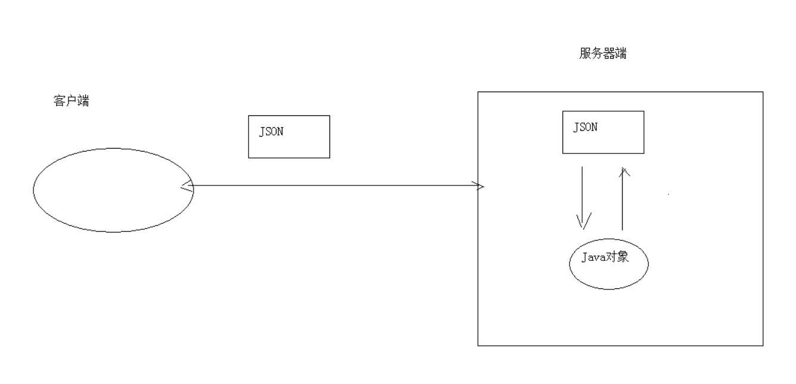
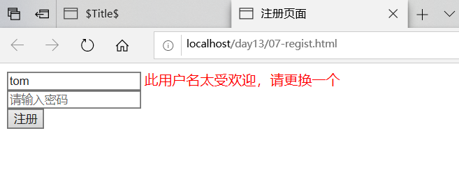
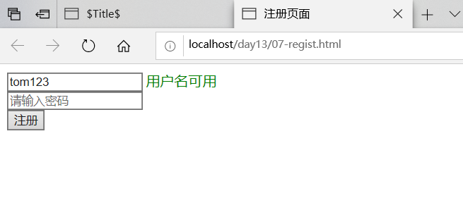

# JSON
## 1、概念
**JavaScript Object Notation		JavaScript对象表示法**
```
Person p = new Person();
p.setName("张三");
p.setAge(23);
p.setGender("男");

var p = {"name":"张三","age":23,"gender":"男"};
```
* **JSON现在多用于存储和交换文本信息的语法**
* **进行数据的传输**
* **JSON比XML更小、更快，更易解析**


## 2、语法
### （1） 基本规则
* 数据在名称/值对中：**json数据是由键值对构成的**
	* **键用引号(单双都行)引起来，也可以不使用引号**
	* **值得取值类型**：
		1. 数字（整数或浮点数）
		2. 字符串（在双引号中）
		3. 逻辑值（true 或 false）
		4. 数组（在方括号中）	`{"persons":[{},{}]}`
		5. 对象（在花括号中） `{"address":{"province"："陕西"....}}`
		6. null
* **数据由逗号分隔**：多个键值对由逗号分隔
* **花括号保存对象**：使用{}定义json 格式
* **方括号保存数组**：[]

### （2）获取数据
* `json对象.键名`
* `json对象["键名"]`
* `数组对象[索引]`

### （3）遍历
```
 //1.定义基本格式
var person = {"name": "张三", age: 23, 'gender': true};

var ps = [{"name": "张三", "age": 23, "gender": true},
    {"name": "李四", "age": 24, "gender": true},
    {"name": "王五", "age": 25, "gender": false}];


//获取person对象中所有的键和值
//for in 循环
/* for(var key in person){
    //这样的方式获取不行。因为相当于  person."name"
    //alert(key + ":" + person.key);
    alert(key+":"+person[key]);
}*/

//获取ps中的所有值
for (var i = 0; i < ps.length; i++) {
    var p = ps[i];
    for(var key in p){
        alert(key+":"+p[key]);
    }
}
```

## 3、JSON数据和Java对象的相互转换
* **JSON解析器**：
	* **常见的解析器**：Jsonlib，Gson，fastjson，**jackson**

## 4、jackson
### （1）SON转为Java对象
	1. 导入jackson的相关jar包
	2. 创建Jackson核心对象 ObjectMapper
	3. 调用ObjectMapper的相关方法进行转换
		* readValue(json字符串数据,Class)

### （2）Java对象转换JSON
	1. 使用步骤：
		1. 导入jackson的相关jar包
		2. 创建Jackson核心对象 ObjectMapper
		3. 调用ObjectMapper的相关方法进行转换
			1. 转换方法：
				* writeValue(参数1，obj):
                    参数1：
                        File：将obj对象转换为JSON字符串，并保存到指定的文件中
                        Writer：将obj对象转换为JSON字符串，并将json数据填充到字符输出流中
                        OutputStream：将obj对象转换为JSON字符串，并将json数据填充到字节输出流中
                * writeValueAsString(obj):将对象转为json字符串

			2. 注解：
				1. @JsonIgnore：排除属性。
				2. @JsonFormat：属性值得格式化
					* @JsonFormat(pattern = "yyyy-MM-dd")

			3. 复杂java对象转换
				1. List：数组
				2. Map：对象格式一致

## 5、案例
* 校验用户名是否存在

    	1. 服务器响应的数据，在客户端使用时，要想当做json数据格式使用。有两种解决方案：
    		1. $.get(type):将最后一个参数type指定为"json"
    		2. 在服务器端设置MIME类型
    			response.setContentType("application/json;charset=utf-8");
* 代码实现：<br>
regist.html
```
<!DOCTYPE html>
<html lang="en">
<head>
    <meta charset="UTF-8">
    <title>注册页面</title>
    <script src="js/jquery-3.3.1.min.js"></script>

    <script>
        //在页面加载完成后
        $(function () {
            //给username绑定blur事件
            $("#username").blur(function () {
                //获取username文本输入框的值
                var username = $(this).val();
                //发送ajax请求
                //期望服务器响应回的数据格式,{"userExsit":true,"msg":"此用户名太受欢迎，请更换一个"}
                //{"userExsit":false,"msg":"用户名可用"}
                if ( '' != $("#username").val() ) {

                    $.get("findUserServlet",{username:username},function (data) {
                        //判断userExsit键的值是否是true

                        //alert(data);
                        var span = $("#s_username");
                        if(data.userExsit){
                            //用户名存在
                            span.css("color","red");
                            span.html(data.msg);
                        }else {
                            //用户名不存在
                            span.css("color","green");
                            span.html(data.msg);
                        }
                    },"json");
                }
            });
        });


    </script>
</head>
<body>

    <form>
        <input type="text" id="username" name="username" placeholder="请输入用户名">
        <span id="s_username"></span>
        <br>
        <input type="text" name="password" placeholder="请输入密码"><br>
        <input type="submit" value="注册"><br>
    </form>
</body>
</html>
```
FindUserServlet.class
```
package com.allen.web.servlet;

import com.fasterxml.jackson.databind.ObjectMapper;

import javax.servlet.ServletException;
import javax.servlet.annotation.WebServlet;
import javax.servlet.http.HttpServlet;
import javax.servlet.http.HttpServletRequest;
import javax.servlet.http.HttpServletResponse;
import java.io.IOException;
import java.util.HashMap;
import java.util.Map;

@WebServlet("/findUserServlet")
public class FindUserServlet extends HttpServlet {
    protected void doPost(HttpServletRequest request, HttpServletResponse response) throws ServletException, IOException {
        //1、获取用户名
        String username = request.getParameter("username");

        //2、调用service层判断用户名是否存在
        //期望服务器响应回的数据格式,{"userExsit":true,"msg":"此用户名太受欢迎，请更换一个"}
        //{"userExsit":false,"msg":"用户名可用"}
        Map<String,Object> map = new HashMap<String, Object>();
        response.setContentType("text/html;charset=utf-8");
        if("tom".equals(username)){
            //存在
            map.put("userExsit",true);
            map.put("msg","此用户名太受欢迎，请更换一个");
        }else {
            //不存在
            map.put("userExsit",false);
            map.put("msg","用户名可用");
        }
        //将map转为JSON，并且传递给客户端
        //将mao转为JSON
        ObjectMapper mapper = new ObjectMapper();
        //并且传递给客户端
        mapper.writeValue(response.getWriter(),map);
    }

    protected void doGet(HttpServletRequest request, HttpServletResponse response) throws ServletException, IOException {
        this.doPost(request, response);
    }
}

```
* 效果展示：

