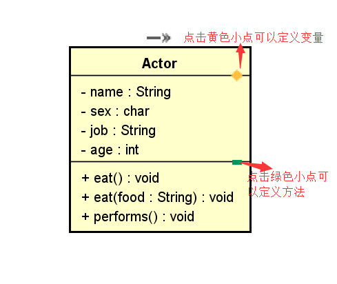
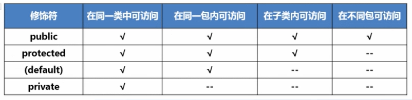

## 一、什么是面向对象
从开始学习Java的那一天起，一直在听老师或者其他人说Java是一门面向对象的高级编程语言，那到底什么是面向对象呢？经过这段时间的学习，终于对面向对象有了一些了解。

面向对象其实并不可怕，就是一种**思想**，一种对现实世界理解和抽象的方法，也就是说面向对象将复杂的存在于人世间的那些你**看得见、摸得着的但是计算机无法识别的具体实体**简单化，运用其本身的一些属性和方法将事物完完整整地表示，让计算机能够通过这些属性识别对象，所以说“**万物皆对象**”。

## 二、类和对象的关系
### 1、什么是类？什么是对象？
类是一种抽象的概念，仅仅是**模板**。举个简单的例子，枪，枪就是一个抽象的概念，我光说一个字“枪”，你肯定可以想到很多，但我要说AK-47呢，你脑子里立马就可以出现一把AK-47，AK-47就是将枪这个类**实例化**后变成一个**对象**，那么对象的定义也就出来了，对象就是一个你能够看得见、摸得着的具体实体。
### 2、类和对象之间的关系
* 类是对象的设计图，对象是类的实体（现实存在）
* 类是对象的模板（类型），对象是类的实例

### 3、Java中的包
#### 包（package）
* 打包：package com.Allen.javabase;

包的本质说白了就是**文件夹**，如我上面所写的com.Allen.javabase;就是在com文件夹下的Allen文件夹下的javabase文件夹；打包也就可以理解为**创建文件夹**
* 导包：impor java.util.Scanner;

#### 包的作用
* 包允许将类组合成较小的单元(类似文件夹)，使其易于找到和使用相应的类文件
* 有助于避免命名冲突。在使用许多类时,类和方法的名称很难决定。有时需要使用与其他类相同的名称。包基本上隐藏了类并避免了名称上的冲突
* 包允许在更广的范围内保护类，数据和方法,可以在包内定义类,而在包外的代码不能访问该类

*注意：1、包将类名空间划分为更加容易管理的块*
*2、包既是命名机制也是可见度控制机制*

## 三、面向对象的三大特征
### 1、封装
核心思想就是“隐藏细节”、“数据安全”：将对象不需要让外界访问的成员变量和方法私有化，只提供符合开发者意愿的公有方法来访问这些数据和逻辑，保证了数据的安全和程序的稳定。

**A、使用封装解决设计上的缺陷**

隐藏对象的属性和实现细节，仅对外公开接口。控制在程序中属性的读取和修改的访问限制

**B、this表示指向当前对象**
采用 this 关键字是为了解决成员变量和局部变量之间发生的同名的冲突

下面通过实例来感受一下:
```
public class Students{
    private String name;
    private int ID;

    public int getID(){
      return ID;
    }

    public String getName(){
      return name;
    }

    public void setAge(int ID){
      this.ID = ID;
    }

    public void setName(String name){
      this.name = name;
    }
}
```
上面的代码定义了一个只有姓名（name）和学号（ID）的学生类，在该类中，name和ID都是私有的，通过setName()和setID()两个公共的方法可以访问该类中的两个成员变量，但是公共方法中的name和ID就属于局部变量了。

***注意:***

**1、成员变量的作用域在整个类都是可见的**
类中的方法都可以使用私有变量

**2、局部变量的作用域仅限于定义它的方法**
局部变量只能分别在方法中使用

**3、成员变量有默认的初始值**
数字为0、对象为null

**4、局部变量默认没有初始值，需要赋初值再使用**

### 2、继承
在现实生活中，继承一般指的是子女继承父辈的财产。在程序中，继承描述的是事物之间的所属关系，通过继承可以使多种事物之间形成一种关系体系。例如猫和狗都属于动物，程序中便可以描述为猫和狗继承自动物，同理，波斯猫和巴厘猫继承自猫，而沙皮狗和斑点狗继承自狗。这些动物之间会形成一个继承体系。

在Java中，**类的继承是**指在一个**现有类**的基础上去构建一个**新的类**，构建出来的新类被称作**子类**，现有类被称作**父类**，子类会自动拥有父类所有可继承的**属性和方法**。

#### 继承的优点
* 父类定义公共内容，方便同意修改
* 整体减少了代码量
* 添加新类（职业）方便

#### UML软件
在这里向大家推荐一款软件



可以在软件中导出类，选择Java就可以导出一个.java的文件，*如果以后需要做一些企业级的项目就可以使用（该软件现在收费，如果有人需要的话，通过邮箱联系我，我的邮箱873661417@qq.com）*

#### 实例
下面来看实例理解继承，应该大多数人都玩过这种
MOBA类游戏吧，比如LOL、DOTA等

我们定义一个英雄父类，再定义一个战士类英雄的子类
```
//Hero父类的构造
public class Hero {
	private String nickName;
	private int level;
	private int maxLife;
	/**
	 * 构造方法：
	 * 1、方法名和类名一致
	 * 2、没有返回值
	 */
	public Hero() {
	}
	/**
	 * 父类方法：英雄的移动
	 */
	public void move(){
	}
	
	public String getNickName() {
		return nickName;
	}
	public void setNickName(String nickName) {
		this.nickName = nickName;
	}
	public int getLevel() {
		return level;
	}
	public void setLevel(int level) {
		this.level = level;
	}
	public int getMaxLife() {
		return maxLife;
	}
	public void setMaxLife(int maxLife) {
		this.maxLife = maxLife;
	}
}
```

```
//Warrior子类的构造
public class Warrior extends Hero{
	/** 战士的特有属性：物理攻击力 */
	private int pysicalAttach;
	
	/**
	 * 子类的构造
	 */
	public Warrior(){
		super();	//子类构造中，默认就会调用父类构造
		setLevel(1);
		setMaxLife(100);
		setPysicalAttach(99);
	}
	
	public Warrior(String nickName, int pysicalAttach){
		this();
		setNickName(nickName);
		setPysicalAttach(pysicalAttach);
	}

	public int getPysicalAttack() {
		return pysicalAttach;
	}

	public void setPysicalAttach(int pysicalAttach) {
		this.pysicalAttach = pysicalAttach;
	}
	
}
```
分析上面的代码，Hero中定义了英雄类，所包含的私有属性有nickName（昵称）、level（等级）、maxLife（最大生命值），下面的方法通过this关键字对其进行赋值。
在Warrior中定义了战士类，extend关键字继承了Hero类，所以Hero就是Warrior的父类，Warrior是Hero的子类，在Warrior类中，除了继承的父类的属性和方法之外，自己重新定义了pysicalAttach（物理攻击）属性

**注意：**

1、使用**super**关键字调用父类构造方法

2、默认会先调用父类构造，再调用子类构造

3、构造方法不可**继承**

4、Java中只能继承**一个**父类

5、**父类私有属性**在子类中**不能直接访问**

6、继承关系是一种“**is-a**关系“:父类和子类之间必须存在is-a关系

#### 方法重写（override）
* 在子类中提供一个对方法的新的实现

看例子，现在我想要在Hero中加一个move方法实现英雄的移动，但是父类Hero中定义的move方法在子类Warrior中我想要重新定义一下，就用到了重写
```
//父类中的move方法
public class Hero{
    ...
    public void move(){
        System.out.println(”移动ing“); 
    }
}

//子类中的move方法重写
public class Warrior extends Hero{
    ...
    @Override
    public void move() {
        System.out.println(”战士的移动:交通基本靠走“);
    }
}
```
**注意:**

1、**方法重写**发生在通过**继承而相关的不同类**中

2、方法重写具有**同样的方法签名和返回值类型**

3、 **@override**称为**重写标注**，用来保证重写的方法与原方法的签名和返回值**一致**

#### 子类调用父类信息
* 使用super关键字
* 可以调用父类的公有属性和方法
* 可以调用父类protected属性和方法
 


#### 接口
* **接口**是-种与**类**相似的结构,只包含**常量和抽象方法**
* 目的是指明相关或不相关类的多个对象的**共同行为(功能)**
* **使用接口的案例:**
可以指明对象是可比较的、可食用的、可被攻击的、可飞翔的甚至是可克隆的。
```
//定义接口(可攻击的) 
public interface Assailable {
    //常量及抽象方法声明 
}
```
**注意:**

 1、在Java中，**接口**被看做是**一种特殊的类**，与抽象类相似,**不能**使用**new**操作符**直接创建**接口的实例
 
2、**接口**必须由**其他类**实现，实现类不能实现的方法可以继续标识为abstract（抽象类的标识）

### 3、多态
#### 什么是多态？
多态是同一个行为具有多个不同表现形式或形态的能力。
多态性是对象多种表现形式的体现。现实中，比如我们按下 F1 键这个动作： 如果当前在 Flash界面下弹出的就是 AS 3 的帮助文档；如果当前在 Word 下弹出的就是 Word 帮助；在 Windows 下弹出的就是 Windows 帮助和支持。同一个事件发生在不同的对象上会产生不同的结果。
#### 多态的优点
消除类型之间的耦合关系

可替换性

可扩充性

接口性

灵活性

简化性
#### 多态存在的三个必要条件
继承、重写、父类引用指向子类对象

#### 实例
```
public class ObjectArraySortDemo {
	
	public static void sort(Hero[] heroArray){
		Hero tempHero = null;	//用来交换的英雄对象
		for (int i = 0; i < heroArray.length; i++) {
			for (int j = 0; j < heroArray.length - i - 1; j++) {
				if(heroArray[j].compareToByName(heroArray[j + 1]) < 0){
					tempHero = heroArray[j];
					heroArray[j] = heroArray[j + 1];
					heroArray[j + 1] = tempHero;
				}
			}
		}
	}
	
	public static void main(String[] args) {
		Warrior 战士1 = new Warrior();
		Warrior 战士2 = new Warrior();
		Warrior 战士3 = new Warrior();
		Warrior 战士4 = new Warrior();
		Warrior 战士5 = new Warrior();
		Archmage 法师1 = new Archmage();
		Archmage 法师2 = new Archmage();
		Archmage 法师3 = new Archmage();
		Archmage 法师4 = new Archmage();
		Archmage 法师5 = new Archmage();
		
		Hero[] heroArray = {
			战士1, 战士2, 战士3, 战士4, 战士5,
			法师1, 法师2, 法师3, 法师4, 法师5
		};
		System.out.println("排序前：");
		System.out.println("级别\t昵称\t\tmaxLife\tlife\t攻击力");
		for(Hero hero : heroArray){
			System.out.println(hero);
		}
		sort(heroArray);
		System.out.println("排序后：");
		System.out.println("级别\t昵称\t\tmaxLife\tlife\t攻击力");
		for(Hero hero : heroArray){
			System.out.println(hero);
		}
	}
}
```
上面的代码重新定义了一个ObjectArraySortDemo类，对英雄对象数组进行排序，在此类中的排序方法public static void sort(Hero[] heroArray)，在定义时就已经体现出**多态**，因为Hero父类的子类有很多，虽然看起来只有战士Warrior类和法师Archmage类，但是后期可以定义更多的子类，那么要对所有英雄进行排序，就直接向排序方法中传入Hero对象，具体是哪一个英雄对象看实际情况，这就是多态，传入的子类不同实现方法后的结果也就不同。