## 一、集合
### 1、集合的概念
* 现实生活中：很多事物凑在一起
* 数学中的集合：具有共同属性的事物的总体
* **Java中的集合类：是一种工具类。就像是容器，储存任意数量的具有共同属性的对象**

### 2、集合的作用
* 在类的的内部，对数据进行组织
* 简单而快速地搜索大数量地条目
* 有的集合接口，提供了一系列排列有序的元素，并且可以在序列中间快速地插入或者删除有关属性
* 有的集合接口，提供了映射关系，可以通过关键字（key）去快速查找到对应的唯一对象，而这个关键字可以是任意类型

### 3、与数组的对比——为何选择集合而不是数组
* 数组的长度固定，集合长度可变
* 数组只能通过下标访问元素，类型固定，而有的集合可以通过任意类型查找所映射的具体对象

## 二、Java中的集合
### 1、Collection架构
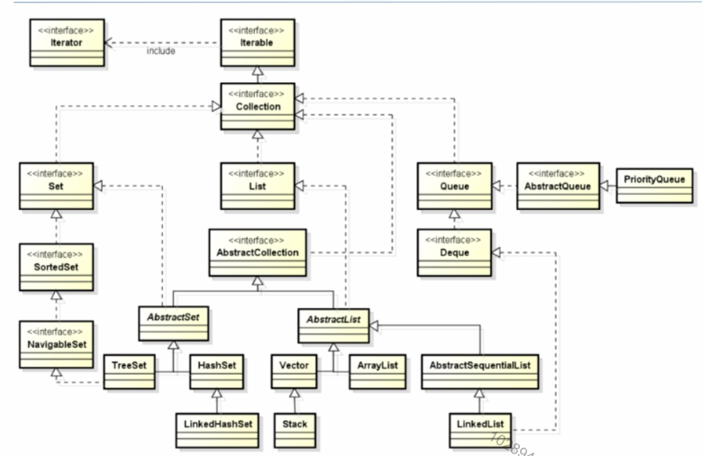

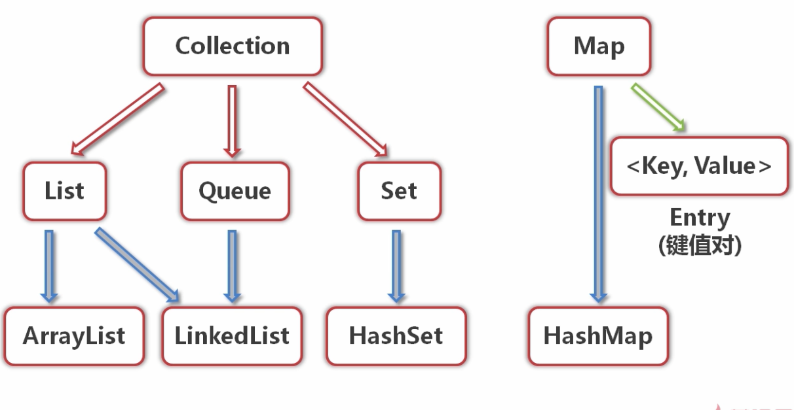

**三种主要类型的集合：**
* **Set（规则集）**：存储一组不可重复的元素
* **List（线性表）**：存储一个有序集合
* **Queue（队列）**：存储用先进先出方式处理的对象

**注意：**
* 集合框架中的**所有接口和类**都在**java.util**包中
* 集合框架中的所有的具体类都实现了**Cloneable**和**Serializable**接口，即他们的实例都是**可复制且可序列化的**

### 2、Collection接口
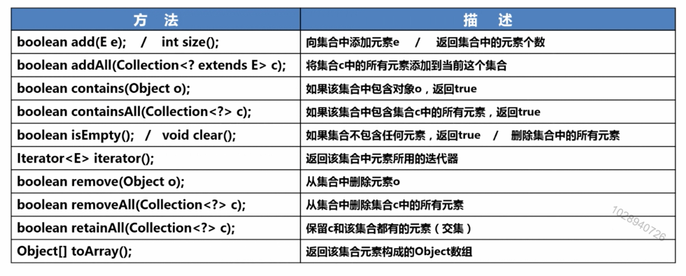
### 3、插入一个知识点：泛型
**泛型**，即“参数化类型”。
将类型由原来的具体的类型参数化，类似于方法中的变量参数，此时类型也定义成参数形式（可以称之为类型形参），然后在使用/调用时传入具体的类型（类型实参）。

**泛型的本质**是为了参数化类型（在不创建新的类型的情况下，通过泛型指定的不同类型来控制形参具体限制的类型）。也就是说在泛型使用过程中，

**操作的数据类型被指定为一个参数**，这种参数类型可以用在类、接口和方法中，分别被称为**泛型类、泛型接口、泛型方法。**

通过下面的代码理解：
```
/**
 * 理解泛型的基本含义
 */
public class ElementDemo<E> {
	Object[] objs = new Object[999];
	
	public static void main(String[] args) {
		//运行时给定类型
		ElementDemo<Integer> demo = new ElementDemo<Integer>();
		demo.add(12);//使用泛型后，类型错误时就会产生编译期的异常
		
		ElementDemo<String> demo1 = new ElementDemo<>();
		
		//
//		objs[0] = 1024;
//		objs[1] = "abc";
//		objs[2] = 19.9;
//		objs[3] = new Student();
//		
//		//从对象数组中取出对象进行操作
//		Integer value1 = (Integer)objs[0];
//		//java.lang.ClassCastException - 运行时异常，无法在编译期杜绝 - 有可能造成程序的崩溃
//		Integer value2 = (Integer)objs[1]; 
//		
//		System.out.println(value1);
//		System.out.println(value2);
		
	}
	/**
	 * 向对象数组中添加给定类型的元素 - 泛型
	 * @param e
	 */
	public void add(E e){
		//向obj数组中添加e元素即可
		//代码省略
	}

}
class Student{
	
}
```
运行上面的代码注释的部分会发现程序并没有报错，但是运行的时候程序会直接跳出异常。
### 4、具有索引的List接口
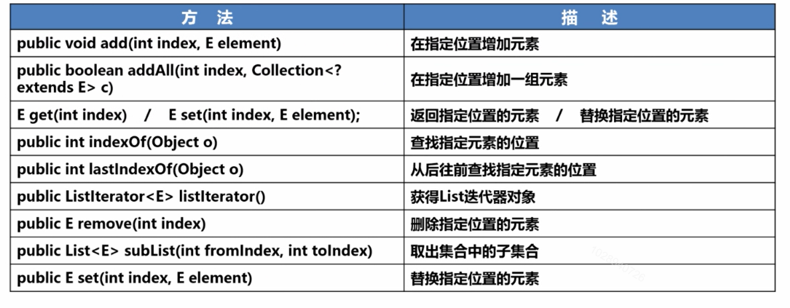

**集合使用建议：**
 * **ArrayList/LinkedList/ArrayDeque/HashSet/LinkedHashSet/TreeSet**
* 1、如果要遍历List结合，对于ArrayList、Vector来说，使用随遍历（get)效率更高；对于LinkedList/LinkHashSet来说，使用**迭代器**效率更高
* 2、如果需要经常执行插入、删除操作来改变包含大量数据的集合大小，建议使用LinkedList。（ArrayList、Vector可能需要重新分配内部数组的大小，从而影响效率）
* 3、如果有多个线程需要同时访问集合中的元素，可以考虑使用Collectons将集合包装成线程安全的集合

通过代码进一步理解List接口以及迭代器的使用：
```
import java.util.ArrayList;
import java.util.Iterator;
import java.util.List;
import java.util.ListIterator;


public class CollectionDemo {

	public static void main(String[] args) {
		//多态：使用List接口的一个子类ArrayList进行实现
		List<String> list1 = new ArrayList<>();
		list1.add("曹操");
		list1.add("曹冲");
		list1.add("曹植");
		list1.add("曹培");
		list1.add("曹仁");	
		System.out.println(list1);
		list1.add(1, "刘璇的");
		System.out.println(list1);
		list1.set(1, "关云长");
		System.out.println(list1);
		
		List<String> list2 = new ArrayList<>();
		list2.add("张翼德");
		list2.add("张飞龙");
		
		list1.addAll(list2);
		System.out.println(list1);
		
		System.out.println("集合的遍历");
		//1、List的遍历
		for(int i = 0; i < list1.size(); i++){
			System.out.print(list1.get(i) + ",  ");
		}
		System.out.println();
		//2、使用foreach循环
		for(String str : list1){
			System.out.print(str + ",  ");
		}
		System.out.println();
		//3、使用迭代器遍历
		Iterator<String> it = list1.iterator();
		//使用迭代器的方法相对比较固定
		while(it.hasNext()){
			System.out.print(it.next() + ",  ");
		}
		System.out.println();
		//4、使用ListIterator迭代器
		ListIterator<String> listIt = list1.listIterator();
		while(listIt.hasNext()){
			System.out.print(listIt.next() + ",  ");
		}
		System.out.println();
		//使用ListIterator与传统迭代器的区别
		//1、ListIterator不止可以向后访问，也可以向前访问
		//2、ListIterator可以修改集合中的元素
		System.out.println("使用ListIterator从后向前遍历集合元素（逆序）");
		ListIterator<String> listIt2 = list1.listIterator(list1.size());
		while(listIt2.hasPrevious()){//当迭代器中的元素存在上一个时
			System.out.print(listIt2.previous() + ",  ");
		}
		System.out.println("\n");
		ListIterator<String> listIt3 = list1.listIterator(3);
		if(listIt3.hasPrevious()){
			listIt3.previous();
			listIt3.set("赵子龙");//使用迭代器修改元素
		}
		System.out.println(list1);
		
		
		System.out.println("删除下标为4的元素：");
		//list1.remove(4);
		list1.remove("曹培");
		System.out.println(list1);
		
		System.out.println("subList(3, 5) : " + list1.subList(3, 5));
	}
	
	/**
	 * 使用迭代器的好处：在遍历集合时，不依赖某个类的实现
	 * @param it
	 */
	public void show(Iterator<? extends Employee> it){
		while(it.hasNext()){
			System.out.println(it.next());
		}
	}
	
}
class Employee{
	
}
```
### 5、List接口的实现类
* **ArrayList（数组线性表）**
    * 是一个**大小可变的数组**，在内存中分配**连续的空间**
    * **遍历**元素和**随机访问**元素的**效率比较高**
* **LinkedList（链表）**
    * 采用**链表**存储方式
    * 提供从**线性表两端提取、插入和删除**元素的方法
    * **插入、删除**元素的效率比较高

通过下面的代码，能够清楚地发现两者在不同情况下的效率谁高谁低：
```
import java.util.ArrayList;
import java.util.LinkedList;
import java.util.List;

public class ArrayListAndLinkedListDemo {
	/**
	 * 在实际开发中，有可能两种情况（随机访问和删除、插入）交替出现
	 * 建议使用父接口List，不用关心具体的实现
	 * 在具体的情况下，传入或转换成相应的子类型进行使用即可
	 * @param args
	 */
	public static void main(String[] args) {
		ArrayList<String> list = new ArrayList<>();
		//list.addAll(c)
		System.out.println("ArrayList耗时：" + CostTime(new ArrayList<>()));
		
		System.out.println("LinkedList耗时：" + CostTime(new LinkedList<>()));
	}
	
	public static long CostTime(List<Object> list){
		Object obj = new Object();
		final int N = 150000;
		long startTime = System.currentTimeMillis();
		for (int i = 0; i < N; i++) {
			list.add(obj);			//每次在集合的最后一个位置添加元素
			//list.add(0, obj);   	//每次向集合的0号位置添加元素
		}
		long endTime = System.currentTimeMillis();
		return endTime - startTime;
	}

}
```
### 6、向量类Vector
* **Vector**从**Java1.0**起就存在了，**ArrayList**从**Java1.2**才开始存在
* Vector的**使用场景**：**JavaMe等一些微小版本**中都可以使用，但是ArrayList**不可以**
* 在Java1.2之前，Vector就被广泛的应用在了Java设计中，因为它可以实现可变大小的数组。特别是大多数Swing的数据模型都使用了Vector
* 相较ArrayList，Vector中的方法采用**线程同步**，所以**效率比ArrayList低**

**Vector实现了List接口:**
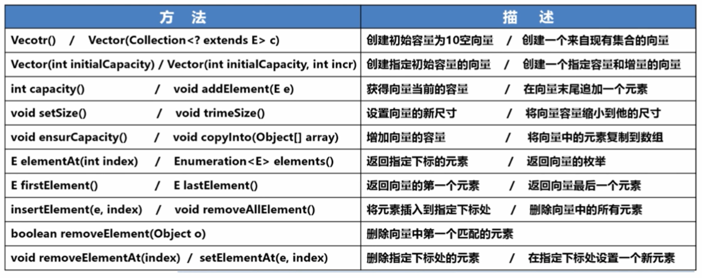
```
import java.util.ArrayList;
import java.util.Enumeration;
import java.util.Vector;

public class VectorDemo {
	public static void main(String[] args) {
		
		
		Vector<String> vec = new Vector<>();
		vec.add("天龙八部");			//会返回boolean值
		vec.addElement("天龙九部");	//无返回值
		vec.add("aaa");
		vec.add("aaa");
		vec.add("aaa");
		vec.add("aaa");
		vec.add("aaa");
		vec.add("aaa");
		vec.add("aaa");
		vec.add("aaa");
		vec.add("aaa");
		System.out.println("size:" + vec.size());
		System.out.println("容量：" + vec.capacity());
		vec.trimToSize();
		System.out.println("trim后的容量：" + vec.capacity());
		vec.ensureCapacity(3000);
		System.out.println("ensureCapacity后的容量：" + vec.capacity());
		
		//Vector的遍历
		for(int i = 0; i < vec.size(); i++){
			System.out.print(vec.get(i) + ", ");
		}
		System.out.println();
		//vec.iterator()  迭代器的使用与List相同
		
		//使用枚举遍历 - 早期版本的方式 - 已被Iterator取代
		Enumeration<String> vecEnum = vec.elements();
		while(vecEnum.hasMoreElements()){
			System.out.print(vecEnum.nextElement() + ", ");
		}
		System.out.println();
		
		//Lambda表达式遍历
		System.out.println("使用Lambda表达式遍历");
		vec.forEach(str -> System.out.print(str + ", "));
		
		//查询元素
		System.out.println("第一个元素：" + vec.firstElement());
		System.out.println("最后一个元素：" + vec.lastElement());
		System.out.println("下标为1的元素：" + vec.elementAt(1) + "\t" + vec.get(1));
		
		vec.removeElementAt(19);// java.lang.ArrayIndexOutOfBoundsException: 19 >= 11
		System.out.println("删除后：");
		vec.forEach(str -> System.out.print(str + ", "));
		
	}
}
```
**Vector和ArrayList的异同：**

* 实现原理相同，功能相同，很多情况下可以互用

**两者的主要区别如下：**
* **Vector线程安全，ArrayList重速度轻安全，线程非安全**
* 长度需要增长，Vector默认**增长一倍**；ArrayList增长**50%**。有利于**节约空间**
* 如果**不需要同步**，做好**使用ArrayList**，因为它比Vector快得多

### 7、Set接口及实现类
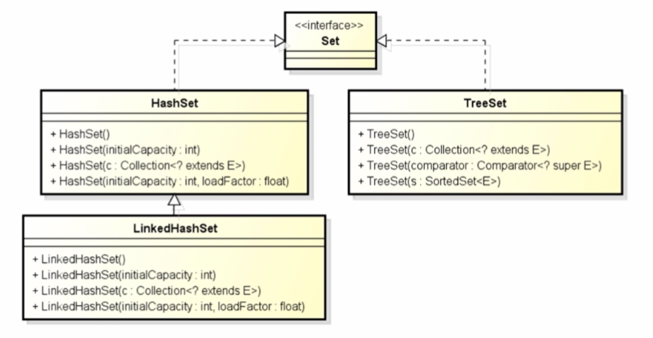
**Set接口：用来操作存储一组唯一、无序的对象**
* **HashSet**：用来存储**互不相同的任何元素**
* **LinkedHashSet**：使用**链表**扩展实现**HashSet类**，**支持对元素的排序**
    * **注意：如果不需要维护元素被插入的顺序，就应该使用HashSet，更加高效**
* **TreeSet**：可以确保所有元素是**有序的**
```
import java.util.Comparator;
import java.util.HashSet;
import java.util.LinkedHashSet;
import java.util.Set;
import java.util.TreeSet;

public class SetDemo {

	public static void main(String[] args) {
		TreeSet();
	}
	
	public static void TreeSet(){
		TreeSet<String> citySet = new TreeSet<>(new Comparator<String>() {
			@Override
			public int compare(String o1, String o2) {
				if(o1.compareTo(o2) > 0) return -1;
				if(o1.compareTo(o2) < 0) return 1;
				return 0;
			}
		});
		citySet.add("London");
		citySet.add("Paris");
		citySet.add("New York");
		citySet.add("Bei Jing");
		citySet.add("Shang Hai");
		citySet.forEach(str -> System.out.print(str + ", "));
		System.out.println();
		System.out.println(citySet.higher("N"));
		System.out.println("New York之前的元素集合：" + citySet.headSet("New York"));
		System.out.println("New York之后的元素集合：" + citySet.tailSet("New York"));
		System.out.println("首元素：" + citySet.first());
		
		//citySet.pollFirst() 返回第一个元素，并删除第一个元素
		System.out.println("删除第一个元素：" + citySet.pollFirst());
		citySet.forEach(str -> System.out.print(str + ", "));
		
	}
	
	public static void HashSetDemo(){
		//Set：规则集两个特点  1、不允许有重复的元素    2、无序
		Set<String> citySet = new HashSet<>();
		citySet.add("London");
		citySet.add("Paris");
		citySet.add("New York");
		citySet.add("Bei Jing");
		citySet.add("Shang Hai");
		citySet.add("Shang Hai");
		citySet.forEach(str -> System.out.print(str + ", "));
	}
	
	public static void LinkedHashSetDemo(){
		//LinkedHashSet:插入顺序与实际的顺序一致
		Set<String> citySet = new LinkedHashSet<>();
		citySet.add("London");
		citySet.add("Paris");
		citySet.add("New York");
		citySet.add("Bei Jing");
		citySet.add("Shang Hai");
		citySet.forEach(str -> System.out.print(str + ", "));
	}

}
```
### 8、java.util.Collections
* Collections用于简化对Java集合框架的常见操作
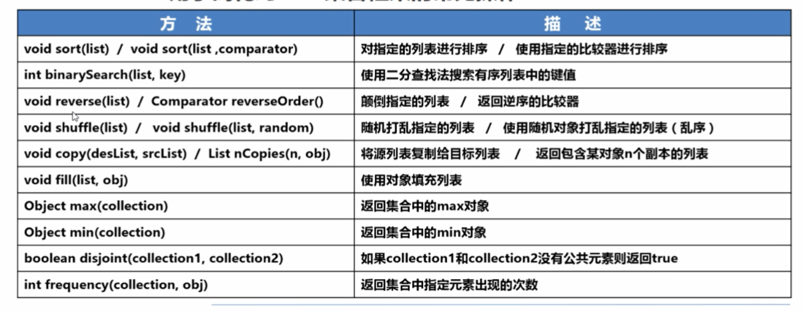
```
import java.util.ArrayList;
import java.util.Arrays;
import java.util.Collection;
import java.util.Collections;
import java.util.List;
import java.util.Random;

public class CollectionsDemo {

	public static void main(String[] args) {
		List<Integer> intCollection = new ArrayList<>();
		intCollection.add(123);
		intCollection.add(120);
		intCollection.add(124);
		intCollection.add(122);
		intCollection.add(127);
		intCollection.add(126);	
		
		intCollection.forEach(value -> System.out.print(value + ", "));
		Collections.shuffle(intCollection, new Random(20));
		System.out.println("\n乱序后：");
		intCollection.forEach(value -> System.out.print(value + ", "));
		
		Collections.shuffle(intCollection, new Random(20));
		System.out.println("\n乱序后：");
		intCollection.forEach(value -> System.out.print(value + ", "));
		
		System.out.println("集合的复制");		
		List<Integer> longCollection = new ArrayList<>();
		longCollection.add(0);
		longCollection.add(0);
		longCollection.add(0);
		longCollection.add(0);
		longCollection.add(0);
		longCollection.add(0);
		Collections.copy(longCollection, intCollection);
		longCollection.forEach(value -> System.out.print(value + ", "));
		longCollection.add(126);
		//对比两个集合中没有公共元素
		System.out.println(Collections.disjoint(intCollection, longCollection));
		
		System.out.println("返回集合中指定元素出现的次数" + Collections.frequency(longCollection, 126));
		
		
		//补充：使用Arrays.asList转换成的List集合中，无法执行add方法
		List<String> strList = Arrays.asList("abc", "123", "321");
		strList.add("111");

	}

}
```
### 9、支持队列操作的Queue
* **Queue**通常用于操作存储一组队列方式的对象信息
    * **特点：一般存储方式为先进先出（FIFO）**
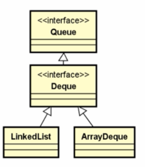
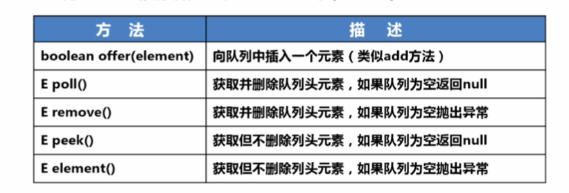
**注意：**
* Deque支持在**两端插入和删除元素**，是双端队列的简称（double-ended queue），支持从两端操作队列的元素
* **定义的方法：addFirst(e),removeFirst(e),addLast(e),removeLast(e),getFirst()/getLast()**

### 10、图Map
* 以**键-值**存储元素的容器
    * 根据**关键字**（key）找到对应的数据

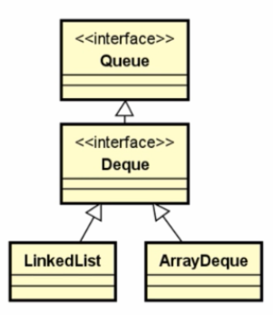
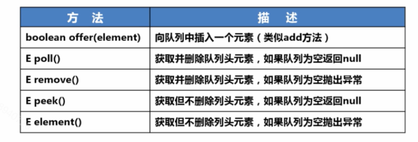

**注意：**
* **HashMap**的**查询、插入和删除比较高效**
* **LinkedHashMap支持元素的排序**
* **TreeMap在遍历有序的键值时非常高效**
* **Properties一般用于操作属性文件**
```
import java.io.BufferedReader;
import java.io.FileReader;
import java.util.ArrayList;
import java.util.Arrays;
import java.util.Comparator;
import java.util.HashMap;
import java.util.HashSet;
import java.util.Iterator;
import java.util.LinkedHashMap;
import java.util.List;
import java.util.Map;
import java.util.Map.Entry;
import java.util.Set;
import java.util.TreeMap;

/**
 * 三种图的基本用法
 *
 */
public class MapDemo {
	public static void main(String[] args) {
		//Map的基本用法();		
		//需求：统计java源文件中，每个关键字出现的次数
		统计关键字出现的次数();
	}
	
	public static void 统计关键字出现的次数(){
		final String fileName = "src/com/javabase/Collection/MapDemo.java";
		final String keywords = "package, import, public, class, void, final, static, new, while, if, catch, for, try, return";
		//1、获得Java源文件中的字符串（行的集合、StringBuffer）
		List<String> contentList = ReadSourceFile(fileName);
		Set<String> keywordsSet = new HashSet<>();	
		keywordsSet.addAll(Arrays.asList(keywords.split(",")));
		//String[] keywordsArray = keywords.split(",");	//简单的做法	
		//2、遍历关键字集合，统计每一个关键字在源文件字符串中出现的次数 - 将关键字和次数以键-值的方式存放在Map集合中
		Map<String, Integer> keywordsMap = new HashMap<>();
		for(String keyword : keywordsSet){//外循环遍历关键字集合
			keyword = keyword.trim();
			for(String line : contentList){//内循环-每个关键字都遍历一次源码的所有行
				//统计每一行中，keyword出现的次数 (进行累加)
				//int num1 = 0;	int num2 = 0; int num3 = 0;
				int count = getLineKeywordCount(line, keyword);
				if(count == 0) continue;
				//将count放到map集合中
				if(keywordsMap.containsKey(keyword)){
					int oldCount = keywordsMap.get(keyword).intValue();
					keywordsMap.put(keyword, new Integer(count + oldCount));
				}else{
					keywordsMap.put(keyword, count);//关键字第一次出现，直接添加即可
				}
			}
		}
		//3、遍历Map集合（以关键字出现的次数来排序）
		for(Entry<String, Integer> entry : keywordsMap.entrySet()){
			System.out.println(entry.getKey() + "\t" + entry.getValue());
		}
		//排序显示
		System.out.println("-------------------------------------------------");
		Map<String, Integer> treeMap = new TreeMap<>(new MyTreeComparator(keywordsMap));
		treeMap.putAll(keywordsMap);
		for(Entry<String, Integer> entry : treeMap.entrySet()){
			System.out.println(entry.getKey() + "\t" + entry.getValue());
		}
	}
	/**
	 * 统计这一行（line）中，keyword出现的次数
	 * @param line
	 * @param keyword
	 * @return
	 */
	private static int getLineKeywordCount(String line, String keyword){
		if(null == line || line.length() == 0) return 0;
		//可以在这里添加其他逻辑判断：跳过注释行
		if(line.startsWith("/*") || line.startsWith("*") || line.startsWith("*/") || line.startsWith("//")){
			return 0;
		}
		int count = 0;
		//int num1 = 0;	int num2 = 0; int num3 = 0;
		String strLine = new String(line);
		int index = -1;
		while((index = strLine.indexOf(keyword)) != -1){
			count++;
			strLine = strLine.substring(index + keyword.length() + 1);
		}
		return count;
	}
	
	/**
	 * 读取传入路径的Java源文件，以字符串的方式返回源文件的所有内容
	 * @param fileName
	 * @return
	 */
	private static List<String> ReadSourceFile(String fileName){
		List<String> contentList = new ArrayList<>();
		try(
			FileReader freader = new FileReader(fileName);
			BufferedReader reader = new BufferedReader(freader);
		){
			String line = null;
			while((line = reader.readLine()) != null){
				if(line.trim().length() == 1) continue;
				contentList.add(line.trim());
			}
		} catch (Exception e) {
			e.printStackTrace();
		}
		return contentList;
	}
	
	public static void Map的基本用法(){
		Map<String, Integer> hashMap = new HashMap<>();
		hashMap.put("Monkey·D·Luffy", 18);
		hashMap.put("Nami", 19);
		hashMap.put("Sanji", 25);
		hashMap.put("Nico Robin", 26);
		hashMap.put("Roronoa Zoro", 21);
		System.out.println("hashmap:" + hashMap);
		Map<String, Integer> linkedHashMap = new LinkedHashMap<>();
		linkedHashMap.put("Monkey·D·Luffy", 18);
		linkedHashMap.put("Nami", 19);
		linkedHashMap.put("Sanji", 25);
		linkedHashMap.put("Nico Robin", 26);
		linkedHashMap.put("Roronoa Zoro", 21);
		System.out.println("linkedHashMap:" + linkedHashMap);
		Map<String, Integer> treeMap = new TreeMap<>(new MyTreeComparator(hashMap));
		treeMap.putAll(hashMap);
//		treeMap.put("Monkey·D·Luffy", 18);
//		treeMap.put("Nami", 19);
//		treeMap.put("Sanji", 25);
//		treeMap.put("Nico Robin", 26);
//		treeMap.put("Roronoa Zoro", 21);
		System.out.println("treeMap:" + treeMap);
		
		System.out.println("第一种遍历方式：通过Map.keySet遍历key，通过key取出对应的value - 比较常用，需要二次取值");
		for(String key : treeMap.keySet()) {
			System.out.println(key + " -- " + treeMap.get(key));
		}
		
		System.out.println("第二种遍历方式：通过Map.entrySet使用迭代器遍历key和value");
		Set<Map.Entry<String, Integer>> entrySet = treeMap.entrySet();
		Iterator<Map.Entry<String, Integer>> entrySetIt = entrySet.iterator();
		while(entrySetIt.hasNext()){
			Map.Entry<String, Integer> entry = entrySetIt.next();
			System.out.println(entry.getKey() + "\t\t" + entry.getValue());
		}
		
		System.out.println("第三种遍历方式：直接遍历Map.entrySet集合 - 容量大时，推荐使用本方法遍历map");
		for(Entry<String, Integer> entry : treeMap.entrySet()){
			System.out.println(entry.getKey() + "  ==  " + entry.getValue());
		}
		
	}
	
}
/**
 * 我们自己定义的比较器
 * 注意：默认情况下，Map的比较器只能对key进行排序
 * 根据值比较：需要自定义属性
 *
 */
class MyTreeComparator implements Comparator<String>{
	private Map<String, Integer> map;
	public MyTreeComparator(Map<String, Integer> map) {
		this.map = map;
	}

	@Override
	public int compare(String key1, String key2) {
//		if(key1.compareTo(key2) > 0) return -1;
//		if(key1.compareTo(key2) < 0) return 1;
		//根据value值进行比较
		if(map.get(key1).intValue() < map.get(key2).intValue()){
			return 1;
		}
		if(map.get(key1).intValue() > map.get(key2).intValue()){
			return -1;
		}
		return 0;
	}
	
}
```
### 11、Properties
* **键值对集合**
    * 通常用于保存**字符串类型的键值对**
    * 更多用于**读取属性文件**
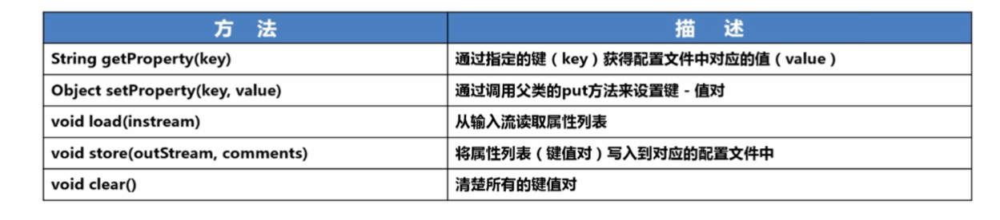
```
import java.io.FileOutputStream;
import java.io.IOException;
import java.util.Map.Entry;
import java.util.Properties;

public class PropertiesDemo {

	public static void main(String[] args) throws IOException {
		//读取properties文件的常用做法
		Properties props = new Properties();
		//加载配置文件 - 固定的写法
		props.load(PropertiesDemo.class.getResourceAsStream("Config.properties"));
		//读取配置
		String value = props.getProperty("user1", "abc");//通过key获得value
		System.out.println(value);
		//向配置文件中写入内容
		props.setProperty("name", "Monkey·D·Luffy");
		props.setProperty("中文", "中华人们共和国");
		FileOutputStream outStream = new FileOutputStream("bin/com/javabase/Collection/Config.properties");
		props.store(outStream, "写入时的注释 - Comments");
		
		props.load(PropertiesDemo.class.getResourceAsStream("Config.properties"));
		System.out.println("遍历所有的键值对");
		for(Entry<Object, Object> entry : props.entrySet()){
			System.out.println(entry.getKey() + " -- " + entry.getValue());
		}
	}

}
```