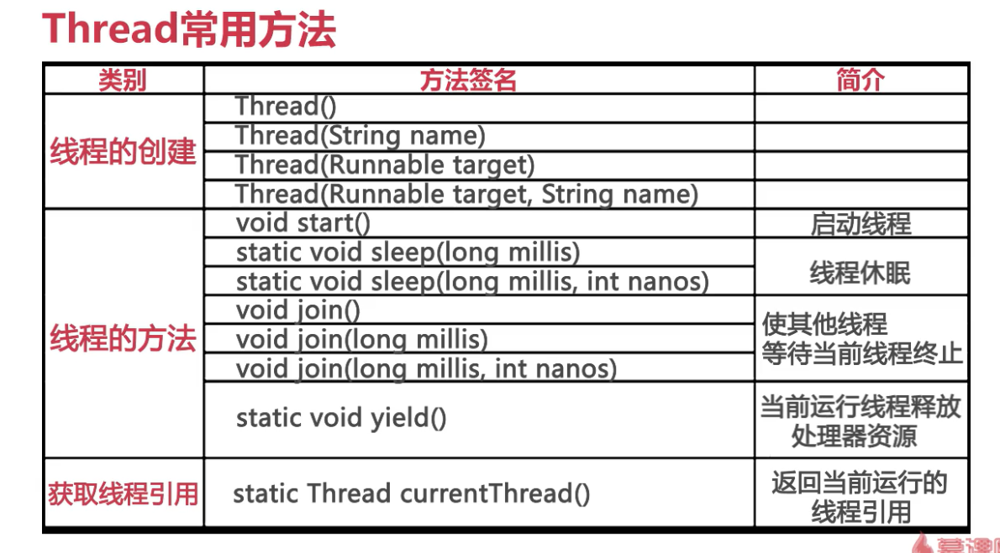

## 一、线程与进程
### 1、线程的概念
**线程**（thread）是操作系统能够进行运算调度的**最小单位**。**它被包含在进程之中，是进程中的实际运作单位**。一条线程指的是进程中一个单一顺序的控制流，一个进程中可以并发多个线程，每条线程并行执行不同的任务。
### 2、进程的概念
**进程**（process）是计算机中的程序关于某数据集合上的一次运行活动，**是系统进行资源分配和调度的基本单位**，是操作系统结构的基础。
### 3、两者之间的联系
 一个进程至少拥有**一个线程——主线程**，**也可以拥有多个线程**；**一个线程必须有一个父进程。多个进程可以并发执行；一个线程可以创建和撤销另一个线程；同一个进程中的多个线程之间可以并发执行**。
### 4、两者之间的区别
**线程是进程划分成的更小的运行单位**。线程和进程最大的不同在于基本上各进程是独立的，而各线程则不一定，因为同一进程中的线程极有可能会相互影响。从另一角度来说，进程属于操作系统的范畴，主要是同一段时间内，可以同时执行一个以上的程序，而线程则是在同一程序内几乎同时执行一个以上的程序段。
## 二、多线程
**多线程**就是几乎**同时执行多个线程**（一个处理器在某一个时间点上永远都只能是一个线程！即使这个处理器是多核的，除非有多个处理器才能实现多个线程同时运行。）。几乎同时是因为实际上多线程程序中的多个线程实际上是一个线程执行一会然后其他的线程再执行，并不是很多书籍所谓的同时执行。
## 三、Java中的多线程
### 1、Java对多线程的支持
* class Thread
* interface Runnable

### 2、线程的创建与启动


**创建一个新的执行线程有两种方法**：
* 一个是将一个类声明为**Thread的子类**。 **这个子类应该重写run类的方法Thread** 。 然后可以分配并启动子类的实例。
 
例如，计算大于规定值的素数的线程可以写成如下： 
```
class PrimeThread extends Thread {
    long minPrime;
    PrimeThread(long minPrime) {
        this.minPrime = minPrime;
    }

    public void run() {
    // compute primes larger than minPrime
              . . .
    }
}
```
然后，以下代码将创建一个线程并启动它运行： 
```
    PrimeThread p = new PrimeThread(143);
    p.start();
```
* 另一种方法来**创建一个线程声明实现类Runnable接口**,**然后实现了run方法,可以分配类的实例，在创建Thread时作为参数传递，并启动**。 

此方法的同一个例子如下所示： 
```
class PrimeRun implements Runnable {
    long minPrime;
    PrimeRun(long minPrime) {
        this.minPrime = minPrime;
    }

    public void run() {
    // compute primes larger than minPrime
            . . .
    }
}
```
然后，以下代码将创建一个线程并启动它运行： 
```
    PrimeRun p = new PrimeRun(143);
    new Thread(p).start();
```
通过下面的代码了解多线程：
```
package com.javabase.concurrent;
/***
 * 线程了解--引入线程
 * @author 87366
 *
 */
public class Actor extends Thread {
	public void run() {
		System.out.println(getName() + "是一个演员！");
		int count = 0;
		boolean keepRunning = true;
		
		while (keepRunning) {
			System.out.println(getName() + "登台演出：" + (++count));
			
			if (count == 100) {
				keepRunning = false;
			}	
					
			if (count %10 == 0) {
				try {
					Thread.sleep(1000);
				} catch (InterruptedException e) {
					e.printStackTrace();
				}
			}
		
		}
		System.out.println(getName() + "的演出结束了！");
	}
	
	
	public static void main(String[] args) {
		Thread actor = new Actor();
		actor.setName("Mr.Thread");
		
		actor.start();
		
		Thread actressThread = new Thread(new Actress(),"Ms.Runnable");
		actressThread.start();
	}
	
}

class Actress implements Runnable{

	@Override
	public void run() {
		System.out.println(Thread.currentThread().getName() + "是一个演员！");
		int count = 0;
		boolean keepRunning = true;
		
		while (keepRunning) {
			System.out.println(Thread.currentThread().getName() + "登台演出：" + (++count));
			
			if (count == 100) {
				keepRunning = false;
			}	
					
			if (count %10 == 0) {
				try {
					Thread.sleep(1000);
				} catch (InterruptedException e) {
					e.printStackTrace();
				}
			}
		
		}
		System.out.println(Thread.currentThread().getName() + "的演出结束了！");
	}
	
}
```
### 3、举例
下面通过舞台剧《隋唐演义》的例子进行理解
* 简述与分析：本例中的《隋唐演义》有隋朝军队和农民军队两大阵营，他们在进行战争的时候，**其实就是一个多线程的实例**，**两个阵营相当于两个进程同时进行**。就在两军交战火热，半路杀出个程咬金，随即两军停止作战，程咬金杀得昏天黑地，农民军取得最后的胜利。在这里，**程咬金也是一个线程，在他启动时，其他两个线程停止。**

下面是代码演示：
* Stage舞台类
```
package com.javabase.concurrent.base;

import javax.swing.JInternalFrame;

/**
 * 隋唐演义大戏舞台
 * @author 87366
 *
 */
public class Stage extends Thread {
	
	public void run() {
		System.out.println("欢迎观看隋唐演义");
		try {
			Thread.sleep(5000);
		} catch (InterruptedException e1) {
			e1.printStackTrace();
		}
		System.out.println("大幕徐徐拉开");
		try {
			Thread.sleep(5000);
		} catch (InterruptedException e1) {
			e1.printStackTrace();
		}
		System.out.println("话说隋朝末年，隋军与农民起义军杀得昏天黑地。。。");
		
		ArmyRunnable armyTsakOfDynasty = new ArmyRunnable();//隋朝军队
		ArmyRunnable armyTsakOfRevolt = new ArmyRunnable(); //农民起义军
		//使用Runnable接口创建线程
		Thread armyOfDynasty = new Thread(armyTsakOfDynasty,"隋朝军队");
		Thread armyOfRevolt = new Thread(armyTsakOfRevolt,"农民起义军");
		//启动线程，让双方开始作战
		armyOfDynasty.start();
		armyOfRevolt.start();
		//舞台线程休眠，大家专心观看军队的厮杀
		try {
			Thread.sleep(50);
		} catch (InterruptedException e) {
			e.printStackTrace();
		}
		System.out.println("正当双方激战正酣，半路杀出个程咬金");
		Thread mrCheng = new KeyPersonThread();
		mrCheng.setName("程咬金");
		System.out.println("程咬金的理想就是结束战争，使百姓安居乐业！");
		//停止军队作战
		//停止线程的方法
		armyTsakOfDynasty.keepRunning = false;
		armyTsakOfRevolt.keepRunning = false;
		try {
			Thread.sleep(2000);
		} catch (InterruptedException e) {
			e.printStackTrace();
		}
		/**
		 * 历史大戏留给关键人物
		 */
		mrCheng.start();
		try {
			mrCheng.join();
		} catch (InterruptedException e) {
			e.printStackTrace();
		}
		System.out.println("战争结束，人民安居乐业，程先生实现了积极的人生梦想，为人民做出了贡献");
		System.out.println("谢谢大家的观看，再见！");
		
	}
	
	public static void main(String[] args) {
		new Stage().start();
	}
	
}
```
* 创建军队进程
```
package com.javabase.concurrent.base;
/**
 * 军队进程 -- 模拟双方作战的行为
 * @author 87366
 *
 */
public class ArmyRunnable implements Runnable {
	//volatile保证了线程可以正确的读取其他线程写入的值
	//可见性 JMM ， happens-before原则
	volatile boolean keepRunning = true;

	@Override
	public void run() {
		while (keepRunning) {
			//发动五连击
			for (int i = 0; i < 5; i++) {
				System.out.println(Thread.currentThread().getName() + "进攻对方[" + i + "]");
				//让出了处理器时间，下次该谁进攻还不一定呢！
				Thread.yield();
			}
		}
		
		System.out.println(Thread.currentThread().getName() + "结束了战斗！");
	}

}
```
* 关键人物线程
```
package com.javabase.concurrent.base;

public class KeyPersonThread extends Thread {
    public void run() {
    	System.out.println(Thread.currentThread().getName() + "开始了战斗！");
    	for (int i = 0; i < 10; i++) {
    		System.out.println(Thread.currentThread().getName() + "突出重围，击杀隋军。。。");
    	}
    	System.out.println(Thread.currentThread().getName() + "结束了战斗！");
    }
}
```
### 4、线程停止的方法
**我接触到的线程停止的方法有三种**：
* **interrupt（）方法**是给受阻塞的线程发出一个中断信号，这样受阻线程就得以退出阻塞的状态，只是改变中断状态而已，它不会中断一个正在运行的线程。
* **stop方法停止**：由于不安全，已经不使用了
* **设置标识位停止**，上面的举例中的keepRunning就是一个标志位，如果想要进程停止，将keepRunning置为false即可，**这样做的好处是：使得线程有机会使得一个完整的业务步骤被完整地执行，在执行完业务步骤后有充分的时间去做代码的清理工作，使得线程代码在实际中更安全。**
**是最推荐的一种方法**。

### 5、线程的交互与同步
* 互斥的实现：synchronized(intrinsic lock)
* 同步的实现：wait()/notify()/notifyAll()

### 6、还需要了解的概念：
* Java Memory Mode
* Locks & Condition
* 线程安全性
* 多线程编程常用的交互模型
