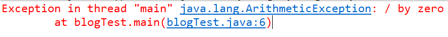
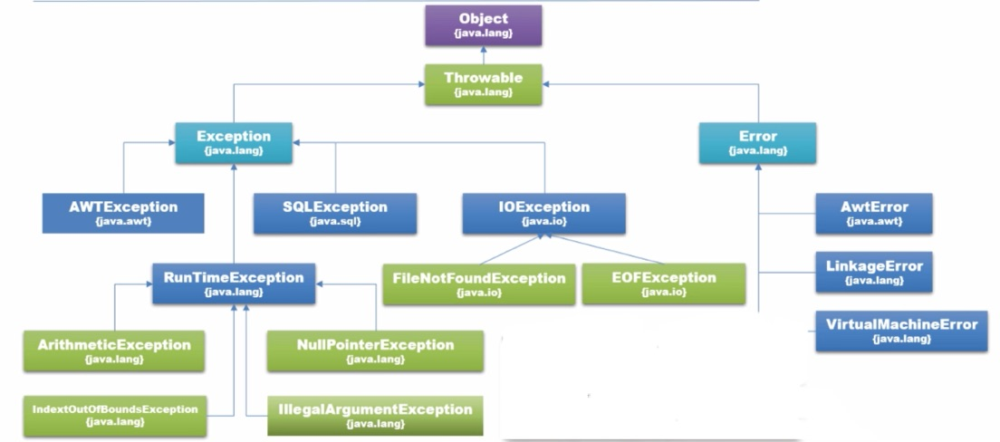
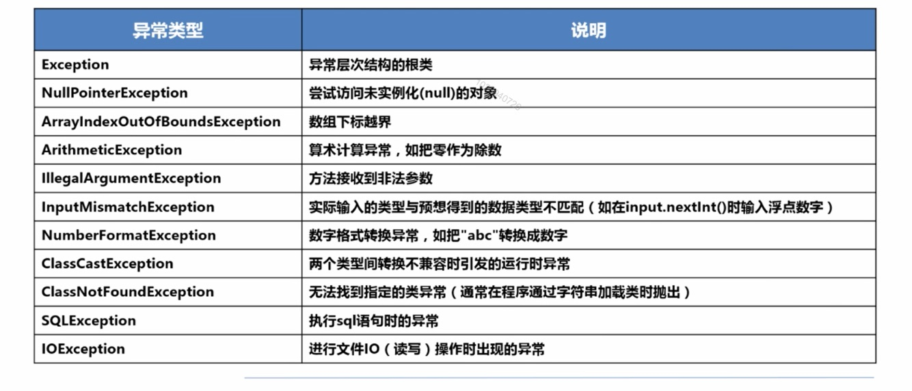

## 一、什么是异常
**异常**是一种**对象**（Exception），**表示组织程序正常执行的错误或情况**
* 在程序运行的过程中，如果JVM检测出一个不可能执行的操作，就会出现运行时错误
* 在Java中，运行时错误（Running Error）会作为异常（对象）抛出
* 如果异常没有被处理，程序将会非正常终止

**异常处理 - 使程序可以继续运行或者优雅地终止**
* 方法抛出异常，调用者可以捕获以及处理该异常 
    * 恢复正常的程序执行
    * 进行日志处理
    * 以某些方式提醒用户（错误提示、对话框等）

以下是一个除法的例子，我们都知道除法运算中的除数不能为零，那么如果是零的话，会出现什么情况呢？

如果没有进行任何异常处理并记录在日志中：
```
    int num1 = 1,num2 = 0,result;
	result = num1/num2;
```
编译器会直接报错


这只是一个异常，在以后会做一些大型的项目，如果写完程序后运行时，出现满屏的异常，这样就很不好，异常的日志直接记录下来，在屏幕上显示的内容少一点也更明确，从而使开发者能够一目了然，下面是加了异常处理的全新版本
```
int num1 = 1,num2 = 0,result;
try{
    result = num1 / num2;
}catch(Exception ex){
    System.err.println(ex.getMessage());
    //记录在日志中
    log.log(Level.WARNING,ex.getMessage());
}
```
## 二、异常类的层次结构


**注意：**
* RuntimeException和Error以及他们的子类都成为免检异常。所有其他异常都称为必检异常（由于免检异常可能在程序的任何一个地方出现，为避免过多地使用try-catch块，Java语言不强制要求编写代码捕获异常）

## 三、常见的异常类型

## 四、如何进行异常处理
### 1.try catch（try catch finally）捕获异常
**捕获异常结构：**
```
try{

    //可能出现异常的代码段

}catch(匹配的异常){

    解决办法//执行的代码段

}
```
异常捕获的**语法**为**try、catch、finally**，程序首先执行**try**中的代码，当满足catch中的异常情况时执行**catch**中的代码，**catch可以有多个**，最后执行**finally**中的代码。
### 2.使用throw和throws抛出异常
这种方法是**将异常抛出给JVM**，而使用throw抛出的异常是抛出一个**对象**（因为Throwable类继承于Object类），throw可以单独使用也可以和try catch一起使用.
```
public class ThrowDemo {

	public static void main(String[] args) {
		Hero hero = new Hero("貂蝉");
		try {
			hero.setExp(1000);
			hero.setHealth(40);
			hero.rideHorse();
		} catch (Exception e) {
			e.printStackTrace();
//			System.err.print("在设置经验值时出现异常：" + e.getMessage());
		}
		System.out.println("当前英雄的经验值：" + hero.getExp());

	}

}
class Hero{
	private String name;
	private long exp;
	private int health;
	
	public Hero(String name){
		setName(name);
	}
	/**
	 * 英雄的骑马方法 - 当英雄的健康值低于50时，不允许骑马
	 * @throws LessThanZeroException 
	 */
	public void rideHorse() throws RideHorseException{
		if(health >= 50)
			System.out.println(name + "正在快乐地骑马！");
		else
			throw new RideHorseException(health);
	}
	
	
	public int getHealth() {
		return health;
	}


	public void setHealth(int health) {
		this.health = health;
	}


	public String getName() {
		return name;
	}
	public void setName(String name) {
		this.name = name;
	}
	public long getExp() {
		return exp;
	}
	public void setExp(long exp) throws Exception {
		if(exp >= 0)
			this.exp = exp;
		else//当exp为负数时，强制抛出异常
			throw new LessThanZeroException((int)exp);
			
	}
	
	
}

```
*通过上面的例子可以更为全面的理解throw和throws如何使用以抛出异常*
### 3.自定义异常
在定义异常时，必须是Throwable类的子类，如果检查异常就要继承自Exception，如果是运行异常就要继承自RuntimeException。下面通过例子来看下自定义异常如何定义使用：
```
/**
*自定义异常 - 小于零时触发
*/
public class LessThanZeroException extends Exception{
	//重写父类的两个构造方法即可
	
	private int value;
	
	
	public LessThanZeroException(){
		super("数字不能小于零！");
	}
	
	public LessThanZeroException(int value){
		super("输入的数字为：" + value + "，不能小于零！");
	}

}
```