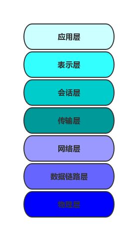
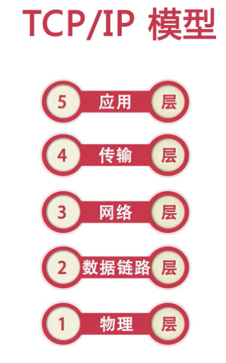
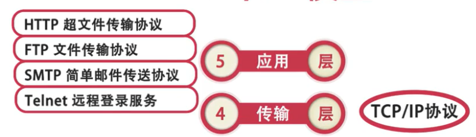
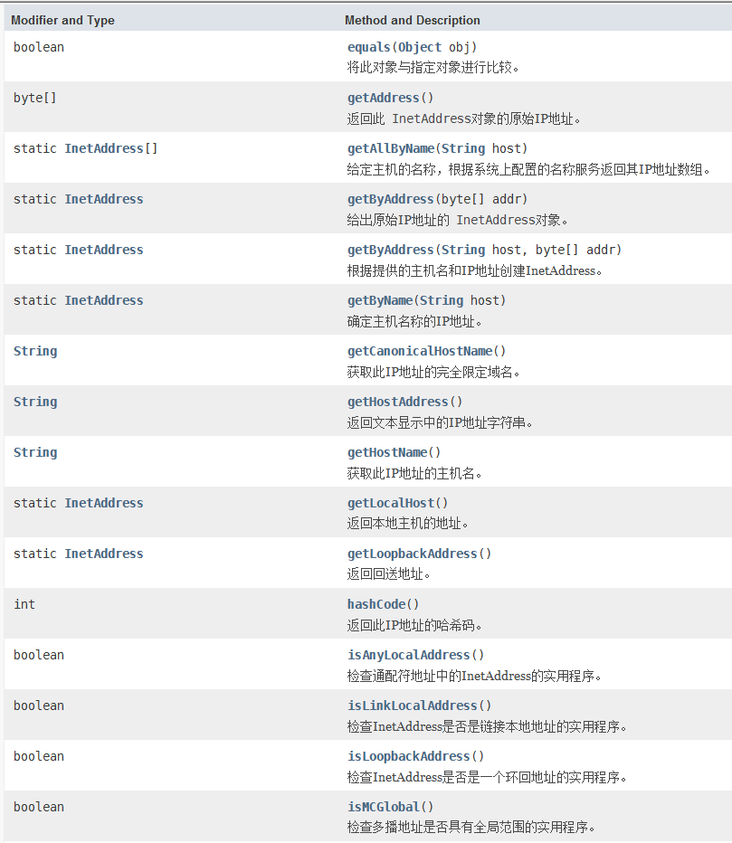
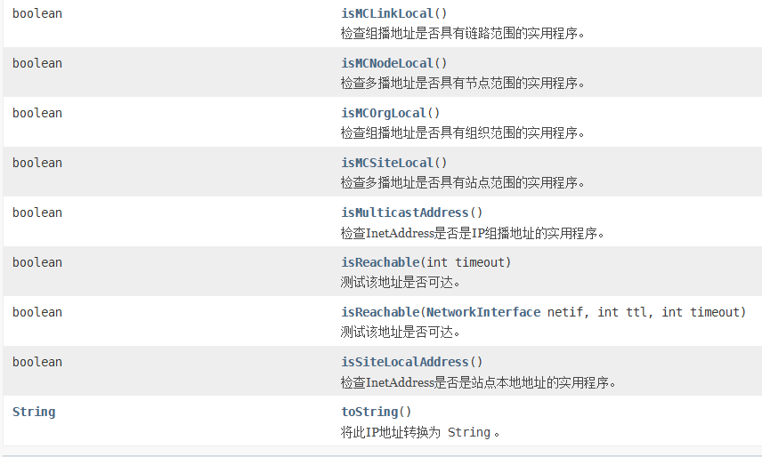
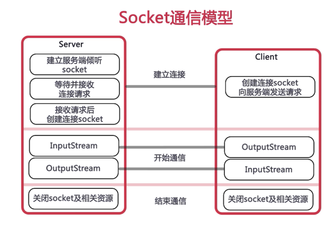

## 一、网络基础了解
### 1、网络架构模型
网络架构模型主要有OSI参考模型和TCP/IP五层模型
* OSI定义了网络互连的七层框架（物理层、数据链路层、网络层、传输层、会话层、表示层、应用层）


* TCP/IP五层协议（物理层、数据链路层、网络层、传输层、应用层）





### 2、IP地址
IP，全称互联网协议地址，是指IP地址，意思是分配给用户上网使用的网际协议（英语：InternetProtocol,IP）的设备的数字标签。

**通俗的：为实现网络中不同计算机之间的通信，每台机器都必须有一个唯一的标识---IP地址**

IP地址格式：数字型，如：192.168.1.1
### 3、端口
* **用于区分不同应用程序**
* **端口号范围为0 ~ 65535，其中0 ~ 1023为系统所保留**
* **IP地址和端口号组成了所谓的Socket，Socket是网络上运行的程序之间双向通信链路的终结点，是TCP和UDP的基础**
* http：80  ftp：21  telnet：23

## 二、Java中的网络相关API
### 1、InetAddress类
**InetAddress类用于标识网络上的硬件资源，表示互联网协议（IP）地址。**

下面是JDK文档中InetAddress类的方法：




下面通过代码进一步了解方法的使用：
```
package com.socket;

import java.net.InetAddress;
import java.net.UnknownHostException;
import java.util.Arrays;

/**
 * InetAddress类的应用
 * @author 87366
 *
 */
public class InetAddressDemo {

	public static void main(String[] args) throws UnknownHostException {
		InetAddress address = InetAddress.getLocalHost();
		System.out.println("计算机名：" + address.getHostName());
		System.out.println("IP地址：" + address.getHostAddress());
		byte[] bytes = address.getAddress();  //获取字节数组的IP地址
		System.out.println("字节数组的形式的IP：" + Arrays.toString(bytes));
		System.out.println(address);//直接输出InetAddress对象
		//根据机器名获取InetAddress实例
		//InetAddress address2 = InetAddress.getByName("DESKTOP-KF6VQOG");
		InetAddress address2 = InetAddress.getByName("111.114.38.225");
		System.out.println("计算机名：" + address2.getHostName());
		System.out.println("IP地址：" + address2.getHostAddress());
		
	}

}
```
### 2、URL
**URL（Uniform Resource Locator）统一资源定位符，表示Internet上某一资源的地址**

下面直接上代码理解URL的常用方法：
```
package com.socket;

import java.net.MalformedURLException;
import java.net.URL;

/**
 * URL常用方法
 * @author 87366
 *
 */
public class URLDemo {

	public static void main(String[] args) {
		
		try {
			//创建一个URL实例
			URL imooc = new URL("https://www.imooc.com");
			//?后面表示参数   #后面表示锚点
			URL url = new URL(imooc,"/index.html?username=tom#test");
			System.out.println("协议：" + url.getProtocol());
			System.out.println("主机：" + url.getHost());
			//如果未指定端口号，则使用默认的端口号，此时getPort()方法返回值为-1
			System.out.println("端口：" + url.getPort());
			System.out.println("文件路径：" + url.getPath());
			System.out.println("文件名：" + url.getFile());
			System.out.println("相对路径：" + url.getRef());
			System.out.println("查询字符串：：" + url.getQuery());
		} catch (MalformedURLException e) {
			e.printStackTrace();
		}
	}

}

```
### 3、使用URL读取网页内容
* 通过**URL对象的openStream()方法**可以得到指定资源的输入流
* 通过输入流可以读取、访问网络上的数据

通过下面代码实现：
```
package com.socket;

import java.io.BufferedReader;
import java.io.IOException;
import java.io.InputStream;
import java.io.InputStreamReader;
import java.net.MalformedURLException;
import java.net.URL;

/**
 * 使用URL读取页面内容
 * @author 87366
 *
 */
public class URLDemo1 {

	public static void main(String[] args) {
		InputStream inpStr = null;
		InputStreamReader inpStream = null;
		BufferedReader bufffedReader = null;
		
		try {
			//创建一个URL实例
			URL url = new URL("https://www.baidu.com");
			//通过URL的openStream方法获取URL对象所表示的资源的字节输入流
			inpStr = url.openStream();
			//将字节输入流转换为字符输入流
			inpStream = new InputStreamReader(inpStr , "utf-8");
			//为字符输入流添加缓冲
			bufffedReader = new BufferedReader(inpStream);
			String dataString = bufffedReader.readLine();//读取数据
			while (dataString != null) {
				System.out.println(dataString);
				dataString = bufffedReader.readLine();
			}
		} catch (MalformedURLException e) {
			e.printStackTrace();
		} catch (IOException e) {
			e.printStackTrace();
		}finally {
			try {
				bufffedReader.close();
				inpStream.close();
				inpStr.close();
			} catch (IOException e) {
				e.printStackTrace();
			}
		}
	}

}
```
## 三、通过Socket实现TCP编程
### 1、Socket通信
**TCP协议是面向连接、可靠的、有序的，以字节流的方式发送数据**
* 基于TCP协议实现网络通信的类
    * 客户端的Socket类
    * 服务器端的ServerSocket类


### 2、Socket通信实现步骤
* 创建ServerSocket和Socket
* 打开连接到Socket的输入/输出流
* 按照协议对Socket进行读/写操作
* 关闭输入输出流、关闭Socket

### 3、编程实现基于Socket通信的用户登录功能
* 服务器端
    * 创建ServerSocket对象，绑定监听端口
    * 通过accept()方法监听客户端请求
    * 连接建立后，通过输入流读取客户端发送的请求信息
    * 通过输出流向客户端发送相应信息

代码实现：
```
package com.socket;

import java.io.BufferedReader;
import java.io.IOException;
import java.io.InputStream;
import java.io.InputStreamReader;
import java.io.OutputStream;
import java.io.PrintWriter;
import java.net.InetAddress;
import java.net.ServerSocket;
import java.net.Socket;

/**
 * 基于TCP协议的Socket通信，实现用户登录
 * 服务器端
 * @author 87366
 *
 */
public class ServerDemo {
	//加入多线程
	public static void main(String[] args) {
		ServerSocket serverSocket = null;
		Socket socket = null;
		try {
			//1.创建一个服务器端Socket，即ServerSocket，指定绑定的端口，并监听此端口
			serverSocket = new ServerSocket(8888);
			//记录客户端的数量
			int count = 0;
			System.out.println("***服务器即将启动，等待客户端的连接***");
			//循环监听等待客户端的连接
			while(true) {
				//调用accept()方法开始监听，等待客户端的连接
				socket = serverSocket.accept();
				//创建一个新的线程
				ServerThreadDemo serverThreadDemo = new ServerThreadDemo(socket);
				//启动线程
				serverThreadDemo.start();
				
				count++;//统计客户端的数量
				System.out.println("客户端的数量：" + count);
				InetAddress address = socket.getInetAddress();
				System.out.println("客户端" + count + "的IP地址：" + address.getHostAddress());
				
			}
						
		} catch (IOException e) {
			e.printStackTrace();
		}finally {
			try {
				//5.关闭相关资源
				socket.close();
				serverSocket.close();
			} catch (IOException e) {
				e.printStackTrace();
			}		
		}
	}
	
	//第一个版本
	public static void main1(String[] args) {
		ServerSocket serverSocket = null;
		Socket socket = null;
		InputStream inputStream = null;
		InputStreamReader inputStreamReader = null;
		BufferedReader bufferedReader = null;
		OutputStream outputStream = null;
		PrintWriter printWriter = null;
		try {
			//1.创建一个服务器端Socket，即ServerSocket，指定绑定的端口，并监听此端口
			serverSocket = new ServerSocket(8888);
			//2.调用accept()方法开始监听，等待客户端的连接
			System.out.println("***服务器即将启动，等待客户端的连接***");
			socket = serverSocket.accept();
			//3.获取输入流用来读取客户端信息
			inputStream = socket.getInputStream();
			inputStreamReader = new InputStreamReader(inputStream);
			bufferedReader = new BufferedReader(inputStreamReader);
			String infor = null;
			while ((infor = bufferedReader.readLine()) != null) {//循环读取客户端的信息
				System.out.println("我是服务器，客户端说：" + infor);
			}
			socket.shutdownInput();
			//4.获取输入流，响应客户端的请求
			outputStream = socket.getOutputStream();
			printWriter = new PrintWriter(outputStream);
			printWriter.write("欢迎您！");
			printWriter.flush();
		} catch (IOException e) {
			e.printStackTrace();
		}finally {
			try {
				//5.关闭相关资源
				printWriter.close();
				outputStream.close();
				bufferedReader.close();
				inputStreamReader.close();
				inputStream.close();
				socket.close();
				serverSocket.close();
			} catch (IOException e) {
				e.printStackTrace();
			}		
		}
	}
}
```
```
package com.socket;
/**
 * 服务器端线程处理类
 * @author 87366
 *
 */

import java.io.BufferedReader;
import java.io.IOException;
import java.io.InputStream;
import java.io.InputStreamReader;
import java.io.OutputStream;
import java.io.PrintWriter;
import java.net.Socket;

public class ServerThreadDemo extends Thread {
	//和本线程相关的Socket
	Socket socket = null;

	public ServerThreadDemo(Socket socket) {
		this.socket = socket;
	}
	
	//线程执行的操作，响应客户端的请求
	@Override
	public void run() {
		InputStream inputStream = null;
		InputStreamReader inputStreamReader = null;
		BufferedReader bufferedReader = null;
		OutputStream outputStream = null;
		PrintWriter printWriter = null;
		try {
			//获取输入流用来读取客户端信息
			inputStream = socket.getInputStream();
			inputStreamReader = new InputStreamReader(inputStream);
			bufferedReader = new BufferedReader(inputStreamReader);
			String infor = null;
			while ((infor = bufferedReader.readLine()) != null) {//循环读取客户端的信息
				System.out.println("我是服务器，客户端说：" + infor);
			}
			socket.shutdownInput();
			//获取输入流，响应客户端的请求
			outputStream = socket.getOutputStream();
			printWriter = new PrintWriter(outputStream);
			printWriter.write("欢迎您！");
			printWriter.flush();
		} catch (IOException e) {
			e.printStackTrace();
		}finally {
			try {
				//5.关闭相关资源
				printWriter.close();
				outputStream.close();
				bufferedReader.close();
				inputStreamReader.close();
				inputStream.close();
			} catch (IOException e) {
				e.printStackTrace();
			}		
		}
	}	
}
```
上面的代码包含了两个版本，第一个版本是没有加入多线程的，第二个加入了多线程更加高效。

* 客户端：
    * 创建Socket对象，指明需要连接的服务器的地址和端口号
    * 连接建立后，通过输出流向服务器端发送请求信息
    * 通过输入流获取服务器响应的信息
    * 关闭相关资源

代码实现：
```
package com.socket;

import java.io.BufferedReader;
import java.io.IOException;
import java.io.InputStream;
import java.io.InputStreamReader;
import java.io.OutputStream;
import java.io.PrintWriter;
import java.net.Socket;

/**
 * 客户端
 * @author 87366
 *
 */
public class ClientDemo {
	public static void main(String[] args) {	
		Socket socket = null;
		OutputStream outputStream = null;
		PrintWriter printWriter = null;
		BufferedReader bufferedReader = null;
		InputStream inputStream = null;
		try {
			//1.创建客户端Socket，指定服务器端口和地址
			socket = new Socket("localhost",8888);
			//2.获取输出流，向服务器发送消息
			outputStream = socket.getOutputStream();
			printWriter = new PrintWriter(outputStream);
			printWriter.write("用户名：tom;密码：456");
			printWriter.flush();
			socket.shutdownOutput();
			//3.获取输入流，用来读取服务器端的响应信息
			inputStream = socket.getInputStream();
			bufferedReader = new BufferedReader(new InputStreamReader(inputStream));
			String infor = null;
			while ((infor = bufferedReader.readLine()) != null) {//循环读取客户端的信息
				System.out.println("我是客户端，服务端说：" + infor);
			}
		} catch (IOException e) {
			e.printStackTrace();
		}finally {	
			try {
				//4.关闭相关资源
				bufferedReader.close();
				inputStream.close();				
				printWriter.close();
				outputStream.close();
				socket.close();
			} catch (IOException e) {
				e.printStackTrace();
			}
		}
	}
}
```
***运行时，先运行服务器端代码，再运行客户端代码***
## 四、通过Socket实现UDP编程
### 1、DatagramPacket
**UDP编程**
* **UDP协议（用户数据报协议）是无连接的、不可靠的、无序的**
* **UDP协议以数据报作为数据传输的载体**
* 进行数据传输时，首先需要将要传输的数据定义成数据报（Datagram），在数据报中指明数据所要达到的Socket（主机地址和端口号），然后再将数据报发送出去

### 2、相关操作类
* DatagramPacket：表示数据包报
* DatagramSocket：进行端到端通信的类

### 3、编程实现基于Socket通信的用户登录功能
* 服务器端  
    * 创建DatagramSocket，指定端口号
    * 创建DatagramPacket
    * 接收客户端发送的数据信息
    * 读取数据

代码实现：
```
package com.socket;

import java.io.IOException;
import java.net.DatagramPacket;
import java.net.DatagramSocket;
import java.net.InetAddress;
import java.net.SocketException;

/**
 * 服务器端，实现基于UDP的用户登录
 * @author 87366
 *
 */
public class UDPServerDemo {
	public static void main(String[] args) throws IOException {
		/*
		 * 接收客户端发送的数据
		 */
		//1.创建服务器端DatagramSocket，指定端口
		DatagramSocket socket = new DatagramSocket(8889);
		//2.创建数据报，用于接收客户端发送的数据
		byte[] data = new byte[1024];//创建字节数组，指定接收的数据包的大小
		DatagramPacket packet = new DatagramPacket(data, data.length);
		//3.接收客户端发送的数据
		System.out.println("****服务器端已经启动，等待客户端发送数据****");
		socket.receive(packet);//此方法在接收到数据报之前会一直阻塞
		//4.读取数据
		String infor = new String(data, 0, packet.getLength());
		System.out.println("我是服务器，客户端说：" + infor);
		/*
		 * 向客户端响应数据
		 */
		//1.定义客户端的地址、端口号、数据
		InetAddress address = packet.getAddress();
		int port = packet.getPort();
		byte[] data2 = "欢迎您！".getBytes();
		//2.创建数据报，包含响应的数据信息
		DatagramPacket packet2 = new DatagramPacket(data2, data2.length, address, port);
		//3.响应客户端
		socket.send(packet2);
		socket.close();
	}
}
```
* 客户端实现步骤
    * 定义发送信息
    * 创建DatagramPacket，包含将要发送的信息
    * 创建DatagramSocket
    * 发送数据
代码实现：
```
package com.socket;

import java.io.IOException;
import java.net.DatagramPacket;
import java.net.DatagramSocket;
import java.net.InetAddress;
import java.net.SocketException;
import java.net.UnknownHostException;

/**
 * 客户端
 * @author 87366
 *
 */
public class UDPClient {
	public static void main(String[] args) throws IOException {
		/*
		 * 向服务器端发送数据
		 */
		//1.定义服务器的地址、端口号、数据
		InetAddress address = InetAddress.getByName("localhost");
		int port = 8889;
		byte[] data = "用户名：admin;密码：123".getBytes();
		//2.创建数据报，包含发送的数据信息
		DatagramPacket packet = new DatagramPacket(data, data.length, address, port);
		//3.创建DatagramSocket对象
		DatagramSocket socket = new DatagramSocket();
		//4.向服务器端发送数据报
		socket.send(packet);	
		/*
		 * 接收服务器端响应的数据
		 */
		//1.创建数据报，用于接收服务器端响应的数据
		byte[] data2 = new byte[1024];
		DatagramPacket packet2 = new DatagramPacket(data2, data2.length);
		//2.接收服务器响应的数据
		socket.receive(packet2);
		//3.读取数据
		String reply = new String(data2, 0, packet2.getLength());
		System.out.println("我是客户端，服务器说：" + reply);
		//4.关闭资源
		socket.close();	
	}
}
```