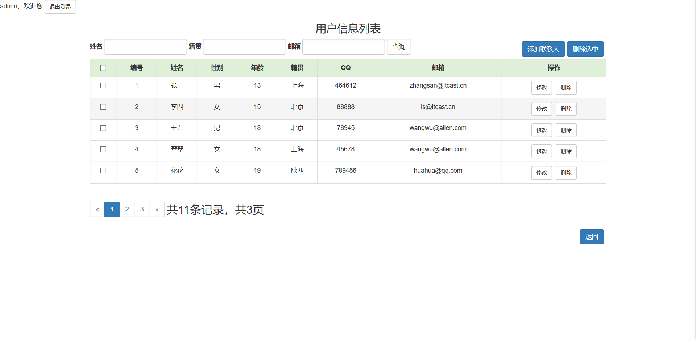

## 1、前言
*原版本请访问[此链接](https://blog.csdn.net/qq_34504626/article/details/104571195)*
## 2、登录状态验证
### 功能简介
* 访问所有资源。验证其是否登录
	* 如果登录了，则直接放行。
	* 如果没有登录，则跳转到登录页面，提示"您尚未登录，请先登录"。

### 分析


### 代码实现
* LoginFilter.class
```
package com.allen.web.filter;

import javax.servlet.*;
import javax.servlet.annotation.WebFilter;
import javax.servlet.http.HttpServletRequest;
import java.io.IOException;

/**
 * 完成登录验证的过滤器
 */
@WebFilter("/*")
public class LoginFilter implements Filter {

    public void doFilter(ServletRequest req, ServletResponse resp, FilterChain chain) throws ServletException, IOException {
        //强制转换
        HttpServletRequest request = (HttpServletRequest) req;

        //1、获取资源请求路径
        String uri = request.getRequestURI();
        //2、判断是否包含登录相关资源路径,要注意排除掉css/js/图片/验证码等资源
        if(uri.contains("/login.jsp") || uri.contains("/loginServlet") || uri.contains("/css/") || uri.contains("/js/") || uri.contains("/fonts/") || uri.contains("/checkCodeServlet")){
            //包含，用户就是想登录，放行
            chain.doFilter(req, resp);
        }else {
            //不包含，需要验证用户是否登录
            //3、从获取session中获取user
            Object admin = request.getSession().getAttribute("admin");
            if(admin != null){
                //登录了，放行
                chain.doFilter(req, resp);
            }else {
                //没有登录，跳转登录页面
                request.setAttribute("login_msg","您尚未登录，请登录");
                request.getRequestDispatcher("/login.jsp").forward(request,resp);
            }
        }

    }

    public void init(FilterConfig config) throws ServletException {

    }

    public void destroy() {
    }

}

```
* login.jsp中加入以下代码
```
<c:if test="${pageContext.request.getAttribute('login_msg') == '您尚未登录，请登录'}">
    <div class="alert alert-warning alert-dismissible" role="alert">
        <button type="button" class="close" data-dismiss="alert" >
            <span>&times;</span></button>
        <strong>
            <strong><%=request.getAttribute("login_msg") == null ? "" : "您尚未登录，请登录"%></strong>
        </strong>
    </div>
    <%
        request.getSession().removeAttribute("login_msg");
    %>
</c:if>
```
### 效果展示
* 如果未登录，不管访问除登录页面所需资源外的其他资源均跳转到此页面


## 3、退出登录按钮小功能
### 分析


### 代码实现
* index.jsp页面和list.jsp页面分别加入以下代码
```
<script>
    function exit() {
        if(confirm("你确定要退出吗？")){
            location.href = "${pageContext.request.contextPath}/userExitServlet";
        }
    }
</script>

<div>${admin.username}，欢迎您
    <a class="btn btn-default btn-sm" href="javascript:exit();">退出登录</a>
</div>
```
* UserExitServlet.class
```
package com.allen.web.servlet;

import javax.servlet.ServletException;
import javax.servlet.annotation.WebServlet;
import javax.servlet.http.HttpServlet;
import javax.servlet.http.HttpServletRequest;
import javax.servlet.http.HttpServletResponse;
import java.io.IOException;

@WebServlet("/userExitServlet")
public class UserExitServlet extends HttpServlet {
    protected void doPost(HttpServletRequest request, HttpServletResponse response) throws ServletException, IOException {
        request.getSession().removeAttribute("admin");
        response.sendRedirect(request.getContextPath()+"/login.jsp");
    }

    protected void doGet(HttpServletRequest request, HttpServletResponse response) throws ServletException, IOException {
        this.doPost(request, response);
    }
}
```

### 效果展示



点击确定后退出登录，并跳转到登录页面