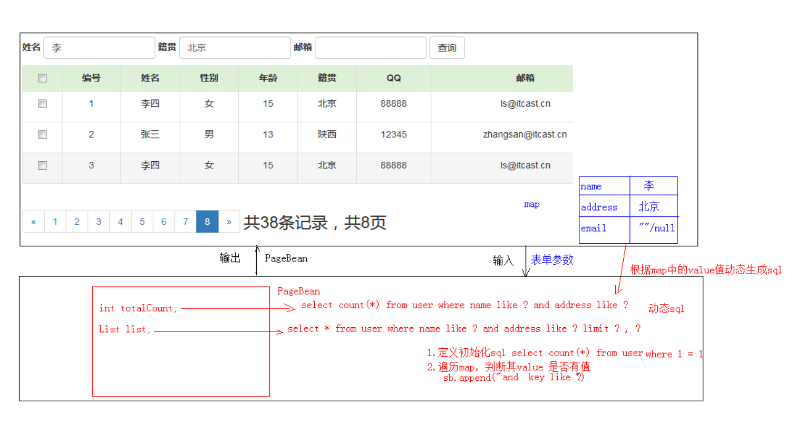

## 一、前言
从2020年二月十七日开始学习JavaWeb，到今天已经经历了十一个日日夜夜了，在这期间算是对JavaWeb中所涉及的一些内容有了了解，算是有点小成果吧，所以在第十天的学习结束之后，便萌生了想要自己做一个东西的想法。于是经过两天的开发测试终于做好了**一个简单的小型用户管理网页（主要是后端，前端在一些基础上加了一些功能）**。

## 二、案例开发流程
这个小项目的主要功能就是用户信息列表展示以及一些增删改查的操作加上用户登录，但其中有很多细节部分，对新手来说不是很友好，要考虑的细节很多。
* **以其中的主要功能用户信息的增删改查操作为例，介绍开发流程。**

### 1、需求：用户信息的增删改查操作
### 2、设计（架构师完成）
* **技术选型**：Servlet+JSP+MySQL+JDBCTempleat+Duird+BeanUtils+tomcat

*由于还未接触到框架所以用的都是学过的Web开发基础内容*
* **数据库设计**：
    * 存放用户信息数据的user表   
    ```
	create database day10; -- 创建数据库
	use day10; 			   -- 使用数据库
	create table user(   -- 创建表
		id int primary key auto_increment,
		name varchar(20) not null,
		gender varchar(5),
		age int,
		address varchar(32),
		qq	varchar(20),
		email varchar(50)
	);
    ```
    * 存放管理员信息数据的admin表
    ```
    CREATE TABLE `admin` (
      `id` int(11) NOT NULL AUTO_INCREMENT,
      `username` varchar(30) NOT NULL,
      `password` varchar(30) NOT NULL,
      `lastTime` datetime NOT NULL,
      `status` varchar(30) NOT NULL,
      PRIMARY KEY (`id`)
    ) ENGINE=InnoDB AUTO_INCREMENT=2 DEFAULT CHARSET=utf8mb4 COLLATE=utf8mb4_0900_ai_ci;
    ```

### 3、开发（程序员完成，也就是我）
* **环境搭建**
	* **创建数据库环境**
	* **创建项目，导入需要的jar包**
* **编码**

### 4、测试
**白盒测试为主**
### 5、部署运维
项目过小，部署在本地Tomcat服务器中即可。

## 三、具体功能介绍以及分析
### 1、简单功能
* **登录**
    * 输入正确的用户名、密码以及验证码校验后进行登录
* **列表查询**
    * 进入管理界面初始化展示所有的用户信息数据表
* **添加**
    * 添加用户，并加入了前端的信息校验，若无效信息则提交失败
    * 分析实现过程
    
* **删除**
    * 删除用户
    * 分析实现过程
    
* **修改**
    * 修改用户信息，对所有可修改数据进行校验，若无效信息则提交失败
    * 分析实现过程
    
### 2、复杂功能
* **删除选中**
    * 删除选中的用户信息数据
    * 分析实现过程
    
* **分页查询**
	* 好处：
		1. 减轻服务器内存的开销
		2. 提升用户体验
	* 分析实现过程
	* 第一步：分页查询显示总页数和信息总条数
    
    * 第二步：完成分页后每页的信息展示
    
* **复杂条件查询**
    * 设定三个常用的条件查询栏，可以同时输入进行查询也可以仅输入其中的部分数据进行查询，并分页展示
    * 分析实现过程
    

## 四、具体功能的细节
* 删除和删除选中功能中加入了警告信息，是否删除

* 分页查询中，用户在使用左侧和右侧小按键进行跳转时，如果在首页和末尾页我无法进行跳转，否则会出错

* 从管理界面index.jsp转到用户信息界面时，将分页功能中所创建的分页对象的两个属性进行设定。防止跳转出错
* 登录功能中的验证码使用Servlet简单地进行随机生成，登录后还可以显示上一次登录的时间

## 五、效果展示
### 1、登录功能（login.jsp+UserLoginServlet+checkCodeServlet验证码生成器）


### 2、 简单的管理界面（index.jsp）

### 3、用户信息展示以及分页（list.jsp+UserFindByPageServlet）

### 4、用户信息修改（update.jsp+UserUpdateServlet+UserFindServlet信息回显）


### 5、添加用户（add.jsp+UserAddServlet）

### 6、条件查询（list.jsp+UserFindByPageServlet分页）


## 六、总结
*整个项目虽然不大，但是也算是这些天学习的见证。*
* 项目已上传到github，如有需要请访问https://github.com/AllenXueKY/JavaWeb/tree/master/day10_case
* 需要改进的方面：前端页面的设计以及表单中籍贯选择器，在登录的Servlet中加入Cookie和Session并设置存活时间，使得系统更加安全。