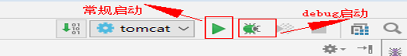

## 一、前言
学习JavaWeb已经将近二十天了，在学习框架之前，将自己最近学习的东西来一个大融合，既巩固了基础知识，又能在开发过程中查漏补缺，为下来学习框架打好基础。某马旅游网是一个综合性的项目，其中包含了Web项目开发的大多数基本功能的实现，应用的东西很多，很适合现在进行，所以就选择做旅游网了。

## 二、准备工作
* **编译器**：idea
* **数据库**：MySQL 8.0
* **Web项目服务器**：Tomcat
* **一个半成品的maven项目**（其中包括前端页面以及项目中的实体类）
    * 这样做的原因：本人主要是做Java后端开发的，所以一般来说，前后端分离，前端已经有人做好了，只需要导入后，进行后端开发即可。
    * 如果也想做的话，通过此链接（https://pan.baidu.com/s/1nOUnZLE5anbDIaUyENiBtQ 提取码：oplj）下载即可。

## 三、项目开发过程 
### 1、项目导入
* 点击**绿色＋按钮**

* 选择travel项目的**pom.xml文件**，**点击ok**，完成项目导入。*需要等待一小会，项目初始化完成*。


### 2、启动项目
#### 方式一：

#### 方式二：配置maven快捷启动
 

### 3、技术选型
**三层架构**
#### （1）Web层
* **Servlet：前端控制器**
* **html：视图**
* **Filter：过滤器**
* **BeanUtils：数据封装**
* **Jackson：json序列化工具**

#### （2）Service层
* **Javamail**：java发送邮件工具
* **Redis**：nosql内存数据库
* **Jedis**：java的redis客户端

#### （3）Dao层
* **Mysql**：数据库
* **Druid**：数据库连接池
* **JdbcTemplate**：jdbc的工具

### 4、创建数据库
* 数据库表结构

* 建表语句
```
-- 创建数据库
CREATE DATABASE travel;
-- 使用数据库
USE travel;
--创建表
/*==============================================================*/
/* DBMS name:      MySQL 5.0                                    */
/* Created on:     2018/2/14 23:10:29                           */
/*==============================================================*/
set names utf8;

drop table if exists tab_favorite;
drop table if exists tab_route_img;
drop table if exists tab_route;
drop table if exists tab_category;
drop table if exists tab_seller;
drop table if exists tab_user;

/*==============================================================*/
/* Table: tab_category                                          */
/*==============================================================*/
create table tab_category
(
   cid                  int not null auto_increment,
   cname                varchar(100) not null,
   primary key (cid),
   unique key AK_nq_categoryname (cname)
);

/*==============================================================*/
/* Table: tab_favorite                                          */
/*==============================================================*/
create table tab_favorite
(
   rid                  int not null,
   date                 date not null,
   uid                  int not null,
   primary key (rid, uid)
);

/*==============================================================*/
/* Table: tab_route                                             */
/*==============================================================*/
create table tab_route
(
   rid                  int not null auto_increment,
   rname                varchar(500) not null,
   price                double not null,
   routeIntroduce       varchar(1000),
   rflag                char(1) not null,
   rdate                varchar(19),
   isThemeTour          char(1) not null,
   count                int default 0,
   cid                  int not null,
   rimage               varchar(200),
   sid                  int,
   sourceId             varchar(50),
   primary key (rid),
   unique key AK_nq_sourceId (sourceId)
);

/*==============================================================*/
/* Table: tab_route_img                                         */
/*==============================================================*/
create table tab_route_img
(
   rgid                 int not null auto_increment,
   rid                  int not null,
   bigPic               varchar(200) not null,
   smallPic             varchar(200),
   primary key (rgid)
);

/*==============================================================*/
/* Table: tab_seller                                            */
/*==============================================================*/
create table tab_seller
(
   sid                  int not null auto_increment,
   sname                varchar(200) not null,
   consphone            varchar(20) not null,
   address              varchar(200),
   primary key (sid),
   unique key AK_Key_2 (sname)
);

/*==============================================================*/
/* Table: tab_user                                              */
/*==============================================================*/
create table tab_user
(
   uid                  int not null auto_increment,
   username             varchar(100) not null,
   password             varchar(32) not null,
   name                 varchar(100),
   birthday             date,
   sex                  char(1),
   telephone            varchar(11),
   email                varchar(100),
   status               char(1) ,
   code					varchar(50),
   
   primary key (uid),
   unique key AK_nq_username (username),
   unique key AK_nq_code (code)
);

alter table tab_favorite add constraint FK_route_favorite foreign key (rid)
      references tab_route (rid) on delete restrict on update restrict;

alter table tab_favorite add constraint FK_user_favorite foreign key (uid)
      references tab_user (uid) on delete restrict on update restrict;

alter table tab_route add constraint FK_category_route foreign key (cid)
      references tab_category (cid) on delete restrict on update restrict;

alter table tab_route add constraint FK_seller_route foreign key (sid)
      references tab_seller (sid) on delete restrict on update restrict;

alter table tab_route_img add constraint FK_route_routeimg foreign key (rid)
      references tab_route (rid) on delete restrict on update restrict;

```
### 5、注册功能
#### （1）页面效果

#### （2）功能分析

#### （3）代码实现
##### 前台代码
* **表单校验**
    * 提升用户体验，并减轻服务器压力。
```
<script>
	//校验用户名
    //用户名正则，4到16位（字母，数字，下划线，减号）
	function checkUsername() {
		//1、获取用户名的值
		var username = $("#username").val();
		//2、定义正则
		var reg_username = /^[a-zA-Z0-9_-]{4,16}$/;
		//3、判断，给出提示信息
		var flag = reg_username.test(username);
		if(flag){
		    //用户名合法
            $("#username").css("border","");
		}else {
		    //用户名非法，加一个红色的边框
			$("#username").css("border","1px solid red");
		}
		return flag;
    }
    //校验密码
    function checkPassword() {
        var password = $("#password").val();
        //2、定义正则
        var reg_password = /^[a-zA-Z0-9_-]{4,16}$/;
        //3、判断，给出提示信息
        var flag = reg_password.test(password);
        if(flag){
            $("#password").css("border","");
        }else {
            $("#password").css("border","1px solid red");
        }
        return flag;
    }
    //校验邮箱
    function checkEmail() {
		//1、获取邮箱
		var email = $("#email").val();
		//2、定义正则
		var reg_email = /^([A-Za-z0-9_\-\.])+\@([A-Za-z0-9_\-\.])+\.([A-Za-z]{2,4})$/;
		//3、判断
		var flag = reg_email.test(email);
        if(flag){
            $("#email").css("border","");
        }else {
            $("#email").css("border","1px solid red");
        }
        return flag;
    }
    //校验姓名
	//汉字
    function checkName() {
        var name = $("#name").val();
        //2、定义正则
        var reg_name = /^[\u2E80-\u9FFF]+$/;
        //3、判断
        var flag = reg_name.test(name);
        if(flag){
            $("#name").css("border","");
        }else {
            $("#name").css("border","1px solid red");
        }
        return flag;
    }
    //校验手机号
    function checkTelephone() {
        var telephone = $("#telephone").val();
        //2、定义正则
        var reg_telephone = /^((13[0-9])|(14[5|7])|(15([0-3]|[5-9]))|(18[0,5-9]))\d{8}$/;
        //3、判断
        var flag = reg_telephone.test(telephone);
        if(flag){
            $("#telephone").css("border","");
        }else {
            $("#telephone").css("border","1px solid red");
        }
        return flag;
    }
    //校验出生日期
    function checkBirthday() {
        var birthday = $("#birthday").val();
        var reg_birthday = /^[1-9]\d{3}-(0[1-9]|1[0-2])-(0[1-9]|[1-2][0-9]|3[0-1])$/;
        //判断
        var flag = reg_birthday.test(birthday);
        if(flag){
            $("#birthday").css("border","");
        }else {
            $("#birthday").css("border","1px solid red");
        }
        return flag;
    }
    
    //校验验证码
	//4位数字字母组成 ^(?![0-9]+$)(?![a-zA-Z]+$)[0-9A-Za-z]{4}$
    function checkCheck() {
        var check = $("#check").val();
        //2、定义正则
        var reg_check = /^(?![0-9]+$)(?![a-zA-Z]+$)[0-9A-Za-z]{4}$/;
        //3、判断
        var flag = reg_check.test(check);
        if(flag){
            $("#check").css("border","");
        }else {
            $("#check").css("border","1px solid red");
        }
        return flag;
    }
    $(function () {
		//当表单提交时，调用所有的校验方法
        $("#registerForm").submit(function () {
			//1、发送数据到服务器
			if(checkUsername() && checkPassword() && checkEmail() && checkName() && checkTelephone() && checkBirthday() && checkCheck()){
			    //校验通过，发送ajax请求，提交表单的数据

				$.post("registUserServlet",$(this).serialize(),function (data) {
					//处理服务器响应的数据 data
					if(data.flag){
					    //注册成功，跳转成功页面
						alert("正在跳转中，请稍等...");
						location.href="register_ok.html";
					}else {
					    //注册失败
						$("#error_Msg").html(data.errorMsg);
					}
                });

			}
			//2、跳转页面
            return false;
            //如果这个方法没有返回值，或者返回为true，则表单提交，如果返回为false，则表单不提交
        });
        //当某一个组件失去焦点时，调用对应的校验方法
    	$("#username").blur(checkUsername);
        $("#password").blur(checkPassword);
        $("#email").blur(checkEmail);
        $("#name").blur(checkName);
        $("#telephone").blur(checkTelephone);
        $("#birthday").blur(checkBirthday);
        $("#check").blur(checkCheck);
    });

</script>
```
* **异步(ajax)提交表单**
	在此使用异步提交表单是为了获取服务器响应的数据。因为我们前台使用的是html作为视图层，不能够直接从servlet相关的域对象获取值，只能通过ajax获取响应数据

 
##### **后台代码实现**
* **编写RegistUserServlet**
```
@WebServlet("/registUserServlet")
public class RegistUserServlet extends HttpServlet {
    protected void doPost(HttpServletRequest request, HttpServletResponse response) throws ServletException, IOException {


        //验证校验
        String check = request.getParameter("check");
        //从sesion中获取验证码
        HttpSession session = request.getSession();
        String checkcode_server = (String) session.getAttribute("CHECKCODE_SERVER");
        session.removeAttribute("CHECKCODE_SERVER");//为了保证验证码只能使用一次
        //比较
        if(checkcode_server == null || !checkcode_server.equalsIgnoreCase(check)){
            //验证码错误
            ResultInfo info = new ResultInfo();
            //注册失败
            info.setFlag(false);
            info.setErrorMsg("验证码错误");
            //将info对象序列化为json
            ObjectMapper mapper = new ObjectMapper();
            String json = mapper.writeValueAsString(info);
            response.setContentType("application/json;charset=utf-8");
            response.getWriter().write(json);
            return;
        }

        //1.获取数据
        Map<String, String[]> map = request.getParameterMap();

        //2.封装对象
        User user = new User();
        try {
            BeanUtils.populate(user,map);
        } catch (IllegalAccessException e) {
            e.printStackTrace();
        } catch (InvocationTargetException e) {
            e.printStackTrace();
        }

        //3.调用service完成注册
        UserService service = new UserServiceImpl();
        boolean flag = service.regist(user);
        ResultInfo info = new ResultInfo();
        //4.响应结果
        if(flag){
            //注册成功
            info.setFlag(true);
        }else{
            //注册失败
            info.setFlag(false);
            info.setErrorMsg("注册失败!");
        }

        //将info对象序列化为json
        ObjectMapper mapper = new ObjectMapper();
        String json = mapper.writeValueAsString(info);

        //将json数据写回客户端
        //设置content-type
        response.setContentType("application/json;charset=utf-8");
        response.getWriter().write(json);


    }

    protected void doGet(HttpServletRequest request, HttpServletResponse response) throws ServletException, IOException {
        this.doPost(request, response);
    }
}
```
* **编写UserService以及UserServiceImpl**
```
public class UserServiceImpl implements UserService {

    private UserDao userDao = new UserDaoImpl();
    /**
     * 注册用户
     * @param user
     * @return
     */
    @Override
    public boolean regist(User user) {
        //1.根据用户名查询用户对象
        User u = userDao.findByUsername(user.getUsername());
        //判断u是否为null
        if(u != null){
            //用户名存在，注册失败
            return false;
        }
        //2.保存用户信息
        userDao.save(user);
        return true;
    }
}
```
* **编写UserDao以及UserDaoImpl**
```
public class UserDaoImpl implements UserDao {

    private JdbcTemplate template = new JdbcTemplate(JDBCUtils.getDataSource());

    @Override
    public User findByUsername(String username) {
        User user = null;
        try {
            //1.定义sql
            String sql = "select * from tab_user where username = ?";
            //2.执行sql
            user = template.queryForObject(sql, new BeanPropertyRowMapper<User>(User.class), username);
        } catch (Exception e) {

        }

        return user;
    }

    @Override
    public void save(User user) {
        //1.定义sql
        String sql = "insert into tab_user(username,password,name,birthday,sex,telephone,email) values(?,?,?,?,?,?,?)";
        //2.执行sql

        template.update(sql,user.getUsername(),
                    user.getPassword(),
                user.getName(),
                user.getBirthday(),
                user.getSex(),
                user.getTelephone(),
                user.getEmail());
    }
}
```
##### 邮件激活
	* 为什么要进行邮件激活？为了保证用户填写的邮箱是正确的。将来可以推广一些宣传信息，到用户邮箱中。
* **发送邮件**
    * 申请邮箱
    * 开启授权码
    * 在MailUtils中设置自己的邮箱账号和密码(授权码)（我用的是QQ邮箱，在设置中选择帐户，然后向下拉，找到如下图所示的部分）
    
* **邮件工具类**：MailUtils，调用其中sendMail方法可以完成邮件发送

##### 用户点击邮件激活
* 经过分析，发现，用户激活其实就是修改用户表中的status为‘Y’

* **分析**：

* **发送邮件代码**：

* 修改保存Dao代码，加上存储status和code 的代码逻辑

* **激活代码实现**：
    * **ActiveUserServlet**
```
//1.获取激活码
String code = request.getParameter("code");
if(code != null){
    //2.调用service完成激活
    UserService service = new UserServiceImpl();
    boolean flag = service.active(code);

    //3.判断标记
    String msg = null;
    if(flag){
        //激活成功
        msg = "激活成功，请<a href='login.html'>登录</a>";
    }else{
        //激活失败
        msg = "激活失败，请联系管理员!";
    }
    response.setContentType("text/html;charset=utf-8");
    response.getWriter().write(msg);
```
    * **UserService：active**
```
@Override
public boolean active(String code) {
    //1.根据激活码查询用户对象
    User user = userDao.findByCode(code);
    if(user != null){
        //2.调用dao的修改激活状态的方法
        userDao.updateStatus(user);
        return true;
    }else{
        return false;
    }

}
```
    * **UserDao：findByCode	updateStatus**
```
/**
 * 根据激活码查询用户对象
 * @param code
 * @return
 */
@Override
public User findByCode(String code) {
    User user = null;
    try {
        String sql = "select * from tab_user where code = ?";

        user = template.queryForObject(sql,new BeanPropertyRowMapper<User>(User.class),code);
    } catch (DataAccessException e) {
        e.printStackTrace();
    }

    return user;
}

/**
 * 修改指定用户激活状态
 * @param user
 */
@Override
public void updateStatus(User user) {
    String sql = " update tab_user set status = 'Y' where uid=?";
    template.update(sql,user.getUid());
}
```

### 6、登录
#### （1）分析

#### （2）代码实现
##### 前台代码

##### 后台代码
* **LoginServlet**
```
//1.获取用户名和密码数据
Map<String, String[]> map = request.getParameterMap();
//2.封装User对象
User user = new User();
try {
    BeanUtils.populate(user,map);
} catch (IllegalAccessException e) {
    e.printStackTrace();
} catch (InvocationTargetException e) {
    e.printStackTrace();
}

//3.调用Service查询
UserService service = new UserServiceImpl();
User u  = service.login(user);

ResultInfo info = new ResultInfo();

//4.判断用户对象是否为null
if(u == null){
    //用户名密码或错误
    info.setFlag(false);
    info.setErrorMsg("用户名密码或错误");
}
//5.判断用户是否激活
if(u != null && !"Y".equals(u.getStatus())){
    //用户尚未激活
    info.setFlag(false);
    info.setErrorMsg("您尚未激活，请激活");
}
//6.判断登录成功
if(u != null && "Y".equals(u.getStatus())){
    //登录成功
    info.setFlag(true);
}

//响应数据
ObjectMapper mapper = new ObjectMapper();

response.setContentType("application/json;charset=utf-8");
mapper.writeValue(response.getOutputStream(),info);
```
* **UserService**
```
public User login(User user) {
    return userDao.findByUsernameAndPassword(user.getUsername(),user.getPassword());
}
```
* **UserDao**
```
public User findByUsernameAndPassword(String username, String password) {
    User user = null;
    try {
        //1.定义sql
        String sql = "select * from tab_user where username = ? and password = ?";
        //2.执行sql
        user = template.queryForObject(sql, new BeanPropertyRowMapper<User>(User.class), username,password);
    } catch (Exception e) {

    }

    return user;
}
```
##### index页面中用户姓名的提示信息功能
* 效果：

* **header.html代码**

* **Servlet代码**
```
//从session中获取登录用户
Object user = request.getSession().getAttribute("user");
//将user写回客户端

ObjectMapper mapper = new ObjectMapper();
response.setContentType("application/json;charset=utf-8");
mapper.writeValue(response.getOutputStream(),user);
```

### 7、退出
*什么叫做登录了？session中有user对象。*
#### 实现步骤：

        1.	访问servlet，将session销毁
        2.	跳转到登录页面
#### 代码实现：
##### Header.html 

##### Servlet
```
//1.销毁session
request.getSession().invalidate();

//2.跳转登录页面
response.sendRedirect(request.getContextPath()+"/login.html");
```

## 四、总结
*如果有需要代码的，评论联系我*