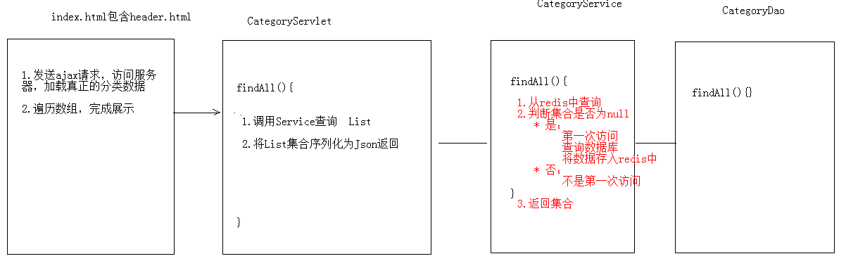

## 项目开发过程
### 8、优化Servlet
#### （1）目的
**减少Servlet的数量，现在是一个功能一个Servlet，将其优化为一个模块一个Servlet，相当于在数据库中一张表对应一个Servlet，在Servlet中提供不同的方法，完成用户的请求。**

* **Idea控制台中文乱码解决**：-Dfile.encoding=gb2312


#### （2）BaseServlet编写
```
	public class BaseServlet extends HttpServlet {


    @Override
    protected void service(HttpServletRequest req, HttpServletResponse resp) throws ServletException, IOException {
        //System.out.println("baseServlet的service方法被执行了...");

        //完成方法分发
        //1.获取请求路径
        String uri = req.getRequestURI(); //   /travel/user/add
        System.out.println("请求uri:"+uri);//  /travel/user/add
        //2.获取方法名称
        String methodName = uri.substring(uri.lastIndexOf('/') + 1);
        System.out.println("方法名称："+methodName);
        //3.获取方法对象Method
        //谁调用我？我代表谁
        System.out.println(this);//UserServlet的对象cn.itcast.travel.web.servlet.UserServlet@4903d97e
        try {
            //获取方法
            Method method = this.getClass().getMethod(methodName, HttpServletRequest.class, HttpServletResponse.class);
            //4.执行方法
            //暴力反射
            //method.setAccessible(true);
            method.invoke(this,req,resp);
        } catch (NoSuchMethodException e) {
            e.printStackTrace();
        } catch (IllegalAccessException e) {
            e.printStackTrace();
        } catch (InvocationTargetException e) {
            e.printStackTrace();
        }


    }
}
```
#### （3）UserServlet改写
将之前的Servlet实现的功能，**抽取到UserServlet中的不同方法中实现**，并且将UserService创建抽取到**成员变量位置**
```
@WebServlet("/user/*") // /user/add /user/find
public class UserServlet extends BaseServlet {

    //声明UserService业务对象
    private UserService service = new UserServiceImpl();

    /**
     * 注册功能
     * @param request
     * @param response
     * @throws ServletException
     * @throws IOException
     */
    public void regist(HttpServletRequest request, HttpServletResponse response) throws ServletException, IOException {

        //验证校验
        String check = request.getParameter("check");
        //从sesion中获取验证码
        HttpSession session = request.getSession();
        String checkcode_server = (String) session.getAttribute("CHECKCODE_SERVER");
        session.removeAttribute("CHECKCODE_SERVER");//为了保证验证码只能使用一次
        //比较
        if(checkcode_server == null || !checkcode_server.equalsIgnoreCase(check)){
            //验证码错误
            ResultInfo info = new ResultInfo();
            //注册失败
            info.setFlag(false);
            info.setErrorMsg("验证码错误");
            //将info对象序列化为json
            ObjectMapper mapper = new ObjectMapper();
            String json = mapper.writeValueAsString(info);
            response.setContentType("application/json;charset=utf-8");
            response.getWriter().write(json);
            return;
        }

        //1.获取数据
        Map<String, String[]> map = request.getParameterMap();

        //2.封装对象
        User user = new User();
        try {
            BeanUtils.populate(user,map);
        } catch (IllegalAccessException e) {
            e.printStackTrace();
        } catch (InvocationTargetException e) {
            e.printStackTrace();
        }

        //3.调用service完成注册
        //UserService service = new UserServiceImpl();
        boolean flag = service.regist(user);
        ResultInfo info = new ResultInfo();
        //4.响应结果
        if(flag){
            //注册成功
            info.setFlag(true);
        }else{
            //注册失败
            info.setFlag(false);
            info.setErrorMsg("注册失败!");
        }

        //将info对象序列化为json
        ObjectMapper mapper = new ObjectMapper();
        String json = mapper.writeValueAsString(info);

        //将json数据写回客户端
        //设置content-type
        response.setContentType("application/json;charset=utf-8");
        response.getWriter().write(json);

    }

    /**
     * 登录功能
     * @param request
     * @param response
     * @throws ServletException
     * @throws IOException
     */
    public void login(HttpServletRequest request, HttpServletResponse response) throws ServletException, IOException {
        //1.获取用户名和密码数据
        Map<String, String[]> map = request.getParameterMap();
        //2.封装User对象
        User user = new User();
        try {
            BeanUtils.populate(user,map);
        } catch (IllegalAccessException e) {
            e.printStackTrace();
        } catch (InvocationTargetException e) {
            e.printStackTrace();
        }

        //3.调用Service查询
       // UserService service = new UserServiceImpl();
        User u  = service.login(user);

        ResultInfo info = new ResultInfo();

        //4.判断用户对象是否为null
        if(u == null){
            //用户名密码或错误
            info.setFlag(false);
            info.setErrorMsg("用户名密码或错误");
        }
        //5.判断用户是否激活
        if(u != null && !"Y".equals(u.getStatus())){
            //用户尚未激活
            info.setFlag(false);
            info.setErrorMsg("您尚未激活，请激活");
        }
        //6.判断登录成功
        if(u != null && "Y".equals(u.getStatus())){
            request.getSession().setAttribute("user",u);//登录成功标记

            //登录成功
            info.setFlag(true);
        }

        //响应数据
        ObjectMapper mapper = new ObjectMapper();

        response.setContentType("application/json;charset=utf-8");
        mapper.writeValue(response.getOutputStream(),info);
    }

    /**
     * 查询单个对象
     * @param request
     * @param response
     * @throws ServletException
     * @throws IOException
     */
    public void findOne(HttpServletRequest request, HttpServletResponse response) throws ServletException, IOException {
        //从session中获取登录用户
        Object user = request.getSession().getAttribute("user");
        //将user写回客户端

        ObjectMapper mapper = new ObjectMapper();
        response.setContentType("application/json;charset=utf-8");
        mapper.writeValue(response.getOutputStream(),user);
    }

    /**
     * 退出功能
     * @param request
     * @param response
     * @throws ServletException
     * @throws IOException
     */
    public void exit(HttpServletRequest request, HttpServletResponse response) throws ServletException, IOException {
        //1.销毁session
        request.getSession().invalidate();

        //2.跳转登录页面
        response.sendRedirect(request.getContextPath()+"/login.html");
    }

    /**
     * 激活功能
     * @param request
     * @param response
     * @throws ServletException
     * @throws IOException
     */
    public void active(HttpServletRequest request, HttpServletResponse response) throws ServletException, IOException {
        //1.获取激活码
        String code = request.getParameter("code");
        if(code != null){
            //2.调用service完成激活
            //UserService service = new UserServiceImpl();
            boolean flag = service.active(code);

            //3.判断标记
            String msg = null;
            if(flag){
                //激活成功
                msg = "激活成功，请<a href='login.html'>登录</a>";
            }else{
                //激活失败
                msg = "激活失败，请联系管理员!";
            }
            response.setContentType("text/html;charset=utf-8");
            response.getWriter().write(msg);
        }
    }
}
```
#### （4）页面路径改写
* **register.html**

* **login.html**

* **header.html**

* **UserServiceImpl发送邮件**


### 9、分类数据展示
#### （1）效果
	 
#### （2）分析
	 
#### （3）代码实现
##### 后台代码
* **CategoryServlet**
```
@WebServlet("/category/*")
public class CategoryServlet extends BaseServlet {

    private CategoryService service = new CategoryServiceImpl();

    /**
     * 查询所有
     * @param request
     * @param response
     * @throws ServletException
     * @throws IOException
     */
    public void findAll(HttpServletRequest request, HttpServletResponse response) throws ServletException, IOException {
        //1.调用service查询所有
        List<Category> cs = service.findAll();
        //2.序列化json返回
       /* ObjectMapper mapper = new ObjectMapper();
        response.setContentType("application/json;charset=utf-8");
        mapper.writeValue(response.getOutputStream(),cs);*/
       writeValue(cs,response);

    }

}
```
* **CategoryService**
```
public class CategoryServiceImpl implements CategoryService {

    private CategoryDao categoryDao = new CategoryDaoImpl();

    @Override
    public List<Category> findAll() {
        return categoryDao.findAll();
    }
}
```
* **CategoryDao**
```
public class CategoryDaoImpl implements CategoryDao {

    private JdbcTemplate template = new JdbcTemplate(JDBCUtils.getDataSource());

    @Override
    public List<Category> findAll() {
        String sql = "select * from tab_category ";
        return template.query(sql,new BeanPropertyRowMapper<Category>(Category.class));
    }
}
```
* **在BaseServlet中封装了序列化json的方法**
```
/**
 * 直接将传入的对象序列化为json，并且写回客户端
 * @param obj
 */
public void writeValue(Object obj,HttpServletResponse response) throws IOException {
    ObjectMapper mapper = new ObjectMapper();
    response.setContentType("application/json;charset=utf-8");
    mapper.writeValue(response.getOutputStream(),obj);
}

/**
 * 将传入的对象序列化为json，返回
 * @param obj
 * @return
 */
public String writeValueAsString(Object obj) throws JsonProcessingException {
    ObjectMapper mapper = new ObjectMapper();
    return mapper.writeValueAsString(obj);
}
```
##### 前台代码
**hader.html加载后，发送ajax请求，请求category/findAll**
```
//查询分类数据
 $.get("category/findAll",{},function (data) {
     //[{cid:1,cname:国内游},{},{}]
     var lis = '<li class="nav-active"><a href="index.html">首页</a></li>';
     //遍历数组,拼接字符串(<li>)
     for (var i = 0; i < data.length; i++) {
         var li = '<li><a href="route_list.html">'+data[i].cname+'</a></li>';

         lis += li;
         
     }
     //拼接收藏排行榜的li,<li><a href="favoriterank.html">收藏排行榜</a></li>
     
     lis+= '<li><a href="favoriterank.html">收藏排行榜</a></li>';

     //将lis字符串，设置到ul的html内容中
     $("#category").html(lis);
 });
```
#### （4）对分类数据进行缓存优化
分析发现，分类的数据在每一次页面加载后都会重新请求数据库来加载，对数据库的压力比较大，而且**分类的数据不会经常产生变化，所有可以使用redis来缓存这个数据**。
分析：

#### （5）优化代码实现
**期望数据中存储的顺序就是将来展示的顺序，使用redis的sortedset**
```
@Override
public List<Category> findAll() {
    //1.从redis中查询
    //1.1获取jedis客户端
    Jedis jedis = JedisUtil.getJedis();
    //1.2可使用sortedset排序查询
    Set<String> categorys = jedis.zrange("category", 0, -1);
    List<Category> cs = null;
    //2.判断查询的集合是否为空
    if (categorys == null || categorys.size() == 0) {

        System.out.println("从数据库查询....");
        //3.如果为空,需要从数据库查询,在将数据存入redis
        //3.1 从数据库查询
        cs = categoryDao.findAll();
        //3.2 将集合数据存储到redis中的 category的key
        for (int i = 0; i < cs.size(); i++) {

            jedis.zadd("category", cs.get(i).getCid(), cs.get(i).getCname());
        }
    } else {
        System.out.println("从redis中查询.....");

        //4.如果不为空,将set的数据存入list
        cs = new ArrayList<Category>();
        for (String name : categorys) {
            Category category = new Category();
            category.setCname(name);
            cs.add(category);

        }
    }


    return cs;
}
```

### 10、旅游线路的分页展示
* 点击了不同的分类后，将来看到的旅游线路不一样的。通过分析数据库表结构，发现**旅游线路表和分类表是多对一的关系**

* 查询不同分类的旅游线路sql
`Select * from tab_route where cid = ?;`

#### （1）类别id的传递
* **Redis中查询score（cid）**
```
public class CategoryServiceImpl implements CategoryService {

    private CategoryDao categoryDao = new CategoryDaoImpl();

    @Override
    public List<Category> findAll() {
        //1.从redis中查询
        //1.1获取jedis客户端
        Jedis jedis = JedisUtil.getJedis();
        //1.2可使用sortedset排序查询
        //Set<String> categorys = jedis.zrange("category", 0, -1);
        //1.3查询sortedset中的分数(cid)和值(cname)
        Set<Tuple> categorys = jedis.zrangeWithScores("category", 0, -1);

        List<Category> cs = null;
        //2.判断查询的集合是否为空
        if (categorys == null || categorys.size() == 0) {

            System.out.println("从数据库查询....");
            //3.如果为空,需要从数据库查询,在将数据存入redis
            //3.1 从数据库查询
            cs = categoryDao.findAll();
            //3.2 将集合数据存储到redis中的 category的key
            for (int i = 0; i < cs.size(); i++) {

                jedis.zadd("category", cs.get(i).getCid(), cs.get(i).getCname());
            }
        } else {
            System.out.println("从redis中查询.....");

            //4.如果不为空,将set的数据存入list
            cs = new ArrayList<Category>();
            for (Tuple tuple : categorys) {
                Category category = new Category();
                category.setCname(tuple.getElement());
                category.setCid((int)tuple.getScore());
                cs.add(category);

            }
        }


        return cs;
    }
}
```
* **页面传递cid**
* **header.html传递cid**
```
var li = '<li><a href="route_list.html?cid='+data[i].cid+'">'+data[i].cname+'</a></li>';
```
* **获取cid**
```
$(function () {
   var search = location.search;
   //alert(search);//?id=5
    // 切割字符串，拿到第二个值
    var cid = search.split("=")[1];
});
```

#### （2）根据id查询不同类别的旅游线路数据
**分页展示旅游线路数据**
* **分析**

* **客户端代码编写**
```
$(function () {
    var search = location.search;
        // 切割字符串，拿到第二个值
    var cid = search.split("=")[1];

    //当页码加载完成后，调用load方法，发送ajax请求加载数据
    load(cid);
});

function load(cid ,currentPage){
    //发送ajax请求，请求route/pageQuery,传递cid
    $.get("route/pageQuery",{cid:cid,currentPage:currentPage},function (pb) {
        //解析pagebean数据，展示到页面上

        //1.分页工具条数据展示
        //1.1 展示总页码和总记录数
        $("#totalPage").html(pb.totalPage);
        $("#totalCount").html(pb.totalCount);

                var lis = "";

        var fristPage = '<li onclick="javascipt:load('+cid+')"><a href="javascript:void(0)">首页</a></li>';

        //计算上一页的页码
        var beforeNum =  pb.currentPage - 1;
        if(beforeNum <= 0){
            beforeNum = 1;
        }

        var beforePage = '<li  onclick="javascipt:load('+cid+','+beforeNum+')" class="threeword"><a href="javascript:void(0)">上一页</a></li>';

        lis += fristPage;
        lis += beforePage;
        //1.2 展示分页页码
        /*
            1.一共展示10个页码，能够达到前5后4的效果
            2.如果前边不够5个，后边补齐10个
            3.如果后边不足4个，前边补齐10个
        */

        // 定义开始位置begin,结束位置 end
        var begin; // 开始位置
        var end ; //  结束位置


        //1.要显示10个页码
        if(pb.totalPage < 10){
            //总页码不够10页

            begin = 1;
            end = pb.totalPage;
        }else{
            //总页码超过10页

            begin = pb.currentPage - 5 ;
            end = pb.currentPage + 4 ;

            //2.如果前边不够5个，后边补齐10个
            if(begin < 1){
                begin = 1;
                end = begin + 9;
            }

            //3.如果后边不足4个，前边补齐10个
            if(end > pb.totalPage){
                end = pb.totalPage;
                begin = end - 9 ;
            }
        }


        for (var i = begin; i <= end ; i++) {
            var li;
            //判断当前页码是否等于i
            if(pb.currentPage == i){

                li = '<li class="curPage" onclick="javascipt:load('+cid+','+i+')"><a href="javascript:void(0)">'+i+'</a></li>';

            }else{
                //创建页码的li
                li = '<li onclick="javascipt:load('+cid+','+i+')"><a href="javascript:void(0)">'+i+'</a></li>';
            }
            //拼接字符串
            lis += li;
        }


             var lastPage = '<li class="threeword"><a href="javascript:;">末页</a></li>';
        var nextPage = '<li class="threeword"><a href="javascript:;">下一页</a></li>';

        lis += nextPage;
        lis += lastPage;


        //将lis内容设置到 ul
        $("#pageNum").html(lis);


        
        //2.列表数据展示
        var route_lis = "";

        for (var i = 0; i < pb.list.length; i++) {
            //获取{rid:1,rname:"xxx"}
            var route = pb.list[i];

            var li = '<li>\n' +
                '                        <div class="img"></div>\n' +
                '                        <div class="text1">\n' +
                '                            <p>'+route.rname+'</p>\n' +
                '                            <br/>\n' +
                '                            <p>'+route.routeIntroduce+'</p>\n' +
                '                        </div>\n' +
                '                        <div class="price">\n' +
                '                            <p class="price_num">\n' +
                '                                <span>&yen;</span>\n' +
                '                                <span>'+route.price+'</span>\n' +
                '                                <span>起</span>\n' +
                '                            </p>\n' +
                '                            <p><a href="route_detail.html">查看详情</a></p>\n' +
                '                        </div>\n' +
                '                    </li>';
            route_lis += li;
        }
        $("#route").html(route_lis);

        //定位到页面顶部
        window.scrollTo(0,0);
    });

}
```
* **服务器端代码编写**
* **创建PageBean对象**
```
public class PageBean<T> {

    private int totalCount;//总记录数
    private int totalPage;//总页数
    private int currentPage;//当前页码
    private int pageSize;//每页显示的条数

    private List<T> list;//每页显示的数据集合

    public int getTotalCount() {
        return totalCount;
    }

    public void setTotalCount(int totalCount) {
        this.totalCount = totalCount;
    }

    public int getTotalPage() {
        return totalPage;
    }

    public void setTotalPage(int totalPage) {
        this.totalPage = totalPage;
    }

    public int getCurrentPage() {
        return currentPage;
    }

    public void setCurrentPage(int currentPage) {
        this.currentPage = currentPage;
    }

    public int getPageSize() {
        return pageSize;
    }

    public void setPageSize(int pageSize) {
        this.pageSize = pageSize;
    }

    public List<T> getList() {
        return list;
    }

    public void setList(List<T> list) {
        this.list = list;
    }
}
```
* **RouteServlet**
```
@WebServlet("/route/*")
public class RouteServlet extends BaseServlet {

    private RouteService routeService = new RouteServiceImpl();

    /**
     * 分页查询
     * @param request
     * @param response
     * @throws ServletException
     * @throws IOException
     */
    public void pageQuery(HttpServletRequest request, HttpServletResponse response) throws ServletException, IOException {
        //1.接受参数
        String currentPageStr = request.getParameter("currentPage");
        String pageSizeStr = request.getParameter("pageSize");
        String cidStr = request.getParameter("cid");

        int cid = 0;//类别id
        //2.处理参数
        if(cidStr != null && cidStr.length() > 0){
            cid = Integer.parseInt(cidStr);
        }
        int currentPage = 0;//当前页码，如果不传递，则默认为第一页
        if(currentPageStr != null && currentPageStr.length() > 0){
            currentPage = Integer.parseInt(currentPageStr);
        }else{
            currentPage = 1;
        }

        int pageSize = 0;//每页显示条数，如果不传递，默认每页显示5条记录
        if(pageSizeStr != null && pageSizeStr.length() > 0){
            pageSize = Integer.parseInt(pageSizeStr);
        }else{
            pageSize = 5;
        }

        //3. 调用service查询PageBean对象
        PageBean<Route> pb = routeService.pageQuery(cid, currentPage, pageSize);

        //4. 将pageBean对象序列化为json，返回
        writeValue(pb,response);

    }

}
```
* **RouteService**
```
public class RouteServiceImpl implements RouteService {
    private RouteDao routeDao = new RouteDaoImpl();
    @Override
    public PageBean<Route> pageQuery(int cid, int currentPage, int pageSize) {
        //封装PageBean
        PageBean<Route> pb = new PageBean<Route>();
        //设置当前页码
        pb.setCurrentPage(currentPage);
        //设置每页显示条数
        pb.setPageSize(pageSize);
        
        //设置总记录数
        int totalCount = routeDao.findTotalCount(cid);
        pb.setTotalCount(totalCount);
        //设置当前页显示的数据集合
        int start = (currentPage - 1) * pageSize;//开始的记录数
        List<Route> list = routeDao.findByPage(cid,start,pageSize);
        pb.setList(list);

        //设置总页数 = 总记录数/每页显示条数
        int totalPage = totalCount % pageSize == 0 ? totalCount / pageSize :(totalCount / pageSize) + 1 ;
        pb.setTotalPage(totalPage);


        return pb;
    }
}
```
* **RouteDao**
```
public class RouteDaoImpl implements RouteDao {
    private JdbcTemplate template = new JdbcTemplate(JDBCUtils.getDataSource());

    @Override
    public int findTotalCount(int cid) {
        String sql = "select count(*) from tab_route where cid = ?";
        return template.queryForObject(sql,Integer.class,cid);
    }

    @Override
    public List<Route> findByPage(int cid, int start, int pageSize) {
        String sql = "select * from tab_route where cid = ? limit ? , ?";

        return template.query(sql,new BeanPropertyRowMapper<Route>(Route.class),cid,start,pageSize);
    }
}
```