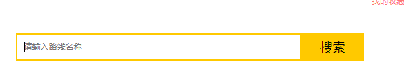

## 项目开发过程
### 11、旅游线路名称查询

#### （1）查询参数的传递
* **header.html**
```
$("#search-button").click(function () {
    //线路名称
    var rname = $("#search_input").val();

    var cid = getParameter("cid");
    // 跳转路径 http://localhost/travel/route_list.html?cid=5，拼接上rname=xxx
    location.href="http://localhost/travel/route_list.html?cid="+cid+"&rname="+rname;
});
```
* **route_list.html**
```
var cid = getParameter("cid");
 //获取rname的参数值
 var rname = getParameter("rname");
 //判断rname如果不为null或者""
 if(rname){
     //url解码
     rname = window.decodeURIComponent(rname);
 }
```
#### （2）修改后台代码
* **RouteServlet**
```
@WebServlet("/route/*")
public class RouteServlet extends BaseServlet {

    private RouteService routeService = new RouteServiceImpl();

    /**
     * 分页查询
     * @param request
     * @param response
     * @throws ServletException
     * @throws IOException
     */
    public void pageQuery(HttpServletRequest request, HttpServletResponse response) throws ServletException, IOException {
        //1.接受参数
        String currentPageStr = request.getParameter("currentPage");
        String pageSizeStr = request.getParameter("pageSize");
        String cidStr = request.getParameter("cid");

        //接受rname 线路名称
        String rname = request.getParameter("rname");
        rname = new String(rname.getBytes("iso-8859-1"),"utf-8");


        int cid = 0;//类别id
        //2.处理参数
        if(cidStr != null && cidStr.length() > 0){
            cid = Integer.parseInt(cidStr);
        }
        int currentPage = 0;//当前页码，如果不传递，则默认为第一页
        if(currentPageStr != null && currentPageStr.length() > 0){
            currentPage = Integer.parseInt(currentPageStr);
        }else{
            currentPage = 1;
        }

        int pageSize = 0;//每页显示条数，如果不传递，默认每页显示5条记录
        if(pageSizeStr != null && pageSizeStr.length() > 0){
            pageSize = Integer.parseInt(pageSizeStr);
        }else{
            pageSize = 5;
        }

        //3. 调用service查询PageBean对象
        PageBean<Route> pb = routeService.pageQuery(cid, currentPage, pageSize,rname);

        //4. 将pageBean对象序列化为json，返回
        writeValue(pb,response);

    }

}
```
* **Service**
```
public PageBean<Route> pageQuery(int cid, int currentPage, int pageSize,String rname ) {
    //封装PageBean
    PageBean<Route> pb = new PageBean<Route>();
    //设置当前页码
    pb.setCurrentPage(currentPage);
    //设置每页显示条数
    pb.setPageSize(pageSize);
    
    //设置总记录数
    int totalCount = routeDao.findTotalCount(cid,rname);
    pb.setTotalCount(totalCount);
    //设置当前页显示的数据集合
    int start = (currentPage - 1) * pageSize;//开始的记录数
    List<Route> list = routeDao.findByPage(cid,start,pageSize,rname);
    pb.setList(list);

    //设置总页数 = 总记录数/每页显示条数
    int totalPage = totalCount % pageSize == 0 ? totalCount / pageSize :(totalCount / pageSize) + 1 ;
    pb.setTotalPage(totalPage);


    return pb;
}
```
* **Dao**
```
@Override
public int findTotalCount(int cid,String rname) {
    //String sql = "select count(*) from tab_route where cid = ?";
    //1.定义sql模板
    String sql = "select count(*) from tab_route where 1=1 ";
    StringBuilder sb = new StringBuilder(sql);

    List params = new ArrayList();//条件们
    //2.判断参数是否有值
    if(cid != 0){
        sb.append( " and cid = ? ");

        params.add(cid);//添加？对应的值
    }

    if(rname != null && rname.length() > 0){
        sb.append(" and rname like ? ");

        params.add("%"+rname+"%");
    }

    sql = sb.toString();


    return template.queryForObject(sql,Integer.class,params.toArray());
}

@Override
public List<Route> findByPage(int cid, int start, int pageSize,String rname) {
    //String sql = "select * from tab_route where cid = ? and rname like ?  limit ? , ?";
    String sql = " select * from tab_route where 1 = 1 ";
    //1.定义sql模板
    StringBuilder sb = new StringBuilder(sql);

    List params = new ArrayList();//条件们
    //2.判断参数是否有值
    if(cid != 0){
        sb.append( " and cid = ? ");

        params.add(cid);//添加？对应的值
    }

    if(rname != null && rname.length() > 0){
        sb.append(" and rname like ? ");

        params.add("%"+rname+"%");
    }
    sb.append(" limit ? , ? ");//分页条件

    sql = sb.toString();

    params.add(start);
    params.add(pageSize);


    return template.query(sql,new BeanPropertyRowMapper<Route>(Route.class),params.toArray());
}
```
#### （3）修改前台代码
```
$(function () {
   /* var search = location.search;
    //alert(search);//?id=5
    // 切割字符串，拿到第二个值
    var cid = search.split("=")[1];*/
   //获取cid的参数值
   var cid = getParameter("cid");
    //获取rname的参数值
    var rname = getParameter("rname");
    //判断rname如果不为null或者""
    if(rname){
        //url解码
        rname = window.decodeURIComponent(rname);
    }

    //当页码加载完成后，调用load方法，发送ajax请求加载数据
    load(cid,null,rname);
});

function load(cid ,currentPage,rname){
    //发送ajax请求，请求route/pageQuery,传递cid
    $.get("route/pageQuery",{cid:cid,currentPage:currentPage,rname:rname},function (pb) {
        //解析pagebean数据，展示到页面上

        //1.分页工具条数据展示
        //1.1 展示总页码和总记录数
        $("#totalPage").html(pb.totalPage);
        $("#totalCount").html(pb.totalCount);

        /*
                <li><a href="">首页</a></li>
                <li class="threeword"><a href="#">上一页</a></li>
                <li class="curPage"><a href="#">1</a></li>
                <li><a href="#">2</a></li>
                <li><a href="#">3</a></li>
                <li><a href="#">4</a></li>
                <li><a href="#">5</a></li>
                <li><a href="#">6</a></li>
                <li><a href="#">7</a></li>
                <li><a href="#">8</a></li>
                <li><a href="#">9</a></li>
                <li><a href="#">10</a></li>
                <li class="threeword"><a href="javascript:;">下一页</a></li>
                <li class="threeword"><a href="javascript:;">末页</a></li>


         */
        var lis = "";

        var fristPage = '<li onclick="javascipt:load('+cid+',1,\''+rname+'\')"><a href="javascript:void(0)">首页</a></li>';

        //计算上一页的页码
        var beforeNum =  pb.currentPage - 1;
        if(beforeNum <= 0){
            beforeNum = 1;
        }

        var beforePage = '<li  onclick="javascipt:load('+cid+','+beforeNum+',\''+rname+'\')" class="threeword"><a href="javascript:void(0)">上一页</a></li>';

        lis += fristPage;
        lis += beforePage;
        //1.2 展示分页页码
        /*
            1.一共展示10个页码，能够达到前5后4的效果
            2.如果前边不够5个，后边补齐10个
            3.如果后边不足4个，前边补齐10个
        */

        // 定义开始位置begin,结束位置 end
        var begin; // 开始位置
        var end ; //  结束位置


        //1.要显示10个页码
        if(pb.totalPage < 10){
            //总页码不够10页

            begin = 1;
            end = pb.totalPage;
        }else{
            //总页码超过10页

            begin = pb.currentPage - 5 ;
            end = pb.currentPage + 4 ;

            //2.如果前边不够5个，后边补齐10个
            if(begin < 1){
                begin = 1;
                end = begin + 9;
            }

            //3.如果后边不足4个，前边补齐10个
            if(end > pb.totalPage){
                end = pb.totalPage;
                begin = end - 9 ;
            }
        }


        for (var i = begin; i <= end ; i++) {
            var li;
            //判断当前页码是否等于i
            if(pb.currentPage == i){

                li = '<li class="curPage" onclick="javascipt:load('+cid+','+i+',\''+rname+'\')"><a href="javascript:void(0)">'+i+'</a></li>';

            }else{
                //创建页码的li
                li = '<li onclick="javascipt:load('+cid+','+i+',\''+rname+'\')"><a href="javascript:void(0)">'+i+'</a></li>';
            }
            //拼接字符串
            lis += li;
        }


       /* for (var i = 1; i <= pb.totalPage ; i++) {
            var li;
            //判断当前页码是否等于i
            if(pb.currentPage == i){

                li = '<li class="curPage" onclick="javascipt:load('+cid+','+i+')"><a href="javascript:void(0)">'+i+'</a></li>';

            }else{
                //创建页码的li
                li = '<li onclick="javascipt:load('+cid+','+i+')"><a href="javascript:void(0)">'+i+'</a></li>';
            }
            //拼接字符串
            lis += li;
        }*/
        var lastPage = '<li class="threeword"><a href="javascript:;">末页</a></li>';
        var nextPage = '<li class="threeword"><a href="javascript:;">下一页</a></li>';

        lis += nextPage;
        lis += lastPage;


        //将lis内容设置到 ul
        $("#pageNum").html(lis);


        /*
            <li>
                <div class="img"></div>
                <div class="text1">
                    <p>【减100元 含除夕/春节出发】广州增城三英温泉度假酒店/自由行套票</p>
                    <br/>
                    <p>1-2月出发，网付立享￥1099/2人起！爆款位置有限，抢完即止！</p>
                </div>
                <div class="price">
                    <p class="price_num">
                        <span>&yen;</span>
                        <span>299</span>
                        <span>起</span>
                    </p>
                    <p><a href="route_detail.html">查看详情</a></p>
                </div>
            </li>

         */

        //2.列表数据展示
        var route_lis = "";

        for (var i = 0; i < pb.list.length; i++) {
            //获取{rid:1,rname:"xxx"}
            var route = pb.list[i];

            var li = '<li>\n' +
                '                        <div class="img"></div>\n' +
                '                        <div class="text1">\n' +
                '                            <p>'+route.rname+'</p>\n' +
                '                            <br/>\n' +
                '                            <p>'+route.routeIntroduce+'</p>\n' +
                '                        </div>\n' +
                '                        <div class="price">\n' +
                '                            <p class="price_num">\n' +
                '                                <span>&yen;</span>\n' +
                '                                <span>'+route.price+'</span>\n' +
                '                                <span>起</span>\n' +
                '                            </p>\n' +
                '                            <p><a href="route_detail.html">查看详情</a></p>\n' +
                '                        </div>\n' +
                '                    </li>';
            route_lis += li;
        }
        $("#route").html(route_lis);

        //定位到页面顶部
        window.scrollTo(0,0);
    });

}
```

### 12、旅游线路的详情展示
#### （1）分析


 
#### （2）代码实现
##### 后台代码
* **Servlet**
```
/**
 * 根据id查询一个旅游线路的详细信息
 * @param request
 * @param response
 * @throws ServletException
 * @throws IOException
 */
public void findOne(HttpServletRequest request, HttpServletResponse response) throws ServletException, IOException {

    //1.接收id
    String rid = request.getParameter("rid");
    //2.调用service查询route对象
    Route route = routeService.findOne(rid);
    //3.转为json写回客户端
    writeValue(route,response);
}
```
* **Service**
```
@Override
public Route findOne(String rid) {
    //1.根据id去route表中查询route对象
    Route route = routeDao.findOne(Integer.parseInt(rid));

    //2.根据route的id 查询图片集合信息
    List<RouteImg> routeImgList = routeImgDao.findByRid(route.getRid());
    //2.2将集合设置到route对象
    route.setRouteImgList(routeImgList);
    //3.根据route的sid（商家id）查询商家对象
    Seller seller = sellerDao.findById(route.getSid());
    route.setSeller(seller);

    return route;
}
```

* **SellerDao**
```
public class SellerDaoImpl implements SellerDao {

    private JdbcTemplate template = new JdbcTemplate(JDBCUtils.getDataSource());


    @Override
    public Seller findById(int id) {

        String sql = "select * from tab_seller where sid = ? ";
        return template.queryForObject(sql,new BeanPropertyRowMapper<Seller>(Seller.class),id);
    }
}
```
* **routeDao**
```
@Override
public Route findOne(int rid) {
    String sql = "select * from tab_route where rid = ?";
    return template.queryForObject(sql,new BeanPropertyRowMapper<Route>(Route.class),rid);
}
RouteImgDao

public class RouteImgDaoImpl implements RouteImgDao {

    private JdbcTemplate template = new JdbcTemplate(JDBCUtils.getDataSource());


    @Override
    public List<RouteImg> findByRid(int rid) {
        String sql = "select * from tab_route_img where rid = ? ";
        return template.query(sql,new BeanPropertyRowMapper<RouteImg>(RouteImg.class),rid);
    }
}
```

##### 前台代码
* **Route_detail.html中加载后**

        1.	获取rid
        2.	发送ajax请求，获取route对象
        3.	解析对象的数据
```
//1.获取rid
var rid = getParameter("rid");

//2.发送请求请求 route/findOne
 $.get("route/findOne",{rid:rid},function (route) {
     //3.解析数据填充html
     $("#rname").html(route.rname);
     $("#routeIntroduce").html(route.routeIntroduce);
     $("#price").html("¥"+route.price);
     $("#sname").html(route.seller.sname);
     $("#consphone").html(route.seller.consphone);
     $("#address").html(route.seller.address);

     //图片展示

     var ddstr = '<a class="up_img up_img_disable"></a>';

     //遍历routeImgList
     for (var i = 0; i < route.routeImgList.length; i++) {
         var astr ;
         if(i >= 4){
             astr = '<a title="" class="little_img" data-bigpic="'+route.routeImgList[i].bigPic+'" style="display:none;">\n' +
                 '                        \n' +
                 '                    </a>';
         }else{
             astr = '<a title="" class="little_img" data-bigpic="'+route.routeImgList[i].bigPic+'">\n' +
                 '                        \n' +
                 '                    </a>';
         }


         ddstr += astr;
     }
     ddstr+='<a class="down_img down_img_disable" style="margin-bottom: 0;"></a>';

     $("#dd").html(ddstr);

     //图片展示和切换代码调用
     goImg();
 });
```

### 13、旅游线路收藏功能
#### （1）分析
##### 判断当前登录用户是否收藏过该线路
* **当页面加载完成后，发送ajax请求，获取用户是否收藏的标记**
* 根据标记，展示不同的按钮样式


#### （2）编写代码
##### 后台代码
* **RouteServlet**
```
public void isFavorite(HttpServletRequest request, HttpServletResponse response) throws ServletException, IOException {
    //1. 获取线路id
    String rid = request.getParameter("rid");

    //2. 获取当前登录的用户 user
    User user = (User) request.getSession().getAttribute("user");
    int uid;//用户id
    if(user == null){
        //用户尚未登录
        uid = 0;
    }else{
        //用户已经登录
        uid = user.getUid();
    }

    //3. 调用FavoriteService查询是否收藏
    boolean flag = favoriteService.isFavorite(rid, uid);

    //4. 写回客户端
    writeValue(flag,response);
}
```
* **FavoriteService**
```
@Override
public boolean isFavorite(String rid, int uid) {

    Favorite favorite = favoriteDao.findByRidAndUid(Integer.parseInt(rid), uid);

    return favorite != null;//如果对象有值，则为true，反之，则为false
}
```

* **FavoriteDao**
```
@Override
public Favorite findByRidAndUid(int rid, int uid) {
    Favorite favorite = null;
    try {
        String sql = " select * from tab_favorite where rid = ? and uid = ?";
        favorite = template.queryForObject(sql, new BeanPropertyRowMapper<Favorite>(Favorite.class), rid, uid);
    } catch (DataAccessException e) {
        e.printStackTrace();
    }
    return favorite;
}
```
##### 前台代码
* **route_detail.html**
```
$(function () {
   // 发送请求，判断用户是否收藏过该线路
    var rid = getParameter("rid");
    $.get("route/isFavorite",{rid:rid},function (flag) {
        if(flag){
            // 用户已经收藏过
            //<a  class="btn already" disabled="disabled">
            //设置收藏按钮的样式
            $("#favorite").addClass("already");
            $("#favorite").prop("disabled",disabled);
        }else{
            // 用户没有收藏
        }
    });
```
#### （3）收藏次数的动态展示
##### 前台
```
//设置收藏次数
$("#favoriteCount").html("已收藏"+route.count+"次");
```
##### 后台
* **RouteService**
```
//4. 查询收藏次数
int count = favoriteDao.findCountByRid(route.getRid());
route.setCount(count);
```
* **FavoriteDao**
```
@Override
public int findCountByRid(int rid) {
    String sql = "SELECT COUNT(*) FROM tab_favorite WHERE rid = ?";

    return template.queryForObject(sql,Integer.class,rid);
}
```

#### （4）点击按钮收藏线路
##### 分析

##### 编码
* **前台代码**
```
	$(function () {
   // 发送请求，判断用户是否收藏过该线路
    var rid = getParameter("rid");
    $.get("route/isFavorite",{rid:rid},function (flag) {
        if(flag){
            // 用户已经收藏过
            //<a  class="btn already" disabled="disabled">
            //设置收藏按钮的样式
            $("#favorite").addClass("already");
            $("#favorite").attr("disabled","disabled");

            //删除按钮的点击事件
            $("#favorite").removeAttr("onclick");
        }else{
            // 用户没有收藏
        }
    });

});

//点击收藏按钮触发的方法
function addFavorite(){
    var rid = getParameter("rid");
    //1. 判断用户是否登录
    $.get("user/findOne",{},function (user) {
       if(user){
           //用户登录了
            //添加功能
            $.get("route/addFavorite",{rid:rid},function () {
                //代码刷新页面
                location.reload();
            });

       }else{
           //用户没有登录
           alert("您尚未登录，请登录");
           location.href="http://localhost/travel/login.html";
       }
    })
}
```
* **后台代码**
* **RouteServlet**
```
public void addFavorite(HttpServletRequest request, HttpServletResponse response) throws ServletException, IOException {
    //1. 获取线路rid
    String rid = request.getParameter("rid");
    //2. 获取当前登录的用户
    User user = (User) request.getSession().getAttribute("user");
    int uid;//用户id
    if(user == null){
        //用户尚未登录
        return ;
    }else{
        //用户已经登录
        uid = user.getUid();
    }
    //3. 调用service添加
    favoriteService.add(rid,uid);
}
```
* **FavoriteService**
```
@Override
public void add(String rid, int uid) {
    favoriteDao.add(Integer.parseInt(rid),uid);
}
```
* **FavoriteDao**
```
@Override
public void add(int rid, int uid) {
    String sql = "insert into tab_favorite values(?,?,?)";

    template.update(sql,rid,new Date(),uid);
}
```

## 四、总结
*有待改进的地方：*
* *用户收藏页面的实现*
* *热门排行榜的实现*

**至此，JavaWeb也已基本学习结束，下面将开启框架和微服务的学习。**
* 备注：如果需要相关代码，欢迎随时打扰（873661417@qq.com）