# Linux
## 一、Linux的概述
### 1、学习Linux之前先了解Unix
**Unix是一个强大的多用户、多任务操作系统**。于1969年在AT&T的贝尔实验室开发。UNIX的商标权由国际开放标准组织（The Open Group）所拥有。UNIX操作系统是商业版，需要收费，价格比Microsoft Windows正版要贵一些。
### 2、Linux的概述
* **Linux是基于Unix的**
* **Linux是一种自由和开放源码的操作系统**，存在着许多不同的Linux版本，但它们都使用了Linux内核。Linux可安装在各种计算机硬件设备中，比如手机、平板电脑、路由器、台式计算机
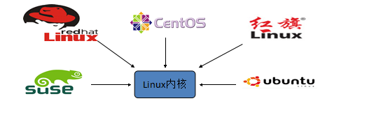
* 诞生于1991 年10 月5 日。是由芬兰赫尔辛基大学学生**Linus Torvalds和后来加入的众多爱好者**共同开发完成


### 3、Linux的历史
Linux最初是由芬兰赫尔辛基大学学生Linus Torvalds由于自己不满意教学中使用的MINIX操作系统， 所以在1990年底由于个人爱好设计出了LINUX系统核心。后来发布于**芬兰最大的ftp服务器上，用户可以免费下载**，所以它的周边的程序越来越多，Linux本身也逐渐发展壮大起来，**之后Linux在不到三年的时间里成为了一个功能完善，稳定可靠的操作系统**.

### 4、Linux系统的应用
* **服务器系统Web应用服务器、数据库服务器、接口服务器、DNS、FTP等等**； 
* 嵌入式系统路由器、防火墙、手机、PDA、IP 分享器、交换器、家电用品的微电脑控制器等等，
* 高性能运算、计算密集型应用Linux有强大的运算能力。
* 桌面应用系统
* 移动手持系统

### 5、Linux的版本
Linux的版本分为两种：**内核版本和发行版本**；**内核版本是指在Linus领导下的内核小组开发维护的系统内核的版本号 **

### 6、Linux的主流版本


## 二、Linux的安装
### 1、虚拟机安装
#### （1）什么是虚拟机
* **虚拟机：一台虚拟的电脑.**
* **虚拟机软件**:
    * **VmWare		:收费的**（**这里给大家安利一个微信公众号：软件安装管家，在上面可以免费下载安装最新版本的VMWare WorkStation15**）.
    * VirtualBox	:免费的.

#### （2）安装VmWare
*傻瓜式安装，直接下一步到底，中途将安装路径切换到其他盘符即可。*

### 2、CentOS的安装
一个兄弟写的blog，完美安装CentOS7，[点击访问](https://misakifx.github.io/2018/12/02/%E3%80%90Linux%E3%80%91Linux%E5%9F%BA%E7%A1%80-1/)

### 3、Linux的远程访问
#### （1）安装一个远程访问的软件
**推荐使用XShell，安装很简单，也是傻瓜式的安装**

#### （2）连接Linux
* **需要录入linux的ip地址及用户名密码**
* **查看ip地址**`ifconfig`
* 如果遇到问题，请访问[此链接](https://blog.csdn.net/qq_34504626/article/details/102720047)，这是之前学习Linux时写的连接XShell。

## 三、Linux的目录结构
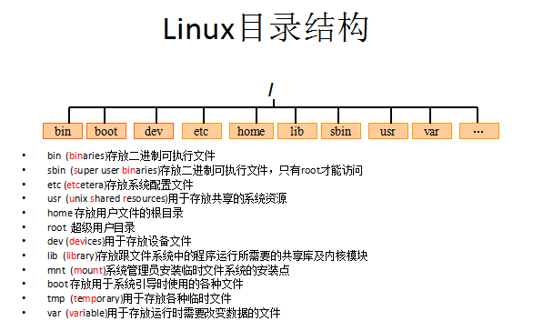
* **root管理员的home目录root**
* **其他用户的home目录home目录中**

## 四、Linux的常用命令
### 1、切换目录命令 cd
* **使用方法**：`cd xxx`(xxx代表要去的路径，可以是绝对路径，也可以是相对路径)
* **切换到app目录：**`cd app`
* **切换到上一层目录：**`cd ..`
* **切换到系统根目录：**`cd /`
* **切换到用户主目录：**`cd ~`
* **切换到上一个所在目录：**`cd -`
* **使用**`tab键`**来补全文件路径**

### 2、列出文件列表ls/ll 
* **ls(list)是一个非常有用的命令，用来显示当前目录下的内容**。配合参数的使用，能以不同的方式显示目录内容。    
* **格式**：`ls[参数] [路径或文件名]`
* **常用**：
    * `ls`
    * `ls -a ` **显示所有文件或目录（包含隐藏的文件）**
    * `ls -l`  **缩写成ll**
    * *在linux中以 . 开头的文件都是隐藏的文件*

### 3、创建目录和移除目录：mkdir和rmdir
* `mkdir(make directory)`命令可用来**创建目录。**
    * `mkdir app`**在当前目录下创建app目录**
    * `mkdir –p app2/test` **级联创建aap2以及test子目录**
* `rmdir(remove directory)`命令可用来**删除“空”的子目录**
    * `rmdir app` **删除app目录**

### 4、浏览文件【cat、more、less】
* **cat用于显示文件的内容。格式**：`cat[参数]<文件名>`
    * `cat yum.conf`**打印yum.conf文件的内容**
* `more`**一般用于要显示的内容会超过一个画面长度的情况**。
    * 按**空格键**显示下一个画面。
    * **回车**显示下一行内容。
    * 按 `q 键`退出查看。
    * 例如：`more yum.conf`
    * 空格显示下一页数据  回车显示下一行的数据
* **less用法和more类似，不同的是less可以通过PgUp、PgDn键来控制。**
    * `less yum.conf`
        * `PgUp`(上键)和`PgDn`(下键)进行**上下翻页**.

#### tail命令
**tail命令是在实际使用过程中使用非常多的一个命令**，**它的功能是：用于显示文件后几行的内容**。
* 用法:
    * `tail -10 /etc/passwd`**查看后10行数据**
    * `tail -f catalina.log`**动态查看日志**catalina.log
    * `ctrl+c `**结束查看**

### 5、文件操作
#### 【rm】删除文件
* **用法**：`rm [选项]... 文件...`
* `rm a.txt` **删除a.txt文件**
    * **删除需要用户确认，输入`y`或者`n`来确认删除或取消**
* `rm -f a.txt` **不询问，直接删除rm 删除目录**
* `rm -r a` **递归删除不询问递归删除（一般用于删除文件夹）**
* `rm -rf a`**不询问递归删除（慎用）**
* `rm -rf *` **删除当前目录下所有文件**
* ==`rm -rf /` **删库跑路，直接将根目录下所有文件以及文件夹递归不询问删除，等于自杀**==


#### 【cp、mv】
* **cp(copy)命令可以将文件从一处复制到另一处**。一般在使用cp命令时将一个文件**复制成另一个文件或复制到某目录时，需要指定源文件名与目标文件名或目录**。
    * `cp a.txt b.txt` **将a.txt复制为b.txt文件(等同于重命名)**
    * `cp a.txt ../` **将a.txt文件复制到上一层目录中**
* **mv 移动或者重命名**
    * `mv a.txt ../` **将a.txt文件移动到上一层目录中**
    * `mv a.txt b.txt`**将a.txt文件重命名为b.txt**

#### 【tar】打包或解压
**tar命令位于/bin目录下，它能够将用户所指定的文件或目录打包成一个文件，但不做压缩**。一般Linux上常用的**压缩方式是选用tar将许多文件打包成一个文件，再以gzip压缩命令压缩成xxx.tar.gz(或称为xxx.tgz)的文件**。
* **常用参数**：
    * `-c`：**创建**一个新tar文件
    * `-v`：**显示运行过程的信息**
    * `-f`：**指定**文件名
    * `-z`：调用gzip压缩命令**进行压缩**
    * `-t`：**查看**压缩文件的内容
    * `-x`：**解开tar文件**

* **打包**：
    * `tar –cvf xxx.tar ./*`**将当前目录下所有文件打包成xxx.tar**
* **打包并且压缩**：
    * `tar –zcvf xxx.tar.gz ./*`**将当前目录下所有文件打包并压缩成xxx.tar.gz**

* **解压**
    * `tar –xvf xxx.tar`**解压xxx.tar**
    * `tar -zxvf xxx.tar.gz -C /usr/aaa`**解压xxx.tar.gz到/usr/aaa目录下（-C指定解压位置）**

#### 【find】命令
* **find指令用于查找符合条件的文件**
* **示例**：
    * `find / -name “ins*”` **查找文件名称是以ins开头的文件**
    * `find / –user itcast –ls `**查找用户itcast的文件**
    * `find / –user itcast –type d –ls` **查找用户itcast的目录**
    * `find /-perm -777 –type d-ls` **查找权限是777的文件**

#### 【grep】命令
* **查找文件里符合条件的字符串。**
* **用法**: 
    * `grep [选项]... PATTERN [FILE]...`
* **示例**：
    * `grep lang anaconda-ks.cfg `**在文件中查找lang**
    * `grep lang anaconda-ks.cfg –color` **高亮显示**

### 6、其他常用命令
* 【pwd】**显示当前所在目录**
* 【touch】**创建一个空文件**
    * `touch a.txt`
* 【clear/ crtl + L】**清屏**

## 五、Vi和Vim编辑器
### 1、Vim编辑器
**在Linux下一般使用vi编辑器来编辑文件。vi既可以查看文件也可以编辑文件**。三种模式：**命令行、插入、底行模式。**
#### 一些常用的基本操作
* **切换到命令行模式**：按Esc键；
* **切换到插入模式**：按 i 、o、a键；
    * `i` 在当前位置前插入
    * `I` 在当前行首插入
    * `a` 在当前位置后插入
    * `A` 在当前行尾插入
    * `o `在当前行之后插入一行
    * `O` 在当前行之前插入一行
* **切换到底行模式**：按 `:`（冒号）；
* **打开文件**：`vim file`
* **退出**：按下esc键然后输入`:q`再回车
* **修改文件**：输入i进入插入模式
* **保存并退出**：按下esc键然后输入`:wq`再回车
* **不保存退出**：按下esc键然后输入`:q!`再回车

#### 三种进入插入模式
* `i`:在当前的光标所在处插入
* `o`:在当前光标所在的行的下一行插入
* `a`:在光标所在的下一个字符插入

#### 快捷键
* dd – 快速删除一行
* yy - 复制当前行
* nyy - 从当前行向后复制几行
* p - 粘贴
* R – 替换

### 2、重定向输出>和>>
* `>` **重定向输出，覆盖原有内容；** 
* `>>`**重定向输出，又追加功能；**
* **示例**：
    * `cat /etc/passwd > a.txt`  **将输出定向到a.txt中**
    * `cat /etc/passwd >> a.txt`  **输出并且追加**
    * `ifconfig > ifconfig.txt`**将ifconfig命令所展示的结果重定向保存到ifconfig.txt中**（*其他命令也可以这样使用*）

### 3、系统管理命令
* `ps` **正在运行的某个进程的状态**
* `ps –ef`  **查看所有进程**
* `ps –ef | grep ssh` **查找某一进程**
* `kill 2868`  **杀掉2868编号的进程**
* `kill -9 2868`  **强制杀死进程**

### 4、管道 |
**管道是Linux命令中重要的一个概念，其作用是将一个命令的输出用作另一个命令的输入。**
* **示例：**
    * `ls --help | more`  分页查询帮助信息
    * `ps –ef | grep java` 查询名称中包含java的进程
    * `ifconfig | more` 分页展示ifconfig命令的结果
    * `cat index.html | more`分页展示index.html的内容

## 六、Linux的权限命令
### 1、文件权限


    属主（user）属组（group）其他用户
    r	w	x	r	w	x	r	w	x
    4	2	1	4	2	1	4	2	1
* **r:对文件是指可读取内容，对目录是可以ls**
* **w:对文件是指可修改文件内容，对目录是指可以在其中创建或删除子节点(目录或文件)**
* **x:对文件是指是否可以运行这个文件，对目录是指是否可以cd进入这个目录**

### 2、Linux三种文件类型
* **普通文件**： 包括文本文件、数据文件、可执行的二进制程序文件等。 
* **目录文件**： Linux系统把目录看成是一种特殊的文件，利用它构成文件系统的树型结构。  
* **设备文件**： Linux系统把每一个设备都看成是一个文件

### 3、文件类型标识
* **普通文件（-）**
* **目录（d）**
* **符号链接（l）**
* **字符设备文件（c）**
* **块设备文件（s）**
* **套接字（s）**
* **命名管道（p）**

### 4、文件权限管理
**chmod 变更文件或目录的权限。**
* `chmod 755 a.txt `将a.txt的权限设为755（**755从左到右分别代表文件所属的用户、文件所属用户的用户组、其它用户的权限权值的和，权值如下**）

          属主（user）属组（group）其他用户
        r	w	x	r	w	x	r	w	x
        4	2	1	4	2	1	4	2	1
* `chmod u=rwx,g=rx,o=rx a.txt`（**u代表属主，g代表属组，o代表其他用户**）

## 七、Linux上常用网络操作
### 1、主机名配置
* `hostname` **查看主机名**
* `hostname xxx` **修改主机名 重启后无效**
* *如果想要永久生效，可以修改/etc/sysconfig/network文件*

### 2、IP地址配置
* `ifconfig` **查看(修改)ip地址(重启后无效)**
* `ifconfig eth0 192.168.12.22 `**修改ip地址**
* **如果想要永久生效，修改 /etc/sysconfig/network-scripts/ifcfg-eth0文件**
``` 
DEVICE=eth0 #网卡名称
BOOTPROTO=static #获取ip的方式(static/dhcp/bootp/none)
HWADDR=00:0C:29:B5:B2:69 #MAC地址
IPADDR=12.168.177.129 #IP地址
NETMASK=255.255.255.0 #子网掩码
NETWORK=192.168.177.0 #网络地址
BROADCAST=192.168.0.255 #广播地址
NBOOT=yes #  系统启动时是否设置此网络接口，设置为yes时，系统启动时激活此设备。
```
### 3、域名映射
*/etc/hosts文件用于在通过主机名进行访问时做ip地址解析之用,相当于windows系统的C:\Windows\System32\drivers\etc\hosts文件的功能*
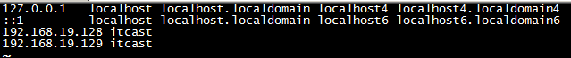

### 4、网络服务管理
* `service network status` **查看指定服务的状态**
* `service network stop` 停止指定服务
* `service network start` 启动指定服务
* `service network restart` **重启指定服务**
* `service --status–all` **查看系统中所有后台服务**
* `netstat –nltp` **查看系统中网络进程的端口监听情况**

### 5、防火墙设置
**防火墙根据配置文件/etc/sysconfig/iptables来控制本机的”出”、”入”网络访问行为。**
* `service iptables status` **查看防火墙状态**
* `service iptables stop `**关闭防火墙**
* `service iptables start `**启动防火墙**
* `chkconfig  iptables off `**禁止防火墙自启**

## 八、Linux上软件安装
### 备注
**所有安装需要的安装包或文件分享给大家**（*链接：https://pan.baidu.com/s/1rMXprV4XgBYCplocEdj1aQ 
提取码：cc5h）*
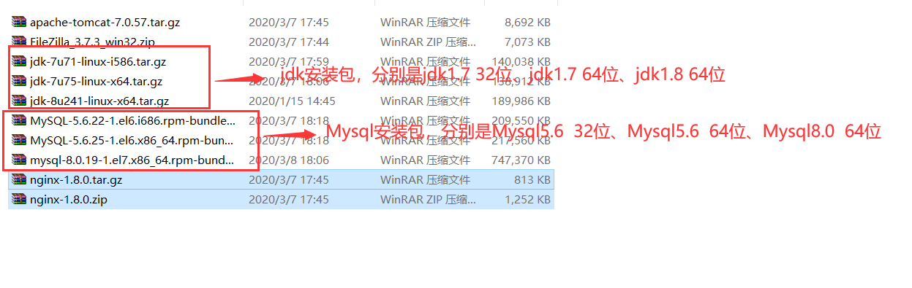
### 1、安装方式介绍
*Linux上的软件安装有以下几种常见方式*
* **二进制发布包**
    * 软件已经针对具体平台编译打包发布，只要解压，修改配置即可
* RPM包
    * 软件已经按照redhat的包管理工具规范RPM进行打包发布，需要获取到相应的软件RPM发布包，然后用RPM命令进行安装
* **Yum在线安装**
    * 软件已经以RPM规范打包，但发布在了网络上的一些服务器上，可用yum在线安装服务器上的rpm软件，并且会自动解决软件安装过程中的库依赖问题
* **源码编译安装**
    * 软件以源码工程的形式发布，需要获取到源码工程后用相应开发工具进行编译打包部署。
* *一般使用比较多的是yum，直接通过yum命令便可以进行安装，但是网络不好的话可能会中断，或者有时候命令输错的话会安装失败*，**这里用一种比较传统而且稳定的方法，将要安装的软件，在对应官网上进行下载，要看清楚自己的版本，然后将其上传，再解压配置即可**

### 2、上传与下载工具介绍
#### FileZilla（个人比较推荐）
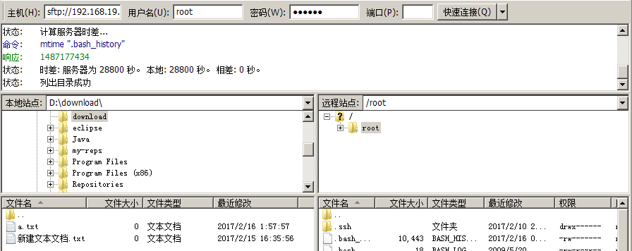
* **简单方便，输入主机名（通过ifconfig获得的ip），用户名和密码，端口号填22即可**
* **要放在哪个目录直接拖拽即可**

#### lrzsz（如果使用crt远程连接的话可以使用）
* 可以使用yum安装方式安装`yum install lrzsz`
    * 注意：**必须有网络**
* *可以在crt中设置上传与下载目录*
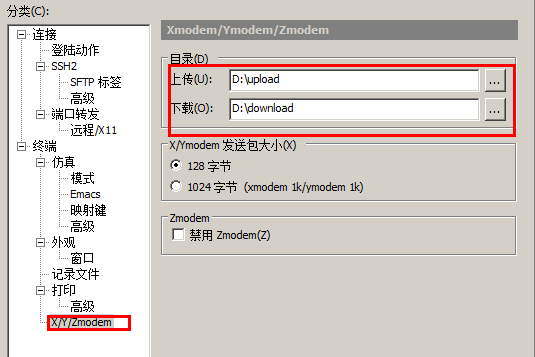
* **上传**
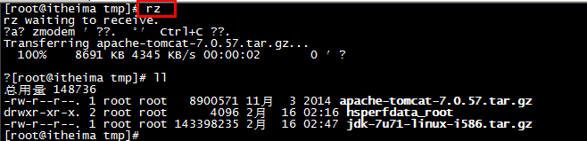
* **下载**
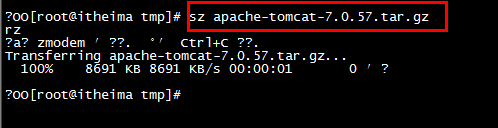

#### sftp（如果使用crt远程连接的话可以使用）
* **使用alt + p 组合键打开sftp窗口**

* **使用put 命令上传**

* **使用get命令下载**

* **默认下载位置在当前计算的的文档位置**


### 3、在Linux上安装JDK
#### 【步骤一】上传JDK到Linux的服务器
* **上传JDK**
* **卸载open-JDK**
* **命令如下**：
```
# 查看jdk版本
java –version
# 查看安装的jdk信息
rpm -qa | grep java
# 卸载jdk
rpm -e --nodeps java-1.6.0-openjdk-1.6.0.35-1.13.7.1.el6_6.i686
rpm -e --nodeps java-1.7.0-openjdk-1.7.0.79-2.5.5.4.el6.i686
```
#### 【步骤二】在Linux服务器上安装JDK.
* **通常将软件安装到/usr/local**
* **直接解压就可以**
  ` tar –xvf  jdk.tar.gz  -C 目标路径  `


#### 【步骤三】配置JDK的环境变量.
**配置环境变量：**
*  `vi /etc/profile`**编辑配置文件**
* **在末尾行添加(JAVA_HOME的值是自己安装jdk的路径)**
```
#set java environment
JAVA_HOME=/usr/local/jdk/jdk1.7.0_71
CLASSPATH=.:$JAVA_HOME/lib.tools.jar
PATH=$JAVA_HOME/bin:$PATH
export JAVA_HOME CLASSPATH PATH
```
* **保存退出**`:wq`
* `source /etc/profile` **使更改的配置立即生效**

### 4、在Linux上安装Mysql（版本是5.6的可以参考）
#### 【步骤一】将mysql的安装文件上传到Linux的服务器.
* **将mysql的tar上传**
* **将mysql的tar解压**
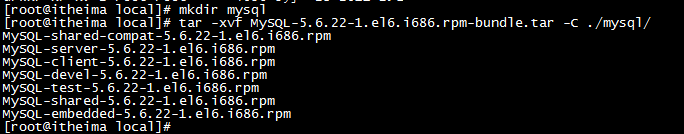
* **将系统自带的mysql卸载**
`rpm –qa | grep mysql `
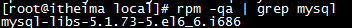 
 

#### 【步骤二】安装MYSQL服务端

*下面的提示是告诉我们root用户的密码第一次是随机生成的，它保存在/root/.mysql_secret中，第一次登录需要修改root密码*
 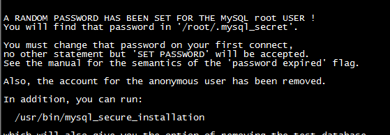

#### 【步骤三】安装MYSQL客户端

* **查看生成的root密码**
 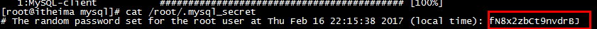
 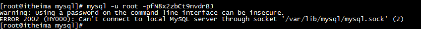
* **报错:原因是没有启动mysql服务**
* **需要开启mysql服务**
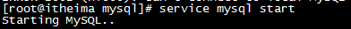
* **执行下面操作报错，原因是第一次操作mysql必须修改root用户的密码**
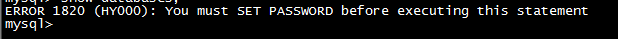
* **设置root用户的密码**
 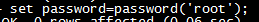

#### 关于mysql远程访问设置
* `grant all privileges on *.* to 'root' @'%' identified by 'root';`
* `flush privileges;`
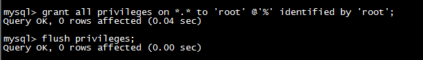
* 在linux中很多软件的端口都被”防火墙”限止，我们需要将防火墙关闭
* **防火墙打开3306端口**
    * `/sbin/iptables -I INPUT -p tcp --dport 3306 -j ACCEPT`
    * `/etc/rc.d/init.d/iptables save`
    * `/etc/init.d/iptables status`
* *学习阶段我们也可以直接将防火墙关闭*
    * `service iptables stop;`

#### 备注
**以上介绍的是Mysql5.6的版本的安装配置过程，如果使用8.0及以上版本可以参考，[此链接](https://blog.csdn.net/weixin_42266606/article/details/80879571)**
* **如果使用Mysql8.0及以上版本，jdk安装1.8及以上版本**

### 5、在Linux上安装tomcat（直接上传并解压即可）
* **Tomcat上传到linux上**
* **将上传的tomcat解压**
* **在tomcat/bin目录下执行 startup.sh（注意防火墙）**
* 查看目标 tomcat/logs/catalina.out

### 6、在Linux上安装redis
#### 【步骤一】安装gcc-c++
**redis是C语言开发，安装redis需要先将官网下载的源码进行编译，编译依赖gcc环境。**
* **输入命令**:`yum install gcc-c++`
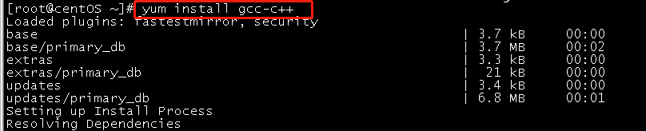
* **输入y确认下载**

* **输入y确认安装**
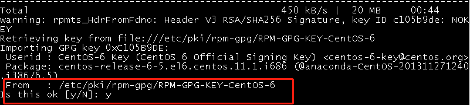
* **安装 gcc 成功！**
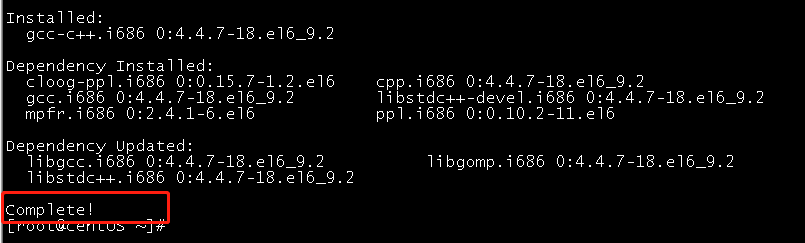

#### 【步骤二】安装redis
* **下载redis命令** `wget http://download.redis.io/releases/redis-3.0.4.tar.gz`
* **解压**`tar -xzvf redis-3.0.4.tar.gz`
* **编译安装**：切换至程序目录，并执行make命令编译：
    * `cd redis-3.0.4`
    * `make`
* **执行安装命令**
    * `make PREFIX=/usr/local/redis install`
* *make install安装完成后，会在/usr/local/bin目录下生成下面几个可执行文件，它们的作用分别是*：
    * redis-server：**Redis服务器端启动程序**
    * redis-cli：**Redis客户端操作工具。也可以用telnet根据其纯文本协议来操作**
    * redis-benchmark：Redis性能测试工具
    * redis-check-aof：数据修复工具
    * redis-check-dump：检查导出工具

#### 【步骤三】配置redis
* **复制配置文件到/usr/local/redis/bin目录**：
    * `cd redis-3.0.4`
    * `cp redis.conf /usr/local/redis/bin`

#### 【步骤四】启动redis
* **进入redis/bin目录**`cd redis/bin`
* **启动redis服务端**`./redis-server redis.conf`
* **克隆新窗口，启动redis客户端**`./redis-cli`
    * 克隆窗口在XShell中在标签栏右键然后选择复制SSH渠道即可
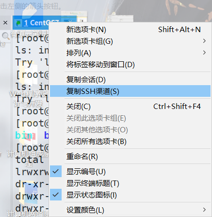

### 7、部署项目到Linux
#### （1）修改pom配置
* **在pom.xml中添加`<finalName>`**
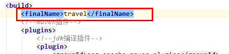
* **修改jdk版本**
    * 根据第一步安装的jdk版本来确定

#### （2）修改项目
* **修改properties数据库配置文件**
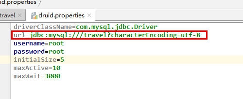
    * 如果使用Mysql8.0及以上版本连接url的配置可以看之前发的blog，点击[此链接](https://blog.csdn.net/qq_34504626/article/details/104526679)访问
* **将自己项目中的所有路径检查均使用相对路径**

#### （3）使用package命令打包
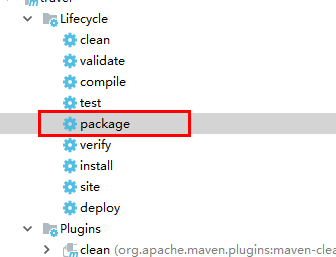
#### （4）上传war包到Linux
* **将`项目名.war`上传到tomcat中的webapps目录**

#### **重启tomcat**
#### 导出本地mysql数据，并导入到linux中的mysql
#### 在物理机的浏览器中，访问虚拟机的项目
* **192.168.xxx.xxx:8080/项目名**
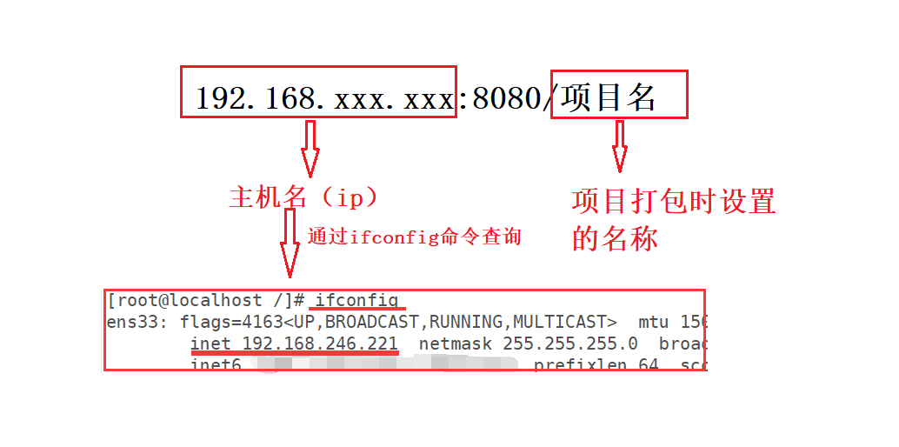