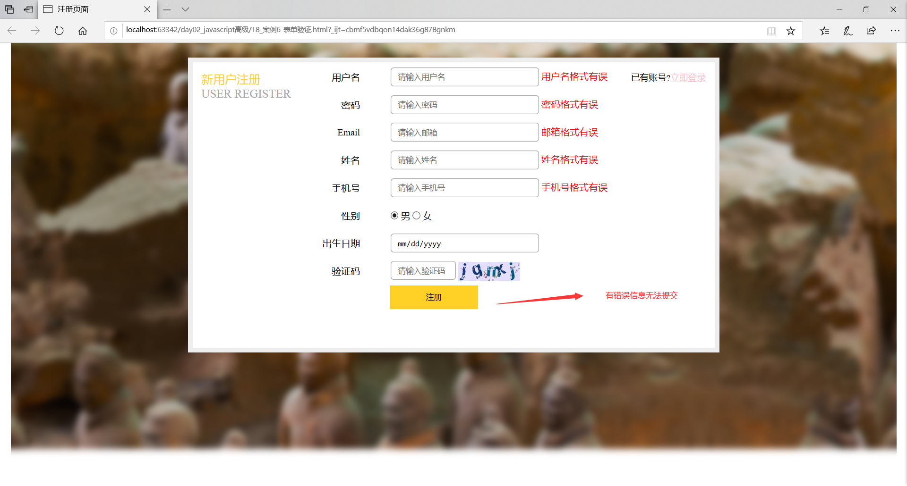
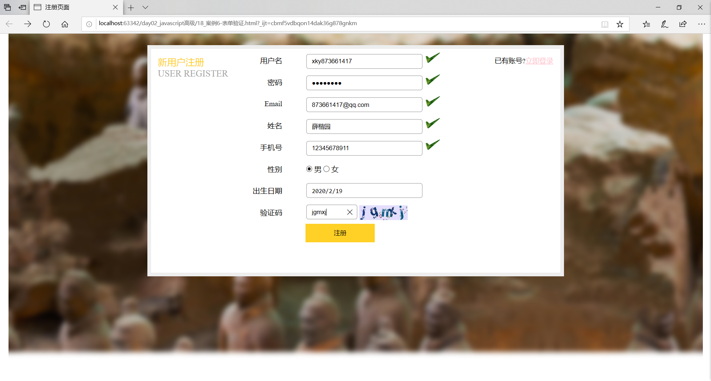
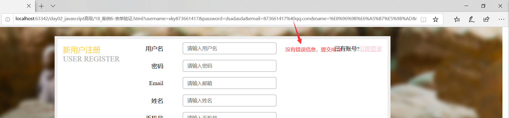

## 一、DOM简单学习
*为了满足案例要求*
* 功能：控制html文档的内容
* 获取页面标签(元素)对象：Element
	* document.getElementById("id值"):通过元素的id获取元素对象

* 操作Element对象：
	1. 修改属性值：
		1. 明确获取的对象是哪一个？
		2. 查看API文档，找其中有哪些属性可以设置
	2. 修改标签体内容：
		* 属性：innerHTML
		1. 获取元素对象
		2. 使用innerHTML属性修改标签体内容

## 二、事件简单学习
* 功能： 某些组件被执行了某些操作后，触发某些代码的执行。
* 如何绑定事件
	* 直接在html标签上，指定事件的属性(操作)，属性值就是js代码
	    * 事件：onclick--- 单击事件
	* 通过js获取元素对象，指定事件属性，设置一个函数

## 三、案例1：电灯开关
```
<!DOCTYPE html>
<html lang="en">
<head>
    <meta charset="UTF-8">
    <title>电灯开关</title>

</head>
<body>


<script>
    /*
        分析：
            1.获取图片对象
            2.绑定单击事件
            3.每次点击切换图片
                * 规则：
                    * 如果灯是开的 on,切换图片为 off
                    * 如果灯是关的 off,切换图片为 on
                * 使用标记flag来完成

     */

    //1.获取图片对象
    var light = document.getElementById("light");

    var flag = false;//代表灯是灭的。 off图片

    //2.绑定单击事件
    light.onclick = function(){
        if(flag){//判断如果灯是开的，则灭掉
            light.src = "img/off.gif";
            flag = false;

        }else{
            //如果灯是灭的，则打开

            light.src = "img/on.gif";
            flag = true;
        }


    }
    
</script>
</body>
</html>

```
## 四、BOM
### 1. 概念
Browser Object Model 浏览器对象模型
* 将浏览器的各个组成部分封装成对象

### 2. 组成
* Window：窗口对象
* Navigator：浏览器对象
* Screen：显示器屏幕对象
* History：历史记录对象
* Location：地址栏对象

### 3. Window：窗口对象
1. 创建
2. 方法
* 与弹出框有关的方法：<br>
    * alert()	显示带有一段消息和一个确认按钮的警告框。
    * confirm()	显示带有一段消息以及确认按钮和取消按钮的对话框。
        * 如果用户点击确定按钮，则方法返回true
        * 如果用户点击取消按钮，则方法返回false
    * prompt()	显示可提示用户输入的对话框。
        * 返回值：获取用户输入的值
* 与打开关闭有关的方法：
    * close()	关闭浏览器窗口。
        * 谁调用我 ，我关谁
    * open()	打开一个新的浏览器窗口
        * 返回新的Window对象
* 与定时器有关的方式
    * setTimeout()	在指定的毫秒数后调用函数或计算表达式。
        * 参数：
            1. js代码或者方法对象
            2. 毫秒值
        * 返回值：唯一标识，用于取消定时器
    * clearTimeout()	取消由 setTimeout() 方法设置的 timeout。

    * setInterval()	
        * 按照指定的周期（以毫秒计）来调用函数或计算表达式。
    * clearInterval()	
        * 取消由 setInterval() 设置的 timeout。

3. 属性：
* 获取其他BOM对象：
    history
    location
    Navigator
    Screen
* 获取DOM对象:
    document
4. 特点
    * Window对象不需要创建可以直接使用 window使用。 window.方法名();
    * window引用可以省略。  方法名();


### 4. Location：地址栏对象
1. 创建(获取)：
* window.location
* location

2. 方法：
* reload()	重新加载当前文档。刷新
3. 属性
* href	设置或返回完整的 URL。


### 5. History：历史记录对象
1. 创建(获取)：
*  window.history
*  history

2. 方法：
* back()	加载 history 列表中的前一个 URL。
* forward()	加载 history 列表中的下一个 URL。
* go(参数)	加载 history 列表中的某个具体页面。
    * 参数：
        * 正数：前进几个历史记录
        * 负数：后退几个历史记录
3. 属性：
* length	返回当前窗口历史列表中的 URL 数量。


## 五、DOM
* 概念： Document Object Model 文档对象模型
	* 将标记语言文档的各个组成部分，封装为对象。可以使用这些对象，对标记语言文档进行CRUD的动态操作

* W3C DOM 标准被分为 3 个不同的部分：

	* 核心 DOM - 针对任何结构化文档的标准模型
		* Document：文档对象
		* Element：元素对象
		* Attribute：属性对象
		* Text：文本对象
		* Comment:注释对象

		* Node：节点对象，其他5个的父对象
	* XML DOM - 针对 XML 文档的标准模型
	* HTML DOM - 针对 HTML 文档的标准模型


* 核心DOM模型：
	* Document：文档对象
		1. 创建(获取)：在html dom模型中可以使用window对象来获取
			1. window.document
			2. document
		2. 方法：
			1. 获取Element对象：
				1. getElementById()	： 根据id属性值获取元素对象。id属性值一般唯一
				2. getElementsByTagName()：根据元素名称获取元素对象们。返回值是一个数组
				3. getElementsByClassName():根据Class属性值获取元素对象们。返回值是一个数组
				4. getElementsByName(): 根据name属性值获取元素对象们。返回值是一个数组
			2. 创建其他DOM对象：
				createAttribute(name)
            	createComment()
            	createElement()
            	createTextNode()
		3. 属性
	* Element：元素对象
		1. 获取/创建：通过document来获取和创建
		2. 方法：
			1. removeAttribute()：删除属性
			2. setAttribute()：设置属性
	* Node：节点对象，其他5个的父对象
		* 特点：所有dom对象都可以被认为是一个节点
		* 方法：
			* CRUD dom树：
				* appendChild()：向节点的子节点列表的结尾添加新的子节点。
				* removeChild()	：删除（并返回）当前节点的指定子节点。
				* replaceChild()：用新节点替换一个子节点。
		* 属性：
			* parentNode 返回节点的父节点。


* HTML DOM
	1. 标签体的设置和获取：innerHTML
	2. 使用html元素对象的属性
	3. 控制元素样式
		1. 使用元素的style属性来设置
			如：
				 //修改样式方式1
		        div1.style.border = "1px solid red";
		        div1.style.width = "200px";
		        //font-size--> fontSize
		        div1.style.fontSize = "20px";
		2. 提前定义好类选择器的样式，通过元素的className属性来设置其class属性值。


## 五、事件监听机制
* 概念：某些组件被执行了某些操作后，触发某些代码的执行。	
* 事件：某些操作。如： 单击，双击，键盘按下了，鼠标移动了
* 事件源：组件。如： 按钮 文本输入框...
* 监听器：代码。
* 注册监听：将事件，事件源，监听器结合在一起。 当事件源上发生了某个事件，则触发执行某个监听器代码。


* 常见的事件：
    1. 点击事件：
    	1. onclick：单击事件
    	2. ondblclick：双击事件
    2. 焦点事件
    	1. onblur：失去焦点
    	2. onfocus:元素获得焦点。
    
    3. 加载事件：
    	1. onload：一张页面或一幅图像完成加载。
    
    4. 鼠标事件：
    	1. onmousedown	鼠标按钮被按下。
    	2. onmouseup	鼠标按键被松开。
    	3. onmousemove	鼠标被移动。
    	4. onmouseover	鼠标移到某元素之上。
    	5. onmouseout	鼠标从某元素移开。
    	
    5. 键盘事件：
    	1. onkeydown	某个键盘按键被按下。	
    	2. onkeyup		某个键盘按键被松开。
    	3. onkeypress	某个键盘按键被按下并松开。
    
    6. 选择和改变
    	1. onchange	域的内容被改变。
    	2. onselect	文本被选中。
    
    7. 表单事件：
    	1. onsubmit	确认按钮被点击。
    	2. onreset	重置按钮被点击。

## 六、案例2：表单验证
代码实现：
```
<!DOCTYPE html>
<html lang="en">
<head>
    <meta charset="UTF-8">
    <title>注册页面</title>
    <style>
        *{
            margin: 0px;
            padding: 0px;
            box-sizing: border-box;
        }
        body{
            background: url("img/register_bg.png") no-repeat center;
            padding-top: 25px;
        }

        .rg_layout{
            width: 900px;
            height: 500px;
            border: 8px solid #EEEEEE;
            background-color: white;
            /*让div水平居中*/
            margin: auto;
        }

        .rg_left{
            /*border: 1px solid red;*/
            float: left;
            margin: 15px;
        }
        .rg_left > p:first-child{
            color:#FFD026;
            font-size: 20px;
        }

        .rg_left > p:last-child{
            color:#A6A6A6;
            font-size: 20px;

        }


        .rg_center{
            float: left;
            /* border: 1px solid red;*/

        }

        .rg_right{
            /*border: 1px solid red;*/
            float: right;
            margin: 15px;
        }

        .rg_right > p:first-child{
            font-size: 15px;

        }
        .rg_right p a {
            color:pink;
        }

        .td_left{
            width: 100px;
            text-align: right;
            height: 45px;
        }
        .td_right{
            padding-left: 50px ;
        }

        #username,#password,#email,#name,#tel,#birthday,#checkcode{
            width: 251px;
            height: 32px;
            border: 1px solid #A6A6A6 ;
            /*设置边框圆角*/
            border-radius: 5px;
            padding-left: 10px;
        }
        #checkcode{
            width: 110px;
        }

        #img_check{
            height: 32px;
            vertical-align: middle;
        }

        #btn_sub{
            width: 150px;
            height: 40px;
            background-color: #FFD026;
            border: 1px solid #FFD026 ;
        }
        .error{
            color:red;
        }
        #td_sub{
            padding-left: 150px;
        }

    </style>
    <script>

        /*
            分析：
                1.给表单绑定onsubmit事件。监听器中判断每一个方法校验的结果。
                    如果都为true，则监听器方法返回true
                    如果有一个为false，则监听器方法返回false

                2.定义一些方法分别校验各个表单项。
                3.给各个表单项绑定onblur事件。


         */

        window.onload = function(){
            //1.给表单绑定onsubmit事件
            document.getElementById("form").onsubmit = function(){
                //调用用户校验方法   chekUsername();
                //调用密码校验方法   chekPassword();
                //return checkUsername() && checkPassword();

                return checkUsername() && checkPassword() && checkEmail() && checkName() && checkTel() && checkCheckcode();
            }

            //给用户名和密码框分别绑定离焦事件
            document.getElementById("username").onblur = checkUsername;
            document.getElementById("password").onblur = checkPassword;
            document.getElementById("email").onblur = checkEmail;
            document.getElementById("name").onblur = checkName;
            document.getElementById("tel").onblur = checkTel;
            document.getElementById("checkcode").onblur = checkCheckcode;
        }

        //校验用户名
        function checkUsername(){
            //1.获取用户名的值
            var username = document.getElementById("username").value;
            //2.定义正则表达式
            var reg_username = /^\w{6,12}$/;
            //3.判断值是否符合正则的规则
            var flag = reg_username.test(username);
            //4.提示信息
            var s_username = document.getElementById("s_username");

            if(flag){
                //提示绿色对勾
                s_username.innerHTML = "";
            }else{
                //提示红色有误
                s_username.innerHTML = "用户名格式有误";
            }
            return flag;
        }

        //校验密码
        function checkPassword(){
            //1.获取用户名的值
            var password = document.getElementById("password").value;
            //2.定义正则表达式
            var reg_password = /^\w{6,12}$/;
            //3.判断值是否符合正则的规则
            var flag = reg_password.test(password);
            //4.提示信息
            var s_password = document.getElementById("s_password");

            if(flag){
                //提示绿色对勾
                s_password.innerHTML = "";
            }else{
                //提示红色有误
                s_password.innerHTML = "密码格式有误";
            }
            return flag;
        }
        //校验电子邮箱
        function checkEmail(){
            //1.获取用户名的值
            var email = document.getElementById("email").value;
            //2.定义正则表达式
            var reg_email =  /^\w+@[a-z0-9]+\.[a-z]{2,4}$/;
            //3.判断值是否符合正则的规则
            var flag = reg_email.test(email);
            //4.提示信息
            var s_email = document.getElementById("s_email");

            if(flag){
                //提示绿色对勾
                s_email.innerHTML = "";
            }else{
                //提示红色有误
                s_email.innerHTML = "邮箱格式有误";
            }
            return flag;
        }

        //校验姓名
        function checkName(){
            //1.获取用户名的值
            var name = document.getElementById("name").value;
            //2.定义正则表达式
            var reg_name =  /^[\u4e00-\u9fa5]{2,6}$/;
            //3.判断值是否符合正则的规则
            var flag = reg_name.test(name);
            //4.提示信息
            var s_name = document.getElementById("s_name");

            if(flag){
                //提示绿色对勾
                s_name.innerHTML = "";
            }else{
                //提示红色有误
                s_name.innerHTML = "姓名格式有误";
            }
            return flag;
        }
        //校验手机号
        function checkTel(){
            //1.获取用户名的值
            var tel = document.getElementById("tel").value;
            //2.定义正则表达式
            var reg_tel =  /^\d{11}$/;
            //3.判断值是否符合正则的规则
            var flag = reg_tel.test(tel);
            //4.提示信息
            var s_tel = document.getElementById("s_tel");

            if(flag){
                //提示绿色对勾
                s_tel.innerHTML = "";
            }else{
                //提示红色有误
                s_tel.innerHTML = "手机号格式有误";
            }
            return flag;
        }

        //校验验证码
        function checkCheckcode(){
            //1.获取用户名的值
            var checkcode = document.gecheckcodeementById("checkcode").value;
            //2.定义正则表达式
            var reg_checkcode =  /^\w{5}$/;
            //3.判断值是否符合正则的规则
            var flag = reg_checkcode.test(checkcode);
            //4.提示信息
            var s_checkcode = document.gecheckcodeementById("s_checkcode");

            if(flag){
                //提示绿色对勾
                s_checkcode.innerHTML = "";
            }else{
                //提示红色有误
                s_checkcode.innerHTML = "验证码格式有误";
            }
            return flag;
        }

    </script>
</head>
<body>

<div class="rg_layout">
    <div class="rg_left">
        <p>新用户注册</p>
        <p>USER REGISTER</p>

    </div>

    <div class="rg_center">
        <div class="rg_form">
            <!--定义表单 form-->
            <form action="#" id="form" method="get">
                <table>
                    <tr>
                        <td class="td_left"><label for="username">用户名</label></td>
                        <td class="td_right">
                            <input type="text" name="username" id="username" placeholder="请输入用户名">
                            <span id="s_username" class="error"></span>
                        </td>
                    </tr>

                    <tr>
                        <td class="td_left"><label for="password">密码</label></td>
                        <td class="td_right">
                            <input type="password" name="password" id="password" placeholder="请输入密码">
                            <span id="s_password" class="error"></span>
                        </td>
                    </tr>

                    <tr>
                        <td class="td_left"><label for="email">Email</label></td>
                        <td class="td_right"><input type="email" name="email" id="email" placeholder="请输入邮箱">
                            <span id="s_email" class="error"></span>
                        </td>
                    </tr>

                    <tr>
                        <td class="td_left"><label for="name">姓名</label></td>
                        <td class="td_right"><input type="text" name="name" id="name" placeholder="请输入姓名">
                            <span id="s_name" class="error"></span>
                        </td>
                    </tr>

                    <tr>
                        <td class="td_left"><label for="tel">手机号</label></td>
                        <td class="td_right"><input type="text" name="tel" id="tel" placeholder="请输入手机号">
                            <span id="s_tel" class="error"></span>
                        </td>
                    </tr>

                    <tr>
                        <td class="td_left"><label>性别</label></td>
                        <td class="td_right">
                            <input type="radio" name="gender" value="male" checked> 男
                            <input type="radio" name="gender" value="female"> 女
                        </td>
                    </tr>

                    <tr>
                        <td class="td_left"><label for="birthday">出生日期</label></td>
                        <td class="td_right"><input type="date" name="birthday" id="birthday" placeholder="请输入出生日期"></td>
                    </tr>

                    <tr>
                        <td class="td_left"><label for="checkcode" >验证码</label></td>
                        <td class="td_right"><input type="text" name="checkcode" id="checkcode" placeholder="请输入验证码">
                            <span id="s_checkcode" class="error"></span>
                            
                        </td>
                    </tr>


                    <tr>
                        <td colspan="2" id="td_sub"><input type="submit" id="btn_sub" value="注册"></td>
                    </tr>
                </table>

            </form>


        </div>

    </div>

    <div class="rg_right">
        <p>已有账号?<a href="#">立即登录</a></p>
    </div>


</div>


</body>
</html>
```
效果图展示：<br>
* 填写有误时，不能提交

* 全部无误，才可提交

