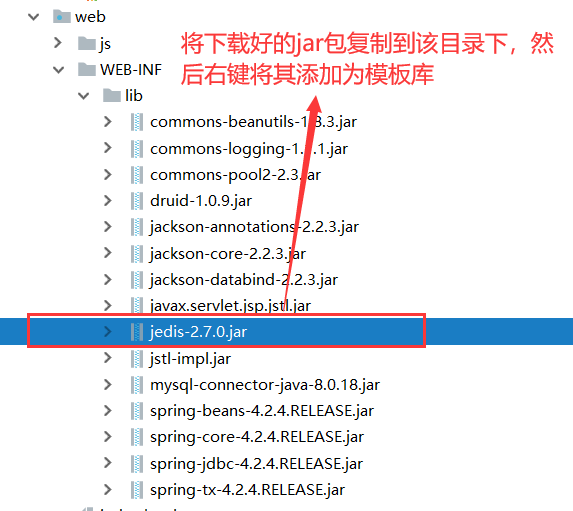
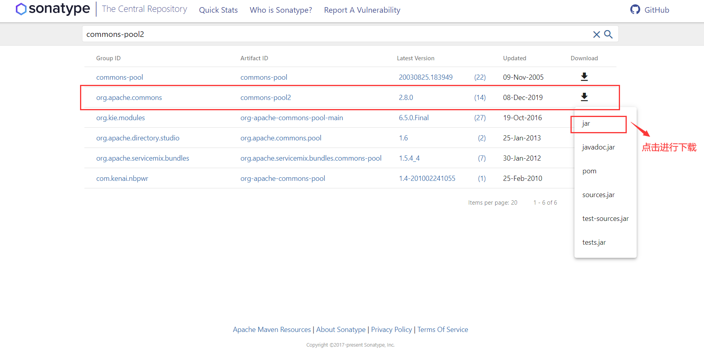
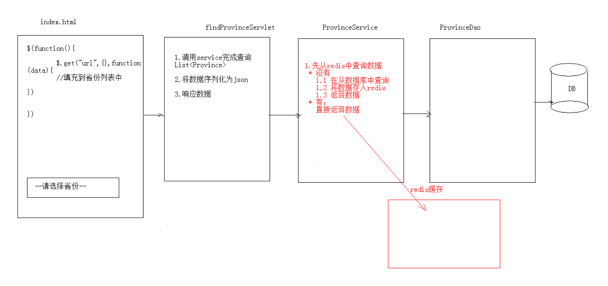

## Java操作Redis数据库客户端Jedis
### 1、Jedis
**一款java操作redis数据库的工具.**
### 2、使用步骤
* **下载jedis的jar包**[jedis-2.9.0.jar](https://static.runoob.com/download/jedis-2.9.0.jar)**并导入到项目中**


* **使用**
```
//1. 获取连接
Jedis jedis = new Jedis("localhost",6379);
//2. 操作
jedis.set("username","zhangsan");
//3. 关闭连接
jedis.close();
```

### 3、Jedis操作各种redis中的数据结构
#### （1）字符串类型 string
* set()
* get()
```	
 //1. 获取连接
Jedis jedis = new Jedis();//如果使用空参构造，默认值 "localhost",6379端口
//2. 操作
//存储
jedis.set("username","zhangsan");
//获取
String username = jedis.get("username");
System.out.println(username);

//可以使用setex()方法存储可以指定过期时间的 key value
jedis.setex("activecode",20,"hehe");//将activecode：hehe键值对存入redis，并且20秒后自动删除该键值对

//3. 关闭连接
jedis.close();
```

#### （2）哈希类型hash（map格式)
* hset()
* hget()
* hgetAll()
```
//1. 获取连接
Jedis jedis = new Jedis();//如果使用空参构造，默认值 "localhost",6379端口
//2. 操作
// 存储hash
jedis.hset("user","name","lisi");
jedis.hset("user","age","23");
jedis.hset("user","gender","female");

// 获取hash
String name = jedis.hget("user", "name");
System.out.println(name);


// 获取hash的所有map中的数据
Map<String, String> user = jedis.hgetAll("user");

// keyset
Set<String> keySet = user.keySet();
for (String key : keySet) {
    //获取value
    String value = user.get(key);
    System.out.println(key + ":" + value);
}

//3. 关闭连接
jedis.close();
```

#### （3）列表类型list(linkedlist格式,支持重复元素)
* lpush / rpush
* lpop / rpop
* lrange start end : 范围获取
```	
 //1. 获取连接
Jedis jedis = new Jedis();//如果使用空参构造，默认值 "localhost",6379端口
//2. 操作
// list 存储
jedis.lpush("mylist","a","b","c");//从左边存
jedis.rpush("mylist","a","b","c");//从右边存

// list 范围获取
List<String> mylist = jedis.lrange("mylist", 0, -1);
System.out.println(mylist);

// list 弹出
String element1 = jedis.lpop("mylist");//c
System.out.println(element1);

String element2 = jedis.rpop("mylist");//c
System.out.println(element2);

// list 范围获取
List<String> mylist2 = jedis.lrange("mylist", 0, -1);
System.out.println(mylist2);

//3. 关闭连接
jedis.close();
```

#### （4）集合类型set（不允许重复元素）
* sadd
* smembers:获取所有元素
```
//1. 获取连接
Jedis jedis = new Jedis();//如果使用空参构造，默认值 "localhost",6379端口
//2. 操作


// set 存储
jedis.sadd("myset","java","php","c++");

// set 获取
Set<String> myset = jedis.smembers("myset");
System.out.println(myset);

//3. 关闭连接
jedis.close();
```

#### （5）有序集合类型sortedset（不允许重复元素，且元素有顺序）
* zadd
* zrange
```
//1. 获取连接
Jedis jedis = new Jedis();//如果使用空参构造，默认值 "localhost",6379端口
//2. 操作
// sortedset 存储
jedis.zadd("mysortedset",3,"亚瑟");
jedis.zadd("mysortedset",30,"后裔");
jedis.zadd("mysortedset",55,"孙悟空");

// sortedset 获取
Set<String> mysortedset = jedis.zrange("mysortedset", 0, -1);

System.out.println(mysortedset);


//3. 关闭连接
jedis.close();
```

### 4、jedis连接池：JedisPool
#### （1）基础使用
* **下载jar包**，浏览器访问[https://search.maven.org/search?q=commons-pool2](https://search.maven.org/search?q=commons-pool2)，点击下图所示进行下载

* **导入jar包**（方法和jedis相同，此处不再赘述）
* **创建JedisPool连接池对象**
* **调用方法 getResource()方法获取Jedis连接**
```
//0.创建一个配置对象
JedisPoolConfig config = new JedisPoolConfig();
config.setMaxTotal(50);
config.setMaxIdle(10);

//1.创建Jedis连接池对象
JedisPool jedisPool = new JedisPool(config,"localhost",6379);

//2.获取连接
Jedis jedis = jedisPool.getResource();
//3. 使用
jedis.set("hehe","heihei");


//4. 关闭 归还到连接池中
jedis.close();
```

#### （2）进阶使用
* **创建一个连接池工具类，将配置文件写在jedis.properties中**
* 连接池工具类JedisPoolUtils.class代码
```
package com.allen.jedis.util;

import redis.clients.jedis.Jedis;
import redis.clients.jedis.JedisPool;
import redis.clients.jedis.JedisPoolConfig;

import java.io.IOException;
import java.io.InputStream;
import java.util.Properties;

/**
 * JedisPool工具类
 *      加载配置文件，配置连接池的参数
 *      提供获取连接的方法
 */
public class JedisPoolUtils {

    private static JedisPool jedisPool;

    static {
        //读取配置文件
        InputStream is = JedisPoolUtils.class.getClassLoader().getResourceAsStream("jedis.properties");
        //创建Properties对象
        Properties pro = new Properties();
        //关联文件
        try {
            pro.load(is);
        } catch (IOException e) {
            e.printStackTrace();
        }
        //获取数据，设置到JedisPoolConfig中
        JedisPoolConfig config = new JedisPoolConfig();
        config.setMaxTotal(Integer.parseInt(pro.getProperty("maxTotal")));
        config.setMaxIdle(Integer.parseInt(pro.getProperty("maxIdle")));
        //初始化JedisPool
        jedisPool = new JedisPool(config,pro.getProperty("host"),Integer.parseInt(pro.getProperty("port")));

    }
    /**
     * 获取连接方法
     */
    public static Jedis getJedis(){

        return jedisPool.getResource();
    }
}

```

* 配置文件jedis.properties
```
host=127.0.0.1
port=6379
maxTotal=50
maxIdle=10
```

### 5、案例
    案例需求：
    1. 提供index.html页面，页面中有一个省份 下拉列表
    2. 当 页面加载完成后 发送ajax请求，加载所有省份

* **分析**：

* **注意**：**使用Redis缓存一些不经常发生变化的数据**。
* **数据库的数据一旦发生改变，则需要更新缓存**。
	* 数据库的表执行 增删改的相关操作，需要将redis缓存数据情况，再次存入
	* 在service对应的增删改方法中，将redis数据删除。
* *代码已上传至Github，如有需要请访问此[链接](https://github.com/AllenXueKY/JavaWeb/tree/master/day14_redis)进行下载*