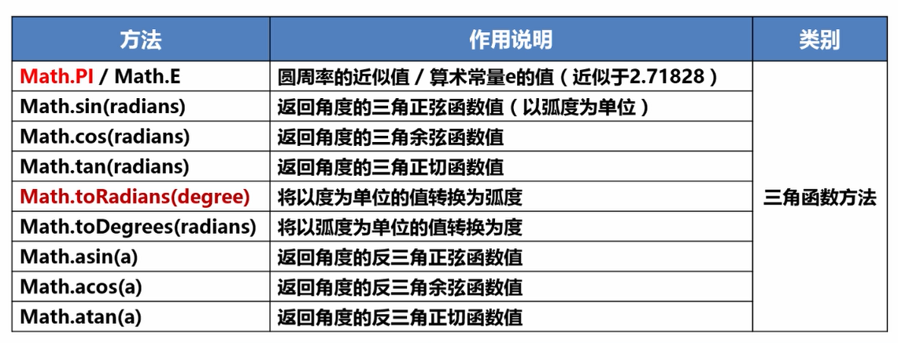
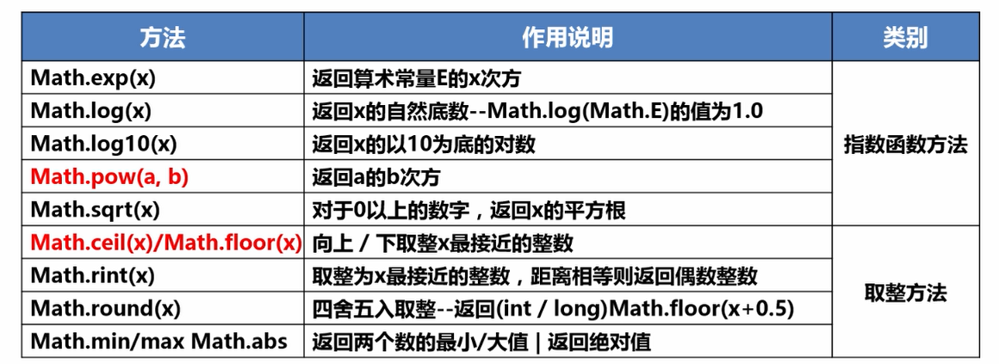

## 一、方法是什么
在我看来，**方法**可以看作是和C语言或C++中的**函数**一样的东西，就是一段可以被**重复调用**的**方法块**。**Java**中的**方法**可分为**内置方法**和**自定义方法**。下面将开始逐一进行介绍。
## 二、内置方法
* **由JDK类库提供**
* **需要导入相应的包**
 
我们在刚开始用Java编写程序时，用到最多的便是Math类

Math类提供了很多实用的方法，用来计算常用的数学函数



Java中还用很多类似的方法，在调用之前一定要记得导入相应的包，不然程序会报错。


用`import`导入相应的包即可。

## 三、自定义方法
**限制条件**：自定义方法必须在主类中定义，并且由主方法直接调用的方法形式。自定义方法通常通过以下方式进行定义。
```
public static 返回类型 方法名称([参数类型 变量, ......]) {
	方法体代码;
	[return [返回值];]
}
```
* 修饰符：方法的修饰符比较多，有对访问权限进行限定的，有静态修饰符static，还有最终修饰符final等，这些修饰符在后面的学习过程中会逐步介绍
* 返回值类型：用于限定方法返回值的数据类型
* 参数类型：用于限定调用方法时传入参数的数据类型
* 参数名：是一个变量，用于接收调用方法时传入的数据
* return关键字：用于结束方法以及返回方法指定类型的值
* 返回值：被return语句返回的值，该值会返回给调用者

*看到很多文章都是将自定义方法分为四种：**无参无返回值**、**无参有返回值**、**有参无返回值**和****有参有返回值****，其实通过上面的通式很容易就能理解以上四个概念，我来主要说一下有参方法的一些细节*

### 1、按值传递的机制
* **按值传递（pass-by-value）**
*   为方法传递参数时，参数不会直接传递给方法，而是先制做参数值的**副本**，存储在**栈**上，再使这个副本可用于方法，而不是使用初始值。


### 2、不定长度的参数
*   **使用场景：**
*   调用方法时，方法的参数个数**无法确定**

通过下面的求平均成绩的代码感受一下，怎样传递不定长度的参数。
```
public class blogTest1 {
	public static void main(String[] args) {
		double[] score = {99, 85, 82, 63, 60};
		printAvg(score);
	}
	public static void printAvg(double ...score) {
		double sum = 0;
		for (int i = 0; i < score.length; i++) {
			sum += score[i];
		}
		System.out.println("平均分：" + sum / score.length) ;
	}
}
```
### 3、方法重载
* **重载**
* 方法**名称**相同，**参数列表**不同
* 编译器根据**方法签名**决定**调用**哪个方法

假设现在要对三组不同数据类型且每组数据包含两个常量（或字符串）进行选出较大的一个的操作，为了方便起见，定义三个方法且方法名都叫Max，这时就用到了**重载**，代码如下：
```
public class blogTest1 {
	public static void main(String[] args) {
		System.out.println(max(15, 51));
		System.out.println(max(1.5, 5.1));
		System.out.println(max("Hello", "hello"));	
	}
	public static int max(int num1,int num2) {
		return num1 > num2 ? num1 : num2;
	}
	public static double max(double num1,double num2) {
		return num1 > num2 ? num1 : num2;
	}
	public static String max(String str1,String str2) {
		if (str1.compareTo(str2) > 0) {
			return str1;
		}else {
			return str2;
		}
	}
}

/* 
运行结果：
51
5.1
hello
*/
```
***注意：***

1、有时调用方法会有**两个或更多**可能的匹配，编译器无法判断哪个更为精确，这称为**歧义调用**（ambiguous invocation）

2、被重载的方法**必须**具有**不同的参数列表**，**不能**基于不同修饰符返回值类型来重载方法


#### 以上这些都是在自定义方法时需要注意的一些细节，最后分享两个自定义方法的例子，能够较快提升对自定义方法的理解。
```
import java.util.Scanner;
/**
 * 十六进制和十进制之间的转换
 */
public class HexToDecimalDemo {

	public static void main(String[] args) {
		Scanner input = new Scanner(System.in);
		System.out.print("请输入一个整形数字：");
		int decNum=input.nextInt();
		System.out.println(DecToHex(decNum));
		System.out.println(HexToHDec(DecToHex(decNum)));
	}
	/**
	 * 调用方法将十进制转换为十六进制
	 * @param decNum 要转换的十进制数字
	 * @return 转换成十六进制的数字（以字符串的方式返回）
	 */
	public static String DecToHex(int decNum) {
		String hex ="";
		while (decNum!=0) {
			int temp = decNum%16;
			if (temp>=0&&temp<=9) {
				hex = temp+hex;
			}else if(temp>=10&&temp<=15) {
				hex=(char)(temp-10+'A')+hex;
			}
			decNum/=16;
		}
		return hex;
	}
	/**
	 * 十六进制转换为十进制
	 * @param hex 要转换的十六进制字符串
	 * @return	转换成功的十六进制数
	 */
	public static int  HexToHDec(String hex){
		int decNum=0;
		for (int i = 0; i < hex.length(); i++) {
			char tempChar=hex.charAt(i);
			if (tempChar>='0'&&tempChar<='9') {
				decNum+=(tempChar-'0')*Math.pow(16, hex.length()-i-1); 
			}else if (tempChar>='A'&&tempChar<='F') {
				decNum+=(tempChar-'A'+10)*Math.pow(16, hex.length()-i-1); 
			}
		}
		return decNum;
	}	
}

```


```
import java.util.Scanner;
public class Method {

	public static void main(String[] args) {
		System.out.print("请输入今天是星期几：");
		int dayOfWeek = new Scanner(System.in).nextInt();
		ShowWeekDayByChinese(dayOfWeek-1);
		ShowWeekDayByJapanese(dayOfWeek-1);
		ShowWeekDayByEnglish(dayOfWeek-1);	
	}
	private static boolean isRight(int dayOfWeek) {
		if (dayOfWeek<0||dayOfWeek>6) {
			return false;
		}
		return true;
	}
	/**
	 * 以中文的方式打印星期几
	 * @param dayOfWeek 1-7之间的整形数字，用来表示星期几
	 */
	public static void ShowWeekDayByChinese(int dayOfWeek) {
		String[] weekday = {"星期一","星期二","星期三" ,"星期四","星期五","星期六","星期日"};
		if (isRight(dayOfWeek)) {
			System.out.println(weekday[dayOfWeek]);
			return;
		}
		System.out.println("输入有误！请输入1-7之间的数字");
	}
	/**以日文的方式打印星期几
	 * 
	 * @param dayOfWeek
	 */
	public static void ShowWeekDayByJapanese(int dayOfWeek) {
		String[] weekday = {"月曜日","火曜日","水曜日" ,"木曜日","金曜日","土曜日","日曜日"};
		if (isRight(dayOfWeek)) {
			System.out.println(weekday[dayOfWeek]);
			return;
		}
		System.out.println("输入有误！请输入1-7之间的数字");
	}
	/**以英文的方式打印
	*
	*/
	public static void ShowWeekDayByEnglish(int dayOfWeek) {
		String[] weekday = {"Monday","Tuesday","Wednesday" ,"Thursday","Friday","Saturday","Sunday"};
		if (isRight(dayOfWeek)) {
			System.out.println(weekday[dayOfWeek]);
			return;
		}
		System.out.println("输入有误！请输入1-7之间的数字");
	}
}
```