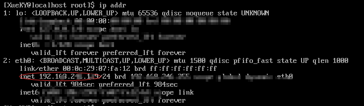
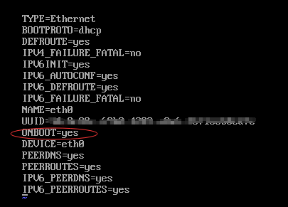
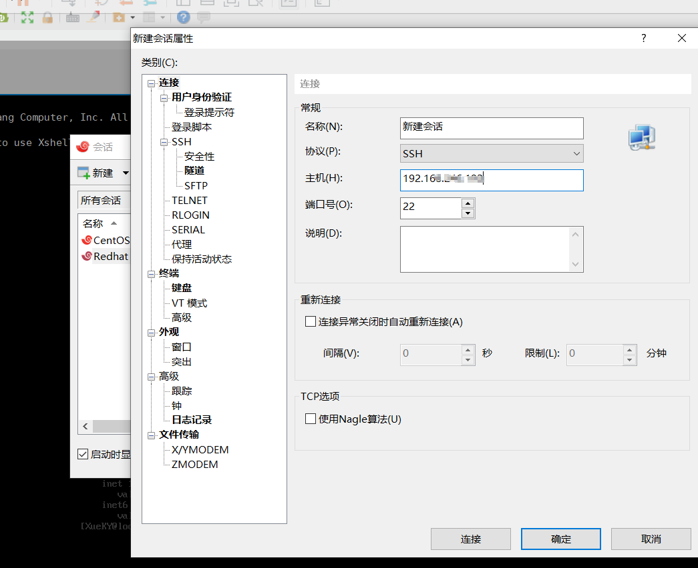
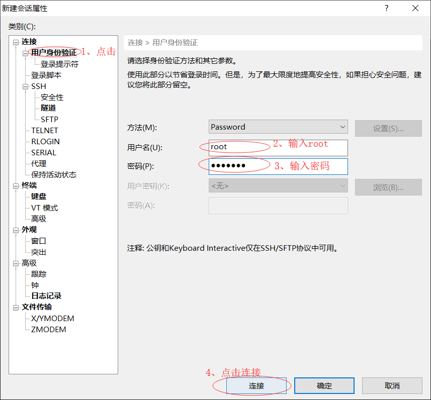
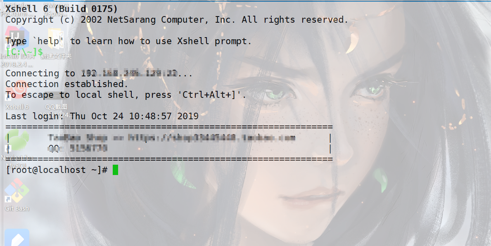

## 一、Linux操作系统简介
**Linux是一套免费使用和自由传播的类Unix操作系统，是一个基于POSIX和Unix的多用户、多任务、支持多线程和多CPU的操作系统。**
### 1、优点：
* 系统性能稳定，而且是开源软件。其核心防火墙组件性能高效、配置简单，保证了系统的安全。
* Linux与其他操作系统相比，具有开放源码、没有版权、技术社区用户多等特点，开放源码使得用户可以自由裁剪，灵活性，功能强大，成本低。尤其系统中内嵌网络协议栈，经过适当的配置就可实现路由器的功能。这些特点使得Linux成为开发路由交换设备的理想开发平台。

### 2、主流发行版本
* Ubuntu
* Debian
* CentOS（强烈推荐）
* Fedora
* Red Hat

### 3、为什么使用XShell呢？
XShell就是舒服，不然你也不会点开我的blog

***由于本文是在参加了红帽的集训之后所写的，所以主要以Redhat为主展开介绍***
## 二、准备工作
* **VMWare**（推荐一个公众号“软件安装管家”，在里面进行下载即可）
* **配置好的虚拟机/镜像文件**（如果需要Redhat配置好的虚拟机，在下方评论，我会联系；镜像文件的话，推荐去CentOS的官方网站进行下载）
* **XShell**（官网下载即可，安装过程基本全程next，无难度）

## 三、配置网络以连接XShell
* 1、在VMWare中启动已经安装好的虚拟机
* 2、输入命令`ip addr`或者`ifconfig`（有些新版本的Linux已经不支持ifconfig命令）
* 3、查看你的（以e开头的那个）网卡配置是否显示的是IP地址（ *** .***. ***. *** ）（如果已经显示如下图所示的类似，可选择跳过7）

* 4、输入命令`vim /etc/sysconfig/network-scripts/ifcfg-eth0`(eth0是我的网卡连接名，大多数情况下是eth0，如果没有，在输入到e时按下Tab键进行自动补全即可)
* 5、通过`su`命令，切换到管理员权限（会提示输密码，Linux的密码是隐藏的不会显示，直接输入即可）
* 6、按`i键`进入vim编辑模式，并移动到**ONBOOT=no**那一行（一般是no，如果是yes可以跳过此步），将`no`改为`yes`，改好后如下图，然后按`ESC键`进入普通模式，再输入`:wq`命令写入并退出

* 7、输入`service network restart`命令重启网络
* 8、输入`ip addr`命令，在刚才的地方查看IP
* 9、复制IP地址，用`CTRL键`+`Insert键`复制，也可以记住
* 10、按`CTRL键`+`ALT键`将鼠标移出虚拟机
* 11、打开XShell，点击新建，然后在主机一栏输入IP地址
 
* 12、按图操作
 
* 13、连接成功 