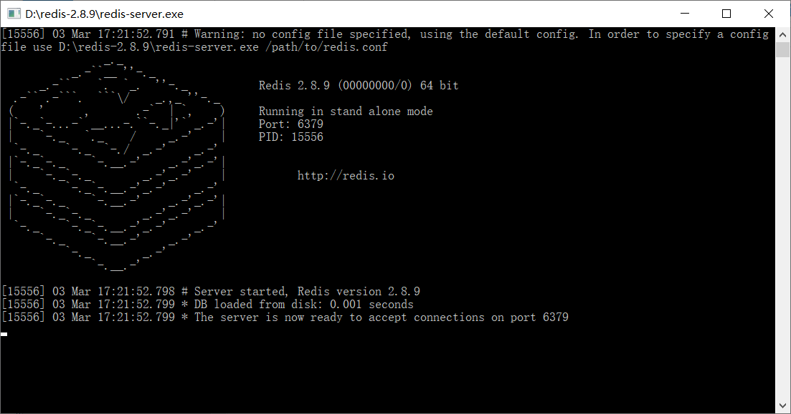
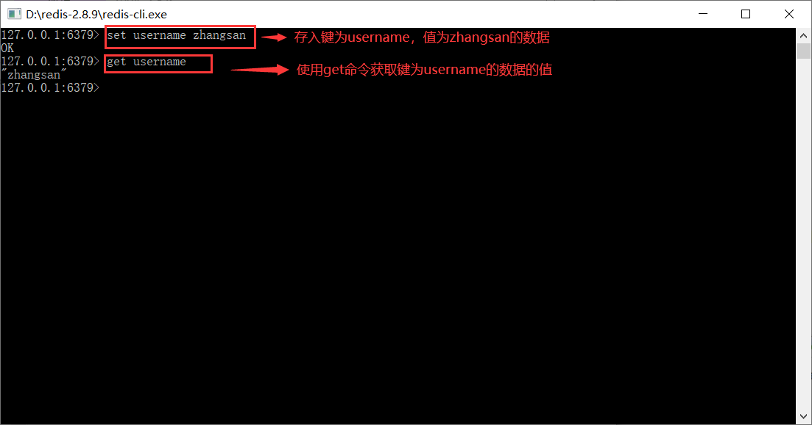
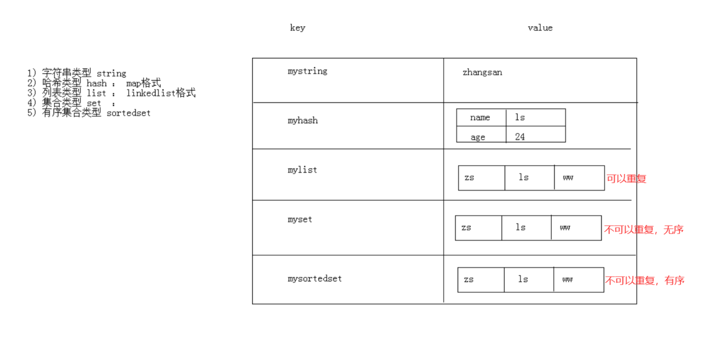
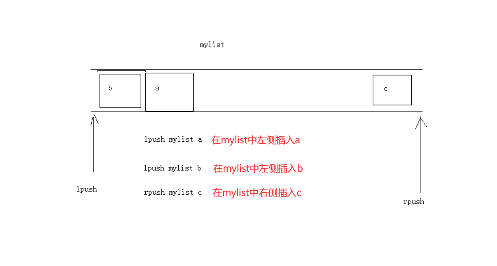

# Redis
## 1、概念
**Redis是一款高性能的NOSQL系列的非关系型数据库**
### 1.1、什么是NOSQL
**NoSQL(NoSQL = Not Only SQL)**，意即“**不仅仅是SQL**”，**是一项全新的数据库理念，泛指非关系型的数据库**。
随着互联网web2.0网站的兴起，传统的关系数据库在应付web2.0网站，特别是超大规模和高并发的SNS类型的web2.0纯动态网站已经显得力不从心，暴露了很多难以克服的问题，而非关系型的数据库则由于其本身的特点得到了非常迅速的发展。**NoSQL数据库的产生就是为了解决大规模数据集合多重数据种类带来的挑战，尤其是大数据应用难题。**

#### 1.1.1、NOSQL和关系型数据库比较

* **优点**：
	* **成本**：nosql数据库简单易部署，基本都是开源软件，不需要像使用oracle那样花费大量成本购买使用，相比关系型数据库价格便宜。
	* **查询速度**：nosql数据库将数据存储于缓存之中，关系型数据库将数据存储在硬盘中，自然查询速度远不及nosql数据库。
	* **存储数据的格式**：nosql的存储格式是key,value形式、文档形式、图片形式等等，所以可以存储基础类型以及对象或者是集合等各种格式，而数据库则只支持基础类型。
	* **扩展性**：关系型数据库有类似join这样的多表查询机制的限制导致扩展很艰难。

* **缺点**：
    * 维护的工具和资料有限，因为nosql是属于新的技术，不能和关系型数据库10几年的技术同日而语。
    * **不提供对sql的支持**，如果不支持sql这样的工业标准，将产生一定用户的学习和使用成本。
    * **不提供关系型数据库对事务的处理**。

#### 1.1.2、非关系型数据库的优势
* **性能NOSQL是基于键值对的**，可以想象成表中的主键和值的对应关系，而且不需要经过SQL层的解析，所以性能非常高。
* **可扩展性同样也是因为基于键值对，数据之间没有耦合性，所以非常容易水平扩展**。

#### 1.1.3、总的来说
* **关系型数据库与NoSQL数据库并非对立而是互补的关系**，即通常情况下使用关系型数据库，在适合使用NoSQL的时候使用NoSQL数据库
* **让NoSQL数据库对关系型数据库的不足进行弥补**。
* 一般会将数据存储在关系型数据库中，**在nosql数据库中备份存储关系型数据库的数据**


### 1.2、主流的NOSQL产品
#### 键值(Key-Value)存储数据库
* 相关产品： Tokyo Cabinet/Tyrant、**Redis**、Voldemort、Berkeley DB
* 典型应用： **内容缓存**，主要用于处理大量数据的高访问负载。 
* 数据模型： **一系列键值对**
* 优势： **快速查询**
* 劣势： **存储的数据缺少结构化**

#### 列存储数据库
* 相关产品：Cassandra, **HBase**, Riak
* 典型应用：**分布式的文件系统**
* 数据模型：以列簇式存储，将同一列数据存在一起
* 优势：**查找速度快，可扩展性强，更容易进行分布式扩展**
* 劣势：**功能相对局限**

#### 文档型数据库
* 相关产品：CouchDB、**MongoDB**
* 典型应用：Web应用（与Key-Value类似，Value是结构化的）
* 数据模型： 一系列键值对
* 优势：数据结构要求不严格
* 劣势： 查询性能不高，而且缺乏统一的查询语法

#### 图形(Graph)数据库
* 相关数据库：Neo4J、InfoGrid、**Infinite Graph**
* 典型应用：社交网络
* 数据模型：图结构
* 优势：利用图结构相关算法。
* 劣势：需要对整个图做计算才能得出结果，不容易做分布式的集群方案。

### 1.3 什么是Redis
**Redis是用C语言开发的一个开源的高性能键值对（key-value）数据库**，官方提供测试数据，**50个并发执行100000个请求,读的速度是110000次/s,写的速度是81000次/s** ，**且Redis通过提供多种键值数据类型来适应不同场景下的存储需求**，目前为止**Redis支持的键值数据类型**如下：
* **字符串类型 string**
* **哈希类型 hash**
* **列表类型 list**
* **集合类型 set**
* **有序集合类型 sortedset**

#### Redis的应用场景
* **缓存（数据查询、短连接、新闻内容、商品内容等等）**
* **聊天室的在线好友列表**
* **任务队列。（秒杀、抢购、12306等等）**
* **应用排行榜**
* **网站访问统计**
* **数据过期处理（可以精确到毫秒）**
* **分布式集群架构中的session分离**

## 2、下载安装
* 官网：[https://redis.io](https://redis.io)（国内不好用）
* **中文网**：[http://www.redis.net.cn/](http://www.redis.net.cn/)（建议访问中文网）
* **解压直接可以使用**：
	* **redis.windows.conf：配置文件**
	* **redis-cli.exe：redis的客户端**
	* **redis-server.exe：redis服务器端**
* **双击打开redis-server.exe**，Redis就启动成功了

* **不要关闭redis-server.exe的界面，然后双击打开redis-cli.exe**，就可以开始操作Redis了


## 3、命令操作
### （1）Redis的数据结构

* **Redis存储**的是：**key,value格式的数据**，其中**key都是字符串**，value有5种不同的数据结构
	* **value的数据结构**：
		* **字符串类型string**
		* **哈希类型 hash**：map格式  
		* **列表类型 list**： linkedlist格式。支持重复元素
		* **集合类型 set**： 不允许重复元素
		* **有序集合类型 sortedset**：不允许重复元素，且元素有顺序

### （2）字符串类型 string
* **存储**： `set key value`
```	
127.0.0.1:6379> set username zhangsan
OK
```
* **获取**： `get key`
```
127.0.0.1:6379> get username
"zhangsan"
```
* **删除**： `del key`
```
127.0.0.1:6379> del age
(integer) 1
```

### （3）哈希类型 hash
* **存储**： `hset key field value`
```
127.0.0.1:6379> hset myhash username lisi
(integer) 1
127.0.0.1:6379> hset myhash password 123
(integer) 1
```
* **获取**： 
	* `hget key field`: **获取指定的field对应的值**
    ```	
    127.0.0.1:6379> hget myhash username
	"lisi"
	```
	* `hgetall key`：**获取所有的field和value**
    ```	
    127.0.0.1:6379> hgetall myhash
	1) "username"
	2) "lisi"
	3) "password"
	4) "123"
	```	
* **删除**： `hdel key field`
```	
127.0.0.1:6379> hdel myhash username
(integer) 1
```

### （4）列表类型 list
**可以添加一个元素到列表的头部（左边）或者尾部（右边）**

* **添加**：
	* `lpush key value`: **将元素加入列表左表**
		
	* `rpush key value`：**将元素加入列表右边**
	```	
		127.0.0.1:6379> lpush myList a
		(integer) 1
		127.0.0.1:6379> lpush myList b
		(integer) 2
		127.0.0.1:6379> rpush myList c
		(integer) 3
    ```
* **获取**：
	* `lrange key start end`：**范围获取**
	```
	127.0.0.1:6379> lrange myList 0 -1
	1) "b"
	2) "a"
	3) "c"
	```
* **删除**：
	* `lpop key`： 删除列表**最左边**的元素，并将元素返回
	* `rpop key`： 删除列表**最右边**的元素，并将元素返回

### （5）集合类型 set 
**不允许重复元素**
* **存储**：`sadd key value`
```
127.0.0.1:6379> sadd myset a
(integer) 1
127.0.0.1:6379> sadd myset a
(integer) 0
```
* **获取**：`smembers key`:**获取set集合中所有元素**
```
127.0.0.1:6379> smembers myset
1) "a"
```
* **删除**：`srem key value`:**删除set集合中的某个元素**
```
127.0.0.1:6379> srem myset a
(integer) 1
```

### （6）有序集合类型 sortedset
**不允许重复元素，且元素有顺序**,每个元素都会**关联一个double类型的分数**。redis正是**通过分数**来为集合中的成员进行**从小到大的排序**。
* **存储**：`zadd key score value`
```	
127.0.0.1:6379> zadd mysort 60 zhangsan
(integer) 1
127.0.0.1:6379> zadd mysort 50 lisi
(integer) 1
127.0.0.1:6379> zadd mysort 80 wangwu
(integer) 1
```
* **获取**：`zrange key start end [withscores]`
```
127.0.0.1:6379> zrange mysort 0 -1
1) "lisi"
2) "zhangsan"
3) "wangwu"
127.0.0.1:6379> zrange mysort 0 -1 withscores
1) "zhangsan"
2) "60"
3) "wangwu"
4) "80"
5) "lisi"
6) "500"
```
* **删除**：`zrem key value`
```
127.0.0.1:6379> zrem mysort lisi
(integer) 1
```

### （7）通用命令
* `keys * `: **查询所有的键**
* `type key` ： **获取键对应的value的类型**
* `del key`：**删除指定的key value**

## 4、持久化
* **Redis是一个内存数据库**，**当Redis服务器重启，或者电脑重启，数据会丢失**，我们可以将Redis内存中的数据**持久化保存到硬盘的文件中**。

### Redis持久化机制
#### （1）RDB（推荐使用）
**默认方式**，不需要进行配置，默认就使用这种机制
* **在一定的间隔时间中，检测key的变化情况，然后持久化数据**
* **先编辑redis.windwos.conf文件**
```
#   after 900 sec (15 min) if at least 1 key changed
save 900 1
#   after 300 sec (5 min) if at least 10 keys changed
save 300 10
#   after 60 sec if at least 10000 keys changed
save 60 10000
```

* **再重新启动redis服务器，并指定配置文件名称**
找到Redis的安装路径，按住shift右键打开cmd，在cmd中输入`redis-server.exe redis.windows.conf`
如图：

	
#### （2）AOF（不建议使用，太耗资源）
**日志记录的方式，可以记录每一条命令的操作。可以每一次命令操作后，持久化数据**<br>
* **先编辑redis.windwos.conf文件**<br>
将appendonly no（关闭aof） --> appendonly yes （开启aof）

```	
# appendfsync always ： 每一次操作都进行持久化
appendfsync everysec ： 每隔一秒进行一次持久化
# appendfsync no	 ： 不进行持久化
```
* **再重新启动redis服务器，并指定配置文件名称**
找到Redis的安装路径，按住shift右键打开cmd，在cmd中输入`redis-server.exe redis.windows.conf`
如图：


## 5、Java操作Redis数据库Jedis
请点击访问[Java操作Redis数据库（小白一看秒会，简单易上手）](https://blog.csdn.net/qq_34504626/article/details/104638164)