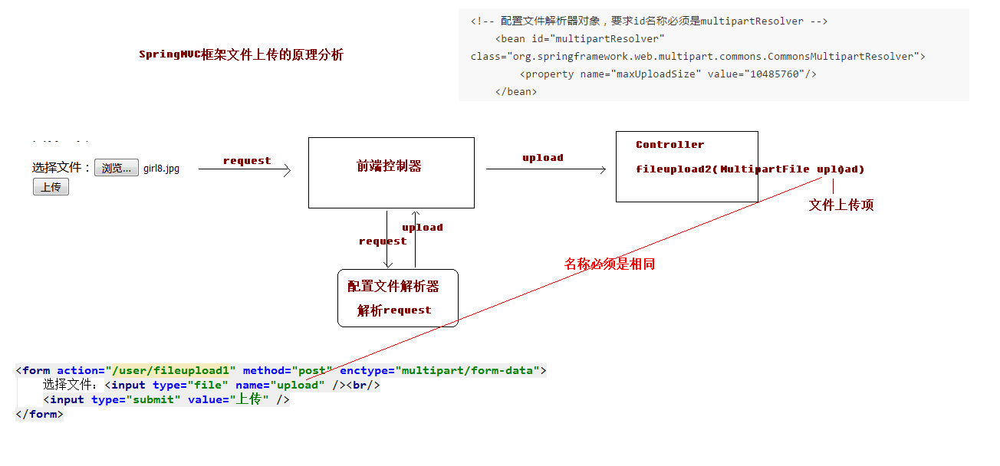
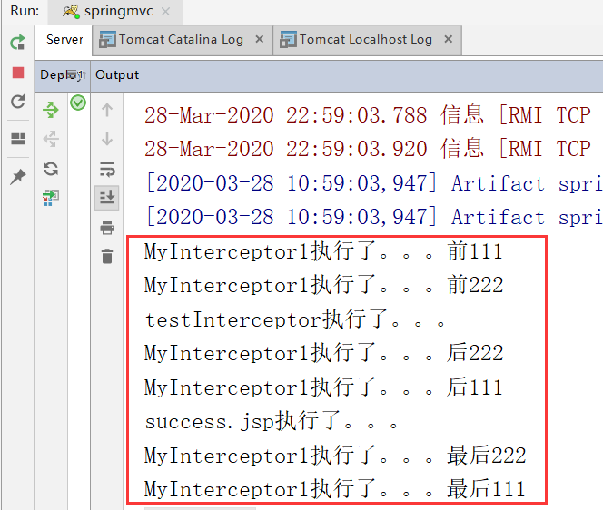

## 前言
*个人建议，如果对SpringMVC框架没有接触过的先看之前的文章，点击前往[SpringMVC框架之初次见面请多多关照](https://blog.csdn.net/qq_34504626/article/details/105105846)*

**本文主要是在之前的基础上再学习一些常用的配置，主要是通过使用和配置SpringMVC框架来更加方便快捷地完成以下内容**：
* **响应数据和结果视图**
* **文件上传**
* **异常处理**
* **拦截器**

## 一、响应数据和结果视图
### 1、返回值分类
#### （1）返回字符串
* **Controller中的方法返回字符串可以指定逻辑视图的名称，根据视图解析器为物理视图的地址**
```
@RequestMapping(value="/hello")
public String sayHello() {
    System.out.println("Hello SpringMVC!!");
    // 跳转到成功页面
    return "success";
}
```
* **具体的应用场景**
```
//控制器代码
@Controller
@RequestMapping("/user")
public class UserController {
    /**
     * 返回值类型是字符串
     * @param model
     * @return
     */
    @RequestMapping("/testString")
    public String testString(Model model){
        System.out.println("testString方法执行了。。。");
        //模拟从数据库中查询出User对象
        user.setUsername("美美");
        user.setPassword("123");
        user.setAge(30);
        //model对象
        model.addAttribute("user",user);
        return "success";
    }
}
```

#### （2）返回值是void
* **如果控制器的方法返回值编写成void，执行程序报404的异常，默认查找JSP页面没有找到**
    * *默认会跳转到`@RequestMapping(value="/testVoid")`注解中的 **user/testVoid** 页面*
* **可以使用请求转发或者重定向跳转到指定的页面**，代码如下：
```
//控制器代码
@Controller
@RequestMapping("/user")
public class UserController {
    /**
     * 返回值类型是void
     * 请求转发一次请求，不用编写项目的名称
     */
    @RequestMapping("/testVoid")
    public void testVoid(HttpServletRequest request, HttpServletResponse response) throws ServletException, IOException {
        System.out.println("testVoid方法执行了。。。");
        //编写请求转发的程序
        //request.getRequestDispatcher("/WEB-INF/pages/success.jsp").forward(request,response);
    
        //重定向
        //response.sendRedirect(request.getContextPath()+"/index.jsp");
    
        //设置中文乱码
        response.setCharacterEncoding("utf-8");
        response.setContentType("text/html;charset=utf-8");
    
        //直接会进行响应
        response.getWriter().print("你好");
    
        return;
    }
}
```


#### （3）返回值是ModelAndView对象
* **ModelAndView对象是Spring提供的一个对象，可以用来调整具体的JSP视图**
* **具体的代码如下**
```
//控制器代码
@Controller
@RequestMapping("/user")
public class UserController {
    /**
     * 返回ModelAndView对象
     * @return
     */
    @RequestMapping("/testModelAndView")
    public ModelAndView testModelAndView(){
        //创建ModelAndView对象
        ModelAndView mv = new ModelAndView();
        System.out.println("testModelAndView方法执行了。。。");
        //模拟从数据库中查询出User对象
        user.setUsername("小风");
        user.setPassword("456");
        user.setAge(30);

        //把user对象存储到mv对象中，也会把user对象存到request对象
        mv.addObject("user",user);

        //跳转到页面
        mv.setViewName("success");

        return mv;
    }
}
```
可以在跳转的jsp页面中，**使用EL表达式进行展示**
```
<!--success.jsp-->
<%@ page contentType="text/html;charset=UTF-8" language="java" isELIgnored="false" %>
<html>
<head>
    <title>Title</title>
</head>
<body>

    <h3>执行成功</h3>

    ${user.username}
    ${user.password}

</body>
</html>
```
### 2、SpringMVC框架提供的转发和重定向
#### （1）forward请求转发
* **controller方法在提供了String类型的返回值之后，默认就是请求转发**。也可以写成下面这种形式：
```
/**
* 转发
* @return
*/
@RequestMapping("/testForward")
public String testForward() {
    System.out.println("AccountController 的 testForward 方法执行了。。。。");
    return "forward:/WEB-INF/pages/success.jsp";
}
```
* **需要注意的是**，如果**用了`formward：`则路径必须写成实际视图url**，不能写逻辑视图。它相当于`request.getRequestDispatcher("url").forward(request,response)`使用请求转发，**既可以转发到jsp，也可以转发到其他的控制器方法**

#### （2）redirect重定向
* **contrller方法提供了一个String类型返回值之后，它需要在返回值里使用`redirect:`**，示例如下：
```
/**
* 重定向
* @return
*/
@RequestMapping("/testRedirect")
public String testRedirect() {
    System.out.println("AccountController 的 testRedirect 方法执行了。。。。");
    return "redirect:testReturnModelAndView";
}
```
**它相当于`response.sendRedirect(url)`，需要注意的是，如果是重定向到jsp页面，则jsp页面不能写在WEB-INF目录中，否则无法找到**

### 3、ResponseBody响应json数据
*在使用`@ResponseBody`注解完成响应json数据之前，需要先 **将JQuery的包添加到webapp目录下的js文件夹下**并 **进行一些配置**，否则使用JQuery进行ajax异步请求时无法进行*：
* **DispatcherServlet会拦截到所有的资源，导致一个问题就是静态资源（img、css、js）也会被拦截到，从而
不能被使用**。解决问题就是**需要配置静态资源不进行拦截，在springmvc.xml配置文件添加如下配置：**
```
<!-- 设置静态资源不过滤 -->
<mvc:resources location="/css/" mapping="/css/**"/> <!-- 样式 -->
<mvc:resources location="/images/" mapping="/images/**"/> <!-- 图片 -->
<mvc:resources location="/js/" mapping="/js/**"/> <!-- javascript -->
```
* `mvc:resources`**标签配置不过滤**
    * **location元素表示webapp目录下的包下的所有文件**
    * **mapping元素表示以/static开头的所有请求路径**，如/static/a 或者/static/a/b

#### （1）在pom文件中导入jar包坐标
**json字符串和JavaBean对象互相转换的过程中，需要使用jackson的jar包**
```
<dependency>
    <groupId>com.fasterxml.jackson.core</groupId>
    <artifactId>jackson-databind</artifactId>
    <version>2.9.0</version>
</dependency>
<dependency>
    <groupId>com.fasterxml.jackson.core</groupId>
    <artifactId>jackson-core</artifactId>
    <version>2.9.0</version>
</dependency>
<dependency>
    <groupId>com.fasterxml.jackson.core</groupId>
    <artifactId>jackson-annotations</artifactId>
    <version>2.9.0</version>
</dependency>
```
#### （2）使用`@RequestBody`获取请求体数据
* **Controller控制器中添加以下代码：**
```
/**
 * 模拟异步请求响应
 * @return
 */
@RequestMapping("/testAjax")
public @ResponseBody User testAjax(@RequestBody User user){
    System.out.println("testAjax方法执行了。。。");
    System.out.println(user);
    //做出响应，模拟查询数据库
    user.setUsername("haha");
    user.setAge(40);
    //做出响应
    return user;
}
```
* **在请求页面jsp中添加如下代码**：
```
<!-- javascript -->
<!--导入JQuery-->
<script src="js/jquery.min.js"></script>

<script>
    //页面加载，绑定单击事件
    $(function () {
        $("#btn").click(function () {
           //alert("hello");
            //发送ajax请求
            $.ajax({
                //编写json格式，设置属性和值
                url:"user/testAjax",
                contentType:"application/json;charset=utf-8",
                data:'{"username":"hehe","password":"123","age":30}',
                dataType:"json",
                type:"post",
                success:function (data) {
                    //data服务器端响应的json数据，进行解析
                    alert(data);
                    alert(data.username);
                    alert(data.password);
                    alert(data.age);
                }
            });
        });
    });
</script>

<!-- 测试异步请求 -->
<button id="btn">发送ajax的请求</button>
```
 
## 二、SpringMVC实现文件上传
#### 文件上传的必要前提
* **form表单的enctype取值必须是：`multipart/form-data`**
    * (默认值是:`application/x-www-form-urlencoded`)
    * **enctype:是表单请求正文的类型**
* **method属性取值必须是Post**
* **提供一个文件选择域`<input type=”file” />`**

#### 文件上传的原理分析
* **当form表单的enctype取值不是默认值后，`request.getParameter()`将失效**
* **`enctype="application/x-www-form-urlencoded"`时，form 表单的正文内容是**：
    * `key=value&key=value&key=value`
* **当form表单的enctype取值为`Mutilpart/form-data`时，请求正文内容就变成：**
```
//每一部分都是MIME类型描述的正文
-----------------------------7de1a433602ac //分界符
Content-Disposition: form-data; name="userName" //协议头
aaa //协议的正文
-----------------------------7de1a433602ac
Content-Disposition: form-data; name="file";
filename="C:\Users\zhy\Desktop\fileupload_demofile\b.txt"
Content-Type: text/plain //协议的类型（MIME 类型）
bbbbbbbbbbbbbbbbbbbbbbbbbbbbbbbb
-----------------------------7de1a433602ac--
```

#### 借助第三方组件实现文件上传
**使用Commons-fileupload组件实现文件上传，需要导入该组件相应的支撑jar包：Commons-fileupload和commons-io。** *commons-io不属于文件上传组件的开发jar文件，但Commons-fileupload组件从1.1版本开始，它工作时需要commons-io包的支持*

### 1、传统文件上传的回顾
#### （1）导入文件上传的jar包
```
<dependency>
    <groupId>commons-fileupload</groupId>
    <artifactId>commons-fileupload</artifactId>
    <version>1.3.1</version>
</dependency>
<dependency>
    <groupId>commons-io</groupId>
    <artifactId>commons-io</artifactId>
    <version>2.4</version>
</dependency>
```
#### （2）编写文件上传的JSP页面
```
<%@ page contentType="text/html;charset=UTF-8" language="java" %>
<html>
<head>
    <title>Title</title>
</head>
<body>

    <h3>传统文件上传</h3>

    <form action="user/fileupload1" method="post" enctype="multipart/form-data">
        选择文件：<input type="file" name="upload"><br>
        <input type="submit" value="上传">
    </form>
</body>
</html>
```
#### （3）编写文件上传的Controller控制器
```
/**
 * 文件上传
 * @return
 */
@RequestMapping("/fileupload1")
public String fileupload1(HttpServletRequest request) throws Exception {
    System.out.println("文件上传。。。");

    //使用fileupload组件完成文件上传
    //上传的位置
    String realPath = request.getSession().getServletContext().getRealPath("/uploads/");
    //判断，该路径是否存在
    File file = new File(realPath);
    if(!file.exists()){
        //创建该文件夹
        file.mkdirs();
    }

    //解析request对象，获取上传文件项
    DiskFileItemFactory factory = new DiskFileItemFactory();
    ServletFileUpload upload = new ServletFileUpload(factory);
    //解析request
    List<FileItem> items = upload.parseRequest(request);
    //遍历
    for (FileItem item : items) {
        //进行判断，当前item对象是否是上传文件项
        if(item.isFormField()){
            //说明是普通表单项
        }else {
            //说明是上传项
            //获取上传文件的名称
            String filename = item.getName();
            //把文件的名称设置成唯一值，uuid
            String uuid = UUID.randomUUID().toString().replace("-", "");
            filename = uuid+"_"+filename;
            //完成文件上传
            item.write(new File(realPath,filename));
            //删除临时文件
            item.delete();
        }
        System.out.println(item);
    }

    return "success";
}
```

### 2、SpringMVC传统方式文件上传
**SpringMVC框架提供了MultipartFile对象，该对象表示上传的文件，要求变量名称必须和表单file标签的name属性名称相同**
* **SpringMVC框架文件上传原理分析**

* **传统方式的文件上传，指的是我们上传的文件和访问的应用存在于同一台服务器上**，并且上传完成之后，浏览器可能跳转
* **控制器实现代码如下**：
```
    /**
     * SpringMVC文件上传
     * @return
     */
    @RequestMapping("/fileupload2")
    public String fileupload2(HttpServletRequest request, MultipartFile upload) throws Exception {
        System.out.println("springmvc文件上传。。。");

        //使用fileupload组件完成文件上传
        //上传的位置
        String realPath = request.getSession().getServletContext().getRealPath("/uploads/");
        //判断，该路径是否存在
        File file = new File(realPath);
        if(!file.exists()){
            //创建该文件夹
            file.mkdirs();
        }

        //说明是上传项
        //获取上传文件的名称
        String filename = upload.getOriginalFilename();
        //把文件的名称设置成唯一值，uuid
        String uuid = UUID.randomUUID().toString().replace("-", "");
        filename = uuid+"_"+filename;
        //完成文件上传
        upload.transferTo(new File(realPath,filename));

        return "success";
    }
```
* **在springmvc.xml配置文件中配置解析器对象**
```
<!--配置文件解析器对象-->
<bean id="multipartResolver" class="org.springframework.web.multipart.commons.CommonsMultipartResolver">
    <!--文件上传大小最大值10*1024*1024=10M-->
    <property name="maxUploadSize" value="10485760"></property>
</bean>
```
==**注意：文件上传的解析器id是固定的，不能起别的名称，否则无法实现请求参数的绑定。（不光是文件，其他字段也将无法绑定）**==

### 3、SpringMVC跨服务器方式文件上传
##### 分服务器的目的
**在实际开发中，我们会有很多处理不同功能的服务器**。例如：
* **应用服务器**：负责部署我们的应用
* **数据库服务器**：运行我们的数据库
* **缓存和消息服务器**：负责处理大并发访问的缓存和消息
* **文件服务器**：负责存储用户上传文件的服务器。

**(注意：此处说的不是服务器集群）**


#### （1）搭建图片服务器
##### 第一步：修改tomcat配置
* **在tomcat安装目录下找到/conf/web.xml配置文件并打开**

* **找到`servlet`标签并添加如下配置：**
```
<init-param>
	<param-name>readonly</param-name>
	<param-value>false</param-value>
</init-param>
```


##### 第二步：创建maven项目并启动Tomcat进行测试
*选择maven中的webapp骨架并创建，不需要配置任何东西*，然后**在idea中将该项目添加到tomcat中并修改tomcat的端口号**，然后**启动Tomcat服务器进行测试**


#### （2）实现SpringMVC跨服务器方式文件上传
##### 第一步：导入开发需要的jar包
在pom配置文件中添加以下依赖坐标
```
<dependency>
  <groupId>com.sun.jersey</groupId>
  <artifactId>jersey-core</artifactId>
  <version>1.18.1</version>
</dependency>
<dependency>
  <groupId>com.sun.jersey</groupId>
  <artifactId>jersey-client</artifactId>
  <version>1.18.1</version>
</dependency>
```
##### 第二步：编写文件上传的JSP页面
```
<h3>跨服务器文件上传</h3>

<form action="user/fileupload3" method="post" enctype="multipart/form-data">
    选择文件：<input type="file" name="upload"><br>
    <input type="submit" value="上传">
</form>
```
##### 第三步：编写控制器
```
/**
 * 跨服务器文件上传
 * @return
 */
@RequestMapping("/fileupload3")
public String fileupload3(MultipartFile upload) throws Exception {
    System.out.println("跨服务器文件上传。。。");

    //定义上传文件服务器路径
    String path = "http://localhost:9090/uploads/";

    //说明是上传项
    //获取上传文件的名称
    String filename = upload.getOriginalFilename();
    //把文件的名称设置成唯一值，uuid
    String uuid = UUID.randomUUID().toString().replace("-", "");
    filename = uuid+"_"+filename;
    //完成文件上传，跨服务器上传
    //创建客户端对象
    Client client = Client.create();
    //和图片服务器进行连接
    WebResource webResource = client.resource(path + filename);
    //上传文件
    webResource.put(upload.getBytes());

    return "success";
}
```

##### 第四步：启动两个项目的tomcat服务器进行测试
**点击上传按钮后，你会惊奇地发现500错误**，**原因：在图片服务器中未找到uploads文件夹**，所以这里*需要在图片服务器的那个项目的工作空间下，找到target目录，然后在项目名称目录下创建一个名为uploads的文件夹即可。*


## 三、SpringMVC的异常处理
### 1、异常处理的思路
**系统中异常包括两类：预期异常和运行时异常RuntimeException**，*前者通过捕获异常从而获取异常信息，后者主要通过规范代码开发、测试通过手段减少运行时异常的发生*

**系统的dao、service、controller出现都通过`throws Exception`向上抛出，最后由springmvc前端控制器交由异常处理器进行异常处理，如下图：**


### 2、SpringMVC的异常处理
#### （1）创建自定义异常类
```
package com.allen.exception;

public class SysException extends Exception{

    //存储提示信息的
    private String message;

    @Override
    public String getMessage() {
        return message;
    }

    public void setMessage(String message) {
        this.message = message;
    }

    public SysException(String message) {
        this.message = message;
    }
}
```
#### （2）自定义异常处理器进行页面跳转
**将原本在页面上显示的异常信息不在页面上显示，而显示一些较为友好的页面**
```
package com.allen.exception;

import org.springframework.web.servlet.HandlerExceptionResolver;
import org.springframework.web.servlet.ModelAndView;

import javax.servlet.http.HttpServletRequest;
import javax.servlet.http.HttpServletResponse;

/**
 * 异常处理器
 */
public class SysExceptionResolver implements HandlerExceptionResolver {

    /**
     * 处理异常业务逻辑
     * @param httpServletRequest
     * @param httpServletResponse
     * @param handler
     * @param ex
     * @return
     */
    @Override
    public ModelAndView resolveException(HttpServletRequest httpServletRequest, HttpServletResponse httpServletResponse, Object handler, Exception ex) {
        //获取到异常对象
        SysException e = null;
        if(ex instanceof SysException){
            e = (SysException)ex;
        }else {
            e = new SysException("系统正在维护。。。");
        }
        //创建ModelAndView对象
        ModelAndView mv = new ModelAndView();
        mv.addObject("errorMsg",e.getMessage());
        mv.setViewName("error");
        return mv;
    }
}
```
* **error.jsp中通过EL表达式显示提示信息**
```
<%@ page contentType="text/html;charset=UTF-8" language="java" isELIgnored="false" %>
<html>
<head>
    <title>Title</title>
</head>
<body>

    ${errorMsg}

</body>
</html>
```

#### （3）配置异常处理器
在springmvc.xml配置文件中配置异常处理器
```
<!--配置异常处理器-->
<bean id="sysExceptionResolver" class="com.allen.exception.SysExceptionResolver"></bean>
```
#### （4）在控制器中模拟异常进行测试
```
package com.allen.controller;

import com.allen.exception.SysException;
import org.springframework.stereotype.Controller;
import org.springframework.web.bind.annotation.RequestMapping;

@Controller
@RequestMapping("/user")
public class UserController {

    @RequestMapping("/testException")
    public String testException() throws SysException{
        System.out.println("testException执行了。。。");

        try {
            //模拟异常
            int a = 10/0;
        } catch (Exception e) {
            //抛出自定义异常信息
            throw new SysException("查询所有用户出现错误了。。。");
        }

        return "success";
    }
}
```

## 四、SpringMVC框架中的拦截器
### 1、拦截器的作用
**SpringMVC的处理器拦截器类似于Servlet开发中的过滤器 Filter，用于对处理器进行预处理和后处理**

**用户可以自己定义一些拦截器来实现特定的功能**

*谈到拦截器，还要向大家提一个词——拦截器链（Interceptor Chain）*。**拦截器链就是将拦截器按一定的顺序联结成一条链**。在访问被拦截的方法或字段时，拦截器链中的拦截器就会按其之前定义的顺序被调用。

下面说说**拦截器和过滤器区别**：
* *过滤器是servlet规范中的一部分，任何javaweb工程都可以使用*
* **拦截器是SpringMVC框架自己的，只有使用了SpringMVC框架的工程才能用**
* *过滤器在`url-pattern`中配置了`/*`之后，可以对所有要访问的资源拦截*
* **拦截器只会拦截访问的控制器方法，如果访问的是jsp，html,css,image 或者js是不会进行拦截的**

**拦截器也是AOP思想的具体应用。**

**要想自定义拦截器，要求必须实现：HandlerInterceptor 接口**

### 2、自定义拦截器的步骤
#### 第一步：编写一个普通类实现HandlerInterceptor接口
**创建类，实现HandlerInterceptor接口，重写需要的方法**
```
package com.allen.interceptor;

import org.springframework.web.servlet.HandlerInterceptor;
import org.springframework.web.servlet.ModelAndView;

import javax.servlet.http.HttpServletRequest;
import javax.servlet.http.HttpServletResponse;

/**
 * 自定义拦截器
 */
public class MyInterceptor1 implements HandlerInterceptor {

    /**
     * 预处理，controller方法执行前
     * return true 放行，执行下一个拦截器，如果没有，执行controller中的方法
     * return false不放行
     * @param request
     * @param response
     * @param handler
     * @return
     * @throws Exception
     */
    @Override
    public boolean preHandle(HttpServletRequest request, HttpServletResponse response, Object handler) throws Exception {
        System.out.println("MyInterceptor1执行了。。。前");
        //request.getRequestDispatcher("/WEB-INF/pages/error.jsp").forward(request,response);
        return true;
    }

    /**
     * 后处理方法，controller方法执行后，success.jsp执行之前
     * @param request
     * @param response
     * @param handler
     * @param modelAndView
     * @throws Exception
     */
    @Override
    public void postHandle(HttpServletRequest request, HttpServletResponse response, Object handler, ModelAndView modelAndView) throws Exception {
        System.out.println("MyInterceptor1执行了。。。后");
        //request.getRequestDispatcher("/WEB-INF/pages/error.jsp").forward(request,response);
    }

    /**
     * success.jsp页面执行后，该方法会执行
     * @param request
     * @param response
     * @param handler
     * @param ex
     * @throws Exception
     */
    @Override
    public void afterCompletion(HttpServletRequest request, HttpServletResponse response, Object handler, Exception ex) throws Exception {
        System.out.println("MyInterceptor1执行了。。。最后");
    }
}
```

#### 第二步：在springmvc.xml中配置拦截器类
```
<!--配置拦截器-->
<mvc:interceptors>
    <mvc:interceptor>
        <!--要拦截的具体方法-->
        <mvc:mapping path="/user/*"/>
        <!--不拦截的方法
        <mvc:exclude-mapping path=""></mvc:exclude-mapping>
        -->
        <!--配置拦截器对象-->
        <bean class="com.allen.interceptor.MyInterceptor1"></bean>
    </mvc:interceptor>
</mvc:interceptors>
```

### 3、拦截器的细节
#### （1）拦截器的放行
**放行的含义是指，如果有下一个拦截器就执行下一个，如果该拦截器处于拦截器链的最后一个，则执行控制器
中的方法**
#### （2）拦截器中方法的说明
```
public interface HandlerInterceptor {
    /**
    * 如何调用：
    *   按拦截器定义顺序调用
    * 何时调用：
    *   只要配置了都会调用
    * 有什么用：
    *   如果程序员决定该拦截器对请求进行拦截处理后还要调用其他的拦截器，或者是业务处理器去
    *   进行处理，则返回 true。
    * 如果程序员决定不需要再调用其他的组件去处理请求，则返回 false。
    */
    default boolean preHandle(HttpServletRequest request, HttpServletResponse response, Object handler) throws Exception {
        return true;
    }

    /**
    * 如何调用：
    *   按拦截器定义逆序调用
    * 何时调用：
    *   在拦截器链内所有拦截器返成功调用
    * 有什么用：
    *   在业务处理器处理完请求后，但是 DispatcherServlet 向客户端返回响应前被调用，
    *   在该方法中对用户请求 request 进行处理。
    */
    default void postHandle(HttpServletRequest request, HttpServletResponse response, Object handler, @Nullable ModelAndView modelAndView) throws Exception {
        
    }
    /**
    * 如何调用：
    *   按拦截器定义逆序调用
    * 何时调用：
    *   只有 preHandle 返回 true 才调用
    * 有什么用：
    *   在 DispatcherServlet 完全处理完请求后被调用，
    *   可以在该方法中进行一些资源清理的操作。
    */
    default void afterCompletion(HttpServletRequest request, HttpServletResponse response, Object handler, @Nullable Exception ex) throws Exception {
        
    }
}
```
#### （3）拦截器的作用路径
**作用路径可以通过在配置文件中配置**
```
<!-- 配置拦截器的作用范围 -->
<mvc:interceptors>
    <mvc:interceptor>
        <mvc:mapping path="/**" /><!-- 用于指定对拦截的 url -->
        <mvc:exclude-mapping path=""/><!-- 用于指定排除的 url-->
        <bean id="handlerInterceptorDemo1"
        class="com.allen.interceptor.MyInterceptor1"></bean>
    </mvc:interceptor>
</mvc:interceptors>
```
#### （4）多个拦截器的执行顺序
**多个拦截器是按照配置的顺序决定的**


### 4、配置多个拦截器
#### （1）再编写一个拦截器的类
```
package com.allen.interceptor;

import org.springframework.web.servlet.HandlerInterceptor;
import org.springframework.web.servlet.ModelAndView;

import javax.servlet.http.HttpServletRequest;
import javax.servlet.http.HttpServletResponse;

/**
 * 自定义拦截器
 */
public class MyInterceptor2 implements HandlerInterceptor {

    /**
     * 预处理，controller方法执行前
     * return true 放行，执行下一个拦截器，如果没有，执行controller中的方法
     * return false不放行
     * @param request
     * @param response
     * @param handler
     * @return
     * @throws Exception
     */
    @Override
    public boolean preHandle(HttpServletRequest request, HttpServletResponse response, Object handler) throws Exception {
        System.out.println("MyInterceptor1执行了。。。前222");
        //request.getRequestDispatcher("/WEB-INF/pages/error.jsp").forward(request,response);
        return true;
    }

    /**
     * 后处理方法，controller方法执行后，success.jsp执行之前
     * @param request
     * @param response
     * @param handler
     * @param modelAndView
     * @throws Exception
     */
    @Override
    public void postHandle(HttpServletRequest request, HttpServletResponse response, Object handler, ModelAndView modelAndView) throws Exception {
        System.out.println("MyInterceptor1执行了。。。后222");
        //request.getRequestDispatcher("/WEB-INF/pages/error.jsp").forward(request,response);
    }

    /**
     * success.jsp页面执行后，该方法会执行
     * @param request
     * @param response
     * @param handler
     * @param ex
     * @throws Exception
     */
    @Override
    public void afterCompletion(HttpServletRequest request, HttpServletResponse response, Object handler, Exception ex) throws Exception {
        System.out.println("MyInterceptor1执行了。。。最后222");
    }
}
```
#### （2）配置2个拦截器
```
<!--配置拦截器-->
<mvc:interceptors>
    <!--配置拦截器-->
    <mvc:interceptor>
        <!--要拦截的具体方法-->
        <mvc:mapping path="/user/*"/>
        <!--不拦截的方法
        <mvc:exclude-mapping path=""></mvc:exclude-mapping>
        -->
        <!--配置拦截器对象-->
        <bean class="com.allen.interceptor.MyInterceptor1"></bean>
    </mvc:interceptor>

    <!--配置第二个拦截器-->
    <mvc:interceptor>
        <!--要拦截的具体方法-->
        <mvc:mapping path="/**"/>
        <!--不拦截的方法
        <mvc:exclude-mapping path=""></mvc:exclude-mapping>
        -->
        <!--配置拦截器对象-->
        <bean class="com.allen.interceptor.MyInterceptor2"></bean>
    </mvc:interceptor>
</mvc:interceptors>
```
#### （3）测试拦截器
* **控制器代码**：
```
package com.allen.controller;

import org.springframework.stereotype.Controller;
import org.springframework.web.bind.annotation.RequestMapping;

@Controller
@RequestMapping("/user")
public class UserController {

    @RequestMapping("/testInterceptor")
    public String testInterceptor(){
        System.out.println("testInterceptor执行了。。。");
        return "success";
    }
}
```
* **success.jsp代码**：
```
<%@ page contentType="text/html;charset=UTF-8" language="java" %>
<html>
<head>
    <title>Title</title>
</head>
<body>

    <h3>执行成功</h3>

    <% System.out.println("success.jsp执行了。。。");%>

</body>
</html>
```
* **执行结果**：
