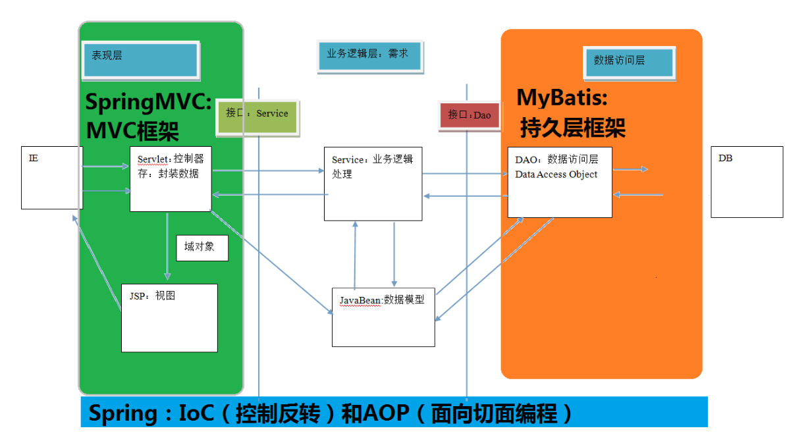
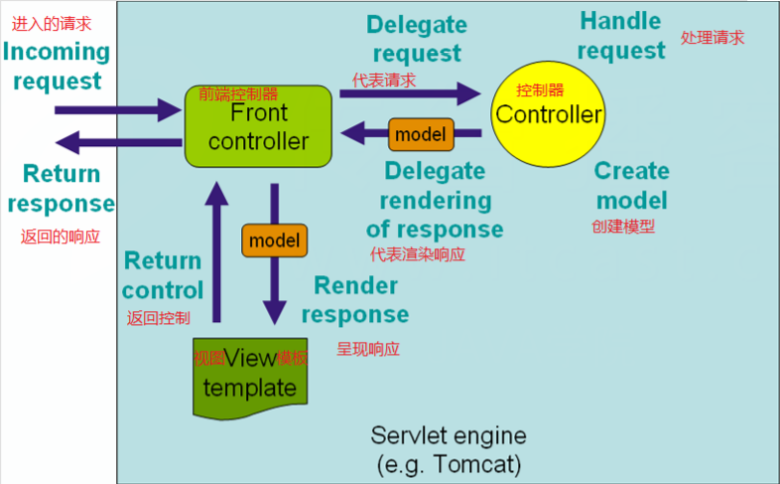
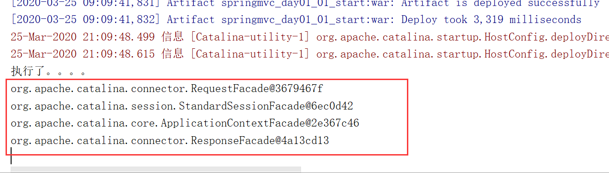

## 一、三层架构和MVC
### 1、三层架构
* **开发服务器端程序，一般都基于两种形式，一种C/S架构程序，一种B/S架构程序**
* **使用Java语言基本上都是开发B/S架构的程序，B/S架构又分成了三层架构**

#### 三层架构
* **表现层**：**WEB层，用来和客户端进行数据交互的**。表现层**一般会采用MVC的设计模型**
* **业务层**：**处理公司具体的业务逻辑的**
* **持久层**：**用来操作数据库的**

### 2、MVC模型
**MVC全名是Model View Controller模型视图控制器，每个部分各司其职**
* **Model**：**数据模型，JavaBean的类，用来进行数据封装**
* **View**：**指JSP、HTML用来展示数据给用户**
* **Controller**：**用来接收用户的请求，整个流程的控制器。** 用来进行数据校验等

*之前关于三层架构和MVC写的一篇blog，内容几乎相同，但是有示意图，可能理解起来更方便一些，点击访问[初识MVC和三层架构](https://blog.csdn.net/qq_34504626/article/details/104506267)*

## 二、SpringMVC的入门案例
### 1、SpringMVC的概述
#### （1）SpringMVC的概述
* 是一种**基于Java实现的MVC设计模型的请求驱动类型的轻量级WEB框架**
* Spring MVC属于SpringFrameWork的后续产品，已经融合在Spring Web Flow里面。**Spring框架提供了构建Web应用程序的全功能MVC模块**
* **使用Spring可插入的MVC架构，从而在使用Spring进行WEB开发时，可以选择使用Spring的SpringMVC框架或集成其他MVC开发框架**，如Struts1(现在一般不用)，Struts2等。

#### （2）SpringMVC在三层架构中的位置


#### （3）SpringMVC的优势
* **清晰的角色划分**
    * **前端控制器**（DispatcherServlet）
    * **请求到处理器映射**（HandlerMapping）
    * **处理器适配器**（HandlerAdapter）
    * **视图解析器**（ViewResolver）
    * **处理器或页面控制器**（Controller）
    * **验证器**（Validator）
    * **命令对象**（Command请求参数绑定到的对象就叫命令对象）
    * **表单对象**（Form Object提供给表单展示和提交到的对象就叫表单对象）
* **分工明确，而且扩展点相当灵活，可以很容易扩展，虽然几乎不需要**
* **由于命令对象就是一个POJO，无需继承框架特定 API，可以使用命令对象直接作为业务对象**
* **和Spring其他框架无缝集成**，是其它Web框架所不具备的
* **可适配**，通过HandlerAdapter可以支持任意的类作为处理器
* **可定制性**，HandlerMapping、ViewResolver等能够非常简单的定制
* **功能强大的数据验证、格式化、绑定机制**
* **利用Spring提供的Mock对象能够非常简单的进行Web层单元测试**
* 本地化、主题的解析的支持，使我们更容易进行国际化和主题的切换
* **强大的JSP标签库，使JSP编写更容易**

*还有比如RESTful风格的支持、简单的文件上传、约定大于配置的契约式编程支持、基于注解的零配置支持等等*

#### （4）SpringMVC和Struts2框架的对比
##### 共同点
* **都是表现层框架，都是基于MVC模型编写的**
* **底层都离不开原始ServletAPI**
* **处理请求的机制都是一个核心控制器**

##### 区别
* **SpringMVC的入口是Servlet, 而Struts2是Filter**
* **SpringMVC是基于方法设计的，而Struts2是基于类，Struts2每次执行都会创建一个动作类**。所以SpringMVC会稍微比Struts2快些。
* **SpringMVC使用更加简洁,同时还支持JSR303,处理ajax的请求更方便**(*JSR303是一套JavaBean参数校验的标准，它定义了很多常用的校验注解，可以直接将这些注解加在JavaBean的属性上面，就可以在需要校验的时候进行校验了*)
* **Struts2的OGNL表达式使页面的开发效率相比SpringMVC更高些**，**但执行效率并没有比JSTL提升**，尤其是Struts2的表单标签，远没有html执行效率高

### 2、SpringMVC的入门程序
#### （1）创建WEB工程，引入开发的jar包
**具体的坐标如下**：
```
<!-- 版本锁定 -->
<properties>
    <spring.version>5.0.2.RELEASE</spring.version>
</properties>

<dependencies>
<dependency>
  <groupId>org.springframework</groupId>
  <artifactId>spring-context</artifactId>
  <version>${spring.version}</version>
</dependency>
<dependency>
  <groupId>org.springframework</groupId>
  <artifactId>spring-web</artifactId>
  <version>${spring.version}</version>
</dependency>
<dependency>
  <groupId>org.springframework</groupId>
  <artifactId>spring-webmvc</artifactId>
  <version>${spring.version}</version>
</dependency>
<dependency>
  <groupId>javax.servlet</groupId>
  <artifactId>servlet-api</artifactId>
  <version>2.5</version>
  <scope>provided</scope>
</dependency>
<dependency>
  <groupId>javax.servlet.jsp</groupId>
  <artifactId>jsp-api</artifactId>
  <version>2.0</version>
  <scope>provided</scope>
</dependency>
</dependencies>
```
#### （2）配置核心的控制器（配置DispatcherServlet）
**在web.xml配置文件中核心控制器DispatcherServlet**
```
<!-- SpringMVC的核心控制器 -->
<servlet>
    <servlet-name>dispatcherServlet</servlet-name>
    <servlet-class>org.springframework.web.servlet.DispatcherServlet</servletclass>
    <!-- 配置Servlet的初始化参数，读取springmvc的配置文件，创建spring容器 -->
    <init-param>
        <param-name>contextConfigLocation</param-name>
        <param-value>classpath:springmvc.xml</param-value>
    </init-param>
    <!-- 配置servlet启动时加载对象 -->
    <load-on-startup>1</load-on-startup>
</servlet>
<servlet-mapping>
    <servlet-name>dispatcherServlet</servlet-name>
    <url-pattern>/</url-pattern>
</servlet-mapping>

```
#### （3）编写springmvc.xml的配置文件
**在resources目录下创建SpringMVC的配置文件springmvc.xml（名字任意）**
```
<?xml version="1.0" encoding="UTF-8"?>
<beans xmlns="http://www.springframework.org/schema/beans"
       xmlns:mvc="http://www.springframework.org/schema/mvc"
       xmlns:context="http://www.springframework.org/schema/context"
       xmlns:xsi="http://www.w3.org/2001/XMLSchema-instance"
       xsi:schemaLocation="
        http://www.springframework.org/schema/beans
        http://www.springframework.org/schema/beans/spring-beans.xsd
        http://www.springframework.org/schema/mvc
        http://www.springframework.org/schema/mvc/spring-mvc.xsd
        http://www.springframework.org/schema/context
        http://www.springframework.org/schema/context/spring-context.xsd">

    <!--开启注解扫描-->
    <context:component-scan base-package="com.allen"></context:component-scan>

    <!--视图解析器对象-->
    <bean id="internalResourceViewResolver" class="org.springframework.web.servlet.view.InternalResourceViewResolver">
        <property name="prefix" value="/WEB-INF/pages/"></property>
        <property name="suffix" value=".jsp"></property>
    </bean>

    <!--开启SpringMVC框架注解的支持-->
    <mvc:annotation-driven conversion-service="conversionService"></mvc:annotation-driven>
</beans>
```

#### （4）编写index.jsp和HelloController控制器类
* **index.jsp**
```
<%@ page contentType="text/html;charset=UTF-8" language="java" %>
<html>
<head>
    <title>Title</title>
</head>
<body>
    <h3>入门程序</h3>
    <a href="hello">入门程序</a>
</body>
</html>

```

* **HelloController**
```
package com.allen.controller;

import org.springframework.stereotype.Controller;
import org.springframework.web.bind.annotation.RequestMapping;

//控制器类
@Controller
public class HelloController {
    /**
     * 入门案例
     * @return
     */
    @RequestMapping(path = "/hello")
    public String sayHello(){
        System.out.println("hello SpringMVC");
        return "success";
    }
}
```
#### （5）在WEB-INF目录下创建pages文件夹，编写success.jsp的成功页面
```
<%@ page contentType="text/html;charset=UTF-8" language="java" isELIgnored="false" %>
<html>
<head>
    <title>Title</title>
</head>
<body>
    <h3>入门成功</h3>
</body>
</html>

```
#### （6）启动Tomcat服务器，进行测试

### 3、入门案例的执行过程分析
#### （1）入门案例的执行流程

* **当启动Tomcat服务器的时候，因为配置了`load-on-startup`标签，所以会创建DispatcherServlet对象，就会加载springmvc.xml配置文件**
* **开启了注解扫描，那么HelloController对象就会被创建**
* **从index.jsp发送请求，请求会先到达DispatcherServlet核心控制器，根据配置`@RequestMapping`注解找到执行的具体方法**
* **根据执行方法的返回值，再根据配置的视图解析器，去指定的目录下查找指定名称的JSP文件**
* **Tomcat服务器渲染页面，做出响应**

#### （2）SpringMVC的请求响应流程


#### （3）入门案例中的组件分析
##### 前端控制器（DispatcherServlet）
**用户请求到达前端控制器，它就相当于mvc模式中的c**，**dispatcherServlet是整个流程控制的中心**，由它调用其它组件处理用户的请求，**dispatcherServlet的存在降低了组件之间的耦合性**
##### 处理器映射器（HandlerMapping）
**HandlerMapping负责根据用户请求找到Handler即处理器**，SpringMVC提供了不同的映射器实现不同的映射方式，例如：配置文件方式，实现接口方式，注解方式等
##### 处理器（Handler）
**它就是开发中要编写的具体业务控制器**。由DispatcherServlet把用户请求转发到Handler。由Handler对具体的用户请求进行处理
##### 处理器适配器（HandlAdapter）
**通过HandlerAdapter对处理器进行执行，这是适配器模式的应用，通过扩展适配器可以对更多类型的处理器进行执行**
##### 视图解析器（View Resolver）
**View Resolver负责将处理结果生成View视图**，View Resolver首先**根据逻辑视图名解析成物理视图名**即具体的页面地址，**再生成View视图对象**，最后**对View进行渲染**将处理结果通过页面展示给用户。
##### 视图（View）
**SpringMVC框架提供了很多的View视图类型的支持**，包括：jstlView、freemarkerView、pdfView等。**我们最常用的视图就是jsp**，一般情况下需要通过页面标签或页面模版技术将模型数据通过页面展示给用户，需要由程序员根据业务需求开
发具体的页面。

### 4、RequestMapping注解
#### （1）作用
**RequestMapping注解的作用是建立请求URL和处理方法之间的对应关系**

#### （2）出现位置
**RequestMapping注解可以作用在方法和类上**
* **作用在类上：第一级的访问目录。** *此处不写的话，就相当于应用的根目录。写的话需要以`/`开头*。
它出现的目的是为了**使URL可以按照模块化管理**:
    * **例如**：

            * 账户模块：
            /account/add
            /account/update
            /account/delete
            ...
            * 订单模块：
            /order/add
            /order/update
            /order/delete

* **作用在方法上：第二级的访问目录**

#### （3）细节
* **路径可以不编写`/`表示应用的根目录开始**
* **`${ pageContext.request.contextPath }`也可以省略不写，但是路径上不能写`/`**

#### （4）RequestMapping的属性

属性 | 作用
---|---
path | 指定请求路径的url
value | value属性和path属性是一样的
mthod | 指定该方法的请求方式
params | 指定限制请求参数的条件
headers | 发送的请求中必须包含的请求头

#### （5）示例
##### 出现位置的示例：
* **控制器代码**
```
@Controller("accountController")
@RequestMapping("/account")
public class AccountController {
@RequestMapping("/findAccount")
    public String findAccount() {
        System.out.println("查询了账户。。。。");
        return "success";
    }
}
```
* **jsp中的代码**
```
<%@ page language="java" contentType="text/html; charset=UTF-8"
pageEncoding="UTF-8"%>
<!DOCTYPE html PUBLIC "-//W3C//DTD HTML 4.01 Transitional//EN"
"http://www.w3.org/TR/html4/loose.dtd">
<html>
    <head>
        <meta http-equiv="Content-Type" content="text/html; charset=UTF-8">
        <title>requestmapping 的使用</title>
    </head>
    <body>
        <!-- 第一种访问方式 -->
        <a href="${pageContext.request.contextPath}/account/findAccount">查询账户 </a>
        <br/>
        <!-- 第二种访问方式 -->
        <a href="account/findAccount">查询账户</a>
    </body>
</html>
```
* **注意**：
**当我们使用此种方式配置时，在jsp中第二种写法时，不要在访问URL前面加/，否则无法找到资源。**

##### method属性的示例：
* **控制器代码**
```
/**
* 保存账户
* @return
*/
@RequestMapping(value="/saveAccount",method=RequestMethod.POST)
public String saveAccount() {
    System.out.println("保存了账户");
    return "success";
}
```
* **jsp代码**
```
<!-- 请求方式的示例 -->
<a href="account/saveAccount">保存账户，get 请求</a>
<br/>
<form action="account/saveAccount" method="post">
    <input type="submit" value="保存账户，post 请求">
</form>
```
* **注意**：
**当使用get请求时，提示错误信息是405，信息是方法不支持get方式请求**

##### params属性的示例：
* **控制器的代码**
```
/**
* 删除账户
* @return
*/
@RequestMapping(value="/removeAccount",params= {"accountName","money>100"})
public String removeAccount() {
    System.out.println("删除了账户");
    return "success";
}
```
* **jsp中的代码**
```
<!-- 请求参数的示例 -->
<a href="account/removeAccount?accountName=aaa&money>100">删除账户，金额 100</a>
<br/>
<a href="account/removeAccount?accountName=aaa&money>150">删除账户，金额 150</a>
```
* **注意**：
    * **当我们点击第一个超链接时,可以访问成功**
    * **当我们点击第二个超链接时，无法访问**

## 三、请求参数的绑定
### 1、请求参数的绑定说明
#### （1）绑定机制
* **表单提交的数据都是k=v的格式**，如：`username=haha&password=123`
* **SpringMVC的参数绑定过程是把表单提交的请求参数，作为控制器中方法的参数进行绑定的**
* **要求：提交表单的name和参数的名称是相同的**

#### （2）支持的数据类型
* **基本数据类型和字符串类型**
* **实体类型**（JavaBean）
* **集合数据类型**（List、map集合等）

### 2、基本数据类型和字符串类型
* **提交表单的name和参数的名称是相同的**
* **区分大小写**

### 3、实体类型（JavaBean）
* **提交表单的name和JavaBean中的属性名称需要一致**
* **如果一个JavaBean类中包含其他的引用类型，那么表单的name属性需要编写成：`对象.属性`**
    * **例如：`address.name`**

### 4、给集合属性数据封装
**JSP页面编写方式：`list[0].属性`**

### 5、请求参数中文乱码的解决
**在web.xml中配置Spring提供的过滤器类**
```
<!-- 配置过滤器，解决中文乱码的问题 -->
<filter>
    <filter-name>characterEncodingFilter</filter-name>
    <filter-class>org.springframework.web.filter.CharacterEncodingFilter</filterclass>
    <!-- 指定字符集 -->
    <init-param>
        <param-name>encoding</param-name>
        <param-value>UTF-8</param-value>
    </init-param>
</filter>
<filter-mapping>
    <filter-name>characterEncodingFilter</filter-name>
    <url-pattern>/*</url-pattern>
</filter-mapping>
```

### 6、自定义类型转换器
* 表单提交的任何数据类型全部都是字符串类型，但是后台定义Integer类型，数据也可以封装上，说明**Spring框架内部会默认进行数据类型转换**
* 如果想**自定义数据类型转换，可以实现Converter的接口**

#### （1）自定义类型转换器
```
package com.allen.utils;

import org.springframework.core.convert.converter.Converter;

import java.text.DateFormat;
import java.text.SimpleDateFormat;
import java.util.Date;

/**
 * 把字符串转换成日期
 */
public class StringToDateConverter implements Converter<String, Date> {

    /**
     * String source  传入进来的字符串
     * @param source
     * @return
     */
    @Override
    public Date convert(String source) {
        //判断
        if (source == null){
            throw new RuntimeException("请您传入数据");
        }
        DateFormat df = new SimpleDateFormat("yyyy-MM-dd");

        try {
            //把字符串转换成日期
            return df.parse(source);
        } catch (Exception e) {
            throw new RuntimeException("数据类型转换出现错误");
        }
    }
}
```

#### （2）注册自定义类型转换器
**在springmvc.xml配置文件中编写配置**
```
<!-- 注册自定义类型转换器 -->
<bean id="conversionService"
class="org.springframework.context.support.ConversionServiceFactoryBean">
    <property name="converters">
        <set>
            <bean class="com.allen.utils.StringToDateConverter"/>
        </set>
    </property>
</bean>

<!-- 开启Spring对MVC注解的支持 -->
<mvc:annotation-driven conversion-service="conversionService"/>
```

### 7、在控制器中使用原生的ServletAPI对象
**SpringMVC还支持使用原始ServletAPI对象作为控制器方法的参数**
* **支持原始ServletAPI对象有**
    * HttpServletRequest
    * HttpServletResponse
    * HttpSession
    * java.security.Principal
    * Locale
    * InputStream
    * OutputStream
    * Reader
    * Writer

**只需要在控制器的方法参数定义HttpServletRequest和HttpServletResponse对象**

**部分示例代码**：
* **jsp代码**
```
<!-- 原始 ServletAPI 作为控制器参数 -->
<a href="account/testServletAPI">测试访问 ServletAPI</a>
```
* **控制器中的代码**
```
/**
     * 原生的API
     * @return
     */
    @RequestMapping("/testServlet")
    public String testServlet(HttpServletRequest request, HttpServletResponse response){
        System.out.println("执行了。。。。");
        System.out.println(request);

        HttpSession session = request.getSession();
        System.out.println(session);

        ServletContext servletContext = session.getServletContext();
        System.out.println(servletContext);

        System.out.println(response);
        return "success";
    }
```
* **运行结果：**


## 四、常用的注解
### 1、RequestParam注解
#### （1）作用
**把请求中的指定名称的参数传递给控制器中的形参赋值**
#### （2）属性
* **value：请求参数中的名称**
* **required：请求参数中是否必须提供此参数，默认值是true（true代表必须提供此参数，否则会报错）**

#### （3）示例
```
/**
* 接收请求
* @return
*/
@RequestMapping(path="/hello")
public String sayHello(@RequestParam(value="username",required=false)String name) {
    System.out.println("aaaa");
    System.out.println(name);
    return "success";
}
```

### 2、RequestBody注解
#### （1）作用
**用于获取请求体的内容**（注意：get方法不可以）
#### （2）属性
**required：是否必须有请求体。默认值是:true。当取值为true时,get请求方式会报错。如果取值为false，get请求得到是 null**
#### （3）示例
```
/**
* 接收请求
* @return
*/
@RequestMapping(path="/hello")
public String sayHello(@RequestBody String body) {
    System.out.println("aaaa");
    System.out.println(body);
    return "success";
}
```

### 3、PathVariable注解
#### （1）作用
**拥有绑定url中的占位符的**。*例如：url中有`/delete/{id}`，`{id}`就是占位符*
#### （2）属性
* **value：指定url中的占位符名称**
* **required：是否必须提供占位符**

#### （3）示例
* **jsp代码**
```
<a href="user/hello/1">入门案例</a>
```
* **控制器代码**
```
/**
* 接收请求
* @return
*/
@RequestMapping(path="/hello/{id}")
public String sayHello(@PathVariable(value="id") String id) {
    System.out.println(id);
    return "success";
}
```
#### （4）Restful风格的URL
##### 什么是REST
**REST（英文：Representational State Transfer，简称 REST）描述了一个架构样式的网络系统，比如 web 应用程序**。它首次出现在2000年Roy Fielding的博士论文中，他是HTTP规范的主要编写者之
一。在目前主流的三种Web服务交互方案中，REST相比于SOAP（Simple Object Access protocol，简单对象访问协议）以及XML-RPC更加简单明了，无论是对URL的处理还是对Payload的编码，REST都倾向于用更加简单轻量的方法设计和实现。值得注意的是REST并没有一个明确的标准，而更像是一种设计的风格。**它本身并没有什么实用性，其核心价值在于如何设计出符合REST风格的网络接口**。
##### Restful的优点
**它结构清晰、符合标准、易于理解、扩展方便，所以正得到越来越多网站的采用**。
##### Restful的特性
* **资源（Resources）：网络上的一个实体，或者说是网络上的一个具体信息**
    * **它可以是一段文本、一张图片、一首歌曲、一种服务，总之就是一个具体的存在**。**可以用一个 URI（统一资源定位符）指向它**，每种资源对应一个特定的 URI 。要获取这个资源，访问它的 URI 就可以，因此URI即为每一个资源的独一无二的识别符。
* **表现层（Representation）：把资源具体呈现出来的形式，叫做它的表现层 （Representation）**
    * 比如，文本可以用txt格式表现，也可以用HTML格式、XML格式、JSON格式表现，甚至可以采用二进制格式。
* **状态转化（State Transfer）：每发出一个请求，就代表了客户端和服务器的一次交互过程**
    * **HTTP协议，是一个无状态协议，即所有的状态都保存在服务器端**。因此，如果客户端想要操作服务器，必须通过某种手段，**让服务器端发生“状态转化”**（State Transfer）。而这种转化是建立在表现层之上的，所以就是 “表现层状态转化”。具体说，就是**HTTP 协议里面，四个表示操作方式的动词：GET 、POST 、PUT、DELETE。它们分别对应四种基本操作：GET用来获取资源，POST用来新建资源，PUT用来更新资源，DELETE用来删除资源**。

##### Restful 的示例
    /account/1 HTTP GET ： 得到 id = 1 的 account
    /account/1 HTTP DELETE： 删除 id = 1 的 account
    /account/1 HTTP PUT： 更新 id = 1 的 account 
    /account HTTP POST： 新增 account

#### （5）基于HiddentHttpMethodFilter的示例
##### 作用
**由于浏览器form表单只支持GET与POST请求，而DELETE、PUT等method并不支持，Spring3.0添加了一个过滤器，可以将浏览器请求改为指定的请求方式**，发送给我们的控制器方法，使得支持 GET、POST、PUT与DELETE请求。

##### 使用方法
* **第一步：在 web.xml 中配置该过滤器**
* **第二步：请求方式必须使用post请求**
* **第三步：按照要求提供_method请求参数**，该参数的取值就是我们需要的请求方式

##### 示例代码
* **jsp代码**
```
<!-- 保存 -->
<form action="springmvc/testRestPOST" method="post">
    用户名称：<input type="text" name="username"><br/>
    <!-- <input type="hidden" name="_method" value="POST"> -->
    <input type="submit" value="保存">
</form>
<hr/>
<!-- 更新 -->
<form action="springmvc/testRestPUT/1" method="post">
    用户名称：<input type="text" name="username"><br/>
    <input type="hidden" name="_method" value="PUT">
    <input type="submit" value="更新">
</form>
<hr/>
<!-- 删除 -->
<form action="springmvc/testRestDELETE/1" method="post">
    <input type="hidden" name="_method" value="DELETE">
    <input type="submit" value="删除">
</form>
<hr/>
<!-- 查询一个 -->
<form action="springmvc/testRestGET/1" method="post">
    <input type="hidden" name="_method" value="GET">
    <input type="submit" value="查询">
</form>
```
* **控制器中示例代码**
```
/**
* post 请求：保存
* @param username
* @return
*/
@RequestMapping(value="/testRestPOST",method=RequestMethod.POST)
public String testRestfulURLPOST(User user){
    System.out.println("rest post"+user);
    return "success";
}
/**
* put 请求：更新
* @param username
* @return
*/
@RequestMapping(value="/testRestPUT/{id}",method=RequestMethod.PUT)
public String testRestfulURLPUT(@PathVariable("id")Integer id,User user){
    System.out.println("rest put "+id+","+user);
    return "success";
}
/**
* post 请求：删除
* @param username
* @return
*/
@RequestMapping(value="/testRestDELETE/{id}",method=RequestMethod.DELETE)
public String testRestfulURLDELETE(@PathVariable("id")Integer id){
    System.out.println("rest delete "+id);
    return "success";
}
/**
* post 请求：查询
* @param username
* @return
*/
@RequestMapping(value="/testRestGET/{id}",method=RequestMethod.GET)
public String testRestfulURLGET(@PathVariable("id")Integer id){
    System.out.println("rest get "+id);
    return "success";
} 
```

### 4、RequestHeader注解
#### （1）作用
**获取指定请求头的值**
#### （2）属性
* **value：请求头的名称**
* **required：是否必须有此消息头**

*注：在实际开发中一般不怎么用*
#### （3）示例
```
@RequestMapping(path="/hello")
public String sayHello(@RequestHeader(value="Accept") String header) {
    System.out.println(header);
    return "success";
}
```

### 5、CookieValue注解
#### （1）作用
**用于获取指定cookie的名称的值**
#### （2）属性
* **value：cookie的名称**
* **required：是否必须有此cookie**

#### （3）示例
```
@RequestMapping(path="/hello")
public String sayHello(@CookieValue(value="JSESSIONID") String cookieValue) {
    System.out.println(cookieValue);
    return "success";
}
```

### 6、ModelAttribute注解
#### （1）作用
* **该注解是SpringMVC4.3版本以后新加入的。它可以用于修饰方法和参数**
* **出现在方法上，表示当前方法会在控制器的方法执行之前，先执行**。它可以修饰没有返回值的方法，也可以修饰有具体返回值的方法。
* **出现在参数上，获取指定的数据给参数赋值。**

#### （2）属性
**value：用于获取数据的key。key可以是POJO的属性名称，也可以是map结构的key。**
#### （3）应用场景
**当表单提交数据不是完整的实体类数据时，保证没有提交数据的字段使用数据库对象原来的数据**
#### （4）示例
* **修饰的方法有返回值**
```
/**
* 作用在方法，先执行
* @param name
* @return
*/
@ModelAttribute
public User showUser(String name) {
    System.out.println("showUser执行了...");
    // 模拟从数据库中查询对象
    User user = new User();
    user.setName("哈哈");
    user.setPassword("123");
    user.setMoney(100d);
    return user;
}
/**
* 修改用户的方法
* @param cookieValue
* @return
*/
@RequestMapping(path="/updateUser")
public String updateUser(User user) {
    System.out.println(user);
    return "success";
}
```
* **修饰的方法没有返回值**
```
/**
* 作用在方法，先执行
* @param name
* @return
*/
@ModelAttribute
public void showUser(String name,Map<String, User> map) {
    System.out.println("showUser执行了...");
    // 模拟从数据库中查询对象
    User user = new User();
    user.setName("哈哈");
    user.setPassword("123");
    user.setMoney(100d);
    map.put("abc", user);
}
/**
* 修改用户的方法
* @param cookieValue
* @return
*/
@RequestMapping(path="/updateUser")
public String updateUser(@ModelAttribute(value="abc") User user) {
    System.out.println(user);
    return "success";
}
```

### 7、SessionAttributes注解
#### （1）作用
**用于多次执行控制器方法间的参数共享**
#### （2）属性
* **value：指定存入属性的名称**
* **type：用于指定存入的数据类型**

#### （3）示例
```
@Controller
@RequestMapping("/anno")
@SessionAttributes(value = {"msg"}) //把msg=美美存入到session域中
public class AnnoController {
    /**
     * SessionAttributes注解
     * @return
     */
    @RequestMapping(value = "/testSessionAttributes")
    public String testSessionAttributes(Model model){
        System.out.println("testSessionAttributes。。。");
        model.addAttribute("msg","美美");
        return "success";
    }

    /**
     * 获取值
     * @param modelMap
     * @return
     */
    @RequestMapping(value = "/getSessionAttributes")
    public String getSessionAttributes(ModelMap modelMap){
        System.out.println("testSessionAttributes。。。");
        String msg = (String)modelMap.get("msg");
        System.out.println(msg);
        return "success";
    }

    /**
     * 清除
     * @param status
     * @return
     */
    @RequestMapping(value = "/delSessionAttributes")
    public String delSessionAttributes(SessionStatus status){
        System.out.println("testSessionAttributes。。。");
        status.setComplete();
        return "success";
    }
}
```
