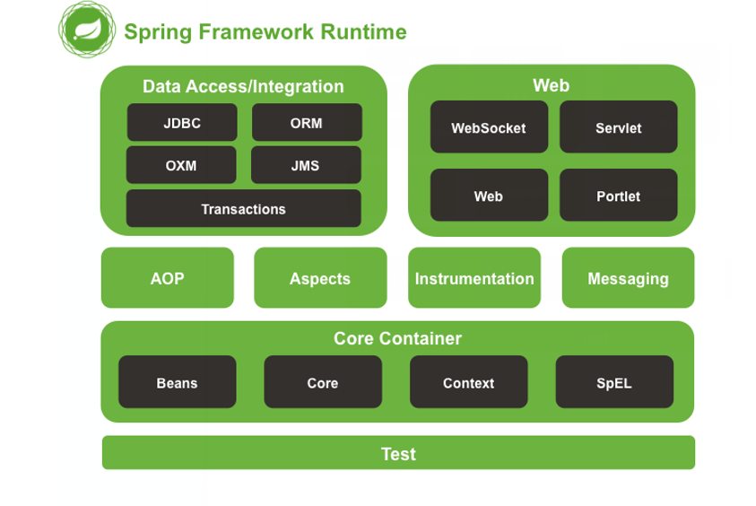
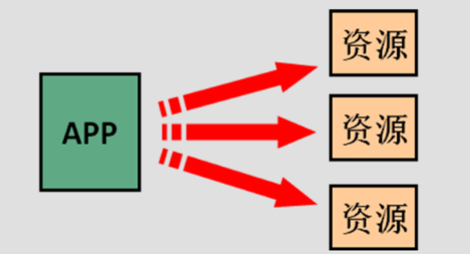
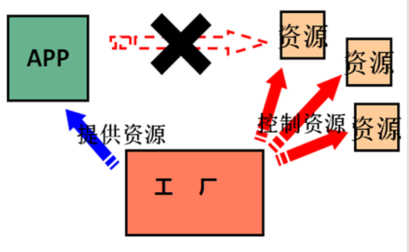
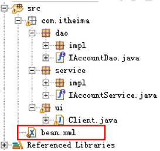
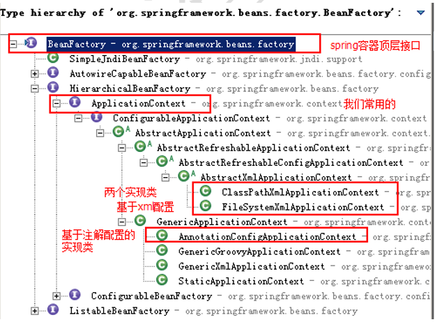
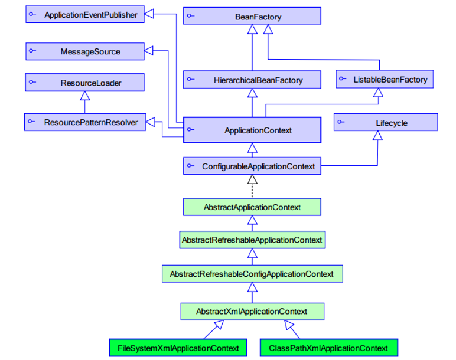

## 一、前言
Spring的学习，我是通过哔哩哔哩网站上的视频，黑马程序员的，个人觉得很不错，推荐给大家，讲解思路清晰，内容充实，总共四天，让我能够全面的了解Spring的常用操作及应用。
<br/>*链接如下：https://www.bilibili.com/video/av47952931?from=search&seid=4094573305286061275*<br>

## 二、Spring概述
### 2.1 spring概述
#### 2.1.1 spring 是什么 
Spring是分层的 Java SE/EE应用 **full-stack** 轻量级开源框架，以 **IoC（Inverse Of Control： 反转控制）和 AOP（Aspect Oriented Programming：面向切面编程）为内核**，提供了展现层 Spring MVC 和持久层 Spring JDBC 以及业务层事务管理等众多的企业级应用技术，还能整合开源世界众多 著名的第三方框架和类库，逐渐成为使用最多的Java EE 企业应用开源框架。

#### 2.1.2 Spring 的发展历程 
*  1997 年 IBM提出了EJB 的思想
*  1998 年，SUN制定开发标准规范 EJB1.0
*  1999 年，EJB1.1 发布
*  2001 年，EJB2.0 发布
*  2003 年，EJB2.1 发布
*  2006 年，EJB3.0 发布
*  **Rod Johnson（spring之父）**
    *  Expert One-to-One J2EE Design and Development(2002)
    *  阐述了 J2EE 使用EJB 开发设计的优点及解决方案
    *  Expert One-to-One J2EE Development without EJB(2004)
    *  阐述了 J2EE 开发不使用 EJB的解决方式（Spring 雏形）
    *  **2017 年 9 月份发布了 spring 的最新版本 spring 5.0 通用版（GA）**

#### 2.1.3 spring 的优势 
* 方便解耦，简化开发  
* AOP编程的支持 
* 声明式事务的支持 
* 方便程序的测试  
* 方便集成各种优秀框架  
* 降低 JavaEE API的使用难度
* Java源码是经典学习范例 

#### 2.1.4 spring 的体系结构 


## 三、 IoC 的概念和作用 
### 3.1 程序的耦合和解耦
#### 3.1.1 什么是程序的耦合 
耦合性(Coupling)，也叫耦合度，是对模块间关联程度的度量。耦合的强弱取决于模块间接口的复杂性、调 用模块的方式以及通过界面传送数据的多少。模块间的耦合度是指模块之间的依赖关系，包括控制关系、调用关
系、数据传递关系。模块间联系越多，其耦合性越强，同时表明其独立性越差( 降低耦合性，可以提高其独立 性)。耦合性存在于各个领域，而非软件设计中独有的，但是我们只讨论软件工程中的耦合。

在软件工程中，耦合指的就是就是对象之间的依赖性。对象之间的耦合越高，维护成本越高。因此对象的设计
应使类和构件之间的耦合最小。软件设计中通常用耦合度和内聚度作为衡量模块独立程度的标准。**划分模块的一个 准则就是高内聚低耦合**。 

**我们在开发中，有些依赖关系是必须的，有些依赖关系可以通过优化代码来解除的**。 

请看下面的示例代码：
```
/** 
 * 账户的业务层实现类 
 */
 public class AccountServiceImpl implements IAccountService {  
    private IAccountDao accountDao = new AccountDaoImpl(); 
 } 
 ```
上面的代码表示：      
* 业务层调用持久层，并且此时业务层在依赖持久层的接口和实现类。如果此时没有持久层实现类，编译 将不能通过。这种编译期依赖关系，应该在我们开发中杜绝。我们需要优化代码解决。 

**再比如：**  
* 早期我们的 JDBC 操作，注册驱动时，我们为什么不使用 DriverManager 的 register 方法，而是采 用 Class.forName 的方式？
```
public class JdbcDemo1 { 
    /** 
     * @param args 
     * @throws Exception
    */ 
    public static void main(String[] args) throws Exception {
        //1.注册驱动   //DriverManager.registerDriver(new com.mysql.jdbc.Driver());  
        Class.forName("com.mysql.jdbc.Driver"); 
        //2.获取连接   
        //3.获取预处理 sql 语句对象
        //4.获取结果集   
        //5.遍历结果集
    }
} 
```
**原因就是**:
* 我们的类依赖了数据库的具体驱动类（MySQL），如果这时候更换了数据库品牌（比如 Oracle），需要 修改源码来重新数据库驱动。这显然不是我们想要的。

#### 3.1.2 解决程序耦合的途径  
* **使用配置文件配置。**

#### 3.1.3 工厂模式解耦
* 在实际开发中我们可以把三层的对象都使用配置文件配置起来，当启动服务器应用加载的时候，让一个类中的
方法通过读取配置文件，把这些对象创建出来并存起来。在接下来的使用的时候，直接拿过来用就好了。 
* 那么，这个读取配置文件，创建和获取三层对象的类就是工厂。 

#### 3.1.4 控制反转-Inversion Of Control 
上一小节解耦的思路有 2 个问题：  
* **1、存哪去？**   
    * 分析：由于我们是很多对象，肯定要找个集合来存。这时候有 Map 和 List 供选择。     
        * 到底选 Map 还是 List 就看我们有没有查找需求。有查找需求，选 Map。   
    * 所以我们的答案就是    
        * 在应用加载时，创建一个 Map，用于存放三层对象。 
        * 我们把这个 map 称之为容器。
* **2、还是没解释什么是工厂？**   
    * 工厂就是负责给我们从容器中获取指定对象的类。这时候我们获取对象的方式发生了改变。   
    * 原来：  
        * 我们在获取对象时，都是采用 new 的方式。是主动的。

    * 现在：       
        * 我们获取对象时，同时跟工厂要，有工厂为我们查找或者创建对象。是被动的。


这种被动接收的方式获取对象的思想就是控制反转，它是 spring 框架的核心之一。

**明确 ioc的作用**：  
* 削减计算机程序的耦合(解除我们代码中的依赖关系)。
## 四、使用 spring的 IOC解决程序耦合 
### 4.1案例的前期准备
#### 4.1.1准备 spring 的开发包 
官网：http://spring.io/  
下载地址： http://repo.springsource.org/libs-release-local/org/springframework/spring 
#### 4.1.2 创建业务层接口和实现类
```
/**
 * 账户业务层的接口
 */
public interface IAccountService {

    /**
     * 模拟保存账户
     */
    void saveAccount();
}


/**
 * 账户的业务层实现类
 */
public class AccountServiceImpl implements IAccountService {

    private IAccountDao accountDao = new AccountDaoImpl();//此处的依赖关系有待解决
    
    @Override 
    public void saveAccount(){
        accountDao.saveAccount();
    }
}
```
#### 4.1.3 创建持久层接口和实现类
```
/**
 * 账户的持久层接口
 */
public interface IAccountDao {
    /**
     * 模拟保存账户
     */
    void saveAccount();
}

/**
 * 账户的持久层实现类
 */
public class AccountDaoImpl implements IAccountDao {
    @Override
    public void saveAccount() {
        System.out.println("保存了账户");
    }
}
```
### 4.2基于 XML 的配置（入门案例）
#### 4.2.1 第一步：拷贝必备的 jar包到工程的 lib 目录中 
也可以通过创建maven项目直接在项目配置文件里通过进行导包
#### 4.2.2第二步：在类的根路径下创建一个任意名称的 xml 文件（不能是中文）


**给配置文件导入约束**：
/spring-framework-5.2.0.RELEASE/docs/spring-framework-reference/html5/core.html 
```
<?xml version="1.0" encoding="UTF-8"?> 
<beans xmlns="http://www.springframework.org/schema/beans" 
    xmlns:xsi="http://www.w3.org/2001/XMLSchema-instance"   
    xsi:schemaLocation="http://www.springframework.org/schema/beans      
             http://www.springframework.org/schema/beans/spring-beans.xsd">
</beans> 
```
#### 4.2.3 第三步：让 spring 管理资源，在配置文件中配置 service 和 dao 
```
<!-- bean 标签：用于配置让 spring 创建对象，并且存入 ioc 容器之中       
    id 属性：对象的唯一标识。       
    class 属性：指定要创建对象的全限定类名
--> 
<!-- 配置 service -->    
<bean id="accountService" class="com.itheima.service.impl.AccountServiceImpl"> </bean> 
<!-- 配置 dao --> 
<bean id="accountDao" class="com.itheima.dao.impl.AccountDaoImpl"></bean> 
```
#### 4.2.4 测试配置是否成功
```
/** 
 * 模拟一个表现层  
 */  
public class Client {
    /** 
      * 使用 main 方法获取容器测试执行
      */ 
    public static void main(String[] args) {   
    //1.使用 ApplicationContext 接口，就是在获取 spring 容器   
    ApplicationContext ac = new ClassPathXmlApplicationContext("bean.xml");  
    //2.根据 bean 的 id 获取对象  
    IAccountService aService = (IAccountService) ac.getBean("accountService");  
    System.out.println(aService); 
 
  IAccountDao aDao = (IAccountDao) ac.getBean("accountDao");   
  System.out.println(aDao); 
  } 
}
```
### 4.3 Spring基于 XML 的 IOC 细节
#### 4.3.1 spring 中工厂的类结构图


##### 4.3.1.1 BeanFactory和 ApplicationContext 的区别 
* BeanFactory 才是 Spring 容器中的顶层接口。 
* ApplicationContext 是它的子接口。 
* BeanFactory 和 ApplicationContext 的区别：     
    * 创建对象的时间点不一样。   
        * ApplicationContext：只要一读取配置文件，默认情况下就会创建对象。   
        * BeanFactory：什么使用什么时候创建对象。 

##### 4.3.1.2 ApplicationContext 接口的实现 
* ClassPathXmlApplicationContext：  
    * 它是从类的根路径下加载配置文件  推荐使用这种
* FileSystemXmlApplicationContext： 
    * 它是从磁盘路径上加载配置文件，配置文件可以在磁盘的任意位置。
* AnnotationConfigApplicationContext: 
    * 当我们使用注解配置容器对象时，需要使用此类来创建 spring 容器。它用来读取注解。

#### 4.3.2 IOC 中 bean 标签和管理对象细节 
##### 4.3.2.1 bean 标签
* 作用： 
    * 用于配置对象让 spring 来创建的。  
    * 默认情况下它调用的是类中的无参构造函数。如果没有无参构造函数则不能创建成功。
* 属性：  
    * id：给对象在容器中提供一个唯一标识。用于获取对象。  
    * class：指定类的全限定类名。用于反射创建对象。默认情况下调用无参构造函数。  
    * scope：指定对象的作用范围。 
        * singleton :默认值，单例的. 
        * prototype :多例的.
        * request :WEB 项目中,Spring 创建一个 Bean 的对象,将对象存入到 request 域中.
        * session :WEB 项目中,Spring 创建一个 Bean 的对象,将对象存入到 session 域中.
        * global session :WEB 项目中,应用在 Portlet 环境.如果没有 Portlet 环境那么 globalSession 相当于 session. 
 
* init-method：指定类中的初始化方法名称。  
* destroy-method：指定类中销毁方法名称。 

##### 4.3.2.2 bean 的作用范围和生命周期
* 单例对象：scope="singleton"   
    * 一个应用只有一个对象的实例。它的作用范围就是整个引用。   
    * 生命周期：    
        * 对象出生：当应用加载，创建容器时，对象就被创建了。    
        * 对象活着：只要容器在，对象一直活着。    
        * 对象死亡：当应用卸载，销毁容器时，对象就被销毁了。  
* 多例对象：scope="prototype"   
    * 每次访问对象时，都会重新创建对象实例。
    * 生命周期：    
        * 对象出生：当使用对象时，创建新的对象实例。    
        * 对象活着：只要对象在使用中，就一直活着。    
        * 对象死亡：当对象长时间不用时，被 java 的垃圾回收器回收了。

##### 4.3.2.3 实例化 Bean 的三种方式
**第一种方式：使用默认无参构造函数** 
```
<!--在默认情况下：   
    它会根据默认无参构造函数来创建类对象。如果 bean 中没有默认无参构造函数，将会创建失败。
--> 
<bean id="accountService" class="com.itheima.service.impl.AccountServiceImpl"/> 
```
**第二种方式：spring管理静态工厂-使用静态工厂的方法创建对象**
```
/** 
 * 模拟一个静态工厂，创建业务层实现类  
 */
public class StaticFactory {   
    public static IAccountService createAccountService(){   
        return new AccountServiceImpl();
    }
}

<!-- 此种方式是:
    使用 StaticFactory 类中的静态方法 createAccountService 创建对象，并存入 spring 容器  
    id 属性：指定 bean 的 id，用于从容器中获取  
    class 属性：指定静态工厂的全限定类名 
    factory-method 属性：指定生产对象的静态方法
--> 
<bean id="accountService"  
      class="com.itheima.factory.StaticFactory"     
      factory-method="createAccountService"></bean> 
```
**第三种方式：spring管理实例工厂-使用实例工厂的方法创建对象**
```
/** 
 * 模拟一个实例工厂，创建业务层实现类  
 * 此工厂创建对象，必须现有工厂实例对象，再调用方法 
 */
public class InstanceFactory {   
    public IAccountService createAccountService(){   
        return new AccountServiceImpl();
    }
} 
    <!-- 此种方式是：    
        先把工厂的创建交给 spring 来管理。   
        然后在使用工厂的 bean 来调用里面的方法   
        factory-bean 属性：用于指定实例工厂 bean 的 id。   
        factory-method 属性：用于指定实例工厂中创建对象的方法。 
    --> 
    <bean id="instancFactory" class="com.itheima.factory.InstanceFactory"></bean>
    <bean id="accountService"  
         factory-bean="instancFactory"      
         factory-method="createAccountService"></bean> 
 ```
#### 4.3.3 spring 的依赖注入
##### 4.3.3.1 依赖注入的概念
* 依赖注入：Dependency Injection。它是 spring 框架核心 ioc 的具体实现。 
* 我们的程序在编写时，通过控制反转，把对象的创建交给了 spring，但是代码中不可能出现没有依赖的情况。 ioc 解耦只是降低他们的依赖关系，但不会消除。例如：我们的业务层仍会调用持久层的方法。 
* 那这种业务层和持久层的依赖关系，在使用 spring 之后，就让 spring 来维护了。 
* 简单的说，就是坐等框架把持久层对象传入业务层，而不用我们自己去获取。

##### 4.3.3.2 构造函数注入
顾名思义，就是使用类中的构造函数，给成员变量赋值。注意，赋值的操作不是我们自己做的，而是通过配置的方式，让 spring 框架来为我们注入。具体代码如下：
```
public class AccountServiceImpl implements IAccountService {    
    private String name;
    private Integer age;
    private Date birthday;     
    
    public AccountServiceImpl(String name, Integer age, Date birthday) {
        this.name = name;   
        this.age = age;   
        this.birthday = birthday;
    } 
 
    @Override
    public void saveAccount() {   
        System.out.println(name+","+age+","+birthday);
    } 
} 
 
<!-- 使用构造函数的方式，给 service 中的属性传值 
    要求：       
        类中需要提供一个对应参数列表的构造函数。 
    涉及的标签： 
        constructor-arg
            属性：     
                index:指定参数在构造函数参数列表的索引位置     
                type:指定参数在构造函数中的数据类型 
                name:指定参数在构造函数中的名称     用这个找给谁赋值      
                =======上面三个都是找给谁赋值，下面两个指的是赋什么值的==============      
                value:它能赋的值是基本数据类型和 String 类型     
                ref:它能赋的值是其他 bean 类型，也就是说，必须得是在配置文件中配置过的 bean   
--> 
<bean id="accountService" class="com.itheima.service.impl.AccountServiceImpl"> 
     <constructor-arg name="name" value=" 张三 "></constructor-arg>  
     <constructor-arg name="age" value="18"></constructor-arg>
     <constructor-arg name="birthday" ref="now"></constructor-arg>
</bean> 
 
<bean id="now" class="java.util.Date"></bean>
```
##### 4.3.3.3 set 方法注入
顾名思义，就是在类中提供需要注入成员的 set 方法。具体代码如下：
```
public class AccountServiceImpl implements IAccountService {    

    private String name; 
    private Integer age;
    private Date birthday;    
    
    public void setName(String name) {
        this.name = name;
    }
    public void setAge(Integer age) {
        this.age = age;
    }
    public void setBirthday(Date birthday) {
        this.birthday = birthday;
    } 
 
     @Override  public void saveAccount() {   
        System.out.println(name+","+age+","+birthday);
    }
} 
 
<!-- 通过配置文件给 bean 中的属性传值：使用 set 方法的方式 
    涉及的标签：   
        property 
    属性：
        name：找的是类中 set 方法后面的部分    
        ref：给属性赋值是其他 bean 类型的    
        value：给属性赋值是基本数据类型和 string 类型的  
        实际开发中，此种方式用的较多。 
-->
<bean id="accountService" class="com.itheima.service.impl.AccountServiceImpl">
    <property name="name" value="test"></property> 
    <property name="age" value="21"></property>   
    <property name="birthday" ref="now"></property> 
</bean>
<bean id="now" class="java.util.Date"></bean> 
```
##### 4.3.3.4 使用 p 名称空间注入数据（本质还是调用 set 方法） 
此种方式是通过在 xml中导入 p名称空间，使用 p:propertyName 来注入数据，它的本质仍然是调用类中的 set 方法实现注入功能。
Java 类代码：
```
 /** 
  * 使用 p 名称空间注入，本质还是调用类中的 set 方法 
  */
  public class AccountServiceImpl4 implements IAccountService {    
  
  private String name;
  private Integer age;
  private Date birthday;
  
  public void setName(String name){
        this.name = name;
  }  
  public void setAge(Integer age) {   
        this.age = age;
  }
  public void setBirthday(Date birthday) {
        this.birthday = birthday;
  } 
  
  @Override
  public void saveAccount() {   
        System.out.println(name+","+age+","+birthday);
    }
}

/*
 * 配置文件代码
 */ 
 
<beans xmlns="http://www.springframework.org/schema/beans" 
    xmlns:p="http://www.springframework.org/schema/p" 
    xmlns:xsi="http://www.w3.org/2001/XMLSchema-instance" 
    xsi:schemaLocation=" http://www.springframework.org/schema/beans            
            http://www.springframework.org/schema/beans/spring-beans.xsd"> 
   
<bean id="accountService"  
    class="com.itheima.service.impl.AccountServiceImpl4"     
    p:name="test" p:age="21" p:birthday-ref="now"/>
</beans>
``` 