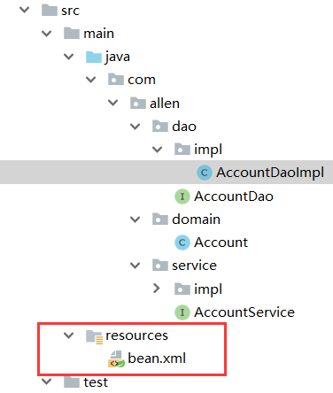
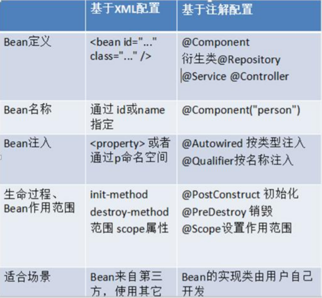
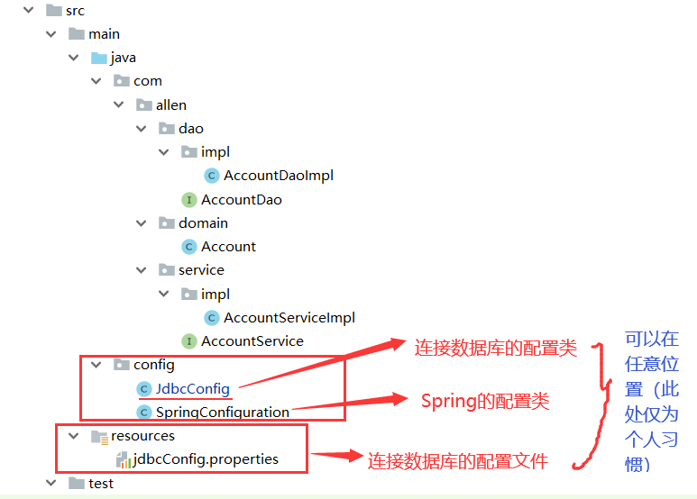
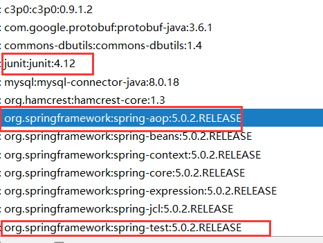

## 前言
*建议先看上篇文章（Spring学习day01）[点击访问](https://blog.csdn.net/qq_34504626/article/details/104300169)*

首先**复习一下之前的Spring基于xml的IOC配置**（通过一个案例），**这里需要说明的是：spring的IOC并不能实现持久层的操作**，而是能够将应用程序的配置和依赖性规范与实际的应用程序代码分开（**控制反转**），*通过IOC将持久层的操作进行解耦，能优化整个操作。*

## 一、案例：使用spring的IoC的实现账户的CRUD
*通过spring的IOC能够简化操作，持久层和业务逻辑层中不需要实例化对象，只需在配置文件中进行配置，就能实现功能*
### 1、需求和技术要求
#### 需求
**实现账户的CRUD操作**
#### 技术要求
* 使用**Spring的IoC实现对象的管理**
* 使用**dbutils作为持久层**解决方案
* 使用**c3p0数据源**(也可以是Druid)

### 2、环境搭建
*Eclipse可能会稍微麻烦一些，看个人习惯吧，如果使用Eclipse的，已经学习框架了，那在创建maven工程和环境搭建中一定不在话下*

#### （1）创建maven工程
**不需要选择任何的模板，直接创建**
#### （2）导入相关的jar包
* **在pom.xml中添加以下内容**
```
<!--打包方式-->
<packaging>jar</packaging>
    
    <!--导入所需的jar-->
    <dependencies>
        <!--spring的jar-->
        <dependency>
            <groupId>org.springframework</groupId>
            <artifactId>spring-context</artifactId>
            <version>5.0.2.RELEASE</version>
        </dependency>
        <!--DBUtile的jar-->
        <dependency>
            <groupId>commons-dbutils</groupId>
            <artifactId>commons-dbutils</artifactId>
            <version>1.4</version>
        </dependency>
        <!--连接数据库的jar-->
        <dependency>
            <groupId>mysql</groupId>
            <artifactId>mysql-connector-java</artifactId>
            <version>8.0.18</version>
        </dependency>
        <!--数据库连接池的jar-->
        <dependency>
            <groupId>c3p0</groupId>
            <artifactId>c3p0</artifactId>
            <version>0.9.1.2</version>
        </dependency>
        <!--单元测试的jar-->
        <dependency>
            <groupId>junit</groupId>
            <artifactId>junit</artifactId>
            <version>4.12</version>
        </dependency>
    </dependencies>
```
#### （3）创建数据库和编写实体类
*因为只是为了掌握spring的IOC知识，所以实体类设计得比较简单*
* **建表语句**
```
create table account(
    id int primary key auto_increment,
    name varchar(40),
    money float
)character set utf8 collate utf8_general_ci;
insert into account(name,money) values('aaa',1000);
insert into account(name,money) values('bbb',1000);
insert into account(name,money) values('ccc',1000);
```
* **Account实体类**
```
package com.allen.domain;

import java.io.Serializable;

public class Account implements Serializable {

    private Integer id;
    private String name;
    private Float money;

    public Integer getId() {
        return id;
    }

    public void setId(Integer id) {
        this.id = id;
    }

    public String getName() {
        return name;
    }

    public void setName(String name) {
        this.name = name;
    }

    public Float getMoney() {
        return money;
    }

    public void setMoney(Float money) {
        this.money = money;
    }

    @Override
    public String toString() {
        return "Account{" +
                "id=" + id +
                ", name='" + name + '\'' +
                ", money=" + money +
                '}';
    }
}
```

#### （4）编写持久层代码
* **持久层接口**
```
package com.allen.dao;

import com.allen.domain.Account;

import java.util.List;

/**
 * 账户的持久层接口
 */
public interface AccountDao {
    /**
     * 查询所有
     * @return
     */
    List<Account> findAllAccount();

    /**
     * 查询一个
     * @return
     */
    Account findAccountById(Integer accountId);

    /**
     * 保存操作
     * @param account
     */
    void saveAccount(Account account);

    /**
     * 更新
     * @param account
     */
    void updateAccount(Account account);

    /**
     * 删除
     * @param accountId
     */
    void deleteAccount(Integer accountId);
}

```

* **持久层接口的实现类**
```
package com.allen.dao.impl;

import com.allen.dao.AccountDao;
import com.allen.domain.Account;
import org.apache.commons.dbutils.QueryRunner;
import org.apache.commons.dbutils.handlers.BeanHandler;
import org.apache.commons.dbutils.handlers.BeanListHandler;

import java.sql.SQLException;
import java.util.List;

public class AccountDaoImpl implements AccountDao {

    private QueryRunner runner;

    public void setRunner(QueryRunner runner) {
        this.runner = runner;
    }

    @Override
    public List<Account> findAllAccount() {
        try {
            return runner.query("select * from account",new BeanListHandler<Account>(Account.class));
        } catch (SQLException e) {
            throw new RuntimeException(e);
        }
    }

    @Override
    public Account findAccountById(Integer accountId) {
        try {
            return runner.query("select * from account where id = ?",new BeanHandler<Account>(Account.class),accountId);
        } catch (SQLException e) {
            throw new RuntimeException(e);
        }
    }

    @Override
    public void saveAccount(Account account) {
        try {
            runner.update("insert into account(name,money) values(?,?) ",account.getName(),account.getMoney());
        } catch (SQLException e) {
            throw new RuntimeException(e);
        }
    }

    @Override
    public void updateAccount(Account account) {
        try {
            runner.update("update account set name=?,money=? where id=? ",account.getName(),account.getMoney(),account.getId());
        } catch (SQLException e) {
            throw new RuntimeException(e);
        }
    }

    @Override
    public void deleteAccount(Integer accountId) {
        try {
            runner.update("delete from account  where id=? ",accountId);
        } catch (SQLException e) {
            throw new RuntimeException(e);
        }
    }
}
```

#### （5）编写业务层代码
*由于业务逻辑基本没有，所以都是调用dao*
* **业务层接口**
```
package com.allen.service;

import com.allen.domain.Account;

import java.util.List;

/**
 * 账户的业务层接口
 */
public interface AccountService {
    /**
     * 查询所有
     * @return
     */
    List<Account> findAllAccount();

    /**
     * 查询一个
     * @return
     */
    Account findAccountById(Integer accountId);

    /**
     * 保存操作
     * @param account
     */
    void saveAccount(Account account);

    /**
     * 更新
     * @param account
     */
    void updateAccount(Account account);

    /**
     * 删除
     * @param accountId
     */
    void deleteAccount(Integer accountId);
}

```

* **业务层接口的实现类**
```
package com.allen.service.impl;

import com.allen.dao.AccountDao;
import com.allen.domain.Account;
import com.allen.service.AccountService;

import java.util.List;

/**
 * 账户的业务层实现类
 */
public class AccountServiceImpl implements AccountService {

    private AccountDao accountDao;

    public void setAccountDao(AccountDao accountDao) {
        this.accountDao = accountDao;
    }

    @Override
    public List<Account> findAllAccount() {
        return accountDao.findAllAccount();
    }

    @Override
    public Account findAccountById(Integer accountId) {
        return accountDao.findAccountById(accountId);
    }

    @Override
    public void saveAccount(Account account) {
        accountDao.saveAccount(account);
    }

    @Override
    public void updateAccount(Account account) {
        accountDao.updateAccount(account);
    }

    @Override
    public void deleteAccount(Integer accountId) {
        accountDao.deleteAccount(accountId);
    }
}
```

#### （6）创建并编写配置文件
**在Resource目录下创建bean.xml配置文件**，**结构**如下：

* **在bean.xml中导入约束**
```
<?xml version="1.0" encoding="UTF-8"?>
<beans xmlns="http://www.springframework.org/schema/beans"
       xmlns:xsi="http://www.w3.org/2001/XMLSchema-instance"
       xsi:schemaLocation="http://www.springframework.org/schema/beans
        http://www.springframework.org/schema/beans/spring-beans.xsd">
        
</beans>
```

### 3、配置步骤（重头戏）
#### 配置对象
这里使用了**构造函数依赖注入和set注入**，*如果不了解的话，可以看上一篇文章（Spring学习day01）[点击访问](https://blog.csdn.net/qq_34504626/article/details/104300169)*
```
<!--配置Service对象-->
    <bean id="accountService" class="com.allen.service.impl.AccountServiceImpl">
        <!--注入dao对象-->
        <property name="accountDao" ref="accountDao"></property>
    </bean>

    <!--配置dao对象-->
    <bean id="accountDao" class="com.allen.dao.impl.AccountDaoImpl">
        <!--注入QueryRunner-->
        <property name="runner" ref="runner"></property>
    </bean>

    <!--配置QueryRunner对象-->
    <bean id="runner" class="org.apache.commons.dbutils.QueryRunner" scope="prototype">
        <!--注入数据源-->
        <constructor-arg name="ds" ref="dataSource"></constructor-arg>
    </bean>

    <!--配置数据源-->
    <bean id="dataSource" class="com.mchange.v2.c3p0.ComboPooledDataSource">
        <!--连接数据库的必备信息-->
        <property name="driverClass" value="com.mysql.cj.jdbc.Driver"></property>
        <!--我使用的是MySql8.0，所以url必须这样配，如果使用mysql5.0按照以往的url进行配置即可-->
        <property name="jdbcUrl" value="jdbc:mysql://localhost:3306/eesy?useSSL=false&amp;serverTimezone=UTC"></property>
        <property name="user" value="root"></property>
        <property name="password" value="991104"></property>
    </bean>
```
### 4、测试案例
#### （1）测试类代码
```
/**
* 测试类
*/
public class AccountServiceTest {

    private AccountService as;

    @Before
    public void init() {
        ApplicationContext ac = new ClassPathXmlApplicationContext("bean.xml");
        AccountService as = ac.getBean("accountService",AccountService.class);
    }
    
    /**
     * 测试查询所有
     */
    @Test
    public void testFindAll() {
        List<Account> accounts = as.findAllAccount();
        for (Account account : accounts) {
            System.out.println(account);
        }
    }

    /**
     * 测试查询一个
     */
    @Test
    public void testFindOne() {
        Account account = as.findAccountById(1);
        System.out.println(account);
    }

    /**
     * 测试保存
     */
    @Test
    public void testSave() {
        Account account = new Account();
        account.setName("test");
        account.setMoney(12345f);
        as.saveAccount(account);
    }

    /**
     * 测试更新
     */
    @Test
    public void testUpdate() {
        Account account = as.findAccountById(4);
        account.setMoney(23456f);
        as.updateAccount(account);
    }

    /**
     * 测试删除
     */
    @Test
    public void testDelete() {
        as.deleteAccount(4);
    }
}
```
#### （2）分析测试中的问题
通过上面的测试类，可以看出，**每个测试方法都重新获取了一次Spring的核心容器，造成了不必要的重复代码，增加了我们开发的工作量**。这种情况，在开发中应该避免发生。*能不能测试时直接就编写测试方法，而不需要手动编码来获取容器呢？*
* 下面第三个内容**Spring整合Junit**，就可以**解决这一问题**

## 二、基于注解的IOC配置
### 1、写在前面
基于注解的IoC配置，首先得有一个认知，即**注解配置和xml配置要实现的功能都是一样的**，都是要**降低程序间的耦合，只是配置的形式不一样。** *关于实际的开发中到底使用xml还是注解，每家公司有着不同的使用习惯*。**所以这两种配置方式都需要掌握**。*在举例注解配置时，采用刚刚的案例，把Spring的xml配置内容改为使用注解逐步实现。*

### 2、环境搭建
#### （1）创建新的maven工程
* **将要使用的依赖jar包在pom.xml中导入**（*和上面案例中的一样，这里不再赘述*）
* **创建和上面的案例一样的包结构以及功能**（*可以直接复制src下的所有内容*）

#### （2）使用@Component注解配置管理的资源
*这里不明白注解的含义和作用没关系，下面会有写*
* **将AccountDao.java和AccountService.java稍作修改，加上注解**
* **AccountDao.java修改**
```
@Repository("accountDao")
public class AccountDaoImpl implements AccountDao {

    @Autowired
    private QueryRunner runner;
    //下面的CRUD操作在这里省略了，上面都有的
}
```

* **AccountService.java修改**
```
@Service("accountService")
public class AccountServiceImpl implements AccountService {

    @Autowired
    private AccountDao accountDao;
    //下面的CRUD操作在这里省略了
}
```
#### （3）创建Spring的xml配置文件并开启对注解的支持
**刚才案例中bean.xml配置文件中的约束仅是Spring基于XML配置IOC的约束，这里要将其换成基于注解配置IOC的约束**
```
<?xml version="1.0" encoding="UTF-8"?>
<beans xmlns="http://www.springframework.org/schema/beans"
       xmlns:xsi="http://www.w3.org/2001/XMLSchema-instance"
       xmlns:context="http://www.springframework.org/schema/context"
       xsi:schemaLocation="http://www.springframework.org/schema/beans
        http://www.springframework.org/schema/beans/spring-beans.xsd
        http://www.springframework.org/schema/context
        http://www.springframework.org/schema/context/spring-context.xsd">

    <!--告知spring在容器时要扫描的包-->
    <context:component-scan base-package="com.allen"></context:component-scan>
    <!--配置QueryRunner对象-->
    <bean id="runner" class="org.apache.commons.dbutils.QueryRunner" scope="prototype">
        <!--注入数据源-->
        <constructor-arg name="ds" ref="dataSource"></constructor-arg>
    </bean>

    <!--配置数据源-->
    <bean id="dataSource" class="com.mchange.v2.c3p0.ComboPooledDataSource">
        <!--连接数据库的必备信息-->
        <property name="driverClass" value="com.mysql.cj.jdbc.Driver"></property>
        <property name="jdbcUrl" value="jdbc:mysql://localhost:3306/eesy?useSSL=false&amp;serverTimezone=UTC"></property>
        <property name="user" value="root"></property>
        <property name="password" value="991104"></property>
    </bean>
</beans>
```

### 3、常用注解
#### （1）用于创建对象的注解
**相当于：`<bean id="" class="">`**
##### `@Component`
* **作用**：**把资源让Spring来管理**。相当于在xml中配置一个bean。
* **属性**：
    * **value**：**指定bean的id**。如果不指定value属性，默认bean的id是当前类的类名。首字母小写。

##### **`@Controller`、` @Service`、` @Repository`**
* **这三个注解都是针对`@Component`的衍生注解，他们的作用及属性都是一模一样的。**他们只不过是**提供了更加明确的语义化。**

注解名 | 应用
---|---
 @Controller | 一般用于表现层的注解。
 @Service | 一般用于业务层的注解。
 @Repository | 一般用于持久层的注解。。

* **细节**：如果注解中**有且只有一个属性要赋值**时，**且名称是value**，value在赋值是**可以不写。**

#### （2）用于注入数据的注解
**相当于：`<property name="" ref="">`或`<property name="" value="">`**
##### `@Autowired`
* **作用**：**自动按照类型注入**。**当使用注解注入属性时，set方法可以省略。** 它**只能注入其他 bean 类型**。当有**多个类型匹配时**，使用**要注入的对象变量名称作为bean的id**，在Spring容器查找，找到了也可以注入成功。**找不到就报错**。

##### `@Qualifier`
* **作用**：**在自动按照类型注入的基础之上，再按照Bean的id注入**。它在**给字段注入时不能独立使用，必须和`@Autowire`一起使用**；但是**给方法参数注入时，可以独立使用。**
* **属性**：
    * **value**：**指定bean的id。**

##### `@Resource`
* **作用**：**直接按照Bean的id注入。它也只能注入其他bean类型。**
* **属性**：
    * **name：指定bean的id。**

##### `@Value`
* **作用**：**注入基本数据类型和String类型数据的**
* **属性**：
    * **value：用于指定值**

#### （3）用于改变作用范围的注解
**相当于：`<bean id="" class="" scope="">`**
##### @Scope
* **作用**：**指定bean的作用范围。**
* **属性**：
    * **value：指定范围的值。**
     * **取值**:

     取值 | 含义
    ---|---
    singleton | 默认值，单例的。
    prototype | 多例的。
    request | WEB项目中，Spring创建一个Bean的对象，将对象存入到request域中。
    session | WEB项目中，Spring创建一个Bean的对象，将对象存入到session域中。
    globalsession | WEB项目中，应用在集群环境。如果没有集群环境，那么globalSession相当于session。

#### （4）和生命周期相关的注解(了解)
**相当于：`<bean id="" class="" init-method="" destroy-method="" />`**
##### `@PostConstruct`
* **作用：用于指定初始化方法。**

##### `@PreDestroy`
* **作用：用于指定销毁方法。**

#### （5）关于Spring注解和XML的选择问题
* **注解的优势：**
**配置简单，维护方便**（*我们找到类，就相当于找到了对应的配*置）。
* **XML的优势**：**修改时，不用改源码。不涉及重新编译和部署。**

##### Spring管理Bean方式的比较：


### 4、Spring管理对象细节
**基于注解的Spring IoC配置中，bean对象的特点和基于XML配置是一模一样的。**

### 5、Spring的纯注解配置
写到此处，**基于注解的IoC配置已经完成**，*但是大家都发现了一个问题：我们依然离不开Spring的xml配置文件，那么能不能不写这个bean.xml，所有配置都用注解来实现呢？*
当然，我们也需要注意，**选择哪种配置的原则是简化开发和配置方便，而非追求某种技术。**
#### （1）待改造的问题
*之所以我们暂时现在离不开xml配置文件，是因为我们有一句很关键的配置：*
```
<!-- 告知spring框架在，读取配置文件，创建容器时，扫描注解，依据注解创建对象，并存入容器中 -->
<context:component-scan base-package="com.allen"></context:component-scan>
```
*如果这些也能用注解配置，那么我们就离玩去哪脱离 xml 文件又进了一步。另外，数据源和dbutils的配置也需要靠注解来实现。*
```
<!--配置QueryRunner对象-->
    <bean id="runner" class="org.apache.commons.dbutils.QueryRunner" scope="prototype">
        <!--注入数据源-->
        <constructor-arg name="ds" ref="dataSource"></constructor-arg>
    </bean>

    <!--配置数据源-->
    <bean id="dataSource" class="com.mchange.v2.c3p0.ComboPooledDataSource">
        <!--连接数据库的必备信息-->
        <property name="driverClass" value="com.mysql.cj.jdbc.Driver"></property>
        <!--我使用的是MySql8.0，所以url必须这样配，如果使用mysql5.0按照以往的url进行配置即可-->
        <property name="jdbcUrl" value="jdbc:mysql://localhost:3306/eesy?useSSL=false&amp;serverTimezone=UTC"></property>
        <property name="user" value="root"></property>
        <property name="password" value="991104"></property>
    </bean>
```

#### （2）新注解说明
**在开始之前，先创建一个类，在src路径下，包名：config，类名：SpringConfiguration（Spring的配置类）**
##### `@Configuration`
* **作用**：**用于指定当前类是一个Spring配置类，当创建容器时会从该类上加载注解**。**获取容器时需要使用
`AnnotationApplicationContext`(有`@Configuration` 注解的`类.class`)。**
* **属性**：
    * **value:用于指定配置类的字节码**
* **示例代码**：
```
/**
* Spring的配置类，相当于 bean.xml 文件
*/
@Configuration
public class SpringConfiguration {
}
```
* **注意**：
    * *已经把配置文件用类来代替了，但是如何配置创建容器时要扫描的包呢？*
    * **请看下一个注解**

##### `@ComponentScan`
* **作用**：**用于指定Spring在初始化容器时要扫描的包。** 作用和在Spring的xml配置文件中的：
`<context:component-scan base-package="com.allen"/>`是一样的。
* **属性**：
    * **basePackages：用于指定要扫描的包。和该注解中的value属性作用一样**。
* **示例代码**：
```
/**
* spring 的配置类，相当于 bean.xml 文件
*/
@Configuration
@ComponentScan("com.allen")
public class SpringConfiguration {
}
```
*已经配置好了要扫描的包，但是数据源和dbutils对象如何从配置文件中移除呢？
请看下一个注解。*

**在进行下一个注解的学习之前，先在src/config路径下创建一个类，类名：JdbcConfig**
##### `@Bean`
* **作用**：该注解只能写在方法上，表明使用此方法创建一个对象，并且放入Spring容器。
* **属性**：
    * **name：给当前`@Bean`注解方法创建的对象指定一个名称(即bean的id）。**
* **示例代码**：
```
/**
* 连接数据库的配置类
*/
public class JdbcConfig {
    /**
     * 用于创建一个QueryRunner对象
     * @param
     * @return
     */
    @Bean(name = "runner")
    @Scope("prototype")
    public QueryRunner createQueryRunner(@Qualifier("ds2") DataSource dataSource){
        return new QueryRunner(dataSource);
    }

    /**
     * 创建数据源对象
     * @return
     */
    @Bean(name = "dataSource")
    public DataSource createDataSource() {
        try {
            ComboPooledDataSource ds = new ComboPooledDataSource();
            ds.setUser("root");
            ds.setPassword("991104");
            ds.setDriverClass("com.mysql.cj.jdbc.Driver");
            ds.setJdbcUrl("jdbc:mysql://localhost:3306/eesy?useSSL=false&serverTimezone=UTC");
            return ds;
        } catch (Exception e) {
            throw new RuntimeException(e);
        }
    }
}
```
*现在已经把数据源和QueryRunner（dbutils中的类）从配置文件中移除了，此时可以删除bean.xml了。
但是由于没有了配置文件，创建数据源的配置又都写死在类中了。如何把它们配置出来呢？
请看下一个注解。*

##### `@PropertySource`
* **作用**：**用于加载`xxxx.properties`文件中的配置。** *例如我们配置数据源时，可以把连接数据库的信息写到properties配置文件中，就可以使用此注解指定properties 配置文件的位置。*
* **属性**：
    * **value[]：用于指定properties文件位置。如果是在类路径下，需要写上`classpath:`**
* **示例代码**：
* **在resources目录下创建jdbcConfig.properties配置文件**（*名字随便起都可以，个人习惯*）：
```
jdbc.driver=com.mysql.cj.jdbc.Driver
jdbc.url=jdbc:mysql://localhost:3306/eesy?useSSL=false&serverTimezone=UTC
jdbc.username=root
jdbc.password=991104
```
* **替换JdbcConfig数据库连接配置类的代码如下**
```
package config;

import com.mchange.v2.c3p0.ComboPooledDataSource;
import org.apache.commons.dbutils.QueryRunner;
import org.springframework.beans.factory.annotation.Qualifier;
import org.springframework.beans.factory.annotation.Value;
import org.springframework.context.annotation.Bean;
import org.springframework.context.annotation.Scope;

import javax.sql.DataSource;

/**
 * 和spring连接数据库相关的配置类
 */

public class JdbcConfig {

    @Value("${jdbc.driver}")
    private String driver;

    @Value("${jdbc.url}")
    private String url;

    @Value("${jdbc.username}")
    private String username;

    @Value("${jdbc.password}")
    private String password;
    /**
     * 用于创建一个QueryRunner对象
     * @param
     * @return
     */
    @Bean(name = "runner")
    @Scope("prototype")
    public QueryRunner createQueryRunner(@Qualifier("ds2") DataSource dataSource){
        return new QueryRunner(dataSource);
    }

    /**
     * 创建数据源对象
     * @return
     */
    @Bean(name = "dataSource")
    public DataSource createDateSource(){
        try {
            ComboPooledDataSource ds = new ComboPooledDataSource();

            ds.setDriverClass(driver);
            ds.setJdbcUrl(url);
            ds.setUser(username);
            ds.setPassword(password);
            return ds;
        } catch (Exception e) {
            throw new RuntimeException(e);
        }
    }
}
```
*此时我们已经有了两个配置类，但是他们还没有关系。如何建立他们的关系呢？
请看下一个注解。*

##### `@Import`
* **作用**：**用于导入其他配置类**，*在引入其他配置类时，可以不用再写`@Configuration`注解。当然，写上也没问题。*
* **属性**：
    * **value[]：用于指定其他配置类的字节码。**
* **示例代码**（仅是类中使用注解的部分，中间内容省略）：
* Spring配置类SpringConfiguration
```
@Configuration
@ComponentScan("com.allen")
@Import({JdbcConfig.class})
public class SpringConfiguration {
    //中间代码此处省略
}
```
* jdbc配置类JdbcConfig
```
@Configuration
@PropertySource("classpath:jdbc.properties")
public class JdbcConfig{
    //中间代码此处省略
}
```

*我们已经把要配置的都配置好了，但是新的问题产生了，由于没有配置文件了，如何获取容器呢？*

##### 通过注解获取容器
**通过ApplicationContext接口的实现类AnnotationConfigApplicationContext的构造函数实现获取。**
```
ApplicationContext ac = new AnnotationConfigApplicationContext(SpringConfiguration.class);
```

#### （3）工程结构图


## 三、Spring整合Junit
### 1、测试类中的问题和解决思路
#### （1）问题
**在测试类中，每个测试方法都要执行以下两行代码**：
```
ApplicationContext ac = new ClassPathXmlApplicationContext("bean.xml");
AccountService as = ac.getBean("accountService",AccountService.class);
```
这两行代码的**作用是获取容器，如果不写的话，直接会提示空指针异常**。所以又不能轻易删掉。

#### （2）解决思路分析
针对上述问题，我们需要的是**程序能自动创建容器**。一旦程序开始执行能自动为我们创建Spring容器，就**无须手动创建**了，问题也就解决了。

**junit单元测试是无法实现的**，因为它自己无法知晓是否使用了Spring框架，更不用说自动创建Spring容器了。不过好在，**junit暴露了一个注解，可以替换掉它的运行器**。

**这时，需要依靠Spring框架，因为它提供了一个运行器，可以读取配置文件（或注解）来创建容器。我们只需要告诉它配置文件在哪就行了。**

### 2、配置步骤
#### （1）导入Spring整合junit的jar包到lib目录
* *如果是手动导包的话，此处需要注意的是，导入jar包后，需要导入一个Spring中aop的jar包。*

* **使用maven的话直接导入坐标（jar包）**
```
<dependency>
    <groupId>org.springframework</groupId>
    <artifactId>spring-test</artifactId>
    <version>5.0.2.RELEASE</version>
</dependency>
<dependency>
    <groupId>junit</groupId>
    <artifactId>junit</artifactId>
    <version>4.12</version>
</dependency>

```
#### （2）使用`@RunWith`注解替换原有运行器
**在test目录下创建测试类，包名：com.allen.test，类名：AccountServiceTest**
```
/**
* 测试类
*/
@RunWith(SpringJUnit4ClassRunner.class)
public class AccountServiceTest {
    
}
```
#### （3）使用`@ContextConfiguration`指定Spring配置文件的位置
```
/**
* 测试类
*/
@RunWith(SpringJUnit4ClassRunner.class)
@ContextConfiguration(locations= {"classpath:bean.xml"})
public class AccountServiceTest {

}
```
* **`@ContextConfiguration`注解：**
    * **locations属性：用于指定配置文件的位置。如果是类路径下，需要用`classpath:`表明**
    * **classes属性：用于指定注解的类**。*当不使用xml配置时，需要用此属性指定注解类的位置。*

#### （4）使用@Autowired 给测试类中的变量注入数据
```
/**
* 测试类
*/
@RunWith(SpringJUnit4ClassRunner.class)
@ContextConfiguration(locations= {"classpath:bean.xml"})
public class AccountServiceTest {
    @Autowired
    private AccountService as ;
}
```

#### （5）编写测试方法完成测试（根据实际情况进行）
```
package com.allen.test;

import com.allen.domain.Account;
import com.allen.service.AccountService;
import config.JdbcConfig;
import config.SpringConfiguration;
import org.junit.After;
import org.junit.Before;
import org.junit.Test;
import org.junit.runner.RunWith;
import org.springframework.beans.factory.annotation.Autowired;
import org.springframework.context.ApplicationContext;
import org.springframework.context.annotation.AnnotationConfigApplicationContext;
import org.springframework.context.support.ClassPathXmlApplicationContext;
import org.springframework.test.context.ContextConfiguration;
import org.springframework.test.context.junit4.SpringJUnit4ClassRunner;

import java.util.List;

@RunWith(SpringJUnit4ClassRunner.class)
@ContextConfiguration(classes = SpringConfiguration.class)
public class AccountServiceTest {

    @Autowired
    private AccountService as;

    @Test
    public void testFindAll() {
        List<Account> accounts = as.findAllAccount();
        for (Account account : accounts) {
            System.out.println(account);
        }
    }
    @Test
    public void testFindOne() {
        Account account = as.findAccountById(1);
        System.out.println(account);
    }
    @Test
    public void testSave() {
        Account account = new Account();
        account.setName("test anno");
        account.setMoney(12345f);
        as.saveAccount(account);
    }
    @Test
    public void testUpdate() {
        Account account = as.findAccountById(4);
        account.setMoney(23456f);
        as.updateAccount(account);
    }
    @Test
    public void testDelete() {
        as.deleteAccount(4);
    }
}
```

### 3、为什么不把测试类配到xml中
* *在解释这个问题之前，先解除一个疑虑，配到XML中能不能用呢？*
    * **答案是肯定的，可以使用。**
* *那么为什么不采用配置到xml中的方式呢？*
    * **第一**：当在xml中配置了一个bean，**Spring加载配置文件创建容器时，就会创建对象**。(显然没有必要)
    * **第二**：测试类**只是在测试功能时使用**，而在项目中它**并不参与程序逻辑**，也不会解决需求上的问题，所以创建完了，并**没有使用。那么存在容器中就会造成资源的浪费。**
* **所以，基于以上两点，不应该把测试配置到xml文件中。**


## 写在最后
*虽然刚开始接触Spring框架，但是能确确实实地感受到Spring框架的魅力，这或许也是Spring能够成为现如今Java开发的主流框架之一的原因吧！加油，努力学习本领技能。同时在疫情期间，作为一名当代青年，愿祖国早日战胜疫情，迎来属于全国人民的Spring（这里取得是春天之意）*