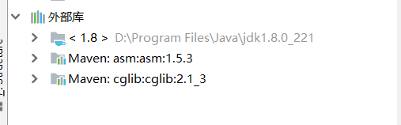

## 一、AOP的相关概念
### 1、AOP概述
#### （1）什么是AOP
**AOP：全称是Aspect Oriented Programming，即：面向切面编程。**


* 简单的说它就是**把程序中重复的代码抽取出来，在需要执行的时候，使用动态代理的技术，在不修改源码的基础上，对已有方法进行增强**。

#### （2）AOP的作用及优势
* **作用**：**在程序运行期间，不修改源码对已有方法进行增强。**
* **优势**：
    *  **减少重复代码**
    *  **提高开发效率**
    *  **维护方便**

#### （3）AOP的实现方式
**使用动态代理技术**

### 2、AOP的具体应用
#### （1）案例中问题
**分析** *上篇文章（Spring学习day02（基于注解的IOC配置、Spring整合Junit））[点击访问](https://blog.csdn.net/qq_34504626/article/details/104910295)* 中的案例（这是之前写的账户信息增删改查例子）。 下面是客户的**业务层实现类**。（有问题，而且很严重）
```
/**
* 账户的业务层实现类
*/
public class AccountServiceImpl implements AccountService {
    private IAccountDao accountDao;
    public void setAccountDao(IAccountDao accountDao) {
        this.accountDao = accountDao;
    }
    @Override
    public void saveAccount(Account account) throws SQLException {
        accountDao.save(account);
    }
    @Override
    public void updateAccount(Account account) throws SQLException{
        accountDao.update(account);
    }
    @Override
    public void deleteAccount(Integer accountId) throws SQLException{
        accountDao.delete(accountId);
    }
    @Override
    public Account findAccountById(Integer accountId) throws SQLException {
        return accountDao.findById(accountId);
    }
    @Override
    public List<Account> findAllAccount() throws SQLException{
        return accountDao.findAll();
    }
}
```
*打眼一看，这不就正常的增产改查有啥问题？其实不然*。

**所有的事务被自动控制了**。换言之，**在使用connection 对象时将自动提交设置为true**即`setAutoCommit(true)`，这种方式控制事务，如果我们**每次都执行一条sql语句，没有问题**，但是如果业务方法一次要**执行多条sql语句，这种方式就无法实现功能了**。

如果现在，**在业务层中多加入一个方法**。
* **业务层接口**
```
/**
* 转账
* @param sourceName
* @param targetName
* @param money
*/
void transfer(String sourceName,String targetName,Float money);
```
* **业务层实现类**：
```
@Override
public void transfer(String sourceName, String targetName, Float money) {
    //根据名称查询两个账户信息
    Account source = accountDao.findByName(sourceName);
    Account target = accountDao.findByName(targetName);
    //转出账户减钱，转入账户加钱
    source.setMoney(source.getMoney()-money);
    target.setMoney(target.getMoney()+money);
    //更新两个账户
    accountDao.update(source);
    
    int i=1/0; //模拟转账异常
    
    accountDao.update(target);
}
```
当执行时，由于执行有异常，转账失败。但是因为**每次执行持久层方法都是独立事务，导致无法实现事务控制（不符合事务的一致性）**，你会发现：在执行完上述的转账操作，会抛出除数为零的异常，此时，肯定代表着转帐失败，但是查询数据库发现，有一个账户的钱已经转出去了，而另一个账户没有收到钱，这是非常严重的问题。


#### （2）问题的解决
* **解决办法**：**让业务层来控制事务的提交和回滚。**
* **改造后的业务层实现类**：（**此处没有使用spring的 IoC**）
```
/**
* 账户的业务层实现类
*/
public class AccountServiceImpl implements AccountService {
    private AccountDao accountDao = new AccountDaoImpl();
    @Override
    public void saveAccount(Account account) {
        try {
            TransactionManager.beginTransaction();
            accountDao.save(account);
            TransactionManager.commit();
        } catch (Exception e) {
            TransactionManager.rollback();
            e.printStackTrace();
        }finally {
            TransactionManager.release();
        }
    }
    @Override
    public void updateAccount(Account account) {
        try {
            TransactionManager.beginTransaction();
            accountDao.update(account);
            TransactionManager.commit();
        } catch (Exception e) {
            TransactionManager.rollback();
            e.printStackTrace();
        }finally {
            TransactionManager.release();
        }
    }
    @Override
    public void deleteAccount(Integer accountId) {
        try {
            TransactionManager.beginTransaction();
            accountDao.delete(accountId);
            TransactionManager.commit();
        } catch (Exception e) {
            TransactionManager.rollback();
            e.printStackTrace();
        }finally {
            TransactionManager.release();
        }
    }
    @Override
    public Account findAccountById(Integer accountId) {
        Account account = null;
        try {
            TransactionManager.beginTransaction();
            account = accountDao.findById(accountId);
            TransactionManager.commit();
            return account;
        } catch (Exception e) {
            TransactionManager.rollback();
            e.printStackTrace();
        }finally {
            TransactionManager.release();
        }
        return null;
    }
    @Override
    public List<Account> findAllAccount() {
    List<Account> accounts = null;
        try {
            TransactionManager.beginTransaction();
            accounts = accountDao.findAll();
            TransactionManager.commit();
            return accounts;
        } catch (Exception e) {
            TransactionManager.rollback();
            e.printStackTrace();
        }finally {
            TransactionManager.release();
        }
        return null;
    }
    @Override
    public void transfer(String sourceName, String targetName, Float money) {
        try {
            TransactionManager.beginTransaction();
            Account source = accountDao.findByName(sourceName);
            Account target = accountDao.findByName(targetName);
            source.setMoney(source.getMoney()-money);
            target.setMoney(target.getMoney()+money);
            accountDao.update(source);
            
            int i=1/0;
            accountDao.update(target);
            TransactionManager.commit();
        } catch (Exception e) {
            TransactionManager.rollback();
            e.printStackTrace();
        }finally {
            TransactionManager.release();
        }
    }
}
```
* **TransactionManager类的代码**：
```
/**
* 事务控制类
*/
public class TransactionManager {
    //定义一个 DBAssit
    private static DBAssit dbAssit = new DBAssit(C3P0Utils.getDataSource(),true);
    //开启事务
    public static void beginTransaction() {
        try {
            dbAssit.getCurrentConnection().setAutoCommit(false);
        } catch (SQLException e) {
            e.printStackTrace();
        }
    }
    //提交事务
    public static void commit() {
        try {
            dbAssit.getCurrentConnection().commit();
        } catch (SQLException e) {
            e.printStackTrace();
        }
    }
    //回滚事务
    public static void rollback() {
        try {
            dbAssit.getCurrentConnection().rollback();
        } catch (SQLException e) {
            e.printStackTrace();
        }
    }
    //释放资源
    public static void release() {
        try {
            dbAssit.releaseConnection();
        } catch (Exception e) {
            e.printStackTrace();
        }
    }
}
```
#### （3）新的问题
通过对业务层改造，已经**可以实现事务控制了**，但是由于我们添加了事务控制，也**产生了一个新的问题**：
业务层方法变得**臃肿**了，里面充斥着**很多重复代码**。并且**业务层方法和事务控制方法耦合**了。

*试想一下，如果此时提交，回滚，释放资源中任何一个方法名变更，都需要修改业务层的代码，况且这还只是一个业务层实现类，而实际的项目中这种业务层实现类可能有十几个甚至几十个。*

这个问题能不能解决呢？答案是可以解决，怎么解决呢？**动态代理**

#### （4）动态代理回顾
##### 动态代理的特点
* **字节码随用随创建，随用随加载。**
* 它**与静态代理的区别**：因为静态代理是字节码一上来就创建好，并完成加载。
* **装饰者模式**就是**静态代理**的一种体现。

##### 动态代理常用的有两种方式
* **基于接口的动态代理**
    * **提供者：JDK官方的Proxy类**
    * **要求：被代理类最少实现一个接口**
* **基于子类的动态代理**
    * **提供者：第三方的CGLib**
    * **要求：被代理类不能用final修饰的类**（最终类）。

*下面将两种动态代理的方式分别演示一下*

##### 使用JDK官方的Proxy类创建代理对象
这里我使用的是一个**电脑厂商生产和销售电脑**的例子：
* 早期电脑**厂商**刚开始生产电脑时，销售大多是由厂商自己公司的销售人员进行，逐渐地规模越来越大，出现了一种连接消费者和厂商之间的人，称为代理商，**代理商**从厂家拿到产品，再加价买给**用户**。代理商越做越大，会提出一些要求，比如：厂家免费售后、厂家只能销售给代理商等等。


**下面用代码演示出来：**（这里**仅仅模拟代理的环节**，其中的业务没有书写，**其旨在理解代理的过程和动态代理的实现**）
* **IProducer接口模拟代理商对厂家的要求**（售后和销售价格）
```
package com.allen.proxy;

/**
 * 对生产厂家要求的接口
 */
public interface IProducer {

    /**
     * 销售
     * @param money
     */
    public void saleProduct(float money);

    /**
     * 售后
     * @param money
     */
    public void afterService(float money);
}
```
* **Producer实现类模拟厂家符合代理商的要求**（售后和销售价格）
```
package com.allen.cglib;

import com.allen.proxy.IProducer;

/**
 * 一个生产者
 */
public class Producer{

    /**
     * 销售
     * @param money
     */
    public void saleProduct(float money){
        System.out.println("销售产品，共拿到钱："+money);
    }

    /**
     * 售后
     * @param money
     */
    public void afterService(float money){
        System.out.println("提供售后服务，并拿到钱："+money);
    }
}
```
* **Client实体类模拟一个消费者**
```
package com.allen.proxy;

import java.lang.reflect.InvocationHandler;
import java.lang.reflect.Method;
import java.lang.reflect.Proxy;

/**
 *  模拟一个消费者
 */
public class Client {
    public static void main(String[] args) {
        final Producer producer = new Producer();

        /**
         * 动态代理：
         *  特点：字节码随用随创建，随用随加载
         *  作用：不修改源码的基础上对方法增强
         *  分类：
         *      基于接口的动态代理
         *      基于子类的动态代理
         *   基于接口的动态代理
         *      涉及的类：Proxy
         *      提供者：JDK官方
         *   如何创建代理对象：
         *      使用Proxy类中的newProxyInstance方法
         *   创建代理对象的要求：
         *      被代理类最少实现一个接口，如果没有则不能使用
         *   newProxyInstance方法的参数：
         *      ClassLoader：类加载器
         *          它是用于加载代理对象字节码，和被代理对象使用相同的类加载器。固定写法
         *      Class[]：字节码数组
         *          它是用于让代理对象和被代理对象有相同方法
         *      InvocationHandler：用于提供增强的代码
         *          它是让我们写如何代理。我们一般都是写一个该接口的是实现类，通常情况下都是匿名内部类，但不是必须的
         *          此接口的实现类都是谁用谁写
         */
        IProducer proxyProducer = (IProducer) Proxy.newProxyInstance(producer.getClass().getClassLoader(),
                producer.getClass().getInterfaces(),
                new InvocationHandler() {
                    /**
                     * 作用：执行被代理对象的任何接口方法都会经过该方法
                     * 方法参数的含义
                     * @param proxy     代理对象的引用
                     * @param method    当前执行的方法
                     * @param args      当前执行方法所需的参数
                     * @return          和被代理对象方法有相同的返回值
                     * @throws Throwable
                     */
                    @Override
                    public Object invoke(Object proxy, Method method, Object[] args) throws Throwable {
                        //提供增强的代码
                        Object returnValue = null;
                        //1、获取方法执行的参数
                        Float money = (Float)args[0];
                        //2、判断当前方法是不是销售
                        if("saleProduct".equals(method.getName())){
                            returnValue = method.invoke(producer, money*0.8f);
                        }
                        return returnValue;
                    }
                });

        proxyProducer.saleProduct(10000f);
    }
}
```

##### 使用CGLib的Enhancer类创建代理对象
**首先需要导入CGLib的jar包**，导入结果如下：


在这里我创建的是一个**普通的maven工程，pom.xml中添加以下依赖**：
```
<dependencies>
    <dependency>
        <groupId>cglib</groupId>
        <artifactId>cglib</artifactId>
        <version>2.1_3</version>
    </dependency>
</dependencies>
```

如果使用创建普通的java工程，先导入CGLib的jar包，*如果报asmxxxx异常，需要导入asm.jar。*

* **Producer实现类模拟厂家符合代理商的要求**（售后和销售价格），**不实现接口**
```
package com.allen.cglib;

/**
 * 一个生产者
 */
public class Producer{

    /**
     * 销售
     * @param money
     */
    public void saleProduct(float money){
        System.out.println("销售产品，共拿到钱："+money);
    }

    /**
     * 售后
     * @param money
     */
    public void afterService(float money){
        System.out.println("提供售后服务，并拿到钱："+money);
    }
}
```
* **现在继续模拟一个消费者Client**
```
package com.allen.cglib;

import com.allen.proxy.IProducer;
import net.sf.cglib.proxy.Enhancer;
import net.sf.cglib.proxy.MethodInterceptor;
import net.sf.cglib.proxy.MethodProxy;

import java.lang.reflect.InvocationHandler;
import java.lang.reflect.Method;
import java.lang.reflect.Proxy;

/**
 *  模拟一个消费者
 */
public class Client {
    public static void main(String[] args) {
        final Producer producer = new Producer();

        /**
         * 动态代理：
         *  特点：字节码随用随创建，随用随加载
         *  作用：不修改源码的基础上对方法增强
         *  分类：
         *      基于接口的动态代理
         *      基于子类的动态代理
         *   基于子类的动态代理
         *      涉及的类：Enhancer
         *      提供者：第三方cglib库
         *   如何创建代理对象：
         *      使用Enhancer类中的create方法
         *   创建代理对象的要求：
         *      被代理类不能是最终类
         *   create方法的参数：
         *      Class：字节码
         *          它是用于指定被代理对象的字节码
         *
         *      Callback：用于提供增强的代码
         *          它是让我们写如何代理。我们一般都是写一个该接口的是实现类，通常情况下都是匿名内部类，但不是必须的
         *          此接口的实现类都是谁用谁写
         *          我们一般写的都是该接口的子接口实现类，MethodInterceptor
         */
        Producer cglibProducer = (Producer)Enhancer.create(producer.getClass(), new MethodInterceptor() {
            /**
             * 执行被代理对象的任何方法都会经过该方法
             * @param proxy
             * @param method
             * @param args
             *      以上三个参数和基于接口的动态代理中invoke方法的参数是一样的
             * @param methodProxy：当前执行方法的代理对象
             * @return
             * @throws Throwable
             */
            @Override
            public Object intercept(Object proxy, Method method, Object[] args, MethodProxy methodProxy) throws Throwable {
                //提供增强的代码
                Object returnValue = null;
                //1、获取方法执行的参数
                Float money = (Float) args[0];
                //2、判断当前方法是不是销售
                if ("saleProduct".equals(method.getName())) {
                    returnValue = method.invoke(producer, money * 0.8f);
                }
                return returnValue;
            }
        });
        cglibProducer.saleProduct(12000f);
    }
}
```
我想在座的各位肯定会想到**一个问题**，通过这个模拟代理过程，*代理到底有什么意义？下面再回到一开始的账户转账的案例中来*。**使用代理就能解绝刚才的事务管理问题，并且业务层代码不会出现像刚才一样臃肿。**

#### （5）解决案例中的问题
*废话不多说，直接上代码*
```
/**
* 用于创建客户业务层对象工厂（当然也可以创建其他业务层对象，只不过此处不做那么繁琐）
*/
public class BeanFactory {
    /**
    * 创建账户业务层实现类的代理对象
    * @return
    */
    public static IAccountService getAccountService() {
        //1.定义被代理对象
        final AccountService accountService = new AccountServiceImpl();
        //2.创建代理对象
        AccountService proxyAccountService = (AccountService)
        Proxy.newProxyInstance(accountService.getClass().getClassLoader(),accountService.getClass().getInterfaces(),new nvocationHandler() {
            /**
            * 执行被代理对象的任何方法，都会经过该方法。
            * 此处添加事务控制
            */
            @Override
            public Object invoke(Object proxy, Method method, 
            Object[] args) throws Throwable {
                Object rtValue = null;
                try {
                    //开启事务
                    TransactionManager.beginTransaction();
                    //执行业务层方法
                    rtValue = method.invoke(accountService, args);
                    //提交事务
                    TransactionManager.commit();
                }catch(Exception e) {
                    //回滚事务
                    TransactionManager.rollback();
                    e.printStackTrace();
                }finally {
                    //释放资源
                    TransactionManager.release();
                }
                return rtValue;
            }
        });
        return proxyAccountService;
    }
}
```
**当改造完成之后，业务层用于控制事务的重复代码就都可以删掉了。**

*是不是感觉瞬间就不一样了呢？一直代理一直爽，有没有*

**下面开始来说主角，Spring中的AOP，它可以做到只需要配置就能完成这些动态代理以及事务控制。**

## 二、Spring中的AOP
### 1、Spring中AOP的细节
学习Spring的AOP，就是**通过配置的方式**，**实现**刚才的**功能**。
#### （1）AOP相关术语
*先了解一下，后面通过示例就可以明白其意*
* **Joinpoint(连接点)**:
    * **所谓连接点是指那些被拦截到的点。在Spring中,这些点指的是方法,因为Spring只支持方法类型的
    连接点。**
* **Pointcut(切入点)**:
    * **所谓切入点是指要对哪些Joinpoint进行拦截的定义。**
    * **例如**：刚才的转账案例中IProducer接口中定义的方法，也就是**要通过动态代理代理拦截进行加强的方法**。
* **Advice(通知/增强)**:
    * **所谓通知是指拦截到Joinpoint之后所要做的事情就是通知。**
    * **例如**：刚才的转账案例中BeanFactory的动态代理中引用的那几个方法，也就是**实现动态代理中对方法进行增强的那几个方法**。（*可能有些抽象，下面有一张图，一看便知*）
    * **通知的类型**：**前置通知,后置通知,异常通知,最终通知,环绕通知**
    
* **Introduction(引介)**:
    * **引介是一种特殊的通知在不修改类代码的前提下,Introduction可以在运行期为类动态地添加一些方法或Field**。（*在现在我这个比较菜的阶段不会用到这个东西，了解一下就行了*）
* **Target(目标对象)**:**代理的目标对象**。（*没什么好说的*）
* **Weaving(织入)**:
    * **织入是指把增强应用到目标对象来创建新的代理对象的过程。Spring采用动态代理织入**，*而AspectJ采用编译期织入和类装载期织入*。
    * 可以这样理解，**原本在Service业务层中定义的方法不能实现事务管理**，而**在BeanFactory中通过动态代理来实现**事务控制时，**加入那些事务管理的方法（也就是刚说的通知）的过程就是Weaving（织入）**
* **Proxy（代理）**:**一个类被AOP织入增强后，就产生一个结果代理类。**
* **Aspect(切面)**:**是切入点和通知（引介）的结合**。（*个人理解就是BeanFactory中通过动态代理增强方法后得到的能够实现整个事务控制的方法*）

#### （2）学习Spring中的AOP要明确的事
* **开发阶段**
    * **编写核心业务代码（开发主线）**（大部分程序员来做，要求熟悉业务需求）
    * **把公用代码抽取出来，制作成通知。（开发阶段最后再做）**（AOP编程人员来做）—
    * **在配置文件中，声明切入点与通知间的关系，即切面。**（AOP编程人员来做）
    * **现在是学习阶段，所有操作都是我们自己做**
* **运行阶段（Spring框架完成的）**
    * **Spring框架监控切入点方法的执行**。一旦监控到切入点方法**被运行，使用代理机制，动态创建目标对象的代理对象**，**根据通知类别，在代理对象的对应位置，将通知对应的功能织入**，完成完整的代码逻辑运行。

#### （3）关于代理的选择
**在Spring中，框架会根据目标类是否实现了接口来决定采用哪种动态代理的方式。**

### 2、基于XML的AOP配置
*在进行配置以学习使用Spring的AOP时，选用的示例是模拟账户操作（CRUD操作用打印语句代替，旨在掌握Spring的AOP如何使用和配置）*
#### （1）环境搭建
##### 第一步：创建普通maven工程导入jar包（坐标）
**直接选择maven工程不需要选择模板直接创建，添加需要导入的依赖jar包坐标**如下：
```
<!--打包方式-->
<packaging>jar</packaging>
<!--所需依赖jar包-->
<dependencies>
    <!--spring的jar-->
    <dependency>
        <groupId>org.springframework</groupId>
        <artifactId>spring-context</artifactId>
        <version>5.0.2.RELEASE</version>
    </dependency>
    <!--切入点表达式的jar包，后面会用到-->
    <dependency>
        <groupId>org.aspectj</groupId>
        <artifactId>aspectjweaver</artifactId>
        <version>1.8.7</version>
    </dependency>
</dependencies>
```
*创建普通的java工程也可以，导入jar包即可，这里使用maven是因为比较方便，并且后期做项目都会使用到maven*
##### 第二步：准备必要的代码
*此处包含了实体类业务层代码，都只是在模拟实现操作，所以也没必要加入持久层代码*
* **业务层接口AccountService**
```
package com.allen.service;
/**
 * 账户的业务层接口
 */
public interface AccountService {

    /**
     * 模拟保存账户
      */
    void saveAccount();

    /**
     * 模拟更新账户
     * @param i
     */
    void updateAccount(int i);

    /**
     * 删除账户
     * @return
     */
    int deleteAccount();
}

```
* **业务层接口实现类AccountServiceImpl**（*重要的事说三遍，我实在模拟操作，不喜勿喷哈*）
```
package com.allen.service.impl;

import com.allen.service.AccountService;

/**
 * 账户的业务层实现类
 */
public class AccountServiceImpl implements AccountService {
    @Override
    public void saveAccount() {
        System.out.println("执行了保存");
    }

    @Override
    public void updateAccount(int i) {
        System.out.println("执行了更新"+i);
    }

    @Override
    public int deleteAccount() {
        System.out.println("执行了删除");
        return 0;
    }
}
```

##### 第三步：创建Spring的配置文件并导入约束
**在Resource目录下创建bean.xml配置文件，配置如下内容（Spring配置所需的约束）**
```
<?xml version="1.0" encoding="UTF-8"?>
<beans xmlns="http://www.springframework.org/schema/beans"
     xmlns:xsi="http://www.w3.org/2001/XMLSchema-instance"
     xmlns:aop="http://www.springframework.org/schema/aop"
     xsi:schemaLocation="http://www.springframework.org/schema/beans
     http://www.springframework.org/schema/beans/spring-beans.xsd
     http://www.springframework.org/schema/aop
     http://www.springframework.org/schema/aop/spring-aop.xsd">
</beans>
```

##### 第四步：配置Spring的IOC
```
<!--配置spring的IOC，把service对象配置起来-->
    <bean id="accountService" class="com.allen.service.impl.AccountServiceImpl"></bean>
```

##### 第五步：抽取公共代码制作成通知
* *这里模拟得比较简单，旨在理解配置过程*
```
package com.allen.utils;
/**
 * 用于记录日志的工具类，它里面提供了公共代码
 */
public class Logger {
    /**
     * 前置通知
     */
    public void beforePrintLog(){
        System.out.println("前置通知Logger类中的beforePrintLog方法开始记录日志了。。。");
    }

    /**
     * 后置通知
     */
    public void afterReturningPrintLog(){
        System.out.println("后置通知Logger类中的afterReturningPrintLog方法开始记录日志了。。。");
    }

    /**
     * 异常通知
     */
    public void afterThrowingPrintLog(){
        System.out.println("异常通知Logger类中的afterThrowingPrintLog方法开始记录日志了。。。");
    }

    /**
     * 最终通知
     */
    public void afterPrintLog(){
        System.out.println("最终通知Logger类中的afterPrintLog方法开始记录日志了。。。");
    }
}
```

#### （2）配置步骤
##### 第一步：把通知类用`bean`标签配置起来
```
<!--配置Logger类-->
    <bean id="logger" class="com.allen.utils.Logger"></bean>
```
##### 第二步：使用`aop:config`声明AOP配置
* **`aop:config`:**
    * **作用：用于声明开始AOP的配置**
```
<aop:config>
    
    <!-- 配置的代码都写在此处 -->
    
</aop:config>
```

##### 第三步：使用`aop:aspect`配置切面
* **`aop:aspect`:**
    * **作用：用于配置切面。**
    * **属性**：
    
    属性名 | 含义
    ---|---
    id | 给切面提供一个唯一标识
    ref | 引用配置好的通知类bean的id

```
<!--配置切面-->
<aop:aspect id="logAdvice" ref="logger">

    <!--配置通知的类型要写在此处-->
    
</aop:aspect>
```

##### 第四步：使用`aop:pointcut`配置切入点表达式
* **`aop:pointcut`**：
    * **作用：用于配置切入点表达式。** *就是指定对哪些类的哪些方法进行增强*
    * **属性**：
    
    属性名 | 含义
    ---|---
    expression | 用于定义切入点表达式
    id | 用于给切入点表达式提供一个唯一标识

```
<!--配置切入点表达式，id属性用于指定表达式的唯一标识。expression属性用于指定表达式内容
                此标签写在aop:aspect标签内部只能当前切面使用。
                它还可以写在aop:aspect外面，此时就变成了所有切面可用
            -->
<aop:pointcut id="pt1" expression="execution(* com.allen.service.impl.*.*(..))"></aop:pointcut>
```

##### 第五步：使用`aop:xxx`配置对应的通知类型
* **`aop:before`**
    * **作用：用于配置前置通知**。*指定增强的方法在切入点方法之前执行*
    * **属性**：
    
    属性名 | 含义
    ---|---
    method | 用于指定通知类中的增强方法名称
    ponitcut-ref | 用于指定切入点的表达式的引用
    poinitcut | 用于指定切入点表达式

    * **执行时间点**：**切入点方法执行之前执行**

```
<!--配置前置通知：在切入点方法执行之前执行-->
<aop:before method="beforePrintLog" pointcut-ref="pt1"></aop:before>
```

* **`aop:after-returning`**
    * **作用：用于配置后置通知**
    * **属性**：
 
    属性名 | 含义
    ---|---
    method | 指定通知中方法的名称
    ponitcut-ref | 指定切入点表达式的引用
    pointcut | 定义切入点表达式

    * **执行时间点**：**切入点方法正常执行之后**。==**它和异常通知只能有一个执行**==

```
<!--配置后置通知：在切入点正常执行之后执行。它和异常通知永远只能执行一个-->
<aop:after-returning method="afterReturningPrintLog" pointcut-ref="pt1"></aop:after-returning>
```
* **`aop:after-throwing`**
    * **作用：用于配置异常通知**
    * **属性**：
    
    属性名 | 含义
    ---|---
    method | 指定通知中方法的名称
    ponitcut-ref | 指定切入点表达式的引用
    pointcut | 定义切入点表达式

    * **执行时间点：切入点方法执行产生异常后执行。** ==**它和后置通知只能执行一个**==

```    
<!--配置异常通知：在切入点执行产生异常之后执行。它和后置通知永远只能执行一个-->
<aop:after-throwing method="afterThrowingPrintLog" pointcut-ref="pt1"></aop:after-throwing>
```
* **`aop:after`**
    * **作用：用于配置最终通知**
    * **属性**：
    
    属性名 | 含义
    ---|---
    method | 指定通知中方法的名称
    ponitcut-ref | 指定切入点表达式的引用
    pointcut | 定义切入点表达式

    * **执行时间点：无论切入点方法执行时是否有异常，它都会在其后面执行。**
```
!--配置最终通知：无论切入点方法是否正常执行它都会在其后面执行-->
<aop:after method="afterPrintLog" pointcut-ref="pt1"></aop:after>
```

#### （3）配置完成后的bean.xml
```
<?xml version="1.0" encoding="UTF-8"?>
<beans xmlns="http://www.springframework.org/schema/beans"
       xmlns:xsi="http://www.w3.org/2001/XMLSchema-instance"
       xmlns:aop="http://www.springframework.org/schema/aop"
       xsi:schemaLocation="http://www.springframework.org/schema/beans
        http://www.springframework.org/schema/beans/spring-beans.xsd
        http://www.springframework.org/schema/aop
        http://www.springframework.org/schema/aop/spring-aop.xsd">
    <!--配置spring的IOC，把service对象配置起来-->
    <bean id="accountService" class="com.allen.service.impl.AccountServiceImpl"></bean>

    <!--配置Logger类-->
    <bean id="logger" class="com.allen.utils.Logger"></bean>

    <!--配置AOP-->
    <aop:config>
        <!--配置切入点表达式，id属性用于指定表达式的唯一标识。expression属性用于指定表达式内容
                此标签写在aop:aspect标签内部只能当前切面使用。
                它还可以写在aop:aspect外面，此时就变成了所有切面可用
            -->
        <aop:pointcut id="pt1" expression="execution(* com.allen.service.impl.*.*(..))"></aop:pointcut>
        <!--配置切面-->
        <aop:aspect id="logAdvice" ref="logger">
            <!--配置前置通知：在切入点方法执行之前执行-->
            <aop:before method="beforePrintLog" pointcut-ref="pt1"></aop:before>

            <!--配置后置通知：在切入点正常执行之后执行。它和异常通知永远只能执行一个-->
            <aop:after-returning method="afterReturningPrintLog" pointcut-ref="pt1"></aop:after-returning>

            <!--配置异常通知：在切入点执行产生异常之后执行。它和后置通知永远只能执行一个-->
            <aop:after-throwing method="afterThrowingPrintLog" pointcut-ref="pt1"></aop:after-throwing>

            <!--配置最终通知：无论切入点方法是否正常执行它都会在其后面执行-->
            <aop:after method="afterPrintLog" pointcut-ref="pt1"></aop:after>

        </aop:aspect>
    </aop:config>
</beans>
```

#### （4）切入点表达式说明
**==execution==:匹配方法的执行(常用)**
* `execution(表达式)`
* **表达式语法：`execution([修饰符] 返回值类型 包名.类名.方法名(参数))`**
* **写法说明**：

各种写法 | 示例
---|---
 标准的表达式写法 | `public void com.allen.service.impl.AccountServiceImpl.saveAccount()`
 访问修饰符可以省略 | `void com.allen.service.impl.AccountServiceImpl.saveAccount()`
 返回值可以使用通配符，表示任意返回值 | `* com.allen.service.impl.AccountServiceImpl.saveAccount()`
 包名可以使用通配符，表示任意包，有几级包，就需要写几个`*.` | `* *.*.*.*.AccountServiceImpl.saveAccount()`    
 包名可以使用`..`表示当前包及其子包 | `* *..AccountServiceImpl.saveAccount()`
 类名和方法名都可以使用`*`来实现通配 | `* *..*.*()`

* **参数列表**：
    * **可以直接写数据类型**
        * **基本类型直接写名称**，例如：`int`
        * **引用类型写`包名.类名`的方式**，例如：`java.lang.String`
    * **可以使用通配符表示任意类型，但是必须有参数**
    * **可以使用`..`表示有无参数均可，有参数可以是任意类型**

* **全通配写法**：`* *..*.*(..)`

* **==实际开发中切入点表达式的通常写法==**
    * **切入到业务层实现类下的所有方法** ：`* com.allen.service.impl.*.*(..)`

#### （5）环绕通知
##### 配置方式
```
<!--配置AOP-->
<aop:config>
    <!--配置切入点表达式-->
    <aop:pointcut id="pt1" expression="execution(* com.allen.service.impl.*.*(..))"></aop:pointcut>
    <!--配置切面-->
    <aop:aspect id="logAdvice" ref="logger">
        <!--配置环绕通知 详细的注释请看Logger类中-->
        <aop:around method="aroundPrintLog" pointcut-ref="pt1"></aop:around>
    </aop:aspect>
</aop:config>
```
##### `aop:around`
* **作用：用于配置环绕通知**
* **属性**：

属性名 | 含义
---|---
method | 指定通知中方法的名称
ponitcut-ref | 指定切入点表达式的引用
pointcut | 定义切入点表达式

* **说明**：**它是Spring框架提供的一种可以在代码中手动控制增强代码什么时候执行的方式。**
* **注意**：**通常情况下，环绕通知都是独立使用的**
```
package com.allen.utils;

import org.aspectj.lang.ProceedingJoinPoint;

/**
 * 用于记录日志的工具类，它里面提供了公共代码
 */
public class Logger {
 /**
     * 环绕通知
     * 问题：
     *      当我们配置了环绕通知之后，切入点没有执行，而通知方法执行了
     * 分析：
     *      通过对比动态代理中的环绕通知代码，发现动态代理的环绕通知有明确的切入点方法调用，而我们的代码中没有
     * 解决：
     *      Spring框架为我们提供了一个接口，ProceedingJoinPoint。该接口有一个方法proceed()，此方法就相当于明确调用切入点方法。
     *      该接口可以作为环绕通知的方法参数，在程序执行时，spring框架会为我们提供该接口的实现类供我们使用。
     * spring中的环绕通知：
     *      它是spring框架为我们提供的一种可以在代码中手动控制增强方法何时执行的方式。
     */
    public Object aroundPrintLog(ProceedingJoinPoint pjp){
        Object rtValue = null;
        try {
            Object[] args = pjp.getArgs();//得到方法执行所需的参数

            System.out.println("Logger类中的aroundPrintLog方法开始记录日志了。。。前置");

            rtValue = pjp.proceed(args);//明确调用业务层方法（切入点方法）

            System.out.println("Logger类中的aroundPrintLog方法开始记录日志了。。。后置");

            return rtValue;
        } catch (Throwable throwable) {
            System.out.println("Logger类中的aroundPrintLog方法开始记录日志了。。。异常");
            throw new RuntimeException(throwable);
        }finally {
            System.out.println("Logger类中的aroundPrintLog方法开始记录日志了。。。最终");
        }
    }
}
```

### 3、基于注解的AOP配置
#### （1）环境搭建
##### 第一步：创建普通maven工程导入jar包（坐标）
**直接选择maven工程不需要选择模板直接创建，添加需要导入的依赖jar包坐标**如下：
```
<!--打包方式-->
<packaging>jar</packaging>
<!--所需依赖jar包-->
<dependencies>
    <!--spring的jar-->
    <dependency>
        <groupId>org.springframework</groupId>
        <artifactId>spring-context</artifactId>
        <version>5.0.2.RELEASE</version>
    </dependency>
    <!--切入点表达式的jar包，后面会用到-->
    <dependency>
        <groupId>org.aspectj</groupId>
        <artifactId>aspectjweaver</artifactId>
        <version>1.8.7</version>
    </dependency>
</dependencies>
```
*创建普通的java工程也可以，导入jar包即可，这里使用maven是因为比较方便，并且后期做项目都会使用到maven*
##### 第二步：准备必要的代码
*拷贝刚才基于XML配置中的案例的接口和实体类业务层代码*

##### 第三步：在配置文件中导入context的名称空间
**在Resource目录下创建bean.xml配置文件，配置如下内容（Spring注解配置所需的约束）**
```
<?xml version="1.0" encoding="UTF-8"?>
<beans xmlns="http://www.springframework.org/schema/beans"
       xmlns:xsi="http://www.w3.org/2001/XMLSchema-instance"
       xmlns:aop="http://www.springframework.org/schema/aop"
       xmlns:context="http://www.springframework.org/schema/context"
       xsi:schemaLocation="http://www.springframework.org/schema/beans
        http://www.springframework.org/schema/beans/spring-beans.xsd
        http://www.springframework.org/schema/aop
        http://www.springframework.org/schema/aop/spring-aop.xsd
        http://www.springframework.org/schema/context
        http://www.springframework.org/schema/context/spring-context.xsd">

</beans>
```
##### 第四步：把资源使用注解配置
```
package com.allen.service.impl;

import com.allen.service.AccountService;
import org.springframework.context.annotation.Bean;
import org.springframework.stereotype.Service;

/**
 * 账户的业务层实现类
 */
@Service("accountService")
public class AccountServiceImpl implements AccountService {
   //中间操作此处省略
}
```
##### 第五步：在bean.xml配置文件中指定Spring要扫描的包
```
<!--配置spring创建容器时要扫描的包-->
<context:component-scan base-package="com.allen"></context:component-scan>
```

#### （2）配置步骤
##### 第一步：在bean.xml配置文件中开启Spring对注解AOP的支持
```
<!--配置spring开启注解AOP的支持-->
<aop:aspectj-autoproxy></aop:aspectj-autoproxy>
```
##### 第二步：通知类使用注解配置并使用`@Aspect`注解声明为切面
* **作用**：**把当前类声明为切面类**
```
package com.allen.utils;

import org.aspectj.lang.ProceedingJoinPoint;
import org.aspectj.lang.annotation.*;
import org.springframework.stereotype.Component;

/**
 * 用于记录日志的工具类，它里面提供了公共代码
 */
@Component("logger")
@Aspect//表示当前类是一个切面类
public class Logger {
    //操作代码部分此处省略
}
```

##### 第三步：在增强的方法上使用注解配置通知

注解 | 作用 | 属性
---|---|---
`@Before` | 把当前方法看成是**前置**通知 | **value**：用于指定切入点表达式，还可以指定切入点表达式的引用。
`@AfterReturning` | 把当前方法看成是**后置**通知 | **value**：用于指定切入点表达式，还可以指定切入点表达式的引用。
`@AfterThrowing` | 把当前方法看成是**异常**通知 | **value**：用于指定切入点表达式，还可以指定切入点表达式的引用。
`@After` | 把当前方法看成是**最终**通知 | **value**：用于指定切入点表达式，还可以指定切入点表达式的引用。

**注解配置通知后的代码：**
```
package com.allen.utils;

import org.aspectj.lang.annotation.*;
import org.springframework.stereotype.Component;

/**
 * 用于记录日志的工具类，它里面提供了公共代码
 */
@Component("logger")
@Aspect//表示当前类是一个切面类
public class Logger {

    /**
     * 前置通知
     */
    @Before("execution(* com.allen.service.impl.*.*(..))")
    public void beforePrintLog(){
        System.out.println("前置通知Logger类中的beforePrintLog方法开始记录日志了。。。");
    }

    /**
     * 后置通知
     */
    @AfterReturning("execution(* com.allen.service.impl.*.*(..))")
    public void afterReturningPrintLog(){
        System.out.println("后置通知Logger类中的afterReturningPrintLog方法开始记录日志了。。。");
    }

    /**
     * 异常通知
     */
    @AfterThrowing("execution(* com.allen.service.impl.*.*(..))")
    public void afterThrowingPrintLog(){
        System.out.println("异常通知Logger类中的afterThrowingPrintLog方法开始记录日志了。。。");
    }
    
    /**
     * 最终通知
     */
    @After("execution(* com.allen.service.impl.*.*(..))")
    public void afterPrintLog(){
        System.out.println("最终通知Logger类中的afterPrintLog方法开始记录日志了。。。");
    }

}
```
* **注意**：**使用这些注解配置，后置注解`@AfterReturning`和最终注解`@After`并不能像我们想象的那样**（*先执行后置注解`@AfterReturning`注解的方法，再执行最终注解`@After`注解的方法*），**而是先执行最终注解`@After`注解的方法，再执行后置注解`@AfterReturning`注解的方法。** **这是由于框架内部就是这样实现的，顺序上有问题。**

**下面介绍一种不会出现此类情况的注解配置**

#### （3）环绕通知注解配置
##### `@Around`
* **作用：把当前方法看成是环绕通知**
* **属性**：
    * **value：用于指定切入点表达式，还可以指定切入点表达式的引用。**
```
package com.allen.utils;

import org.aspectj.lang.ProceedingJoinPoint;
import org.aspectj.lang.annotation.*;
import org.springframework.stereotype.Component;

/**
 * 用于记录日志的工具类，它里面提供了公共代码
 */
@Component("logger")
@Aspect//表示当前类是一个切面类
public class Logger {
    /**
     * 环绕通知
     * 问题：
     *      当我们配置了环绕通知之后，切入点没有执行，而通知方法执行了
     * 分析：
     *      通过对比动态代理中的环绕通知代码，发现动态代理的环绕通知有明确的切入点方法调用，而我们的代码中没有
     * 解决：
     *      Spring框架为我们提供了一个接口，ProceedingJoinPoint。该接口有一个方法proceed()，此方法就相当于明确调用切入点方法。
     *      该接口可以作为环绕通知的方法参数，在程序执行时，spring框架会为我们提供该接口的实现类供我们使用。
     * spring中的环绕通知：
     *      它是spring框架为我们提供的一种可以在代码中手动控制增强方法何时执行的方式。
     */
    @Around("execution(* com.allen.service.impl.*.*(..))")
    public Object aroundPrintLog(ProceedingJoinPoint pjp){
        Object rtValue = null;
        try {
            Object[] args = pjp.getArgs();//得到方法执行所需的参数

            System.out.println("Logger类中的aroundPrintLog方法开始记录日志了。。。前置");

            rtValue = pjp.proceed(args);//明确调用业务层方法（切入点方法）

            System.out.println("Logger类中的aroundPrintLog方法开始记录日志了。。。后置");

            return rtValue;
        } catch (Throwable throwable) {
            System.out.println("Logger类中的aroundPrintLog方法开始记录日志了。。。异常");
            throw new RuntimeException(throwable);
        }finally {
            System.out.println("Logger类中的aroundPrintLog方法开始记录日志了。。。最终");
        }
    }
}
```

#### （4）切入点表达式注解
##### `@Pointcut`
* **作用：指定切入点表达式**
* **属性：value：指定表达式的内容**
```
@Pointcut("execution(* com.allen.service.impl.*.*(..))")
private void pt1() {}
```
* **引用方式**（*上面用哪四种注解进行配置和使用环绕通知注解进行配置都可以引用*，**这里以环绕通知注解配置为例**）
```
@Around("pt1()")//注意：千万别忘了写括号
public Object aroundPrintLog(ProceedingJoinPoint pjp){
    //内部控制代码省略
}
```

#### （5）完全不使用XML的配置方式
**将创建容器时要扫描的包以及开启注解AOP的支持都使用注解配置**
```
@Configuration
@ComponentScan(basePackages="com.allen")
@EnableAspectJAutoProxy
public class Logger {
    //内部控制代码省略
}
```
*配到这里就可以彻底删除bean.xml的配置文件了，使用纯注解的方式*