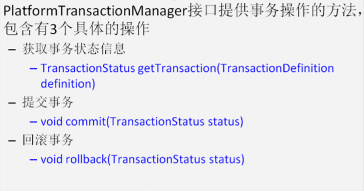
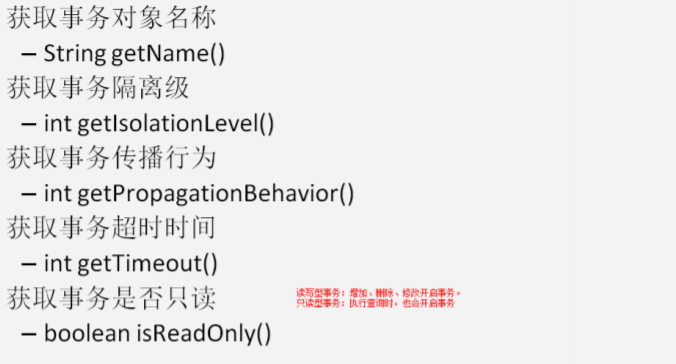
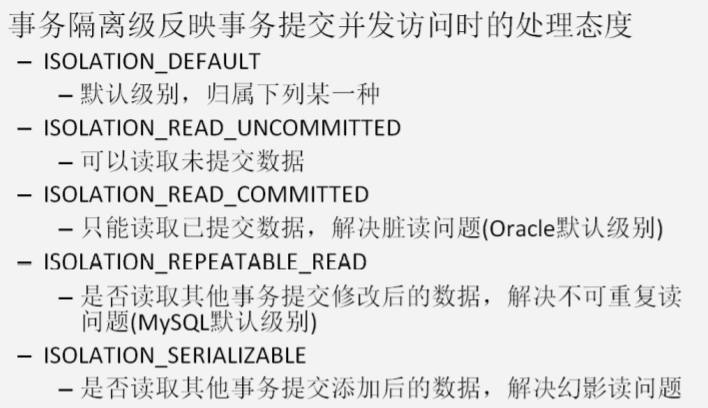
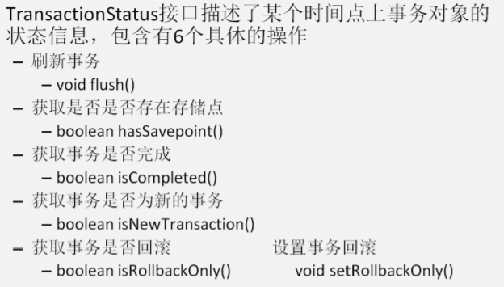
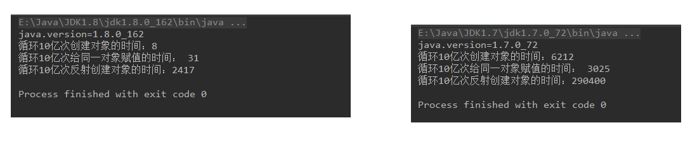

## 一、Spring中的JdbcTemplate
### 1、JdbcTemplate概述
**它是Spring框架中提供的一个对象，是对原始Jdbc API对象的简单封装。Spring框架为我们提供了很多的操作模板类。**
* **操作关系型数据的**：**JdbcTemplate**、**HibernateTemplate**
* **操作nosql非关系型数据库的**：**RedisTemplate**
* **操作消息队列的**：**JmsTemplate**

### 2、JdbcTemplate对象的创建
**可以参考它的源码，来一探究竟**：
```
public JdbcTemplate() {

}
public JdbcTemplate(DataSource dataSource) {
    setDataSource(dataSource);
    afterPropertiesSet();
}
public JdbcTemplate(DataSource dataSource, boolean lazyInit) {
    setDataSource(dataSource);
    setLazyInit(lazyInit);
    afterPropertiesSet();
}
```
除了默认构造函数之外，都需要提供一个数据源。既然**有set方法，就能够使用Spring的依赖注入，可以在配置文件中配置这些对象。**

### 3、Spring中配置数据源
*采用的案例还是之前学习过程中使用的账户转账，可以通过本人首页翻看之前的学习内容*
#### （1）环境搭建
**创建普通的maven工程，然后添加以下依赖：**
```
<!--打包方式-->
<packaging>jar</packaging>

<dependencies>
    <dependency>
        <groupId>org.springframework</groupId>
        <artifactId>spring-context</artifactId>
        <version>5.0.2.RELEASE</version>
    </dependency>
    <dependency>
        <groupId>org.springframework</groupId>
        <artifactId>spring-jdbc</artifactId>
        <version>5.0.2.RELEASE</version>
    </dependency>
    <dependency>
        <groupId>org.springframework</groupId>
        <artifactId>spring-tx</artifactId>
        <version>5.0.2.RELEASE</version>
    </dependency>
    <dependency>
        <groupId>mysql</groupId>
        <artifactId>mysql-connector-java</artifactId>
        <version>8.0.18</version>
    </dependency>
</dependencies>
```
#### （2）编写Spring的配置文件
```
<?xml version="1.0" encoding="UTF-8"?>
<beans xmlns="http://www.springframework.org/schema/beans"
       xmlns:xsi="http://www.w3.org/2001/XMLSchema-instance"
       xsi:schemaLocation="http://www.springframework.org/schema/beans
        http://www.springframework.org/schema/beans/spring-beans.xsd">
 
</beans>
```
#### （3）配置数据源
*这里可以使用C3P0、DBCP、Druid等第三方提供的连接池技术，Spring也提供了数据源，这里对以上提到的常用的几个分别进行配置，根据个人情况自行选择*。**在使用之前要导入对应的jar包。**
* 我使用的是Mysql8.0版本的，所以配置可能有些许差别，但是不管是什么版本都配置的是driver、url、username和password这四个内容，和平时连接数据库时的配置是一样的。

##### 配置C3P0数据源
**在Spring的配置文件中配置**：
```
<bean id="dataSource" class="com.mchange.v2.c3p0.ComboPooledDataSource">
    <property name="driverClassName" value="com.mysql.cj.jdbc.Driver"></property>
    <property name="url" value="jdbc:mysql://localhost:3306/eesy?useSSL=false&amp;serverTimezone=UTC"></property>
    <property name="username" value="root"></property>
    <property name="password" value="991104"></property>
</bean>
```


##### 配置DBCP数据源
**在Spring的配置文件中配置**：
```
<!-- 配置数据源 -->
<bean id="dataSource" class="org.apache.commons.dbcp.BasicDataSource">
    <property name="driverClassName" value="com.mysql.cj.jdbc.Driver"></property>
    <property name="url" value="jdbc:mysql://localhost:3306/eesy?useSSL=false&amp;serverTimezone=UTC"></property>
    <property name="username" value="root"></property>
    <property name="password" value="991104"></property>
</bean>
```

##### 配置Spring内置数据源
**在Spring的配置文件中配置**：
```
<!--配置数据源-->
<bean id="dataSource" class="org.springframework.jdbc.datasource.DriverManagerDataSource">
    <property name="driverClassName" value="com.mysql.cj.jdbc.Driver"></property>
    <property name="url" value="jdbc:mysql://localhost:3306/eesy?useSSL=false&amp;serverTimezone=UTC"></property>
    <property name="username" value="root"></property>
    <property name="password" value="991104"></property>
</bean>
```

### 4、JdbcTemplate的增删改查操作
#### （1）前期准备
* **创建数据库**：
```
create database eesy;
use eesy;
```
* **创建表**：
```
create table account(
    id int primary key auto_increment,
    name varchar(40),
    money float
)character set utf8 collate utf8_general_ci;
```
#### （2）在Spring配置文件中配置JdbcTemplate
```
<?xml version="1.0" encoding="UTF-8"?>
<beans xmlns="http://www.springframework.org/schema/beans"
       xmlns:xsi="http://www.w3.org/2001/XMLSchema-instance"
       xsi:schemaLocation="http://www.springframework.org/schema/beans
        http://www.springframework.org/schema/beans/spring-beans.xsd">
    
    <!--配置jdbcTemplate-->
    <bean id="jdbcTemplate" class="org.springframework.jdbc.core.JdbcTemplate">
        <property name="dataSource" ref="dataSource"></property>
    </bean>

    <!--配置数据源-->
    <bean id="dataSource" class="org.springframework.jdbc.datasource.DriverManagerDataSource">
        <property name="driverClassName" value="com.mysql.cj.jdbc.Driver"></property>
        <property name="url" value="jdbc:mysql://localhost:3306/eesy?useSSL=false&amp;serverTimezone=UTC"></property>
        <property name="username" value="root"></property>
        <property name="password" value="991104"></property>
    </bean>
</beans>
```

#### （3）最基本使用
```
public class JdbcTemplateDemo2 {
    public static void main(String[] args) {
        //1.获取 Spring 容器
        ApplicationContext ac = new ClassPathXmlApplicationContext("bean.xml");
        //2.根据 id 获取 bean 对象
        JdbcTemplate jt = (JdbcTemplate) ac.getBean("jdbcTemplate");
        //3.执行操作
        jt.execute("insert into account(name,money)values('eee',500)");
    }
}
```
#### （4）保存操作
```
public class JdbcTemplateDemo3 {
    public static void main(String[] args) {
        //1.获取 Spring 容器
        ApplicationContext ac = new ClassPathXmlApplicationContext("bean.xml");
        //2.根据 id 获取 bean 对象
        JdbcTemplate jt = (JdbcTemplate) ac.getBean("jdbcTemplate");
        //3.执行操作
        //保存
        jt.update("insert into account(name,money)values(?,?)","fff",5000);
    }
}
```
#### （5）更新操作
```
public class JdbcTemplateDemo3 {
    public static void main(String[] args) {
        //1.获取 Spring 容器
        ApplicationContext ac = new ClassPathXmlApplicationContext("bean.xml");
        //2.根据 id 获取 bean 对象
        JdbcTemplate jt = (JdbcTemplate) ac.getBean("jdbcTemplate");
        //3.执行操作
        //修改
        jt.update("update account set money = money-? where id = ?",300,6);
    }
}
```

#### （6）删除操作
```
public class JdbcTemplateDemo3 {
    public static void main(String[] args) {
        //1.获取 Spring 容器
        ApplicationContext ac = new ClassPathXmlApplicationContext("bean.xml");
        //2.根据 id 获取 bean 对象
        JdbcTemplate jt = (JdbcTemplate) ac.getBean("jdbcTemplate");
        //3.执行操作
        //删除
        jt.update("delete from account where id = ?",6);
    }
}
```
#### （7）查询所有操作
```
public class JdbcTemplateDemo3 {
    public static void main(String[] args) {
        //1.获取 Spring 容器
        ApplicationContext ac = new ClassPathXmlApplicationContext("bean.xml");
        //2.根据 id 获取 bean 对象
        JdbcTemplate jt = (JdbcTemplate) ac.getBean("jdbcTemplate");
        //3.执行操作
        //查询所有
        List<Account> accounts = jt.query("select * from account where money > ? ", new AccountRowMapper(), 500);
        for(Account o : accounts){
            System.out.println(o);
        }
    }
}
public class AccountRowMapper implements RowMapper<Account>{
    @Override
    public Account mapRow(ResultSet rs, int rowNum) throws SQLException {
        Account account = new Account();
        account.setId(rs.getInt("id"));
        account.setName(rs.getString("name"));
        account.setMoney(rs.getFloat("money"));
        return account;
    }
}
```
#### （8）查询一个操作
**使用RowMapper的方式：常用的方式**
```
public class JdbcTemplateDemo3 {
    public static void main(String[] args) {
        //1.获取 Spring 容器
        ApplicationContext ac = new ClassPathXmlApplicationContext("bean.xml");
        //2.根据 id 获取 bean 对象
        JdbcTemplate jt = (JdbcTemplate) ac.getBean("jdbcTemplate");
        //3.执行操作
        //查询一个
        List<Account> as = jt.query("select * from account where id = ? ",new AccountRowMapper(), 55);
        System.out.println(as.isEmpty()?"没有结果":as.get(0));
    }
}
```

* **使用ResultSetExtractor的方式:不常用的方式**
```
public class JdbcTemplateDemo3 {
    public static void main(String[] args) {
        //1.获取 Spring 容器
        ApplicationContext ac = new ClassPathXmlApplicationContext("bean.xml");
        //2.根据 id 获取 bean 对象
        JdbcTemplate jt = (JdbcTemplate) ac.getBean("jdbcTemplate");
        //3.执行操作
        //查询一个
        Account account = jt.query("select * from account where id = ?",new AccountResultSetExtractor(),3);
        System.out.println(account);
    }
}
```

#### （9）查询返回一行一列操作
```
public class JdbcTemplateDemo3 {
    public static void main(String[] args) {
        //1.获取 Spring 容器
        ApplicationContext ac = new ClassPathXmlApplicationContext("bean.xml");
        //2.根据 id 获取 bean 对象
        JdbcTemplate jt = (JdbcTemplate) ac.getBean("jdbcTemplate");
        //3.执行操作
        //查询返回一行一列：使用聚合函数，在不使用 group by 字句时，都是返回一行一列。最长用的就是分页中获取总记录条数
        Integer total = jt.queryForObject("select count(*) from account where money > ?",Integer.class,500);
        System.out.println(total);
    }
}
```

### 5、在dao中使用JdbcTemplate
#### （1）准备实体类
```
/**
* 账户的实体
*/
public class Account implements Serializable {
    private Integer id;
    private String name;
    private Float money;
    public Integer getId() {
        return id;
    }
    public void setId(Integer id) {
        this.id = id;
    }
    public String getName() {
        return name;
    }
    public void setName(String name) {
        this.name = name;
    }
    public Float getMoney() {
        return money;
    }
    public void setMoney(Float money) {
        this.money = money;
    }
    @Override
    public String toString() {
        return "Account [id=" + id + ", name=" + name + ", money=" + money + "]";
    }
}
```
#### （2）第一种方式：在dao中定义JdbcTemplate
* **dao接口**
```
/**
* 账户的接口
*/
public interface AccountDao {
    /**
    * 根据 id 查询账户信息
    * @param id
    * @return
    */
    Account findAccountById(Integer id);
    /**
    * 根据名称查询账户信息
    * @return
    */
    Account findAccountByName(String name);
    /**
    * 更新账户信息
    * @param account
    */
    void updateAccount(Account account);
}
```
* **dao实现类**
```
/**
* 账户的持久层实现类
* 此版本的 dao，需要给 dao 注入 JdbcTemplate
*/
public class AccountDaoImpl implements AccountDao {
    private JdbcTemplate jdbcTemplate;
    public void setJdbcTemplate(JdbcTemplate jdbcTemplate) {
        this.jdbcTemplate = jdbcTemplate;
    }
    @Override
    public Account findAccountById(Integer id) {
        List<Account> list = jdbcTemplate.query("select * from account where id = ?",new AccountRowMapper(),id);
        return list.isEmpty()?null:list.get(0);
    }
    @Override
    public Account findAccountByName(String name) {
        List<Account> list = jdbcTemplate.query("select * from account where name = ? ",new AccountRowMapper(),name);
        if(list.isEmpty()){
            return null;
        }
        if(list.size()>1){
            throw new RuntimeException("结果集不唯一，不是只有一个账户对象");
        }
        return list.get(0);
    }
    @Override
    public void updateAccount(Account account) {
        jdbcTemplate.update("update account set money = ? where id = ? ",account.getMoney(),account.getId());
    }
}
```
* **Spring的配置文件bean.xml**
```
<?xml version="1.0" encoding="UTF-8"?>
<beans xmlns="http://www.springframework.org/schema/beans"
       xmlns:xsi="http://www.w3.org/2001/XMLSchema-instance"
       xsi:schemaLocation="http://www.springframework.org/schema/beans
        http://www.springframework.org/schema/beans/spring-beans.xsd">
    <!--配置账户的持久层-->
    <bean id="accountDao" class="com.allen.dao.impl.AccountDaoImpl">
        <!-- 注入 jdbcTemplate -->
        <property name="jdbcTemplate" ref="jdbcTemplate"></property>
    </bean>
    <!--配置jdbcTemplate-->
    <bean id="jdbcTemplate" class="org.springframework.jdbc.core.JdbcTemplate">
        <property name="dataSource" ref="dataSource"></property>
    </bean>

    <!--配置数据源-->
    <bean id="dataSource" class="org.springframework.jdbc.datasource.DriverManagerDataSource">
        <property name="driverClassName" value="com.mysql.cj.jdbc.Driver"></property>
        <property name="url" value="jdbc:mysql://localhost:3306/eesy?useSSL=false&amp;serverTimezone=UTC"></property>
        <property name="username" value="root"></property>
        <property name="password" value="991104"></property>
    </bean>
</beans>
```
* *思考：此种方式有什么问题吗?*
* 答案：有个小问题。**如果dao有很多时，每个dao都有一些重复性的代码**。下面就是重复代码：
```
private JdbcTemplate jdbcTemplate;
public void setJdbcTemplate(JdbcTemplate jdbcTemplate) {
    this.jdbcTemplate = jdbcTemplate;
}
```
*能不能把它抽取出来呢？*

#### （3）第二种方式：让dao继承JdbcDaoSupport
**JdbcDaoSupport是Spring框架为我们提供的一个类，该类中定义了一个JdbcTemplate对象，可以直接获取使用，但是要想创建该对象，需要为其提供一个数据源**：具体源码如下：
```
public abstract class JdbcDaoSupport extends DaoSupport {
    //定义对象
    private JdbcTemplate jdbcTemplate;
    //set 方法注入数据源，判断是否注入了，注入了就创建 JdbcTemplate
    public final void setDataSource(DataSource dataSource) {
        if (this.jdbcTemplate == null || dataSource != this.jdbcTemplate.getDataSource())
        { //如果提供了数据源就创建 JdbcTemplate
            this.jdbcTemplate = createJdbcTemplate(dataSource);
            initTemplateConfig();
        }
    }
    //使用数据源创建 JdcbTemplate
    protected JdbcTemplate createJdbcTemplate(DataSource dataSource) {
        return new JdbcTemplate(dataSource);
    }
    //当然，我们也可以通过注入 JdbcTemplate 对象
    public final void setJdbcTemplate(JdbcTemplate jdbcTemplate) {
        this.jdbcTemplate = jdbcTemplate;
        initTemplateConfig();
    }
    //使用 getJdbcTmeplate 方法获取操作模板对象
    public final JdbcTemplate getJdbcTemplate() {
        return this.jdbcTemplate;
    }
}
```
* **dao接口**
```
/**
* 账户的接口
*/
public interface AccountDao {
    /**
    * 根据 id 查询账户信息
    * @param id
    * @return
    */
    Account findAccountById(Integer id);
    /**
    * 根据名称查询账户信息
    * @return
    */
    Account findAccountByName(String name);
    /**
    * 更新账户信息
    * @param account
    */
    void updateAccount(Account account);
}
```
* **dao实现类**
```
/**
* 账户的持久层实现类
* 此版本 dao，只需要给它的父类注入一个数据源
*/
public class AccountDaoImpl2 extends JdbcDaoSupport implements AccountDao {
    @Override
    public Account findAccountById(Integer id) {
        //getJdbcTemplate()方法是从父类上继承下来的。
        List<Account> list = getJdbcTemplate().query("select * from account where id = ? ",new AccountRowMapper(),id);
        return list.isEmpty()?null:list.get(0);
    }
    @Override
    public Account findAccountByName(String name) {
        //getJdbcTemplate()方法是从父类上继承下来的。
        List<Account> list = getJdbcTemplate().query("select * from account where name = ? ",new AccountRowMapper(),name);
        if(list.isEmpty()){
            return null;
        }
        if(list.size()>1){
            throw new RuntimeException("结果集不唯一，不是只有一个账户对象");
        }
        return list.get(0);
    }
    @Override
    public void updateAccount(Account account) {
        //getJdbcTemplate()方法是从父类上继承下来的。
        getJdbcTemplate().update("update account set money = ? where id = ? ",account.getMoney(),account.getId());
    }
}
```
* **配置文件**：
```
<?xml version="1.0" encoding="UTF-8"?>
<beans xmlns="http://www.springframework.org/schema/beans"
 xmlns:xsi="http://www.w3.org/2001/XMLSchema-instance"
 xsi:schemaLocation="http://www.springframework.org/schema/beans
 http://www.springframework.org/schema/beans/spring-beans.xsd">
    <!-- 配置 dao2 -->
    <bean id="accountDao2" class="com.allen.dao.impl.AccountDaoImpl2">
        <!-- 注入 dataSource -->
        <property name="dataSource" ref="dataSource"></property>
    </bean>
    <!-- 配置数据源 -->
    <bean id="dataSource"
    class="org.springframework.jdbc.datasource.DriverManagerDataSource">
        <property name="driverClassName" value="com.mysql.cj.jdbc.Driver"></property>
        <property name="url" value="jdbc:mysql://localhost:3306/eesy?useSSL=false&amp;serverTimezone=UTC"></property>
        <property name="username" value="root"></property>
        <property name="password" value="991104"></property>
    </bean> 
</beans>
```
* **两版Dao有什么区别呢？**
    * **第一种在Dao类中定义JdbcTemplate的方式，适用于所有配置方式**（xml和注解都可以）。
    * **第二种让Dao继承JdbcDaoSupport的方式，只能用于基于XML的方式，注解用不了。**

## 二、Spring中的事务控制
### 1、Spring事务控制首先要明确的
* **JavaEE体系进行分层开发，事务处理位于业务层，Spring提供了分层设计业务层的事务处理解决方案。**
* Spring框架为我们提供了一组**事务控制的接口。**
* **Spring的事务控制都是基于AOP**的，它**既可以使用编程的方式实现，也可以使用配置的方式实现**。**主要是使用配置的方式实现。**

### 2、Spring中事务控制的API介绍
#### （1）PlatformTransactionManager
**此接口是Spring的事务管理器，它里面提供了常用的操作事务的方法**，如下图：


在开发中都是使用它的**实现类**
* **真正管理事务的对象**
    * **org.springframework.jdbc.datasource.DataSourceTransactionManager 使用Spring JDBC 或 iBatis 进行持久化数据时使用**
    * org.springframework.orm.hibernate5.HibernateTransactionManager 使用Hibernate 版本进行持久化数据时使用

#### （2）TransactionDefinition
**它是事务的定义信息对象，里面有如下方法：**

##### 事务的隔离级别

##### 事务的传播行为
* ==**REQUIRED**:如果当前没有事务，就新建一个事务，如果已经存在一个事务中，加入到这个事务中。**一般的选择（默认值）**==
* ==**SUPPORTS**:**支持当前事务，如果当前没有事务，就以非事务方式执行（没有事务）**==
* MANDATORY：使用当前的事务，如果当前没有事务，就抛出异常
* REQUERS_NEW:新建事务，如果当前在事务中，把当前事务挂起。
* NOT_SUPPORTED:以非事务方式执行操作，如果当前存在事务，就把当前事务挂起
* NEVER:以非事务方式运行，如果当前存在事务，抛出异常
* NESTED:如果当前存在事务，则在嵌套事务内执行。如果当前没有事务，则执行 REQUIRED 类似的操作。

##### 超时时间
默认值是-1，没有超时限制。如果有，以秒为单位进行设置。

##### 是否是只读事务
建议**查询时设置为只读**

#### （3）TransactionStatus
**此接口提供的是事务具体的运行状态**，方法介绍如下图：


### 3、基于XML的声明式事务控制（配置方式）
#### （1）环境搭建
##### 第一步：创建普通的maven工程
**添加以下依赖**：
```
<!--打包方式-->
<packaging>jar</packaging>

<dependencies>
    <dependency>
        <groupId>org.springframework</groupId>
        <artifactId>spring-jdbc</artifactId>
        <version>5.0.2.RELEASE</version>
    </dependency>
    <dependency>
        <groupId>org.springframework</groupId>
        <artifactId>spring-context</artifactId>
        <version>5.0.2.RELEASE</version>
    </dependency>
    <dependency>
        <groupId>org.springframework</groupId>
        <artifactId>spring-tx</artifactId>
        <version>5.0.2.RELEASE</version>
    </dependency>
    <dependency>
        <groupId>org.springframework</groupId>
        <artifactId>spring-test</artifactId>
        <version>5.0.2.RELEASE</version>
    </dependency>
    <dependency>
        <groupId>mysql</groupId>
        <artifactId>mysql-connector-java</artifactId>
        <version>8.0.18</version>
    </dependency>
    <dependency>
        <groupId>org.aspectj</groupId>
        <artifactId>aspectjweaver</artifactId>
        <version>1.8.7</version>
    </dependency>
    <dependency>
        <groupId>junit</groupId>
        <artifactId>junit</artifactId>
        <version>4.12</version>
    </dependency>
</dependencies>
```
##### 第二步：创建Spring的配置文件并导入约束
**此处需要导入aop和tx两个名称空间**
```
<?xml version="1.0" encoding="UTF-8"?>
<beans xmlns="http://www.springframework.org/schema/beans"
     xmlns:xsi="http://www.w3.org/2001/XMLSchema-instance"
     xmlns:aop="http://www.springframework.org/schema/aop"
     xmlns:tx="http://www.springframework.org/schema/tx"
     xsi:schemaLocation="http://www.springframework.org/schema/beans
     http://www.springframework.org/schema/beans/spring-beans.xsd
     http://www.springframework.org/schema/tx
     http://www.springframework.org/schema/tx/spring-tx.xsd
     http://www.springframework.org/schema/aop
     http://www.springframework.org/schema/aop/spring-aop.xsd">

</beans>
```
##### 第三步：准备数据库表和实体类
*数据库以及表在上面已经创建了，此处采用上面的Account账户表，继续优化账户转账操作中的事务操作，实体类无变化，所以直接法制之前的实体类即可*

##### 第四步：编写业务层接口和实现类
* **业务层接口**
```
package com.allen.service;

import com.allen.domain.Account;

/**
 * 账户的业务层接口
 */
public interface AccountService {
    /**
     * 根据id查询账户信息
     * @param accountId
     * @return
     */
    Account findAccountById(Integer accountId);

    /**
     * 转账
     * @param sourceName    转出账户名称
     * @param targetName    转入账户名称
     * @param money         转账金额
     */
    void transfer(String sourceName, String targetName, Float money);
}
```
* **业务层实现类**
```
package com.allen.service.impl;

import com.allen.dao.AccountDao;
import com.allen.domain.Account;
import com.allen.service.AccountService;

import java.util.List;

/**
 * 账户的业务层实现类
 */
public class AccountServiceImpl implements AccountService {

    private AccountDao accountDao;

    public void setAccountDao(AccountDao accountDao) {
        this.accountDao = accountDao;
    }

    @Override
    public Account findAccountById(Integer accountId) {
        return accountDao.findAccountById(accountId);
    }

    @Override
    public void transfer(String sourceName, String targetName, Float money) {
        System.out.println("transfer....");
        //2.1根据名称查询转出账户
        Account source = accountDao.findAccountByName(sourceName);
        //2.2根据名称查询转入账户
        Account target = accountDao.findAccountByName(targetName);
        //2.3转出账户减钱
        source.setMoney(source.getMoney()-money);
        //2.4转入账户加钱
        target.setMoney(target.getMoney()+money);
        //2.5更新转出账户
        accountDao.updateAccount(source);

        //int i = 1/0;

        //2.6更新转入账户
        accountDao.updateAccount(target);
    }
}
```
##### 第五步：编写Dao接口和实现类
* **账户的持久层接口**
```
package com.allen.dao;

import com.allen.domain.Account;

/**
 * 账户的持久层接口
 */
public interface AccountDao {
    /**
     * 根据id查询账户
     * @param accountId
     * @return
     */
    Account findAccountById(Integer accountId);

    /**
     * 根据名称查询账户
     * @param accountName
     * @return
     */
    Account findAccountByName(String accountName);

    /**
     * 更新账户
     * @param account
     */
    void updateAccount(Account account);
}
```
* **账户的持久层实现类**
```
package com.allen.dao.impl;

import com.allen.dao.AccountDao;
import com.allen.domain.Account;
import org.springframework.jdbc.core.BeanPropertyRowMapper;
import org.springframework.jdbc.core.support.JdbcDaoSupport;

/**
 * 账户的持久层实现类
 */
public class AccountDaoImpl extends JdbcDaoSupport implements AccountDao {

    @Override
    public Account findAccountById(Integer accountId) {
        return getJdbcTemplate().queryForObject("select * from account where id=?",new BeanPropertyRowMapper<Account>(Account.class),accountId);
    }

    @Override
    public Account findAccountByName(String accountName) {
        return getJdbcTemplate().queryForObject("select * from account where name=?",new BeanPropertyRowMapper<Account>(Account.class),accountName);
    }

    @Override
    public void updateAccount(Account account) {
        getJdbcTemplate().update("update account set name=?,money=? where id=?",account.getName(),account.getMoney(),account.getId());
    }
}

```

##### 第六步：在配置文件中配置业务层和持久层
```
<!--配置业务层-->
<bean id="accountService" class="com.allen.service.impl.AccountServiceImpl">
    <property name="accountDao" ref="accountDao"></property>
</bean>

<!--配置账户的持久层-->
<bean id="accountDao" class="com.allen.dao.impl.AccountDaoImpl">
    <property name="dataSource" ref="dataSource"></property>
</bean>

<!--配置数据源-->
<bean id="dataSource" class="org.springframework.jdbc.datasource.DriverManagerDataSource">
    <property name="driverClassName" value="com.mysql.cj.jdbc.Driver"></property>
    <property name="url" value="jdbc:mysql://localhost:3306/eesy?useSSL=false&amp;serverTimezone=UTC"></property>
    <property name="username" value="root"></property>
    <property name="password" value="991104"></property>
</bean>
```
#### （2）配置步骤
##### 第一步：配置事务管理器
```
<!-- 配置一个事务管理器 -->
<bean id="transactionManager" class="org.springframework.jdbc.datasource.DataSourceTransactionManager">
    <!-- 注入 DataSource -->
    <property name="dataSource" ref="dataSource"></property>
</bean>
```
##### 第二步：配置事务的通知引用事务管理器
```
<!-- 事务的配置 -->
<tx:advice id="txAdvice" transaction-manager="transactionManager">
</tx:advice>
```
##### 第三步：配置事务的属性
```
<!--在 tx:advice 标签内部 配置事务的属性 -->
<tx:attributes>
    <!-- 指定方法名称：是业务核心方法
    read-only：是否是只读事务。默认 false，不只读。
    isolation：指定事务的隔离级别。默认值是使用数据库的默认隔离级别。
    propagation：指定事务的传播行为。
    timeout：指定超时时间。默认值为：-1。永不超时。
    rollback-for：用于指定一个异常，当执行产生该异常时，事务回滚。产生其他异常，事务不回滚。
    没有默认值，任何异常都回滚。
    no-rollback-for：用于指定一个异常，当产生该异常时，事务不回滚，产生其他异常时，事务回
    滚。没有默认值，任何异常都回滚。
    -->
    <tx:method name="*" read-only="false" propagation="REQUIRED"/>
    <tx:method name="find*" read-only="true" propagation="SUPPORTS"/>
</tx:attributes>
```
##### 第四步：配置AOP切入点表达式
```
<!-- 配置 aop -->
<aop:config>
    <!-- 配置切入点表达式 -->
    <aop:pointcut id="pt1" expression="execution(* com.allen.service.impl.*.*(..))"></aop:pointcut>
</aop:config>
```
##### 第五步：配置切入点表达式和事务通知的对应关系
```
<!-- 在 aop:config 标签内部：建立事务的通知和切入点表达式的关系 -->
<aop:advisor advice-ref="txAdvice" pointcut-ref="pt1"/>
```

### 4、基于注解的配置方式
#### （1）环境搭建
##### 第一步：创建普通的maven工程
**添加以下依赖**：
```
<!--打包方式-->
<packaging>jar</packaging>

<dependencies>
    <dependency>
        <groupId>org.springframework</groupId>
        <artifactId>spring-jdbc</artifactId>
        <version>5.0.2.RELEASE</version>
    </dependency>
    <dependency>
        <groupId>org.springframework</groupId>
        <artifactId>spring-context</artifactId>
        <version>5.0.2.RELEASE</version>
    </dependency>
    <dependency>
        <groupId>org.springframework</groupId>
        <artifactId>spring-tx</artifactId>
        <version>5.0.2.RELEASE</version>
    </dependency>
    <dependency>
        <groupId>org.springframework</groupId>
        <artifactId>spring-test</artifactId>
        <version>5.0.2.RELEASE</version>
    </dependency>
    <dependency>
        <groupId>mysql</groupId>
        <artifactId>mysql-connector-java</artifactId>
        <version>8.0.18</version>
    </dependency>
    <dependency>
        <groupId>org.aspectj</groupId>
        <artifactId>aspectjweaver</artifactId>
        <version>1.8.7</version>
    </dependency>
    <dependency>
        <groupId>junit</groupId>
        <artifactId>junit</artifactId>
        <version>4.12</version>
    </dependency>
</dependencies>
```
##### 第二步：创建Spring的配置文件导入约束并配置扫描的包
```
<?xml version="1.0" encoding="UTF-8"?>
<beans xmlns="http://www.springframework.org/schema/beans"
       xmlns:xsi="http://www.w3.org/2001/XMLSchema-instance"
       xmlns:aop="http://www.springframework.org/schema/aop"
       xmlns:tx="http://www.springframework.org/schema/tx"
       xmlns:context="http://www.springframework.org/schema/context"
       xsi:schemaLocation="
        http://www.springframework.org/schema/beans
        http://www.springframework.org/schema/beans/spring-beans.xsd
        http://www.springframework.org/schema/tx
        http://www.springframework.org/schema/tx/spring-tx.xsd
        http://www.springframework.org/schema/aop
        http://www.springframework.org/schema/aop/spring-aop.xsd
        http://www.springframework.org/schema/context
        http://www.springframework.org/schema/context/spring-context.xsd">    <!--配置业务层-->

    <!--配置spring创建容器时要扫描的包-->
    <context:component-scan base-package="com.allen"></context:component-scan>

    <!--配置JdbcTemplate-->
    <bean id="jdbcTemplate" class="org.springframework.jdbc.core.JdbcTemplate">
        <property name="dataSource" ref="dataSource"></property>
    </bean>

    <!--配置数据源-->
    <bean id="dataSource" class="org.springframework.jdbc.datasource.DriverManagerDataSource">
        <property name="driverClassName" value="com.mysql.cj.jdbc.Driver"></property>
        <property name="url" value="jdbc:mysql://localhost:3306/eesy?useSSL=false&amp;serverTimezone=UTC"></property>
        <property name="username" value="root"></property>
        <property name="password" value="991104"></property>
    </bean>
</beans>
```
##### 第三步：创建数据库表和实体类
*数据库以及表在上面已经创建了，此处采用上面的Account账户表，继续优化账户转账操作中的事务操作，实体类无变化，所以直接法制之前的实体类即可*
##### 第四步：创建业务层接口和实现类并使用注解让Spring管理
```
/**
* 账户的业务层实现类
*/
@Service("accountService")
public class AccountServiceImpl implements AccountService {
    @Autowired
    private AccountDao accountDao;
    
    //其余代码和基于XML的配置相同
}
```
##### 第五步：创建Dao接口和实现类并使用注解让Spring 管理
```
/**
* 账户的持久层实现类
*/
@Repository("accountDao")
public class AccountDaoImpl implements AccountDao {
    @Autowired
    private JdbcTemplate jdbcTemplate;
    
    //其余代码和基于 XML 的配置相同
}
```

#### （2）配置步骤
##### 第一步：配置事务管理器并注入数据源
```
<!-- 配置事务管理器 -->
<bean id="transactionManager"
class="org.springframework.jdbc.datasource.DataSourceTransactionManager">
    <property name="dataSource" ref="dataSource"></property>
</bean>
```
##### 第二步：在业务层使用`@Transactional`注解
```
package com.allen.service.impl;

import com.allen.dao.AccountDao;
import com.allen.domain.Account;
import com.allen.service.AccountService;
import org.springframework.beans.factory.annotation.Autowired;
import org.springframework.stereotype.Service;
import org.springframework.transaction.annotation.Propagation;
import org.springframework.transaction.annotation.Transactional;

import java.util.List;

/**
 * 账户的业务层实现类
 */
@Service("accountService")
@Transactional(propagation = Propagation.SUPPORTS,readOnly = true)//只读性事务配置
public class AccountServiceImpl implements AccountService {

    @Autowired
    private AccountDao accountDao;

    @Override
    public Account findAccountById(Integer accountId) {
        return accountDao.findAccountById(accountId);
    }

    //需要的时读写型事务配置
    @Transactional(propagation = Propagation.REQUIRED,readOnly = false)
    @Override
    public void transfer(String sourceName, String targetName, Float money) {
        System.out.println("transfer....");
        //2.1根据名称查询转出账户
        Account source = accountDao.findAccountByName(sourceName);
        //2.2根据名称查询转入账户
        Account target = accountDao.findAccountByName(targetName);
        //2.3转出账户减钱
        source.setMoney(source.getMoney()-money);
        //2.4转入账户加钱
        target.setMoney(target.getMoney()+money);
        //2.5更新转出账户
        accountDao.updateAccount(source);

//        int i = 1/0;

        //2.6更新转入账户
        accountDao.updateAccount(target);
    }
}

```
**该注解的属性和xml中的属性含义一致。该注解可以出现在接口上，类上和方法上。**
* **出现在接口上**，表示该**接口的所有实现类都有事务支持**
* **出现在类上**，表示类中**所有方法有事务支持**
* **出现在方法上**，表示**方法有事务支持**
* **以上三个位置的优先级：方法>类>接口**

##### 第三步：在配置文件中开启Spring对注解事务的支持
```
<!-- 开启 spring 对注解事务的支持 -->
<tx:annotation-driven transaction-manager="transactionManager"/>
```

#### （3）不使用xml的配置方式
```
@Configuration
@EnableTransactionManagement
public class SpringTxConfiguration {
    
    //里面配置数据源，配置JdbcTemplate,配置事务管理器。在之前的步骤已经写过了。
    
}
```

## 三、Spring5的新特性
### 1、与JDK相关的升级
#### （1）jdk版本要求：
* **Spring5.0在2017年9月发布了它的GA（通用）版本。该版本是基于jdk8编写的，所以jdk8以下版本将无法使用。同时，可以兼容jdk9版本。**
* **tomcat版本要求8.5及以上**

#### （2）利用jdk8版本更新的内容
##### 第一：基于JDK8的反射增强
请看下面的代码：
```
public class Test {
    //循环次数定义：10 亿次
    private static final int loopCnt = 1000 * 1000 * 1000;
    public static void main(String[] args) throws Exception {
        //输出 jdk 的版本
        System.out.println("java.version=" + System.getProperty("java.version"));
        t1();
        t2();
        t3();
    }
    // 每次重新生成对象
    public static void t1() {
        long s = System.currentTimeMillis();
        for (int i = 0; i < loopCnt; i++) {
            Person p = new Person();
            p.setAge(31);
        }
        long e = System.currentTimeMillis();
        System.out.println("循环 10 亿次创建对象的时间：" + (e - s));
    }
    // 同一个对象
    public static void t2() {
        long s = System.currentTimeMillis();
        Person p = new Person();
        for (int i = 0; i < loopCnt; i++) {
            p.setAge(32);
        }
        long e = System.currentTimeMillis();
        System.out.println("循环 10 亿次给同一对象赋值的时间： " + (e - s));
    }
    //使用反射创建对象
    public static void t3() throws Exception {
        long s = System.currentTimeMillis();
        Class<Person> c = Person.class;
        Person p = c.newInstance();
        Method m = c.getMethod("setAge", Integer.class);
        for (int i = 0; i < loopCnt; i++) {
            m.invoke(p, 33);
        }
        long e = System.currentTimeMillis();
        System.out.println("循环 10 亿次反射创建对象的时间：" + (e - s));
    }
    static class Person {
        private int age = 20;
        public int getAge() {
            return age;
        }
        public void setAge(Integer age) {
            this.age = age;
        }
    }
}
```
*先使用jdk1.8版本（就是JDK8）运行，然后切换到jdk1.7 版本之后，两次运行时间如下*：


**可以看出，在反射创建对象上，jdk8 确实做了加强。**

##### 第二：`@NonNull`注解和`@Nullable`注解的使用
用`@Nullable`和`@NotNull` 注解来显示表明可为空的参数和以及返回值。这样就够在编译的时候处理空值而不是在运行时抛出 NullPointerExceptions。
##### 第三：日志记录方面
Spring Framework 5.0 带来了 Commons Logging 桥接模块的封装, 它被叫做 spring-jcl 而不是标准的 CommonsLogging。当然，无需任何额外的桥接，新版本也会对 Log4j 2.x, SLF4J, JUL( java.util.logging) 进行自动检测。

### 2、核心容器的更新
* **Spring Framework 5.0现在支持候选组件索引作为类路径扫描的替代方案。该功能已经在类路径扫描器中添加，以简化添加候选组件标识的步骤。**
* **应用程序构建任务可以定义当前项目自己的META-INF/spring.components文件**。在编译时，源模型是
自包含的，JPA 实体和 Spring 组件是已被标记的。
* **从索引读取实体而不是扫描类路径对于小于 200 个类的小型项目是没有明显差异**。但对大型项目影响较大。加载组件索引开销更低。因此，随着类数的增加，索引读取的启动时间将保持不变。
* **加载组件索引的耗费是廉价的**。因此当类的数量不断增长，加上构建索引的启动时间仍然可以维持一个常数,
不过对于组件扫描而言，启动时间则会有明显的增长。
* **这个对于我们处于大型Spring项目的开发者所意味着的，是应用程序的启动时间将被大大缩减**。虽然 20
或者 30 秒钟看似没什么，但如果每天要这样登上好几百次，加起来就够你受的了。使用了组件索引的话，就能帮
助你每天过的更加高效。

### 3、JetBrains Kotlin 语言支持
Kolin概述：是一种支持函数式编程编程风格的面向对象语言。Kotlin 运行在 JVM 之上，但运行环境并不
限于 JVM。

### 4、响应式编程风格
*由于现在还没有接触到治理不再展开说明*

### 5、Junit5支持
* **完全支持 JUnit 5 Jupiter，所以可以使用 JUnit 5 来编写测试以及扩展**。此外还提供了一个编程以及
扩展模型，Jupiter 子项目提供了一个测试引擎来在 Spring 上运行基于 Jupiter 的测试。
* 另外，**Spring Framework 5 还提供了在 Spring TestContext Framework 中进行并行测试的扩展。**
* 针对响应式编程模型， spring-test 现在还引入了支持 Spring WebFlux 的 WebTestClient 集成测试的支持，类似于MockMvc，并不需要一个运行着的服务端。使用一个模拟的请求或者响应，WebTestClient就可以直接绑定到 WebFlux 服务端设施。

### 6、依赖类库的更新
##### 终止支持的类库
* Portlet.
* Velocity.
* JasperReports.
* XMLBeans.
* JDO.
* Guava.

##### 支持的类库
* Jackson 2.6+
* EhCache 2.10+ / 3.0 GA
* Hibernate 5.0+
* JDBC 4.0+
* XmlUnit 2.x+
* OkHttp 3.x+
* Netty 4.1+