一、前言
--------
这是AllenXue的第一条blog，可能会很low，但是绝对是非常有意义的，自认为本人是为数不多的长得比较帅的程序员（虽然有点小胖），这条blog也是开启疯狂学习模式的起点。本人在学习过程中，如果有学习心得会在第一时间分享给大家。

二、关于spark
------------------
**Spark**是专为大规模数据处理而设计的快速通用的计算引擎。**Spark**是加州大学伯克利分校的AMP实验室所开源的类Hadoop MapReduce的通用并行框架，**Spark**拥有Hadoop MapReduce所具有的优点。

**Spark**是在**Scala**语言中实现的，它将**Scala** 用作其应用程序框架。与 **Hadoop**不同，**Spark** 和 **Scala** 能够紧密集成，其中的 **Scala** 可以像操作本地集合对象一样轻松地操作分布式数据集。

为了适应迭代计算,**Spark**把经常被重用的数据缓存到内存中以提高数据读取和操作速度,**Spark**比**Hadoop**快近百倍，支持Java、Scla、Pyhon、R等多种语言，除map和reduce之外,还支持filter、foreach、reduceByKey、aggregate以及SQL查询、流式查询等。

进行**Spark**应用开发时，一般是
先在本地进行开发和测试，通过测试后再提交到集群执行，下面我们以**Win 10 64-bit**平台为例环境的搭建和简单使用。

三、搭建过程
------------
## 1、下载安装JDK
官网（https://www.oracle.com/technetwork/java/javase/downloads/jdk8-downloads-2133151.html ）下载最新版本**JDK**（本人下载的是**jdk1.8_221**）   
</br>
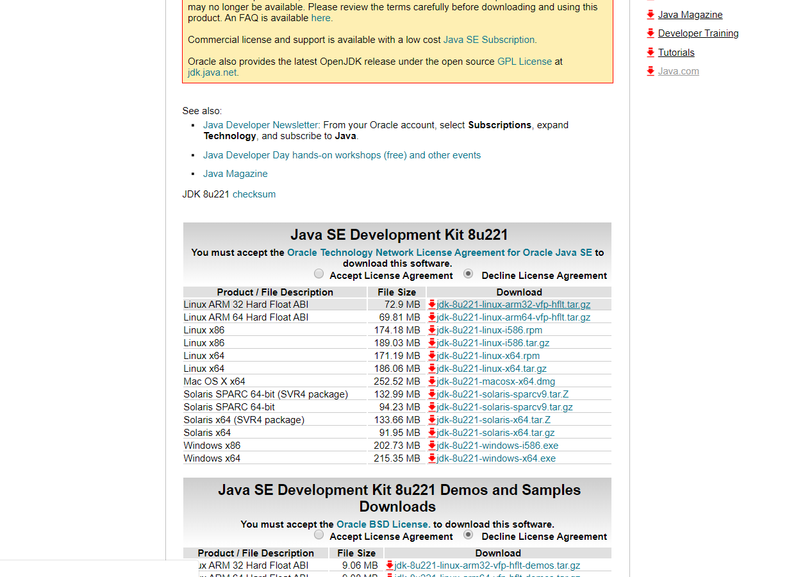</br>

点击 **Accept License Agreement** ,再点击 **jdk-8u221-windows-x64.exe** 进行下载（可以用迅雷进行下载，这样会快很多）

下载完成后，打开进行安装，在路径设置时记住自己所设置的路径（不建议安装在C盘），后面会用到

注意：安装过程会提示安装jre，无需安装，jdk中已经含有jre

## 2、配置JDK的环境变量
右击此电脑，打开属性
 

点击高级系统设置并点击环境变量，开始配置。在系统变量栏新建JAVA_HOME，编辑为jdk的所在路径

系统变量→ Path →编辑 →新建 →输入jdk所在路径
完成后点回车，再重复上述步骤输入jre所在路径，完成后点回车，结果如下图：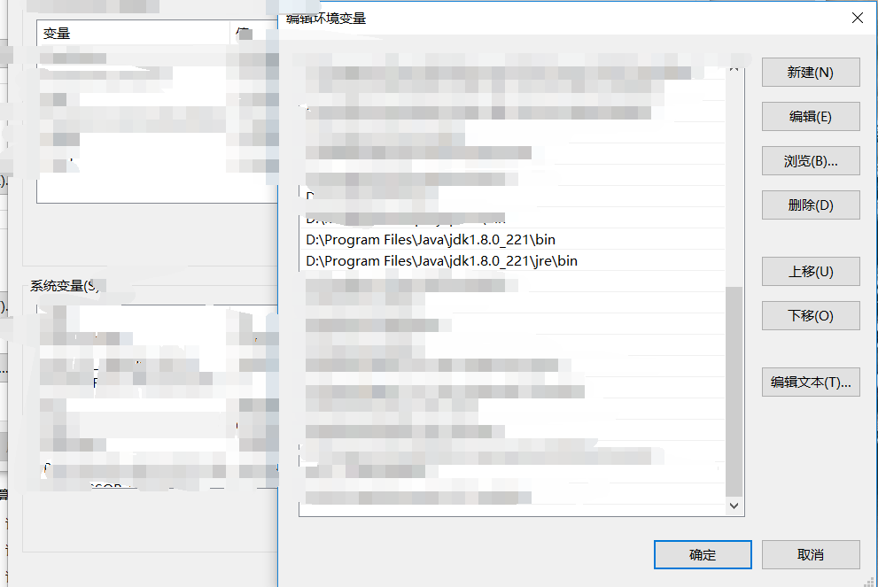

再新建CLASSPATH，并编辑为.;%JAVA_HOME%\lib;%JAVA_HOME%\lib\tools.jar（注意不要忘记前面的 . ） 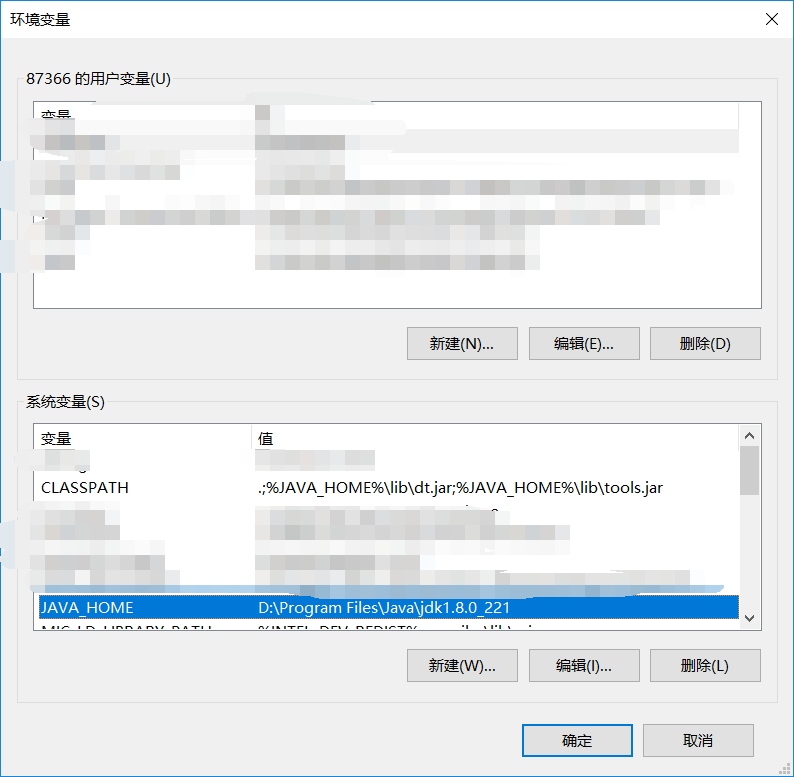

验证是否安装成功
在命令提示符中输入java -version 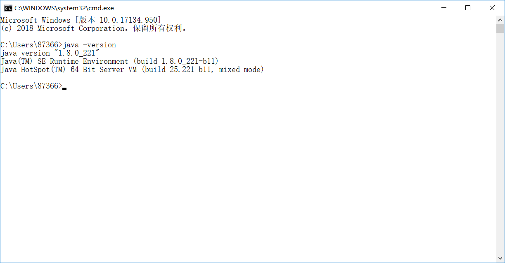
出现上图所示的内容即为安装完成。

## 3、下载安装Scala
在官网上（https://www.scala-lang.org/download/
）下载最新版本的**Scala**（本人下载的是**scala-2.13.0.msi**）

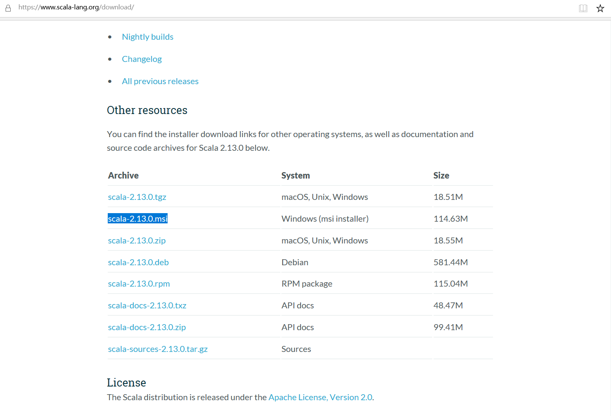

安装过程和**JDK**安装类似，记住安装路径，我的安装路径选择在**D盘**

## 4、配置Scala的环境变量
**注意：在配置Scala的环境变量之前，一定要完成JDK的安装和环境配置**

右击此电脑，打开属性

 

系统变量→ Path →编辑 →新建 →输入 Scala所在路径+/bin/ 
完成后点回车，结果如下图：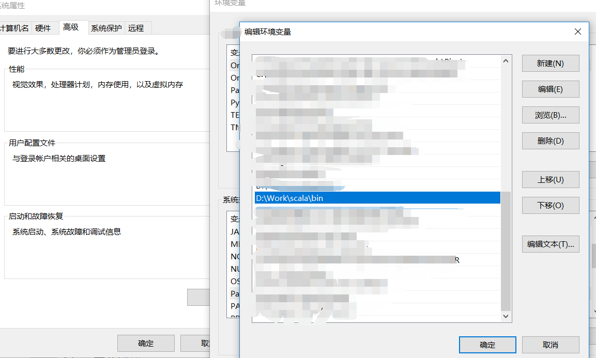

验证是否安装成功
在命令提示符中输入salar -versio
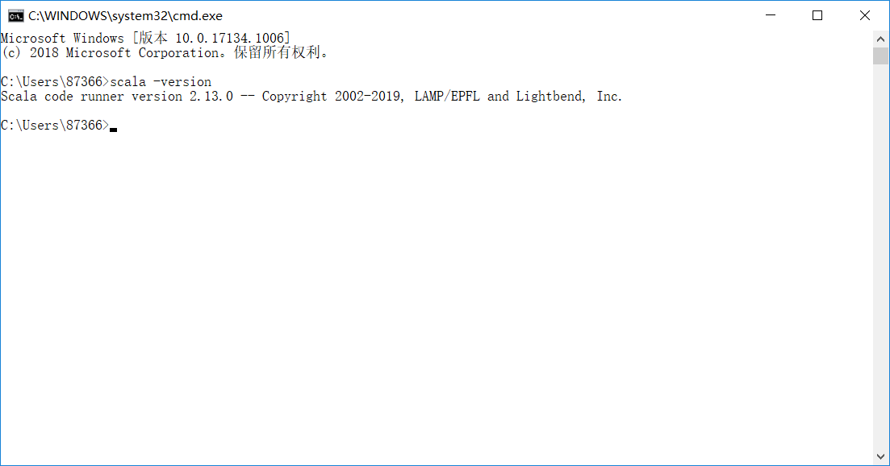
出现上图所示的内容即为安装完成。


## 5、下载安装Spark
在官网（http://spark.apache.org/downloads.html
）上下载Spark

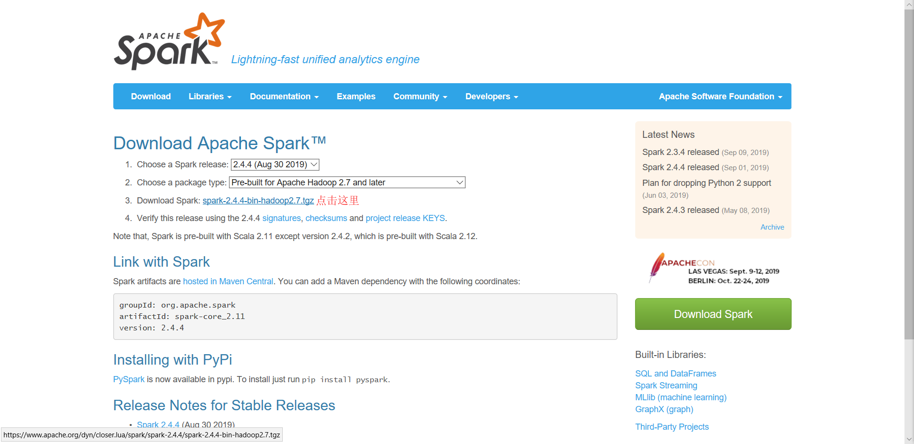

下载完成后，解压到D盘即可
## 6、配置Spark的环境变量
右击此电脑，打开属性
 

点击高级系统设置并点击环境变量，开始配置。在系统变量栏新建SPARK_HOME，编辑为spark的所在路径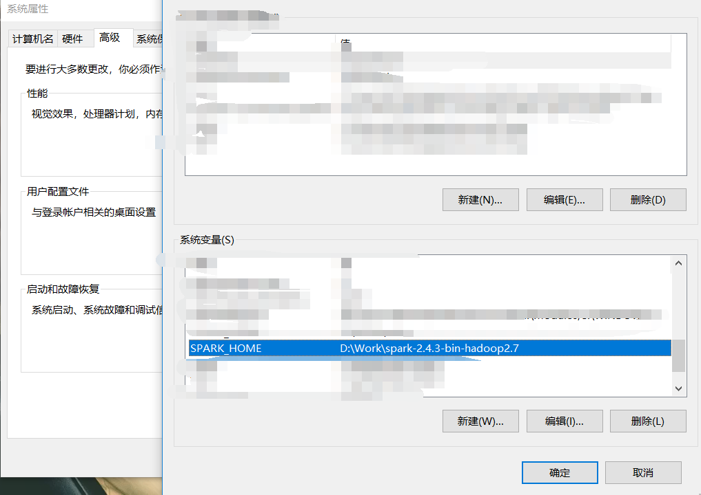
## 7、下载安装Hadoop
在官网（http://hadoop.apache.org/releases.html
）上下载适应版本的**Hadoop**（在下载解压的spark文件夹查看，可以看出我要下载的是**2.7及以后的版本**）


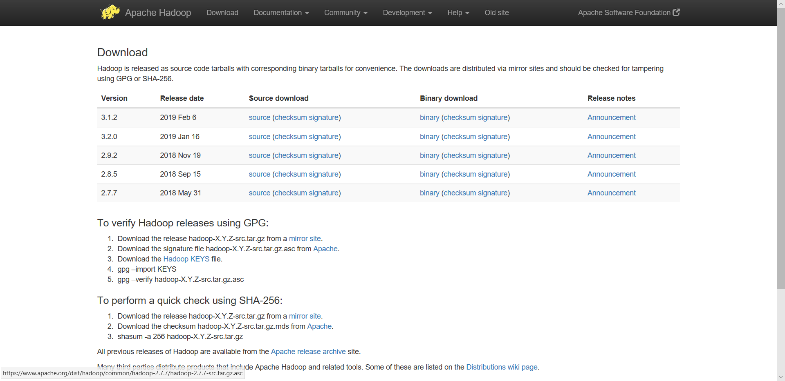 
点击**binary**进行下载，完成后解压到D盘即可
## 6、配置Hadoop的环境变量
右击此电脑，打开属性
 

点击高级系统设置并点击环境变量，开始配置。在系统变量栏新建SPARK_HOME，编辑为spark的所在路径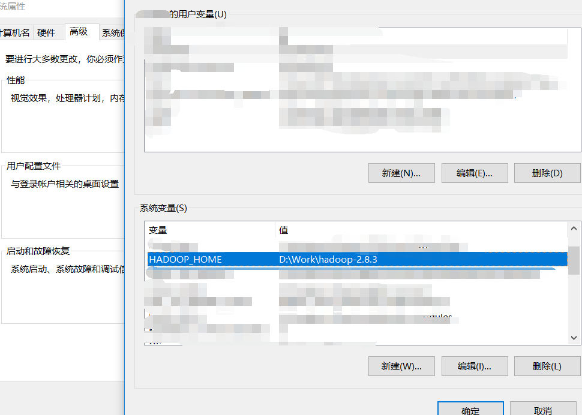

## 7、winutils下载
下载地址（https://github.com/steveloughran/winutils
），点击 **Clone or download** 下载 **winutils-master.zip**

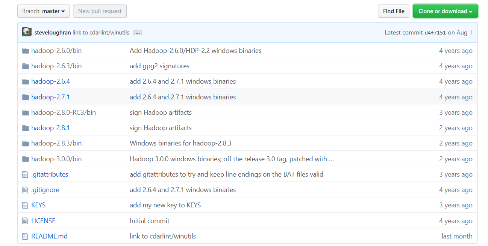 

下载完成后解压并打开，找到自己Hadoop对应的版本
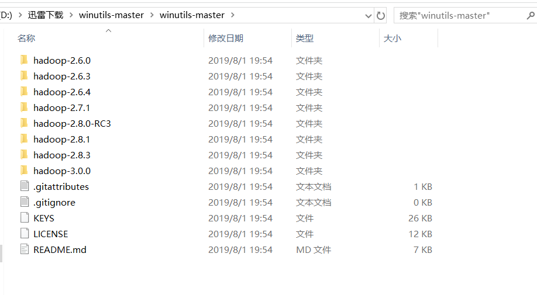

将其打开并将bin文件夹复制到Hadoop所在路径下
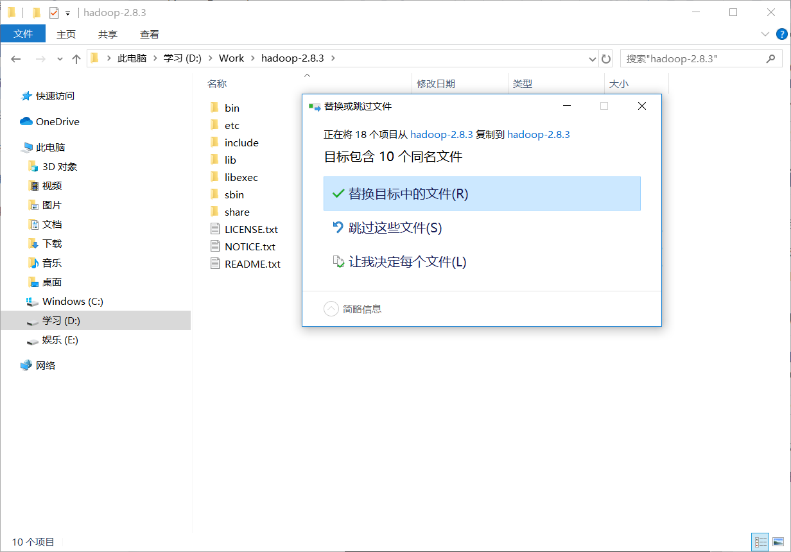

选择**替换目标中的的文件**

## 8、安装扩展库py4j
以**管理员身份**打开**命令提示符**，运行
```
pip install py4j
```
注意：如果出错，一般为网速问题；也有可能是pip版本太低，升级pip版本即可

## 9、验证
打开命令提示符，将路径切换到**spark-2.4.3-bin-hadoop2.7\bin**所在路径，执行命令**pyspark.cmd**，进入**Python**开发环境（不仅可以使用pyspark库，还可以使用Python标准库和已安装的扩展库）


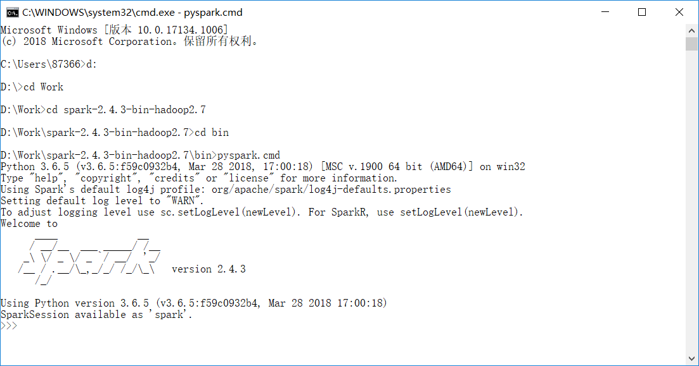

_没有出现错误信息，到这一步已经算是成功了，在此恭喜你已经成功搭建好了python下的spark_

另外，在Spark的bin文件夹中还提供了**spark-submit.cmd** 文件。

打开命令提示符，输入以下命令
```
spark-shell
```
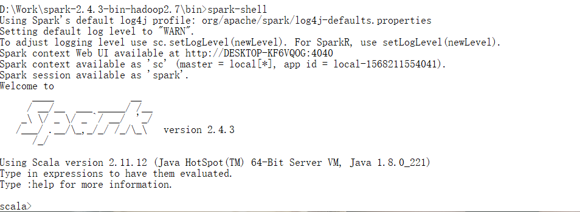

将**Spark context Web UI available at** 后的网址在浏览器中打开，可以访问控制台中的webui


