## 一、框架概述
### 1、什么是框架
#### （1）什么是框架
**框架（Framework）** *是整个或部分系统的可重用设计，表现为一组抽象构件及构件实例间交互的方法;另一种定义认为，框架是可被应用开发者定制的应用骨架。前者是从应用方面而后者是从目的方面给出的定义。*
* 简而言之，**框架其实就是某种应用的半成品，就是一组组件，供你选用完成你自己的系统**。**简单说就是使用别人搭好的舞台，你来做表演。而且，框架一般是成熟的，不断升级的软件。**

#### （2）框架要解决的问题
* **框架要解决的最重要的一个问题是技术整合的问题**，在J2EE的框架中，有着各种各样的技术，不同的软件企业需要从J2EE中选择不同的技术，这就使得软件企业最终的应用依赖于这些技术，技术自身的复杂性和技术的风险性将会直接对应用造成冲击。而应用是软件企业的核心，是竞争力的关键所在，因此应该将应用自身的设计和具体的实现技术解耦。这样，软件企业的研发将集中在应用的设计上，而不是具体的技术实现，技术实现是应用的底层支撑，它不应该直接对应用产生影响。
* **框架一般处在低层应用平台（如J2EE）和高层业务逻辑之间的中间层。**

#### （3）软件开发的分层重要性
**框架的重要性在于它实现了部分功能，并且能够很好的将低层应用平台和高层业务逻辑进行了缓和**。为了实现软件工程中的“**高内聚、低耦合**”。把问题划分开来各个解决，**易于控制，易于延展，易于分配资源**。**我们常见的MVC软件设计思想就是很好的分层思想。**
* **通过分层更好的实现了各个部分的职责，在每一层将再细化出不同的框架，分别解决各层关注的问题**。
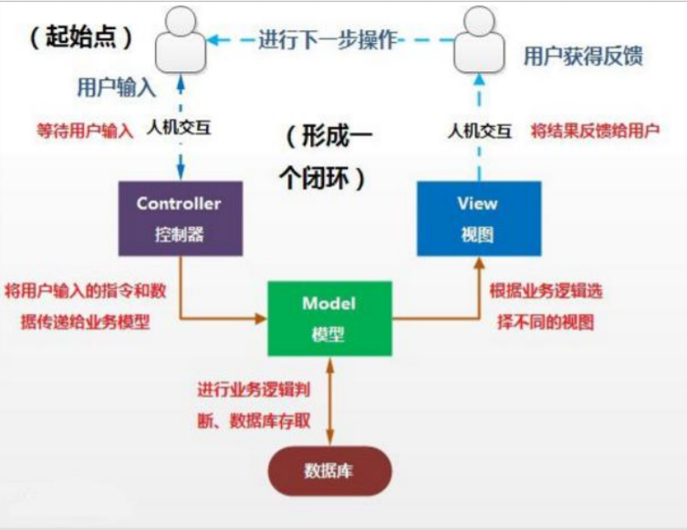

#### （4）分层开发下的常见框架
##### 常见的JavaEE开发框架：
* **解决数据的持久化问题的框架**
    * **Mybatis框架**
    * **封装程度更高的框架Hibernate**，但这个框架因为各种原因目前在国内的流行程度下降太多，现在公司开发也越来越少使用。
    * 目前使用**Spring Data**来实现数据持久化也是一种趋势。
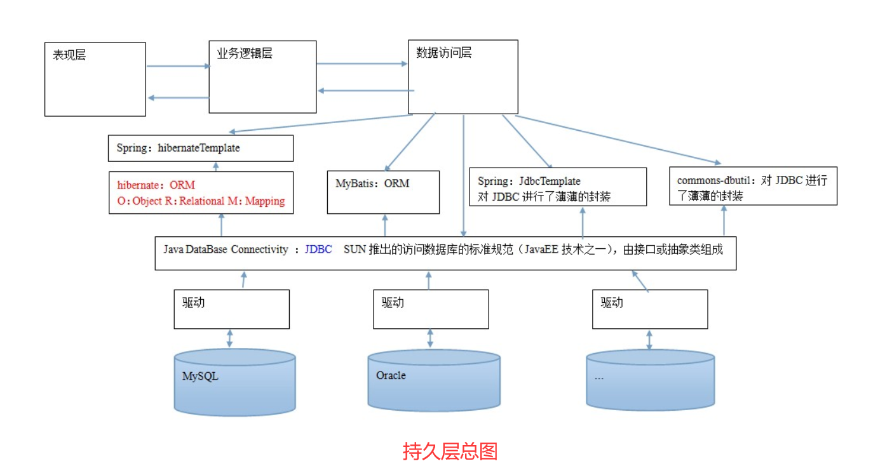
* **解决WEB层问题的MVC框架**
* **解决技术整合问题的Spring框架**


#### （5）MyBatis框架概述

* **Mybatis是一个优秀的基于java的持久层框架**，它**内部封装了jdbc**，使开发者**只需要关注sql语句本身**，而不需要花费精力去处理加载驱动、创建连接、创建 statement 等繁杂的过程。
* **Mybatis通过xml或注解的方式将要执行的各种statement配置起来**，并通过java对象和statement中sql的动态参数进行**映射生成最终执行的sql语句**，最后由Mybatis框架执行sql并**将结果映射为java对象并返回**。
* **采用ORM思想解决了实体和数据库映射的问题，对jdbc进行了封装**，屏蔽了jdbc api底层访问细节，使我们不用与jdbcapi打交道，就可以完成对数据库的持久化操作。


### 2、JDBC编程的分析
#### （1）jdbc程序的回顾
**下边使用jdbc的原始方法（未经封装）实现了查询数据库表记录的操作：**
```
public static void main(String[] args) {
    Connection connection = null;
    PreparedStatement preparedStatement = null;
    ResultSet resultSet = null;
    try {
        //加载数据库驱动
        Class.forName("com.mysql.jdbc.Driver");
        //通过驱动管理类获取数据库链接
        connection = DriverManager.getConnection("jdbc:mysql://localhost:3306/mybatis?characterEncoding=utf-8","root", "root");
        //定义 sql 语句 ?表示占位符
        String sql = "select * from user where username = ?";
        //获取预处理 statement
        preparedStatement = connection.prepareStatement(sql);
        //设置参数，第一个参数为 sql 语句中参数的序号（从 1 开始），第二个参数为设置的参数值
        preparedStatement.setString(1, "王五");
        //向数据库发出 sql 执行查询，查询出结果集
        resultSet = preparedStatement.executeQuery();
        //遍历查询结果集
        while(resultSet.next()){
            System.out.println(resultSet.getString("id")+","+resultSet.getString("username"));
        }
    } catch (Exception e) {
        e.printStackTrace();
    }finally{
        //释放资源
        if(resultSet!=null){
            try {
                resultSet.close();
            } catch (SQLException e) {
                e.printStackTrace();
            }
        }
        if(preparedStatement!=null){
            try {
                preparedStatement.close();
            } catch (SQLException e) {
                e.printStackTrace();
            }
        }
        if(connection!=null){
            try {
                connection.close();
            } catch (SQLException e) {
                // TODO Auto-generated catch block
                e.printStackTrace();
            }
        }
    }
}
```

#### （2）jdbc问题分析
* **数据库链接创建、释放频繁造成系统资源浪费从而影响系统性能**，如果**使用数据库链接池可解决此问题**。
* **Sql语句在代码中硬编码，造成代码不易维护**，实际应用sql变化的可能较大，sql变动需要改变java代码。
* **使用preparedStatement向占有位符号传参数存在硬编码**，因为sql语句的where条件不一定，可能多也可能少，修改sql还要修改代码，系统不易维护。
* **对结果集解析存在硬编码（查询列名）**，sql变化导致解析代码变化，系统不易维护，**如果能将数据库记
录封装成pojo对象解析比较方便。**

## 二、Mybatis框架快速入门
### 1、Mybatis框架开发的准备
* *官网下载Mybatis框架*（如果创建JavaEE工程可以使用，一般不推荐）[点击进入下载地址](https://github.com/mybatis/mybatis-3/releases)
* **创建普通maven工程，不需要选择模板，在pom文件中添加下面内容即可（包含在`<project>`标签内）**（推荐采用）
```
    <packaging>jar</packaging>

    <dependencies>
        <!--Mybatis的jar包-->
        <dependency>
            <groupId>org.mybatis</groupId>
            <artifactId>mybatis</artifactId>
            <version>3.4.5</version>
        </dependency>
        <!--连接数据库的驱动,根据自己的数据库版本进行修改-->
        <dependency>
            <groupId>mysql</groupId>
            <artifactId>mysql-connector-java</artifactId>
            <version>8.0.18</version>
        </dependency>
        <!--日志文件的jar包-->
        <dependency>
            <groupId>log4j</groupId>
            <artifactId>log4j</artifactId>
            <version>1.2.12</version>
        </dependency>
        <!--单元测试的jar包-->
        <dependency>
            <groupId>junit</groupId>
            <artifactId>junit</artifactId>
            <version>4.10</version>
        </dependency>
    </dependencies>
```
* **Mybatis开发文档** [点击进入](https://mybatis.org/mybatis-3/)
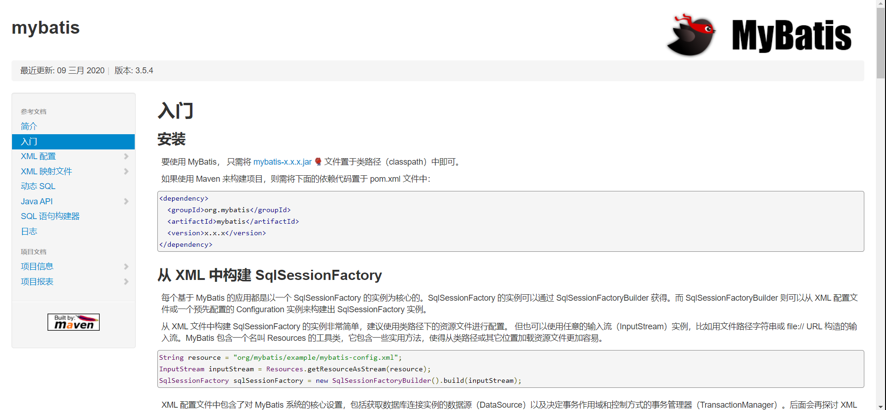

### 2、创建所需要的表
**sql语句**:
```
CREATE DATABASE javatest;
USE javatest;

DROP TABLE IF EXISTS `user`;

CREATE TABLE `user` (
  `id` int(11) NOT NULL auto_increment,
  `username` varchar(32) NOT NULL COMMENT '用户名称',
  `birthday` datetime default NULL COMMENT '生日',
  `sex` char(1) default NULL COMMENT '性别',
  `address` varchar(256) default NULL COMMENT '地址',
  PRIMARY KEY  (`id`)
) ENGINE=InnoDB DEFAULT CHARSET=utf8;


insert  into `user`(`id`,`username`,`birthday`,`sex`,`address`) values (41,'老王','2018-02-27 17:47:08','男','北京'),(42,'小二王','2018-03-02 15:09:37','女','北京金燕龙'),(43,'小二王','2018-03-04 11:34:34','女','北京金燕龙'),(45,'传智播客','2018-03-04 12:04:06','男','北京金燕龙'),(46,'老王','2018-03-07 17:37:26','男','北京'),(48,'小马宝莉','2018-03-08 11:44:00','女','北京修正');


DROP TABLE IF EXISTS `account`;

CREATE TABLE `account` (
  `ID` int(11) NOT NULL COMMENT '编号',
  `UID` int(11) default NULL COMMENT '用户编号',
  `MONEY` double default NULL COMMENT '金额',
  PRIMARY KEY  (`ID`),
  KEY `FK_Reference_8` (`UID`),
  CONSTRAINT `FK_Reference_8` FOREIGN KEY (`UID`) REFERENCES `user` (`id`)
) ENGINE=InnoDB DEFAULT CHARSET=utf8;


insert  into `account`(`ID`,`UID`,`MONEY`) values (1,41,1000),(2,45,1000),(3,41,2000);


DROP TABLE IF EXISTS `role`;

CREATE TABLE `role` (
  `ID` int(11) NOT NULL COMMENT '编号',
  `ROLE_NAME` varchar(30) default NULL COMMENT '角色名称',
  `ROLE_DESC` varchar(60) default NULL COMMENT '角色描述',
  PRIMARY KEY  (`ID`)
) ENGINE=InnoDB DEFAULT CHARSET=utf8;


insert  into `role`(`ID`,`ROLE_NAME`,`ROLE_DESC`) values (1,'院长','管理整个学院'),(2,'总裁','管理整个公司'),(3,'校长','管理整个学校');


DROP TABLE IF EXISTS `user_role`;

CREATE TABLE `user_role` (
  `UID` int(11) NOT NULL COMMENT '用户编号',
  `RID` int(11) NOT NULL COMMENT '角色编号',
  PRIMARY KEY  (`UID`,`RID`),
  KEY `FK_Reference_10` (`RID`),
  CONSTRAINT `FK_Reference_10` FOREIGN KEY (`RID`) REFERENCES `role` (`ID`),
  CONSTRAINT `FK_Reference_9` FOREIGN KEY (`UID`) REFERENCES `user` (`id`)
) ENGINE=InnoDB DEFAULT CHARSET=utf8;

insert  into `user_role`(`UID`,`RID`) values (41,1),(45,1),(41,2);

```

### 3、编写User实体类
```
package com.allen.domain;

import java.io.Serializable;
import java.util.Date;

public class User implements Serializable {

    private Integer id;
    private String username;
    private Date birthday;
    private String sex;
    private String address;

    public Integer getId() {
        return id;
    }

    public void setId(Integer id) {
        this.id = id;
    }

    public String getUsername() {
        return username;
    }

    public void setUsername(String username) {
        this.username = username;
    }

    public Date getBirthday() {
        return birthday;
    }

    public void setBirthday(Date birthday) {
        this.birthday = birthday;
    }

    public String getSex() {
        return sex;
    }

    public void setSex(String sex) {
        this.sex = sex;
    }

    public String getAddress() {
        return address;
    }

    public void setAddress(String address) {
        this.address = address;
    }

    @Override
    public String toString() {
        return "User{" +
                "id=" + id +
                ", username='" + username + '\'' +
                ", birthday=" + birthday +
                ", sex='" + sex + '\'' +
                ", address='" + address + '\'' +
                '}';
    }
}

```

### 4、编写持久层接口UserDao
```
package com.allen.dao;

import com.allen.domain.User;

import java.util.List;

public interface UserDao {
    /**
     * 查询所有
     * @return
     */
    List<User> findAll();
}
```

### 5、编写持久层接口的映射文件UserDao.xml
* **要求**：
    * **创建位置**：**必须和持久层接口在相同的包中。**
    * **名称**：**必须以持久层接口名称命名文件名，扩展名是.xml**
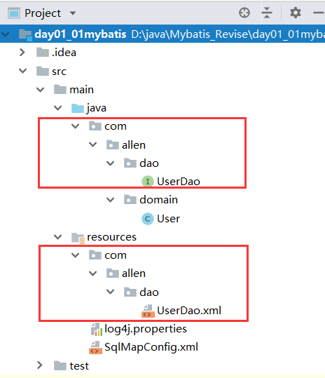
```
<?xml version="1.0" encoding="UTF-8"?>
<!DOCTYPE mapper
        PUBLIC "-//mybatis.org//DTD Mapper 3.0//EN"
        "http://mybatis.org/dtd/mybatis-3-mapper.dtd">
 <mapper namespace="com.allen.dao.UserDao">
    <!--配置查询所有-->
    <select id="findAll" resultType="com.allen.domain.User">
        select * from user
    </select>
</mapper>
```

### 6、编写SqlMapConfig.xml配置文件
```
<?xml version="1.0" encoding="UTF-8"?>
<!DOCTYPE configuration
        PUBLIC "-//mybatis.org//DTD Config 3.0//EN"
        "http://mybatis.org/dtd/mybatis-3-config.dtd">
<!--mybatis的主配置文件-->
<configuration>
    <!--配置环境-->
    <environments default="mysql">
        <!--配置mysql的环境-->
        <environment id="mysql">
            <!--配置事务的类型-->
            <transactionManager type="jdbc"></transactionManager>
            <!--配置数据源（连接池）-->
            <dataSource type="POOLED">
                <!--配置连接数据库的4个基本信息-->
                <property name="driver" value="com.mysql.cj.jdbc.Driver"/>
                <property name="url" value="jdbc:mysql://localhost:3306/javatest?useSSL=false&amp;serverTimezone=UTC"/>
                <property name="username" value="root"/>
                <property name="password" value="991104"/>
            </dataSource>
        </environment>
    </environments>

    <!--指定映射配置文件的位置，映射配置文件指的是每个dao独立的配置文件-->
    <mappers>
        <mapper resource="com/allen/dao/UserDao.xml"/>
    </mappers>
</configuration>
```

### 7、编写测试类
```
package com.allen.test;

import com.allen.dao.UserDao;
import com.allen.domain.User;
import org.apache.ibatis.io.Resources;
import org.apache.ibatis.session.SqlSession;
import org.apache.ibatis.session.SqlSessionFactory;
import org.apache.ibatis.session.SqlSessionFactoryBuilder;

import java.io.IOException;
import java.io.InputStream;
import java.util.List;

public class MybatisTest {
    public static void main(String[] args) throws IOException {
        //1、读取配置文件
        InputStream in = Resources.getResourceAsStream("SqlMapConfig.xml");
        //2、创建SqlSessionFactory工厂
        SqlSessionFactoryBuilder builder = new SqlSessionFactoryBuilder();
        SqlSessionFactory factory = builder.build(in);
        //3、使用工厂生产SqlSession对象
        SqlSession session = factory.openSession();
        //4、使用SqlSession创建Dao接口的代理对象
        UserDao userDao = session.getMapper(UserDao.class);
        //5、使用代理对象执行方法
        List<User> users = userDao.findAll();
        for (User user : users) {
            System.out.println(user);
        }
        //6、释放资源
        session.close();
        in.close();
    }
}

```

### 8、小结
* **查询所有的分析**
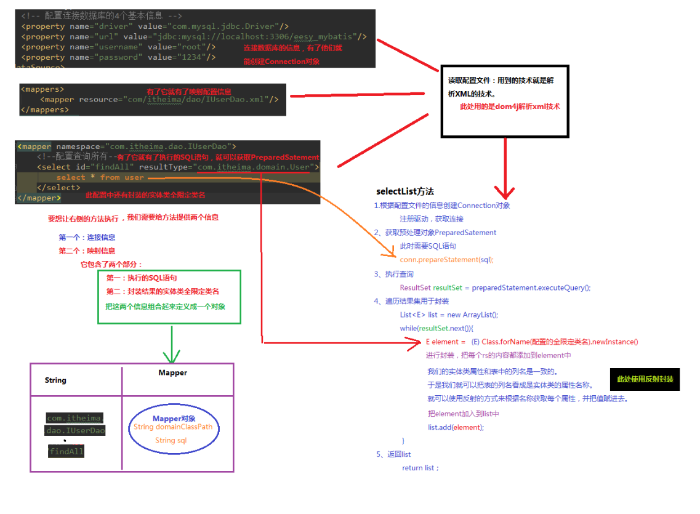
* **入门案例的分析**
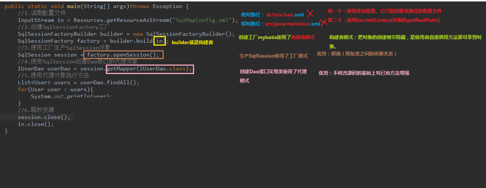
* 通过快速入门示例，我们发现**使用mybatis是非常容易的一件事情**，因为只需要编写Dao接口并且按照Mybatis要求编写**两个配置文件**，就可以实现功能。远**比之前的jdbc方便**多了。（使用注解之后，将变得更为简单，只需要编写一个Mybatis配置文件就够了。）
* 但是，这里面包含了许多细节，比如为什么会有**工厂对象（SqlSessionFactory）**,为什么有了工厂之后还
要有**构建者对象（SqlSessionFactoryBuilder）**，为什么UserDao.xml在创建时有位置和文件名的要求等等。
* **这些问题通过后面自己实现自定义Mybatis框架，就会有所认识**。
* *注意：自定义Mybatis框架，不是让大家回去自己去写个 Mybatis，而是让能更好了了解Mybatis内部是怎么执行的，在以后的开发中能更好的使用Mybatis框架，同时对它的设计理念（设计模式）有一个认识。*

### 9、补充（基于注解的 mybatis 使用）
#### （1）在持久层接口中添加注解
```
package com.allen.dao;

import com.allen.domain.User;
import org.apache.ibatis.annotations.Select;

import java.util.List;

public interface UserDao {
    /**
     * 查询所有
     * @return
     */
    @Select("select * from user")
    List<User> findAll();
}

```
#### （2）修改SqlMapConfig.xml
```
<?xml version="1.0" encoding="UTF-8"?>
<!DOCTYPE configuration
        PUBLIC "-//mybatis.org//DTD Config 3.0//EN"
        "http://mybatis.org/dtd/mybatis-3-config.dtd">
<!--mybatis的主配置文件-->
<configuration>
    <!--配置环境-->
    <environments default="mysql">
        <!--配置mysql的环境-->
        <environment id="mysql">
            <!--配置事务的类型-->
            <transactionManager type="jdbc"></transactionManager>
            <!--配置数据源（连接池）-->
            <dataSource type="POOLED">
                <!--配置连接数据库的4个基本信息-->
                <property name="driver" value="com.mysql.cj.jdbc.Driver"/>
                <property name="url" value="jdbc:mysql://localhost:3306/javatest?useSSL=false&amp;serverTimezone=UTC"/>
                <property name="username" value="root"/>
                <property name="password" value="991104"/>
            </dataSource>
        </environment>
    </environments>

    <!--指定映射配置文件的位置，映射配置文件指的是每个dao独立的配置文件
        如果用注解来配置的话，此处应该适应class属性指定被逐节的dao全限定类名
    -->
    <mappers>
        <mapper class="com.allen.dao.UserDao"/>
    </mappers>
</configuration>
```
#### （3）注意事项
**在使用基于注解的Mybatis配置时，先移除xml的映射配置（UserDao.xml）。**

## 三、自定义Mybatis框架
### 1、自定义Mybatis框架的分析
#### （1）涉及知识点介绍
**下面将使用前面所学的基础知识来构建一个属于自己的持久层框架**，将会涉及到的一些知识点：**工厂模式（Factory 工厂模式）、构造者模式（Builder 模式）、代理模式，反射，自定义注解，注解的反射，xml 解析，数据库元数据，元数据的反射等。**
#### （2）分析流程
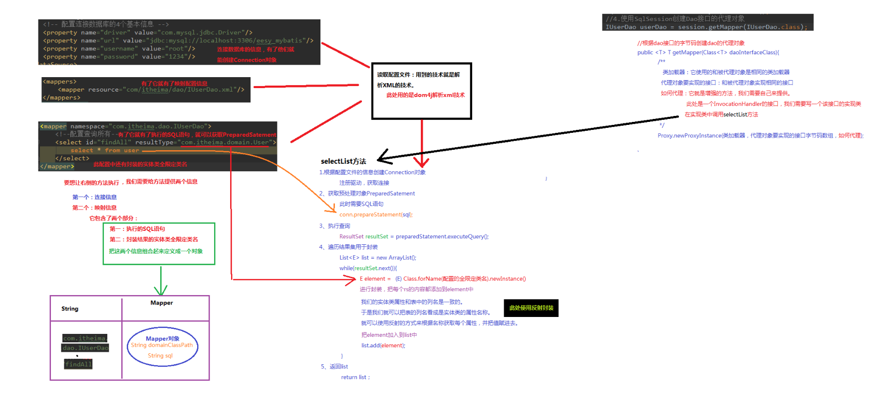
### 2、前期准备
#### （1）创建Maven工程
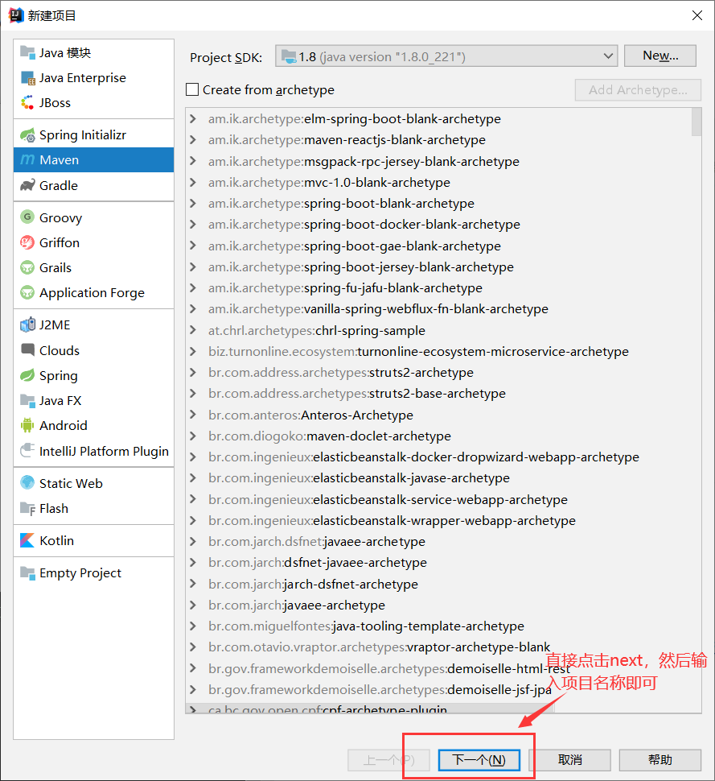
#### （2）引入相关坐标
**在pom文件中添加下面内容即可（包含在`<project>`标签内）**
```
    <packaging>jar</packaging>

    <dependencies>
        <!--因为是自定义mybatis所有不用导入Mybatis的jar包-->
        <!--连接数据库的驱动,根据自己的数据库版本进行修改-->
        <dependency>
            <groupId>mysql</groupId>
            <artifactId>mysql-connector-java</artifactId>
            <version>8.0.18</version>
        </dependency>
        <!--日志文件的jar包-->
        <dependency>
            <groupId>log4j</groupId>
            <artifactId>log4j</artifactId>
            <version>1.2.12</version>
        </dependency>
        <!--单元测试的jar包-->
        <dependency>
            <groupId>junit</groupId>
            <artifactId>junit</artifactId>
            <version>4.10</version>
        </dependency>
    </dependencies>
```
#### （3）引入工具类到项目中
*该工具类为解析Xml文件的工具类，了解即可*
```
package com.allen.mybatis.utils;

//import com.allen.mybatis.annotations.Select;
import com.allen.mybatis.annotation.Select;
import com.allen.mybatis.cfg.Configuration;
import com.allen.mybatis.cfg.Mapper;
import com.allen.mybatis.io.Resources;

import org.dom4j.Attribute;
import org.dom4j.Document;
import org.dom4j.Element;
import org.dom4j.io.SAXReader;

import java.io.IOException;
import java.io.InputStream;
import java.lang.reflect.Method;
import java.lang.reflect.ParameterizedType;
import java.lang.reflect.Type;
import java.util.HashMap;
import java.util.List;
import java.util.Map;

/**
 *  用于解析配置文件
 */
public class XMLConfigBuilder {

    /**
     * 解析主配置文件，把里面的内容填充到DefaultSqlSession所需要的地方
     * 使用的技术：
     *      dom4j+xpath
     */
    public static Configuration loadConfiguration(InputStream config){
        try{
            //定义封装连接信息的配置对象（mybatis的配置对象）
            Configuration cfg = new Configuration();

            //1.获取SAXReader对象
            SAXReader reader = new SAXReader();
            //2.根据字节输入流获取Document对象
            Document document = reader.read(config);
            //3.获取根节点
            Element root = document.getRootElement();
            //4.使用xpath中选择指定节点的方式，获取所有property节点
            List<Element> propertyElements = root.selectNodes("//property");
            //5.遍历节点
            for(Element propertyElement : propertyElements){
                //判断节点是连接数据库的哪部分信息
                //取出name属性的值
                String name = propertyElement.attributeValue("name");
                if("driver".equals(name)){
                    //表示驱动
                    //获取property标签value属性的值
                    String driver = propertyElement.attributeValue("value");
                    cfg.setDriver(driver);
                }
                if("url".equals(name)){
                    //表示连接字符串
                    //获取property标签value属性的值
                    String url = propertyElement.attributeValue("value");
                    cfg.setUrl(url);
                }
                if("username".equals(name)){
                    //表示用户名
                    //获取property标签value属性的值
                    String username = propertyElement.attributeValue("value");
                    cfg.setUsername(username);
                }
                if("password".equals(name)){
                    //表示密码
                    //获取property标签value属性的值
                    String password = propertyElement.attributeValue("value");
                    cfg.setPassword(password);
                }
            }
            //取出mappers中的所有mapper标签，判断他们使用了resource还是class属性
            List<Element> mapperElements = root.selectNodes("//mappers/mapper");
            //遍历集合
            for(Element mapperElement : mapperElements){
                //判断mapperElement使用的是哪个属性
                Attribute attribute = mapperElement.attribute("resource");
                if(attribute != null){
                    System.out.println("使用的是XML");
                    //表示有resource属性，用的是XML
                    //取出属性的值
                    String mapperPath = attribute.getValue();//获取属性的值"com/allen/dao/UserDao.xml"
                    //把映射配置文件的内容获取出来，封装成一个map
                    Map<String, Mapper> mappers = loadMapperConfiguration(mapperPath);
                    //给configuration中的mappers赋值
                    cfg.setMappers(mappers);
                }else{
                    System.out.println("使用的是注解");
                    //表示没有resource属性，用的是注解
                    //获取class属性的值
                    String daoClassPath = mapperElement.attributeValue("class");
                    //根据daoClassPath获取封装的必要信息
                    Map<String,Mapper> mappers = loadMapperAnnotation(daoClassPath);
                    //给configuration中的mappers赋值
                    cfg.setMappers(mappers);
                }
            }
            //返回Configuration
            return cfg;
        }catch(Exception e){
            throw new RuntimeException(e);
        }finally{
            try {
                config.close();
            }catch(Exception e){
                e.printStackTrace();
            }
        }

    }

    /**
     * 根据传入的参数，解析XML，并且封装到Map中
     * @param mapperPath    映射配置文件的位置
     * @return  map中包含了获取的唯一标识（key是由dao的全限定类名和方法名组成）
     *          以及执行所需的必要信息（value是一个Mapper对象，里面存放的是执行的SQL语句和要封装的实体类全限定类名）
     */
    private static Map<String,Mapper> loadMapperConfiguration(String mapperPath)throws IOException {
        InputStream in = null;
        try{
            //定义返回值对象
            Map<String,Mapper> mappers = new HashMap<String,Mapper>();
            //1.根据路径获取字节输入流
            in = Resources.getResourceAsStream(mapperPath);
            //2.根据字节输入流获取Document对象
            SAXReader reader = new SAXReader();
            Document document = reader.read(in);
            //3.获取根节点
            Element root = document.getRootElement();
            //4.获取根节点的namespace属性取值
            String namespace = root.attributeValue("namespace");//是组成map中key的部分
            //5.获取所有的select节点
            List<Element> selectElements = root.selectNodes("//select");
            //6.遍历select节点集合
            for(Element selectElement : selectElements){
                //取出id属性的值      组成map中key的部分
                String id = selectElement.attributeValue("id");
                //取出resultType属性的值  组成map中value的部分
                String resultType = selectElement.attributeValue("resultType");
                //取出文本内容            组成map中value的部分
                String queryString = selectElement.getText();
                //创建Key
                String key = namespace+"."+id;
                //创建Value
                Mapper mapper = new Mapper();
                mapper.setQueryString(queryString);
                mapper.setResultType(resultType);
                //把key和value存入mappers中
                mappers.put(key,mapper);
            }
            return mappers;
        }catch(Exception e){
            throw new RuntimeException(e);
        }finally{
            in.close();
        }
    }

    /**
     * 根据传入的参数，得到dao中所有被select注解标注的方法。
     * 根据方法名称和类名，以及方法上注解value属性的值，组成Mapper的必要信息
     * @param daoClassPath
     * @return
     */
    private static Map<String,Mapper> loadMapperAnnotation(String daoClassPath)throws Exception{
        //定义返回值对象
        Map<String,Mapper> mappers = new HashMap<String, Mapper>();

        //1.得到dao接口的字节码对象
        Class daoClass = Class.forName(daoClassPath);
        //2.得到dao接口中的方法数组
        Method[] methods = daoClass.getMethods();
        //3.遍历Method数组
        for(Method method : methods){
            //取出每一个方法，判断是否有select注解
            boolean isAnnotated = method.isAnnotationPresent(Select.class);
            if(isAnnotated){
                //创建Mapper对象
                Mapper mapper = new Mapper();
                //取出注解的value属性值
                Select selectAnno = method.getAnnotation(Select.class);
                String queryString = selectAnno.value();
                mapper.setQueryString(queryString);
                //获取当前方法的返回值，还要求必须带有泛型信息
                Type type = method.getGenericReturnType();//List<User>
                //判断type是不是参数化的类型
                if(type instanceof ParameterizedType){
                    //强转
                    ParameterizedType ptype = (ParameterizedType)type;
                    //得到参数化类型中的实际类型参数
                    Type[] types = ptype.getActualTypeArguments();
                    //取出第一个
                    Class domainClass = (Class)types[0];
                    //获取domainClass的类名
                    String resultType = domainClass.getName();
                    //给Mapper赋值
                    mapper.setResultType(resultType);
                }
                //组装key的信息
                //获取方法的名称
                String methodName = method.getName();
                String className = method.getDeclaringClass().getName();
                String key = className+"."+methodName;
                //给map赋值
                mappers.put(key,mapper);
            }
        }
        return mappers;
    }
}
```
#### （4）编写SqlMapConfig.xml
```
<?xml version="1.0" encoding="UTF-8"?>
<!--mybatis的主配置文件-->
<configuration>
    <!--配置环境-->
    <environments default="mysql">
        <!--配置mysql的环境-->
        <environment id="mysql">
            <!--配置事务的类型-->
            <transactionManager type="jdbc"></transactionManager>
            <!--配置数据源（连接池）-->
            <dataSource type="POOLED">
                <!--配置连接数据库的4个基本信息-->
                <property name="driver" value="com.mysql.cj.jdbc.Driver"/>
                <property name="url" value="jdbc:mysql://localhost:3306/javatest?useSSL=false&amp;serverTimezone=UTC"/>
                <property name="username" value="root"/>
                <property name="password" value="991104"/>
            </dataSource>
        </environment>
    </environments>

    <!--指定映射配置文件的位置，映射配置文件指的是每个dao独立的配置文件-->
    <mappers>
        <mapper resource="com/allen/dao/UserDao.xml"/>
    </mappers>
</configuration>
```
* **注意**：
**此处我们直接使用的是mybatis的配置文件，但是由于我们没有使用mybatis的jar包，所以要把配置文件的约束删掉否则会报错（如果电脑能接入互联网，不删也行）**

#### （5）编写读取配置文件类
```
package com.allen.mybatis.io;

import java.io.InputStream;

public class Resources {
    /**
     * 根据传入的参数，获得一个字节输入流
     * @param filePath
     * @return
     */
    public static InputStream getResourceAsStream(String filePath){
        return Resources.class.getClassLoader().getResourceAsStream(filePath);
    }
}
```

#### （6）编写Mapper类
```
package com.allen.mybatis.cfg;

/**
 * 用于封装执行的SQL语句和结果类型的全限定类名
 */
public class Mapper {

    private String queryString;//SQL
    private String resultType;//实体类的全限定类名

    public String getQueryString() {
        return queryString;
    }

    public void setQueryString(String queryString) {
        this.queryString = queryString;
    }

    public String getResultType() {
        return resultType;
    }

    public void setResultType(String resultType) {
        this.resultType = resultType;
    }
}
```

#### （7）编写Configuration配置类
```
package com.allen.mybatis.cfg;

import java.util.HashMap;
import java.util.Map;

public class Configuration {

    private String driver;
    private String url;
    private String username;
    private String password;

    private Map<String,Mapper> mappers = new HashMap<String, Mapper>();

    public Map<String, Mapper> getMappers() {
        return mappers;
    }

    public void setMappers(Map<String, Mapper> mappers) {
        this.mappers.putAll(mappers);//此处需要使用追加的方式
    }

    public String getDriver() {
        return driver;
    }

    public void setDriver(String driver) {
        this.driver = driver;
    }

    public String getUrl() {
        return url;
    }

    public void setUrl(String url) {
        this.url = url;
    }

    public String getUsername() {
        return username;
    }

    public void setUsername(String username) {
        this.username = username;
    }

    public String getPassword() {
        return password;
    }

    public void setPassword(String password) {
        this.password = password;
    }
}
```

#### （8）编写User实体类
```
package com.allen.domain;

import java.io.Serializable;
import java.util.Date;

public class User implements Serializable {

    private Integer id;
    private String username;
    private Date birthday;
    private String sex;
    private String address;

    public Integer getId() {
        return id;
    }

    public void setId(Integer id) {
        this.id = id;
    }

    public String getUsername() {
        return username;
    }

    public void setUsername(String username) {
        this.username = username;
    }

    public Date getBirthday() {
        return birthday;
    }

    public void setBirthday(Date birthday) {
        this.birthday = birthday;
    }

    public String getSex() {
        return sex;
    }

    public void setSex(String sex) {
        this.sex = sex;
    }

    public String getAddress() {
        return address;
    }

    public void setAddress(String address) {
        this.address = address;
    }

    @Override
    public String toString() {
        return "User{" +
                "id=" + id +
                ", username='" + username + '\'' +
                ", birthday=" + birthday +
                ", sex='" + sex + '\'' +
                ", address='" + address + '\'' +
                '}';
    }
}
```

### 3、基于XML的自定义mybatis框架
#### （1）编写持久层接口和UserDao.xml
* 持久层接口UserDao
```
package com.allen.dao;

import com.allen.domain.User;

import java.util.List;

public interface UserDao {
    /**
     * 查询所有
     * @return
     */
    List<User> findAll();
}
```
* UserDao.xml
```
<?xml version="1.0" encoding="UTF-8"?>
 <mapper namespace="com.allen.dao.UserDao">
    <!--配置查询所有-->
    <select id="findAll" resultType="com.allen.domain.User">
        select * from user
    </select>
</mapper>
```

#### （2）编写构建者类
```
package com.allen.mybatis.sqlsession;

import com.allen.mybatis.cfg.Configuration;
import com.allen.mybatis.sqlsession.defaults.DefaultSqlSessionFactory;
import com.allen.mybatis.utils.XMLConfigBuilder;

import java.io.InputStream;

/**
 * 用于创建SqlSessionFactory对象
 */
public class SqlSessionFactoryBuilder {
    /**
     * 根据参数的字节输入流构建一个SqlSessionFactory工厂
     * @param in
     * @return
     */
    public SqlSessionFactory build(InputStream in){
        Configuration cfg = XMLConfigBuilder.loadConfiguration(in);
        return new DefaultSqlSessionFactory(cfg);
    }
}
```

#### （3）编写SqlSessionFactory接口和实现类
* SqlSessionFactory接口
```
package com.allen.mybatis.sqlsession;

public interface SqlSessionFactory {
    /**
     * 用户打开一个新的SqlSession对象
     * @return
     */
    SqlSession openSession();
}

```
* 实现类
```
package com.allen.mybatis.sqlsession.defaults;

import com.allen.mybatis.cfg.Configuration;
import com.allen.mybatis.sqlsession.SqlSession;
import com.allen.mybatis.sqlsession.SqlSessionFactory;

/**
 * SqlSessionFactory接口的实现类
 */
public class DefaultSqlSessionFactory implements SqlSessionFactory {
    private Configuration cfg;

    public DefaultSqlSessionFactory(Configuration cfg){
        this.cfg = cfg;
    }
    /**
     * 用于创建一个新的操作数据库对象
     * @return
     */
    @Override
    public SqlSession openSession() {
        return new DefaultSqlSession(cfg);
    }
}
```

#### （4）编写SqlSession接口和实现类
* SqlSession接口
```
package com.allen.mybatis.sqlsession;

/**
 * 自定义Mybatis中和数据库交互的核心类
 * 它里面可以创建dao接口的代理对象
 */
public interface SqlSession {
    /**
     * 根据参数创建一个代理对象
     * @param daoInterfaceClass dao的接口字节码
     * @param <T>
     * @return
     */
    <T> T getMapper(Class<T> daoInterfaceClass);

    /**
     * 释放资源
     */
    void  close();
}
```
* 实现类
```
package com.allen.mybatis.sqlsession.defaults;

import com.allen.mybatis.cfg.Configuration;
import com.allen.mybatis.sqlsession.SqlSession;
import com.allen.mybatis.sqlsession.proxy.MapperProxy;
import com.allen.mybatis.utils.DataSourceUtil;

import java.lang.reflect.Proxy;
import java.sql.Connection;
import java.sql.SQLException;

/**
 * SqlSession接口的实现类
 */
public class DefaultSqlSession implements SqlSession {

    private Configuration cfg;
    private Connection conn;
    public DefaultSqlSession(Configuration cfg){
        this.cfg = cfg;
        conn = DataSourceUtil.getConnection(cfg);
    }

    /**
     * 用户创建代理对象
     * @param daoInterfaceClass dao的接口字节码
     * @param <T>
     * @return
     */
    @Override
    public <T> T getMapper(Class<T> daoInterfaceClass) {
        return (T) Proxy.newProxyInstance(daoInterfaceClass.getClassLoader(),
                new Class[]{daoInterfaceClass},new MapperProxy(cfg.getMappers(),conn));
    }

    /**
     * 用于释放资源
     */
    @Override
    public void close() {
        if (conn != null){
            try {
                conn.close();
            } catch (SQLException e) {
                e.printStackTrace();
            }
        }
    }
}
```
#### （5）编写用于创建Dao接口代理对象的类
```
package com.allen.mybatis.sqlsession.proxy;

import com.allen.mybatis.cfg.Mapper;
import com.allen.mybatis.utils.Executor;

import java.lang.reflect.InvocationHandler;
import java.lang.reflect.Method;
import java.sql.Connection;
import java.util.Map;

public class MapperProxy implements InvocationHandler {
    //map的key是全限定类名+方法名
    private Map<String, Mapper> mappers;
    private Connection conn;
    public MapperProxy(Map<String,Mapper> mappers,Connection conn){
        this.mappers = mappers;
        this.conn = conn;
    }
    /**
     *用于对方法进行增强的，我们的增强其实就是调用selectList方法
     * @param proxy
     * @param method
     * @param args
     * @return
     * @throws Throwable
     */
    @Override
    public Object invoke(Object proxy, Method method, Object[] args) throws Throwable {
        //1、获取方法名
        String methodName = method.getName();
        //2、获取方法所在类的名称
        String className = method.getDeclaringClass().getName();
        //3、组合key
        String key = className + "." + methodName;
        //4、获取mappers中的Mapper对象
        Mapper mapper = mappers.get(key);
        //5、判断是否有mapper
        if(mapper == null){
            throw new IllegalAccessException("传入的参数有误");
        }
        //6、调用工具类执行查询所有
        return new Executor().selectList(mapper,conn);
    }
}
```
#### （6）运行测试类
```
package com.allen.test;

import com.allen.dao.UserDao;
import com.allen.domain.User;
import com.allen.mybatis.io.Resources;
import com.allen.mybatis.sqlsession.SqlSession;
import com.allen.mybatis.sqlsession.SqlSessionFactory;
import com.allen.mybatis.sqlsession.SqlSessionFactoryBuilder;

import java.io.IOException;
import java.io.InputStream;
import java.util.List;

public class MybatisTest {
    public static void main(String[] args) throws IOException {
        //1、读取配置文件
        InputStream in = Resources.getResourceAsStream("SqlMapConfig.xml");
        //2、创建SqlSessionFactory工厂
        SqlSessionFactoryBuilder builder = new SqlSessionFactoryBuilder();
        SqlSessionFactory factory = builder.build(in);
        //3、使用工厂生产SqlSession对象
        SqlSession session = factory.openSession();
        //4、使用SqlSession创建Dao接口的代理对象
        UserDao userDao = session.getMapper(UserDao.class);
        //5、使用代理对象执行方法
        List<User> users = userDao.findAll();
        for (User user : users) {
            System.out.println(user);
        }
        //6、释放资源
        session.close();
        in.close();
    }
}
```
### 4、基于注解方式定义Mybatis框架
#### （1）自定义@Select注解
```
package com.allen.mybatis.annotation;

import java.lang.annotation.ElementType;
import java.lang.annotation.Retention;
import java.lang.annotation.RetentionPolicy;
import java.lang.annotation.Target;

/**
 * 查询的注解
 */
@Retention(RetentionPolicy.RUNTIME)
@Target(ElementType.METHOD)
public @interface Select {
    /**
     * 配置SQL语句的
     * @return
     */
    String value();
}
```

#### （2）修改持久层接口
```
package com.allen.dao;

import com.allen.domain.User;
import com.allen.mybatis.annotation.Select;

import java.util.List;
public interface UserDao {
    /**
     * 查询所有
     * @return
     */
    @Select("select * from user")
    List<User> findAll();
}
```

#### （3）修改 SqlMapConfig.xml
```
<?xml version="1.0" encoding="UTF-8"?>
<!--mybatis的主配置文件-->
<configuration>
    <!--配置环境-->
    <environments default="mysql">
        <!--配置mysql的环境-->
        <environment id="mysql">
            <!--配置事务的类型-->
            <transactionManager type="jdbc"></transactionManager>
            <!--配置数据源（连接池）-->
            <dataSource type="POOLED">
                <!--配置连接数据库的4个基本信息-->
                <property name="driver" value="com.mysql.cj.jdbc.Driver"/>
                <property name="url" value="jdbc:mysql://localhost:3306/javatest?useSSL=false&amp;serverTimezone=UTC"/>
                <property name="username" value="root"/>
                <property name="password" value="991104"/>
            </dataSource>
        </environment>
    </environments>

    <!--指定映射配置文件的位置，映射配置文件指的是每个dao独立的配置文件-->
    <mappers>
        <!--<mapper resource="com/allen/dao/UserDao.xml"/>-->
        <mapper class="com.allen.dao.UserDao"/>
    </mappers>
</configuration>
```

### 5、自定义Mybatis的设计模式说明
#### （1）工厂模式（SqlSessionFactory）
工厂模式是我们最常用的实例化对象模式了，是**用工厂方法代替new操作的一种模式**。著名的Jive论坛 ,就大量使用了工厂模式，**工厂模式在Java程序系统可以说是随处可见。因为工厂模式就相当于创建实例对象的new，我们经常要根据类Class生成实例对象，如A a=new A() 工厂模式也是用来创建实例对象的**，所以以后new时就要多个心眼，是否可以考虑使用工厂模式，虽然这样做，可能多做一些工作，但会给你系统带来更大的可扩展性和尽量少的修改量。

#### （2）代理模式(MapperProxy)
* **代理模式分为静态和动态代理**。静态代理，我们通常都很熟悉。有一个写好的代理类，实现与要代理的类的一个共同的接口，目的是**为了约束也为了安全**。
* 这里主要想说的是关于动态代理。我们知道静态代理若想代理多个类，实现扩展功能，那么它必须具有多个代理类分别取代理不同的实现类。这样做的后果是造成太多的**代码冗余**。那么我们会思考如果做，才能既满足需求，又没有太多的冗余代码呢？**动态代理**。

#### （3）构建者模式(SqlSessionFactoryBuilder)
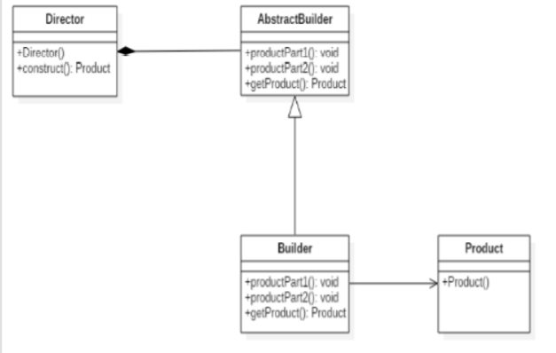
从图中我们可以看出，**创建者模式由四部分组成**。
* **抽象创建者角色**：给出一个抽象接口，以规范产品对象的各个组成成分的建造。一般而言，此接口独立于应用程序的商业逻辑。模式中直接创建产品对象的是具体创建者角色。具体创建者必须实现这个接口的两种方法：一是建造方法，比如图中的buildPart1和buildPart2方法；另一种是结果返回方法，即图中的getProduct方法。一般来说，产品所包含的零件数目与建造方法的数目相符。换言之，有多少零件，就有多少相应的建造方法。
* **具体创建者角色**：他们在应用程序中负责创建产品的实例。这个角色要完成的任务包括：
    * 实现抽象创建者所声明的抽象方法，给出一步一步的完成产品创建实例的操作。
    * 在创建完成后，提供产品的实例。
* **导演者角色**：这个类调用具体创建者角色以创建产品对象。但是导演者并没有产品类的具体知识，真正拥有产
品类的具体知识的是具体创建者角色。
* **产品角色**：产品便是建造中的复杂对象。一般说来，一个系统中会有多于一个的产品类，而且这些产品类并不
一定有共同的接口，而完全可以使不相关联的。

### 6、总结


## 四、基于代理Dao实现CRUD操作
### 1、Mybatis环境搭建步骤
* **第一步：创建maven工程**
* **第二步：导入坐标**
* **第三步：编写必要代码（实体类和持久层接口）**
* **第四步：编写SqlMapConfig.xml**
* **第五步：编写映射配置文件**
* **第六步：编写测试类**

### 2、根据ID查询
#### （1）在持久层接口中添加findById方法
```
/**
* 根据 id 查询
* @param userId
* @return
*/
User findById(Integer userId);
```
#### （2）在用户的映射配置文件中配置
```
<!-- 根据 id 查询 -->
<select id="findById" resultType="com.allen.domain.User" parameterType="int">
    select * from user where id = #{uid}
</select>
```
**细节：**
* **resultType属性**：用于指定**结果集**的类型。
* **parameterType属性**：用于指定**传入参数**的类型。
* **sql语句中使用#{}字符**：它代表**占位符**，相当于原来jdbc部分所学的?，都是用于执行语句时替换实际的数据。**具体的数据是由#{}里面的内容决定的。**
* **#{}中内容的写法**：由于数据类型是**基本类型，所以此处可以随意写**。

#### （3）在测试类添加测试
```
public class MybastisCRUDTest {
    private InputStream in ;
    private SqlSessionFactory factory;
    private SqlSession session;
    private UserDao userDao;
    
    @Before//在测试方法执行之前执行
    public void init()throws Exception {
        //1.读取配置文件
        in = Resources.getResourceAsStream("SqlMapConfig.xml");
        //2.创建构建者对象
        SqlSessionFactoryBuilder builder = new SqlSessionFactoryBuilder();
        //3.创建 SqlSession 工厂对象
        factory = builder.build(in);
        //4.创建 SqlSession 对象
        session = factory.openSession();
        //5.创建 Dao 的代理对象
        userDao = session.getMapper(UserDao.class);
    }
    @After//在测试方法执行完成之后执行
    public void destroy() throws Exception{
        //7.释放资源
        session.close();
        in.close();
    }

     /**
     * 测试根据id查询操作
     */
    @Test
    public void testFindOne() throws IOException {
        User user = userDao.findById(41);
        System.out.println(user);
    }
}

```

### 3、保存操作
#### （1）在持久层接口中添加新增方法
```
/**
* 保存用户
* @param user
* @return 影响数据库记录的行数
*/
int saveUser(User user);
```
#### （2）在用户的映射配置文件中配置
```
<!-- 保存用户-->
<insert id="saveUser" parameterType="com.allen.domain.User">
    insert into user(username,birthday,sex,address) values(#{username},#{birthday},#{sex},#{address})
</insert>
```
* **#{}中内容的写法**：
由于我们保存方法的**参数是一个User对象**，此处要写User**对象中的属性名称**。
**它用的是 ognl 表达式。**
* **ognl表达式**：
**它是apache提供的一种表达式语言**，全称是：**Object Graphic Navigation Language** 对象图导航语言它是按照一定的语法格式来获取数据的。语法格式就是使用`#{对象.对象}`的方式
* *#{user.username}它会先去找 user 对象，然后在 user 对象中找到 username 属性，并调用
getUsername()方法把值取出来。但是我们在 parameterType 属性上指定了实体类名称，所以可以省略 user，而直接写username。*

#### （3）添加测试类中的测试方法
```
@Test
public void testSave(){
    User user = new User();
    user.setUsername("modify User property");
    user.setAddress("北京市顺义区");
    user.setSex("男");
    user.setBirthday(new Date());
    System.out.println("保存操作之前："+user);
    //5.执行保存方法
    userDao.saveUser(user);
    System.out.println("保存操作之后："+user);
}
```
*打开Mysql数据库发现并没有添加任何记录，原因是什么？*
* **这一点和jdbc是一样的，我们在实现增删改时一定要去控制事务的提交**，那么在*mybatis中如何控制事务提交呢？*
* 可以使用:`session.commit();`来实现**事务提交**。加入事务提交后的代码如下：
```
@After//在测试方法执行完成之后执行
public void destroy() throws Exception{
    session.commit();
    //7.释放资源
    session.close();
    in.close();
}
```

#### （4）问题扩展：新增用户id的返回值
新增用户后，同时还要返回当前新增用户的id值，因为id是由数据库的自动增长来实现的，所以就相当于我们要**在新增后将自动增长auto_increment的值返回**。
```
<insert id="saveUser" parameterType="USER">
    <!-- 配置保存时获取插入的 id -->
    <selectKey keyColumn="id" keyProperty="id" resultType="int">
        select last_insert_id();
    </selectKey>
    insert into user(username,birthday,sex,address) values(#{username},#{birthday},#{sex},#{address})
</insert>
```

### 4、用户更新
#### （1）在持久层接口中添加更新方法
```
/**
* 更新用户
* @param user
* @return 影响数据库记录的行数
*/
int updateUser(User user);
```
#### （2）在用户的映射配置文件中配置
```
<!-- 更新用户 -->
<update id="updateUser" parameterType="com.allen.domain.User">
    update user set username=#{username},birthday=#{birthday},sex=#{sex},address=#{address} where id=#{id}
</update>
```
#### （3）加入更新的测试方法
```
@Test
public void testUpdateUser()throws Exception{
    //1.根据 id 查询
    User user = userDao.findById(52);
    //2.更新操作
    user.setAddress("北京市顺义区");
    int res = userDao.updateUser(user);
    System.out.println(res);
}
```

### 5、用户删除
#### （1）在持久层接口中添加删除方法
```
/**
* 根据 id 删除用户
* @param userId
* @return
*/
int deleteUser(Integer userId);
```
#### （2）在用户的映射配置文件中配置
```
<!-- 删除用户 -->
<delete id="deleteUser" parameterType="java.lang.Integer">
    delete from user where id = #{uid}
</delete>
```
#### （3）加入删除的测试方法
```
@Test
public void testDeleteUser() throws Exception {
    //6.执行操作
    int res = userDao.deleteUser(52);
    System.out.println(res);
}
```

### 6、用户模糊查询
#### （1）在持久层接口中添加模糊查询方法
```
/**
* 根据名称模糊查询
* @param username
* @return
*/
List<User> findByName(String username);
```
#### （2）在用户的映射配置文件中配置
```
<!-- 根据名称模糊查询 -->
<select id="findByName" resultType="com.allen.domain.User" parameterType="String">
    select * from user where username like #{username}
</select>
```
#### （3）加入模糊查询的测试方法
```
 @Test
 public void testFindByName(){
     //5.执行查询一个方法
     List<User> users = userDao.findByName("%王%");
     for(User user : users){
        System.out.println(user);
     }
 }
 ```
* *在控制台输出的执行SQL语句如下：*
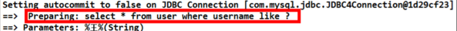
    * **在配置文件中没有加入%来作为模糊查询的条件，所以在传入字符串实参时，就需要给定模糊查询的标识%。配置文件中的#{username}也只是一个占位符，所以 SQL 语句显示为“？”。**

#### （4）模糊查询的另一种配置方式
* **第一步：修改SQL语句的配置，配置如下：**
```
<!-- 根据名称模糊查询 -->
<select id="findByName" parameterType="string" resultType="com.allen.domain.User">
    select * from user where username like '%${value}%'
</select>
```
*我们在上面将原来的`#{}`占位符，改成了`${value}`。注意如果用模糊查询的这种写法，那么`${value}`的写
法就是固定的，不能写成其它名字。*
* **第二步：测试，** 如下：
```
/**
* 测试模糊查询操作
 */
@Test
public void testFindByName(){
    //5.执行查询一个方法
    List<User> users = userDao.findByName("王");
    for(User user : users){
        System.out.println(user);
    }
}
```
* 在控制台输出的执行 SQL 语句如下：
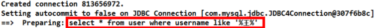
    * *可以发现，我们在程序代码中就不需要加入模糊查询的匹配符%了，这两种方式的实现效果是一样的，但执行的语句是不一样的。*

#### （5）#{}与${}的区别
* **#{}表示一个占位符号**
    * 通过`#{}`可以实现preparedStatement向占位符中设置值，自动进行java类型和jdbc类型转换， **#{}可以有效防止sql注入。** #{}可以接收简单类型值或 pojo 属性值。 如果 parameterType 传输单个简单类型值，`#{}`括号中可以是 value 或其它名称。
* **${}表示拼接sql串**
    * 通过`${}`可以将parameterType传入的内容拼接在 sql 中且不进行jdbc类型转换， `${}`可以接收简单类型值或pojo属性值，如果parameterType传输单个简单类型值，`${}`括号中只能是 value。

### 7、查询使用聚合函数
#### （1）在持久层接口中添加模糊查询方法
```
/**
* 查询总记录条数
* @return
*/
int findTotal();
```
#### （2）在用户的映射配置文件中配置
```
<!-- 查询总记录条数 -->
<select id="findTotal" resultType="int">
    select count(*) from user;
</select>
```
#### （3）加入聚合查询的测试方法
```
@Test
public void testFindTotal() throws Exception {
    //6.执行操作
    int res = userDao.findTotal();
    System.out.println(res);
}
```
### 8、Mybatis与JDBC编程的比较
* 数据库链接创建、释放频繁造成系统资源浪费从而影响系统性能，如果使用数据库链接池可解决此问题。
    * 解决：**在 SqlMapConfig.xml 中配置数据链接池，使用连接池管理数据库链接。**
* Sql 语句写在代码中造成代码不易维护，实际应用 sql 变化的可能较大，sql 变动需要改变 java 代码。
    * 解决：**将 Sql 语句配置在 XXXXmapper.xml 文件中与 java 代码分离。**
* 向 sql 语句传参数麻烦，因为 sql 语句的 where 条件不一定，可能多也可能少，占位符需要和参数对应。
    * 解决：**Mybatis 自动将 java 对象映射至 sql 语句，通过 statement 中的 parameterType 定义输入参数的类型。**
* 对结果集解析麻烦，sql 变化导致解析代码变化，且解析前需要遍历，如果能将数据库记录封装成 pojo 对象解析比较方便。
    * 解决：**Mybatis 自动将 sql 执行结果映射至 java 对象，通过 statement 中的 resultType 定义输出结果的类型。**

## 五、Mybatis的参数深入
### 1、parameterType配置参数
* **基本类型和String我们可以直接写类型名称，也可以使用包名.类名的方式**，例如 ：`java.lang.String`。
* **实体类类型，目前我们只能使用全限定类名。**
* 究其原因，**是mybaits在加载时已经把常用的数据类型注册了别名**，从而我们在使用时可以不写包名，而我们的是实体类并没有注册别名，所以必须写全限定类名。
* 在mybatis的官方文档的说明（如下图），**这些都是支持的默认别名**
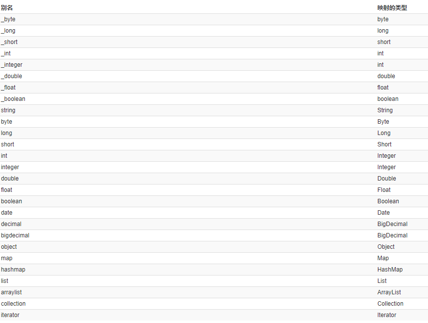

### 2、传递pojo包装对象
**开发中通过pojo传递查询条件**，**查询条件是综合的查询条件**，不仅包括用户查询条件还包括其它的查询条件（比如将用户购买商品信息也作为查询条件），这时可以使用包装对象传递输入参数。
* **Pojo类中包含pojo。**
* *需求：根据用户名查询用户信息，查询条件放到QueryVo的user属性中。*

#### （1）编写 QueryVo
```
package com.allen.domain;
public class QueryVo {
    private User user;
    public User getUser() {
        return user;
    }
    public void setUser(User user) {
        this.user = user;
    }
}
```
#### （2）编写持久层接口
```
/**
* 用户的业务层接口</p>
*/
public interface UserDao {
    /**
    * 根据 QueryVo 中的条件查询用户
    * @param vo
    * @return
    */
    List<User> findByVo(QueryVo vo);
}
```
#### （3）持久层接口的映射文件
```
<!-- 根据用户名称模糊查询，参数变成一个 QueryVo 对象了 -->
<select id="findByVo" resultType="com.allen.domain.User" parameterType="com.allen.domain.QueryVo">
    select * from user where username like #{user.username};
</select>
```
#### （4）测试包装类作为参数
```
@Test
public void testFindByQueryVo() {
    QueryVo vo = new QueryVo();
    User user = new User();
    user.setUserName("%王%");
    vo.setUser(user);
    List<User> users = userDao.findByVo(vo);
    for(User u : users) {
        System.out.println(u);
    }
}
```

## 六、Mybatis的输出结果封装
### 1、resultType配置结果类型
* **resultType属性可以指定结果集的类型，它支持基本类型和实体类类型。**
* **它和parameterType一样，如果注册过类型别名的，可以直接使用别名。没有注册过的必须使用全限定类名**。
* **实体类中的属性名称必须和查询语句中的列名保持一致，否则无法实现封装。**

#### （1）基本类型示例
* Dao接口
```
/**
* 查询总记录条数
* @return
*/
int findTotal();
```
* 映射配置
```
<!-- 查询总记录条数 -->
<select id="findTotal" resultType="int">
    select count(*) from user;
</select>
```
#### （2）实体类类型示例
* Dao接口
```
/**
* 查询所有用户
* @return
*/
List<User> findAll();
```
* 映射配置
```
<!-- 配置查询所有操作 -->
<select id="findAll" resultType="com.allen.domain.User">
    select * from user
</select>
```

#### （3）特殊情况示例
* **修改实体类**，实体类代码如下：(**此时的实体类属性和数据库表的列名已经不一致了**)
```
/**
*用户的实体类
*/
public class User implements Serializable {
    private Integer userId;
    private String userName;
    private Date userBirthday;
    private String userSex;
    private String userAddress;
    public Integer getUserId() {
        return userId;
    }
    public void setUserId(Integer userId) {
        this.userId = userId;
    }
    public String getUserName() {
        return userName;
    }
    public void setUserName(String userName) {
        this.userName = userName;
    }
    public Date getUserBirthday() {
        return userBirthday;
    }
    public void setUserBirthday(Date userBirthday){
        this.userBirthday = userBirthday;
    }
    public String getUserSex() {
        return userSex;
    }
    public void setUserSex(String userSex) {
        this.userSex = userSex;
    }
    public String getUserAddress() {
        return userAddress;
    }
    public void setUserAddress(String userAddress) {
        this.userAddress = userAddress;
    }
    @Override
    public String toString() {
        return "User [userId=" + userId + ", userName=" + userName + ", userBirthday="+ userBirthday + ", userSex="+ userSex + ", userAddress=" + userAddress + "]";
    }
}
```
* Dao 接口
```
/**
* 查询所有用户
* @return
*/
List<User> findAll();
```
* 映射配置
```
<!-- 配置查询所有操作 -->
<select id="findAll" resultType="com.allen.domain.User">
    select * from user
</select>
```
* 测试查询结果
```
@Test
public void testFindAll() {
    List<User> users = userDao.findAll();
    for(User user : users) {
        System.out.println(user);
    }
}
```
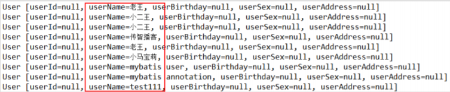
* *为什么名称会有值呢？*
    * **因为：mysql 在 windows 系统中不区分大小写！**
* 修改映射配置(使用别名查询)
```
<!-- 配置查询所有操作 -->
<select id="findAll" resultType="com.allen.domain.User">
    select id as userId,username as userName,birthday as userBirthday,sex as userSex,address as userAddress from user
</select>
```
### 2、resultMap结果类型
* **resultMap标签可以建立查询的列名和实体类的属性名称不一致时建立对应关系。从而实现封装。**
* 在select 标签中使用resultMap属性指定引用即可。同时resultMap可以实现将查询结果映射为复杂类型的pojo，比如在查询结果映射对象中包括pojo和list实现一对一查询和一对多查询。

#### （1）定义 resultMap
```
<!-- 建立 User 实体和数据库表的对应关系
    type 属性：指定实体类的全限定类名
    id 属性：给定一个唯一标识，是给查询 select 标签引用用的。
-->
<resultMap type="com.allen.domain.User" id="userMap">
    <id column="id" property="userId"/>
    <result column="username" property="userName"/>
    <result column="sex" property="userSex"/>
    <result column="address" property="userAddress"/>
    <result column="birthday" property="userBirthday"/>
</resultMap>
<!--id 标签：用于指定主键字段
result 标签：用于指定非主键字段
column 属性：用于指定数据库列名
property 属性：用于指定实体类属性名称
-->
```
#### （2）测试结果
```
@Test
public void testFindAll() {
    List<User> users = userDao.findAll();
    for(User user : users) {
        System.out.println(user);
    }
}
```
* 运行结果：
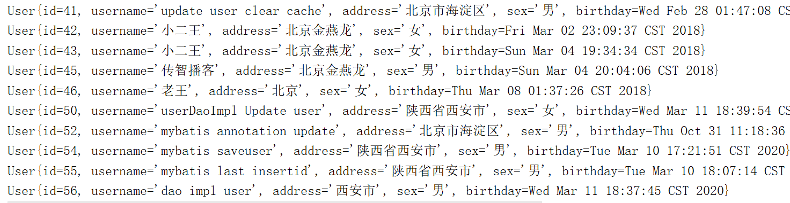

## 七、Mybatis传统DAO层开发（了解）
**使用Mybatis开发Dao，通常有两个方法，即原始Dao开发方式和Mapper接口代理开发方式**。而现在主流的开发方式是接口代理开发方式，这种方式总体上更加简便。现在介绍一下**基于传统编写Dao实现类的开发方式**。

### Mybatis 实现 DAO 的传统开发方式
#### （1）持久层 Dao 接口
```
/**
* 用户的业务层接口
*/
public interface UserDao {
    /**
    * 查询所有用户
    * @return
    */
    List<User> findAll();
    /**
    * 根据 id 查询
    * @param userId
    * @return
    */
    User findById(Integer userId);
    /**
    * 保存用户
    * @param user
    * @return 影响数据库记录的行数
    */
    int saveUser(User user);
    /**
    * 更新用户
    * @param user
    * @return 影响数据库记录的行数
    */
    int updateUser(User user);
    /**
    * 根据 id 删除用户
    * @param userId
    * @return
    */
    int deleteUser(Integer userId);
    /**
    * 查询总记录条数
    * @return
    */
    int findTotal();
}
```
#### （2）持久层 Dao 实现类
```
/**
* dao的实现类
*/
public class UserDaoImpl implements UserDao {
    private SqlSessionFactory factory;
    public UserDaoImpl(SqlSessionFactory factory) {
        this.factory = factory;
    }
    @Override
    public List<User> findAll() {
        SqlSession session = factory.openSession();
        List<User> users = session.selectList("com.allen.dao.UserDao.findAll");
        session.close();
        return users;
    }
    @Override
    public User findById(Integer userId) {
        SqlSession session = factory.openSession();
        User user = session.selectOne("com.allen.dao.UserDao.findById",userId);
        session.close();
        return user;
    }
    @Override
        public int saveUser(User user) {
        SqlSession session = factory.openSession();
        int res = session.insert("com.allen.dao.UserDao.saveUser",user);
        session.commit();
        session.close();
        return res;
    }
    @Override
        public int updateUser(User user) {
        SqlSession session = factory.openSession();
        int res = session.update("com.allen.dao.UserDao.updateUser",user);
        session.commit();
        session.close();
        return res;
    }
    @Override
        public int deleteUser(Integer userId) {
        SqlSession session = factory.openSession();
        int res = session.delete("com.allen.dao.UserDao.deleteUser",userId);
        session.commit();
        session.close();
        return res;
    }
    @Override
        public int findTotal() {
        SqlSession session = factory.openSession();
        int res = session.selectOne("com.allen.dao.UserDao.findTotal");
        session.close();
        return res;
    }
}
```
#### （3）持久层映射配置
```
<?xml version="1.0" encoding="UTF-8"?>
<!DOCTYPE mapper
        PUBLIC "-//mybatis.org//DTD Mapper 3.0//EN"
        "http://mybatis.org/dtd/mybatis-3-mapper.dtd">
 <mapper namespace="com.allen.dao.UserDao">
    <!--查询所有-->
    <select id="findAll" resultType="user">
        select * from user
    </select>

    <!--保存用户-->
    <insert id="saveUser" parameterType="user">
        <!--配置插入操作后，获得插入数据的id-->
        <selectKey keyProperty="id" keyColumn="id" resultType="int" order="AFTER">
            select LAST_insert_id();
        </selectKey>
        insert into user(username,address,sex,birthday)values(#{username},#{address},#{sex},#{birthday});
    </insert>

    <!--更新用户-->
    <update id="updateUser" parameterType="user">
        update user set username=#{username},address=#{address},sex=#{sex},birthday=#{birthday} where id=#{id} ;
    </update>

    <!--删除用户-->
    <delete id="deleteUser" parameterType="Integer">
        delete from user where id=#{id};
    </delete>

    <!--根据id查询用户-->
    <select id="findById" resultType="user" parameterType="INT">
        select * from user where id=#{id}
    </select>

    <!--根据名称模糊查询用户-->
    <select id="findByName" resultType="user" parameterType="String">
      select * from user where username like #{name}
      <!--select * from user where username like '%${value}%'-->
    </select>

    <!--获取用户的总记录条数-->
    <select id="findTotal" resultType="int">
        select count(id) from user
    </select>

</mapper>
```
#### （4）测试类
```
package com.allen.test;

import com.allen.dao.UserDao;
import com.allen.dao.impl.UserDaoImpl;
import com.allen.domain.User;
import org.apache.ibatis.io.Resources;
import org.apache.ibatis.session.SqlSession;
import org.apache.ibatis.session.SqlSessionFactory;
import org.apache.ibatis.session.SqlSessionFactoryBuilder;
import org.junit.After;
import org.junit.Before;
import org.junit.Test;

import java.io.IOException;
import java.io.InputStream;
import java.util.Date;
import java.util.List;

/**
 * 测试Mybatis的crud操作
 */
public class MybatisTest {
    private InputStream in;
    private UserDao userDao;

    @Before
    public void init() throws IOException{
        //1、读取配置文件生成字节输入流
        in = Resources.getResourceAsStream("SqlMapConfig.xml");
        //2、获取SqlSessionFactory
        SqlSessionFactory factory = new SqlSessionFactoryBuilder().build(in);
        //3、使用工厂对象，创建dao对象
        userDao = new UserDaoImpl(factory);

    }

    @After
    public void destory() throws IOException {
        //6、释放资源
        in.close();
    }

    /**
     * 测试查询所有
     */
    @Test
    public void testFindAll() {
        //5、执行查询所有方法
        List<User> users = userDao.findAll();
        for (User user : users) {
            System.out.println(user);
        }
    }

    /**
     * 测试保存操作
     */
    @Test
    public void testSave() throws IOException {
        User user = new User();
        user.setUsername("dao impl user");
        user.setAddress("西安市");
        user.setSex("男");
        user.setBirthday(new Date());
        System.out.println("保存操作之前："+user);
        //5、执行保存方法
        userDao.saveUser(user);
        System.out.println("保存操作之后："+user);
    }

    /**
     * 测试更新操作
     */
    @Test
    public void testUpdate() throws IOException {
        User user = new User();
        user.setId(50);
        user.setUsername("userDaoImpl Update user");
        user.setAddress("陕西省西安市");
        user.setSex("女");
        user.setBirthday(new Date());

        userDao.updateUser(user);
    }

    /**
     * 测试删除操作
     */
    @Test
    public void testDelete() throws IOException {

        userDao.deleteUser(49);
    }

    /**
     * 测试根据id查询操作
     */
    @Test
    public void testFindOne() throws IOException {
        User user = userDao.findById(50);
        System.out.println(user);
    }

    /**
     * 测试根据名字模糊查询操作
     */
    @Test
    public void testFindByName() throws IOException {
        List<User> users = userDao.findByName("%王%");
        // List<User> users = userDao.findByName("王");
        for (User user : users) {
            System.out.println(user);
        }
    }

    /**
     * 测试查询总记录条数操作
     */
    @Test
    public void testFindTotal() throws IOException {
        int total = userDao.findTotal();
        System.out.println(total);
    }
}
```

## 八、SqlMapConfig.xml配置文件
### 1、配置内容
#### SqlMapConfig.xml中配置的内容和顺序
```
    -properties（属性）
        --property
    -settings（全局配置参数）
        --setting
    -typeAliases（类型别名）
        --typeAliase
        --package
    -typeHandlers（类型处理器）
    -objectFactory（对象工厂）
    -plugins（插件）
    -environments（环境集合属性对象）
        --environment（环境子属性对象）
            ---transactionManager（事务管理）
            ---dataSource（数据源）
    -mappers（映射器）
        --mapper
        --package
```
### 2、properties（属性）
**在使用properties标签配置时，我们可以采用两种方式指定属性配置。**
#### 第一种
```
<properties>
    <property name="jdbc.driver" value="com.mysql.cj.jdbc.Driver"/>
    <property name="jdbc.url" value="jdbc:mysql://localhost:3306/javatest?useSSL=false&amp;serverTimezone=UTC"/>
    <property name="jdbc.username" value="root"/>
    <property name="jdbc.password" value="991104"/>
</properties>
```
#### 第二种
* **在classpath下定义jdbc.properties文件**
```
jdbc.driver=com.mysql.cj.jdbc.Driver
jdbc.url=jdbc:mysql://localhost:3306/javatest?useSSL=false&serverTimezone=UTC
jdbc.username=root
jdbc.password=991104
```
* **标签配置，在SqlMapConfig.xml中**
```
<!--配置properties
    可以在标签内部配置连接数据库的信息，也可以通过属性引用外部配置文件信息
    resource属性：
        用于指定配置文件的文件，是按照类路径的写法来写，并且必须存在于类路径下
    url属性：
        是要求按照Url的写法来写地址
        URL：Uniform Resource Locator 统一资源定位符，它是可以唯一标识一个资源的位置
        它的写法：
            http://localhost:8080/mybatiesserver/demo1Servlet
            协议      主机    端口        URI
        URI：Uniform Resource Identified 统一资源标识符。它是在应用中可以唯一定位一个资源的。
-->
<properties resource="jdbcConfig.properties">
</properties>
```
* **此时dataSource标签就变成了引用上面的配置**
```
<property name="driver" value="${jdbc.driver}"></property>
<property name="url" value="${jdbc.url}"></property>
<property name="username" value="${jdbc.username}"></property>
<property name="password" value="${jdbc.password}"></property>
       
```
### 3、typeAliases（类型别名）
*Mybatis支持的默认别名，也可以采用自定义别名方式来开发。*
#### （1）自定义别名
* **在SqlMapConfig.xml中配置：**
```
<typeAliases>
<!-- 单个别名定义 -->
<typeAlias alias="user" type="com.allen.domain.User"/>
    <!-- 批量别名定义，扫描整个包下的类，别名为类名（首字母大写或小写都可以） -->
    <package name="com.allen.domain"/>
    <package name="其它包"/>
</typeAliases>
```
### 4、mappers（映射器）
* `<mapper resource=" " />`**使用相对于类路径的资源**
    * 如：`<mapper resource="com/allen/dao/UserDao.xml" />`
* `<mapper class=" " />`**使用 mapper 接口类路径**
    * 如：`<mapper class="com.allen.dao.UserDao"/>`
    * **注意：此种方法要求mapper接口名称和mapper映射文件名称相同，且放在同一个目录中。**
* `<package name=""/>**`注册指定包下的所有 mapper 接口**
    * 如：`<package name="con.allen.mybatis.mapper"/>`
    * **注意：此种方法要求mapper接口名称和mapper映射文件名称相同，且放在同一个目录中。**

## 三张非常重要的图（对Mybatis的深入了解）
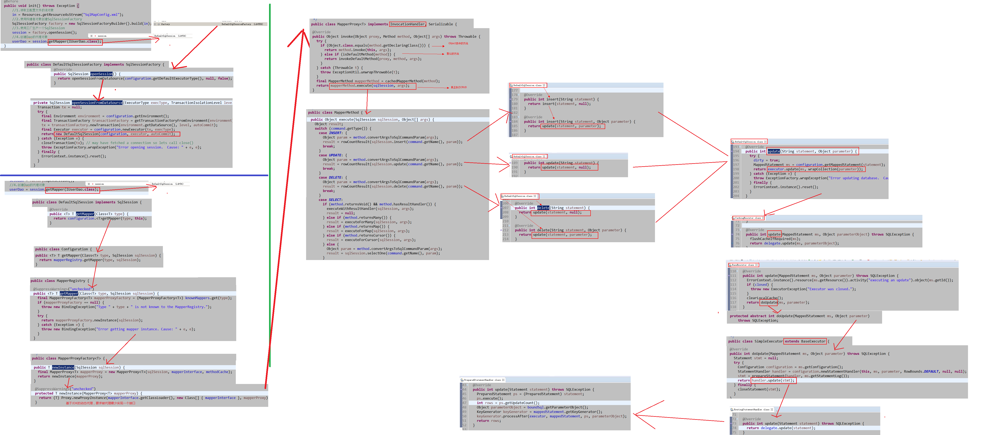
* **分析编写dao实现类Mybatis的执行过程**

* **分析代理dao的执行过程**


## 备注：
*内容很充足，过两天更新下集*