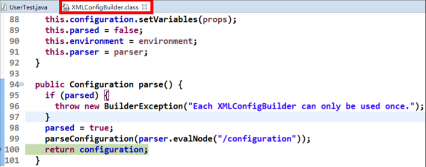
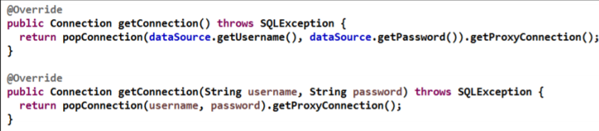
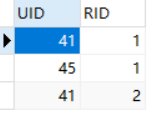

## 前言
*建议先看上篇文章（初识Java持久层框架Mybatis之上）[点击访问](https://blog.csdn.net/qq_34504626/article/details/104810222)*

## 九、Mybatis连接池与事务深入
### 1、Mybatis的连接池技术
* **在Mybatis中的连接池技术采用的是自己的连接池技术**，*不像JDBC的连接池技术是使用其他厂商开发如：c3p0和druid*。
* **在Mybatis的SqlMapConfig.xml配置文件中，通过`<dataSource type=”POOLED”>`来实现Mybatis中连接池的配置。**

#### （1）Mybatis连接池的分类
* **在Mybatis中将它的数据源dataSource分为以下几类**：

* 可以看出**Mybatis将数据源分为三类**：

        UNPOOLED 不使用连接池的数据源
        POOLED 使用连接池的数据源
        JNDI 使用JNDI实现的数据源
* **具体结构如下**：

* 相应地，**MyBatis内部分别定义了实现了`java.sql.DataSource`接口的`UnpooledDataSource`，`PooledDataSource`类来表示`UNPOOLED`、`POOLED`类型的数据源。**

* 在这三种数据源中，**我们一般采用的是POOLED数据源**（*很多时候我们所说的数据源就是为了更好的管理数据
库连接，也就是我们所说的连接池技术*）。

#### （2）Mybatis中数据源的配置
**数据源配置在SqlMapConfig.xml文件中，具体配置如下**：
```
<!-- 配置数据源（连接池）信息 -->
<dataSource type="POOLED">
    <property name="driver" value="${jdbc.driver}"/>
    <property name="url" value="${jdbc.url}"/>
    <property name="username" value="${jdbc.username}"/>
    <property name="password" value="${jdbc.password}"/>
</dataSource>
```
**MyBatis在初始化时，根据`<dataSource>`的`type`属性来创建相应类型的的数据源DataSource**，即：
* `type=”POOLED”`：**MyBatis会创建PooledDataSource实例**
* `type=”UNPOOLED”`：**MyBatis会创建UnpooledDataSource实例**
* `type=”JNDI”`**：MyBatis会从JNDI服务上查找 DataSource实例，然后返回使用**


==***以上都是重点，Mybatis的连接池只需要在SqlMapConfig.xml配置文件中进行上面的配置即可，下面是对其进行的分析***==


#### （3）Mybatis中DataSource的存取
**MyBatis是通过工厂模式来创建数据源DataSource对象的， MyBatis定义了抽象的工厂接口:**`org.apache.ibatis.datasource.DataSourceFactory`,通过其 `getDataSource()`方法**返回数据源DataSource**。
* *下面是DataSourceFactory源码，具体如下*：
```
package org.apache.ibatis.datasource;
import java.util.Properties;
import javax.sql.DataSource;
/**
* @author Clinton Begin
*/
public interface DataSourceFactory {
    void setProperties(Properties props);
    DataSource getDataSource();
}
```
**MyBatis创建了DataSource实例后，会将其放到Configuration对象内的Environment对象中，供以后使用。**

具体分析过程如下：
* 先**进入XMLConfigBuilder类中**，可以找到如下代码：

* 分析**configuration对象的environment属性**，结果如下：


#### （4）Mybatis中连接的获取过程分析


当我们需要**创建SqlSession对象并需要执行SQL语句时**，这时候MyBatis才会去**调用dataSource对象来创建`java.sql.Connection`对象**。也就是说，**`java.sql.Connection`对象的创建一直延迟到执行SQL语句的时候。**
```
@Test
public void testSql() throws Exception {
    InputStream in = Resources.getResourceAsStream("SqlMapConfig.xml");
    SqlSessionFactory factory = new SqlSessionFactoryBuilder().build(in);
    SqlSession sqlSession = factory.openSession();
    List<User> list = sqlSession.selectList("findUserById",41);
    System.out.println(list.size());
}
```
只有当第4句`sqlSession.selectList("findUserById")`，才会**触发MyBatis在底层执行下面这个方
法来创建`java.sql.Connection`对象**。

*下面是连接获取的源代码*：

* 最后我们可以发现，**真正连接打开的时间点，只是在执行SQL语句时，才会进行**。其实这样做也可以进一步发现，**数据库连接是最为宝贵的资源，只有在要用到的时候，才去获取并打开连接，当用完了就再立即将数据库连接归还到连接池中**。

### 2、Mybatis的事务控制
#### （1）JDBC中事务的回顾
**在JDBC中我们可以通过手动方式将事务的提交改为手动方式，通过setAutoCommit()方法就可以调整。**
* *通过JDK文档，我们找到该方法如下：*


**Mybatis框架因为是对JDBC的封**装，所以Mybatis框架的事务控制方式，**本身也是用JDBC的setAutoCommit()方法来设置事务提交方式的。**

#### （2）Mybatis中事务提交方式
**Mybatis中事务的提交方式，本质上就是调用JDBC的setAutoCommit()来实现事务控制。**
* 运行如下代码：
```
public class MybatisTest {
    private InputStream in;
    private SqlSession sqlSession;
    private UserDao userDao;

    @Before
    public void init() throws IOException{
        //1、读取配置文件生成字节输入流
        in = Resources.getResourceAsStream("SqlMapConfig.xml");
        //2、获取SqlSessionFactory
        SqlSessionFactory factory = new SqlSessionFactoryBuilder().build(in);
        //3、获取SqlSession对象
        sqlSession = factory.openSession();
        //4、获取dao的代理对象
        userDao = sqlSession.getMapper(UserDao.class);

    }

    @After
    public void destory() throws IOException {
        //提交事务
        sqlSession.commit();
        //6、释放资源
        sqlSession.close();
        in.close();
    }
    /**
     * 测试保存操作
     */
    @Test
    public void testSave() throws IOException {
        User user = new User();
        user.setUsername("autocommit");
        user.setAddress("陕西省西安市");
        user.setSex("男");
        user.setBirthday(new Date());
        System.out.println("保存操作之前："+user);
        //5、执行保存方法
        userDao.saveUser(user);
        System.out.println("保存操作之后："+user);
    }
}
```
* 运行结果：


**这是Connection的整个变化过程**，通过分析我们能够发现之前的CUD操作过程中，我们都**要手动进行事务的提交，原因是setAutoCommit()方法，在执行时它的值被设置为false了（默认为false）**，所以我们在CUD操作中，**必须通过`sqlSession.commit(true)`来执行提交操作。**

#### （3）Mybatis自动提交事务的设置
**将`sqlSession.commit(true)`设置后就可以进行自动提交。**
```
public class MybatisTest {
    private InputStream in;
    private SqlSession sqlSession;
    private UserDao userDao;

    @Before
    public void init() throws IOException{
        //1、读取配置文件生成字节输入流
        in = Resources.getResourceAsStream("SqlMapConfig.xml");
        //2、获取SqlSessionFactory
        SqlSessionFactory factory = new SqlSessionFactoryBuilder().build(in);
        //3、获取SqlSession对象
        sqlSession = factory.openSession(true);
        //4、获取dao的代理对象
        userDao = sqlSession.getMapper(UserDao.class);
    }

    @After
    public void destory() throws IOException {
        //6、释放资源
        sqlSession.close();
        in.close();
    }
    /**
     * 测试保存操作
     */
    @Test
    public void testSave() throws IOException {
        User user = new User();
        user.setUsername("autocommit");
        user.setAddress("陕西省西安市");
        user.setSex("男");
        user.setBirthday(new Date());
        System.out.println("保存操作之前："+user);
        //5、执行保存方法
        userDao.saveUser(user);
        System.out.println("保存操作之后："+user);
    }
}
```

此时事务就设置为自动提交了，同样可以实现CUD操作时记录的保存。虽然这也是一种方式，但就编程而言，**设置为自动提交方式为false再根据情况决定是否进行提交，这种方式更常用**。因为我们可以根据业务情况来决定提交是否进行提交。

## 十、Mybatis的动态SQL语句
* 参考的**官方文档**，描述如下：


### 1、动态SQL之`<if>`标签
我们根据实体类的不同取值，**使用不同的SQL语句来进行查询**。*比如在id如果不为空时可以根据id查询，如果username不同时为空，还要加入用户名作为条件。这种情况在我们的多条件组合查询中经常会碰到*。
#### （1）持久层Dao接口
```
/**
 * 查询所有用户
 * @return
 */
List<User> findAll();
```
#### （2）持久层Dao映射配置
```
<select id="findByUser" resultType="user" parameterType="user">
    select * from user where 1=1
    <if test="username!=null and username != '' ">
        and username like #{username}
    </if>
    <if test="address != null">
        and address like #{address}
    </if>
</select>
```
**注意：<if>标签的test属性中写的是对象的属性名，如果是包装类的对象要使用OGNL表达式的写法。另外要注意 where 1=1 的作用~！**

### 2、动态SQL之`<where>`标签
**为了简化上面`where 1=1`的条件拼装，我们可以采用`<where>`标签来简化开发。**
#### 持久层 Dao 映射配置
```
<!--抽取重复的sql语句-->
<sql id="defaultUser">
    select * from user
</sql>
<!-- 根据用户信息查询 -->
<select id="findByUser" resultType="user" parameterType="user">
    <include refid="defaultSql"></include>
    <where>
        <if test="username!=null and username != '' ">
            and username like #{username}
        </if>
        <if test="address != null">
            and address like #{address}
        </if>
    </where>
</select>
```
### 3、动态标签之`<foreach>`标签
#### （1）需求
**传入多个id查询用户信息**，用下边两个sql实现：
```
SELECT * FROM USERS WHERE username LIKE '%张%' AND (id =10 OR id =89 OR id=16)
SELECT * FROM USERS WHERE username LIKE '%张%' AND id IN (10,89,16)
```
这样我们在进行范围查询时，就要**将一个集合中的值，作为参数动态添加进来。**

*如何进行参数的传递？*
* **在QueryVo中加入一个List集合用于封装参数**
```
/**
* 查询的条件
*/
public class QueryVo implements Serializable {
    private List<Integer> ids;
    public List<Integer> getIds() {
        return ids;
    }
    public void setIds(List<Integer> ids) {
        this.ids = ids;
    }
}
```
#### （2）持久层Dao接口
```
/**
* 根据id集合查询用户
* @param vo
* @return
*/
List<User> findInIds(QueryVo vo);
```
#### （3）持久层Dao映射配置
```
<!-- 查询所有用户在 id 的集合之中 -->
<select id="findInIds" resultType="user" parameterType="queryvo">
    <!-- select * from user where id in (1,2,3,4,5); -->
    <include refid="defaultSql"></include>
    <where>
        <if test="ids != null and ids.size() > 0">
            <foreach collection="ids" open="id in ( " close=")" item="uid"
            separator=",">
                #{uid}
            </foreach>
        </if>
    </where>
</select>
```
* SQL语句：`select 字段 from user where id in (?)`
* **`<foreach>`标签用于遍历集合**，它的**属性**：
    * `collection`:**代表要遍历的集合元素，注意编写时不要写`#{}`**
    * `open`:**代表语句的开始部分**
    * `close`:**代表结束部分**
    * `item`:**代表遍历集合的每个元素，生成的变量名**
    * `sperator`:**代表分隔符**

### 4、Mybatis中简化编写的SQL片段
**Sql中可将重复的sql提取出来，使用时用include引用即可，最终达到sql重用的目的。（上面的例子中已经使用了）**
* **定义代码片段**
```
<!-- 抽取重复的语句代码片段 -->
<sql id="defaultSql">
    select * from user
</sql>
```
* **引用代码片段**
```
<!-- 配置查询所有操作 -->
<select id="findAll" resultType="user">
    <include refid="defaultSql"></include>
</select>
<!-- 根据 id 查询 -->
<select id="findById" resultType="UsEr" parameterType="int">
    <include refid="defaultSql"></include>
    where id = #{uid}
</select>
```

## 十一、Mybatis多表查询之一对多 
*本次案例主要以最为简单的用户和账户的模型来分析Mybatis多表关系*。**用户为Use表，账户为Account表。一个用户（User）可以有多个账户（Account）。具体关系如下**：


### 1、一对一查询(多对一)
#### 需求
**查询所有账户信息，关联查询下单用户信息。**

* **注意**：因为**一个账户信息只能供某个用户使用 **，所以**从查询账户信息出发关联查询用户信息为一对一查询**。如果**从用户信息出发查询用户下的账户信息则为一对多查询，因为一个用户可以有多个账户**。

#### 方式一
* **定义账户信息的实体类**
```
/**
* Description: 账户的实体类
*/
public class Account implements Serializable {
    private Integer id;
    private Integer uid;
    private Double money;
    public Integer getId() {
        return id;
    }
    public void setId(Integer id) {
        this.id = id;
    }
    public Integer getUid() {
        return uid;
    }
    public void setUid(Integer uid) {
        this.uid = uid;
    }
    public Double getMoney() {
        return money;
    }
    public void setMoney(Double money) {
        this.money = money;
    }
    @Override
    public String toString() {
        return "Account [id=" + id + ", uid=" + uid + ", money=" + money + "]";
    }
}
```
* **编写Sql语句**
    * **实现查询账户信息时，也要查询账户所对应的用户信息。**
```
SELECT account.*,user.username,user.address FROM account, user WHERE account.uid = user.id
```

* **定义AccountUser类**
    * 为了能够封装上面SQL语句的查询结果，定义AccountCustomer类中**要包含账户信息同时还要包含用户信息**，所以我们要**在定义AccountUser类时可以继承User类。**
```
public class AccountUser extends Account implements Serializable {
    private String username;
    private String address;
    public String getUsername() {
        return username;
    }
    public void setUsername(String username) {
        this.username = username;
    }
    public String getAddress() {
        return address;
    }
    public void setAddress(String address) {
        this.address = address;
    }
    @Override
    public String toString() {
        return super.toString() + " AccountUser [username=" + username + ",address=" + address + "]";
    }
}
```
* **定义账户的持久层Dao接口**
```
/**
*
* 账户的持久层接口
*/
public interface AccountDao {
    /**
     * 查询所有账户，同时获取账户的所属用户名称以及它的地址信息
     * @return
     */
    List<AccountUser> findAll();
}
```

* **定义AccountDao.xml文件中的查询配置信息**
```
<?xml version="1.0" encoding="UTF-8"?>
<!DOCTYPE mapper
 PUBLIC "-//mybatis.org//DTD Mapper 3.0//EN"
 "http://mybatis.org/dtd/mybatis-3-mapper.dtd">
<mapper namespace="com.allen.dao.AccountDao">
    <!-- 配置查询所有操作-->
    <select id="findAll" resultType="accountuser">
        select a.*,u.username,u.address from account a,user u where a.uid =u.id;
    </select>
</mapper>
```
**注意**：因为上面查询的结果中包含了账户信息同时还包含了用户信息，所以我们的返回值类型**returnType的值设置为AccountUser类型，这样就可以接收账户信息和用户信息了。**

* **小结**：
**定义专门的po类作为输出类型，其中定义了sql查询结果集所有的字段。此方法较为简单，企业中使用普遍**

#### 方式二
**使用resultMap，定义专门的resultMap用于映射一对一查询结果。**
* *通过面向对象的(has a)关系可以得知，我们可以在Account 类中加入一个User类的对象来代表这个账户是哪个用户的。*

* **修改Account类**
    * **在Account类中加入User类的对象作为Account类的一个属性。**
```
/**
*
* 账户的实体类
*/
public class Account implements Serializable {
    private Integer id;
    private Integer uid;
    private Double money;
    private User user;
    public User getUser() {
        return user;
    }
    public void setUser(User user) {
        this.user = user;
    }
    public Integer getId() {
        return id;
    }
    public void setId(Integer id) {
        this.id = id;
    }
    public Integer getUid() {
        return uid;
    }
    public void setUid(Integer uid) {
        this.uid = uid;
    }
    public Double getMoney() {
        return money;
    }
    public void setMoney(Double money) {
        this.money = money;
    }
    @Override
    public String toString() {
        return "Account [id=" + id + ", uid=" + uid + ", money=" + money + "]";
    }
}

```
* **修改AccountDao接口中的方法**
```
/**
* 账户的持久层接口
*/
public interface AccountDao {
    /**
    * 查询所有账户，同时获取账户的所属用户名称以及它的地址信息
    * @return
    */
    List<Account> findAll();
}
```
* **注意**：**第二种方式，将返回值改为Account类型。因为Account类中包含了一个User类的对象，它可以封装账户所对应的用户信息**。

* **重新定义AccountDao.xml文件**
```
<?xml version="1.0" encoding="UTF-8"?>
<!DOCTYPE mapper
 PUBLIC "-//mybatis.org//DTD Mapper 3.0//EN"
 "http://mybatis.org/dtd/mybatis-3-mapper.dtd">
<mapper namespace="com.allen.dao.AccountDao">
    <!-- 建立对应关系 -->
    <resultMap type="account" id="accountMap">
        <id column="aid" property="id"/>
        <result column="uid" property="uid"/>
        <result column="money" property="money"/>
        <!-- 它是用于指定从表方的引用实体属性的 -->
        <association property="user" javaType="user">
            <id column="id" property="id"/>
            <result column="username" property="username"/>
            <result column="sex" property="sex"/>
            <result column="birthday" property="birthday"/>
            <result column="address" property="address"/>
        </association>
    </resultMap>
    <select id="findAll" resultMap="accountMap">
        select u.*,a.id as aid,a.uid,a.money from account a,user u where a.uid =u.id;
    </select>
</mapper>
```

### 2、一对多查询
#### 需求
**查询所有用户信息及用户关联的账户信息。**
#### 分析
**用户信息和他的账户信息为一对多关系**，并且查询过程中如果用户没有账户信息，此时也要将用户信息查询出来，我们想到了**左外连接查询比较合适**。
#### （1）编写SQL语句
```
SELECT u.*, acc.id id,acc.uid,acc.money FROM user u
LEFT JOIN account acc ON u.id = acc.uid;
```
#### （2）User类加入`List<Account>`
```
/**
* Description: 用户的实体类
*/
public class User implements Serializable {
    private Integer id;
    private String username;
    private Date birthday;
    private String sex;
    private String address;
    private List<Account> accounts;
    public List<Account> getAccounts() {
        return accounts;
    }
    public void setAccounts(List<Account> accounts) {
        this.accounts = accounts;
    }
    public Integer getId() {
        return id;
    }
    public void setId(Integer id) {
        this.id = id;
    }
    public String getUsername() {
        return username;
    }
    public void setUsername(String username) {
        this.username = username;
    }
    public Date getBirthday() {
        return birthday;
    }
    public void setBirthday(Date birthday) {
        this.birthday = birthday;
    }
    public String getSex() {
        return sex;
    }
    public void setSex(String sex) {
        this.sex = sex;
    }
    public String getAddress() {
        return address;
    }
    public void setAddress(String address) {
        this.address = address;
    }
    @Override
    public String toString() {
        return "User [id=" + id + ", username=" + username + ", birthday=" + birthday + ",sex=" + sex + ", address=" + address + "]";
    }
}
```
#### （3）用户持久层Dao接口中加入查询方法
```
/**
* 查询所有用户，同时获取出每个用户下的所有账户信息
* @return
*/
List<User> findAll();
```
#### （4）用户持久层Dao映射文件配置
```
<?xml version="1.0" encoding="UTF-8"?>
<!DOCTYPE mapper
 PUBLIC "-//mybatis.org//DTD Mapper 3.0//EN"
 "http://mybatis.org/dtd/mybatis-3-mapper.dtd">
<mapper namespace="com.allen.dao.UserDao">
    <resultMap type="user" id="userMap">
        <id column="id" property="id"></id>
        <result column="username" property="username"/>
        <result column="address" property="address"/>
        <result column="sex" property="sex"/>
        <result column="birthday" property="birthday"/>
        <!-- collection 是用于建立一对多中集合属性的对应关系
        ofType 用于指定集合元素的数据类型
        -->
        <collection property="accounts" ofType="account">
            <id column="aid" property="id"/>
            <result column="uid" property="uid"/>
            <result column="money" property="money"/>
        </collection>
    </resultMap>
    <!-- 配置查询所有操作 -->
    <select id="findAll" resultMap="userMap">
        select u.*,a.id as aid ,a.uid,a.money from user u left outer join account a on u.id =a.uid
    </select>
</mapper>
```
* **`collection`部分定义了用户关联的账户信息。表示关联查询结果集**
* **`property="accList"`：关联查询的结果集存储在 User 对象的上哪个属性。**
* **`ofType="account"`：指定关联查询的结果集中的对象类型即List中的对象类型。此处可以使用别名，也可以使用全限定名。**

## 十二、Mybatis多表查询之多对多
### 1、实现Role到User多对多
**多对多关系其实可以看成是双向的一对多关系。**
#### （1）用户与角色的关系模型
用户与角色的多对多关系模型如下：


**在MySQL数据库中添加角色表，用户角色的中间表。**
* 角色表

* 用户角色中间表


#### （2）业务要求及实现SQL
* **需求：实现查询所有对象并且加载它所分配的用户信息。**
* **分析：**
    * 查询角色我们需要用到Role表，但角色分配的用户的信息我们并不能直接找到用户信息，而是要**通过中间表(USER_ROLE 表)才能关联到用户信息**。
* 下面是实现的SQL语句：
```
SELECT r.*,u.id uid,u.username username,u.birthday birthday,u.sex sex,u.address address FROM ROLE r
INNER JOIN USER_ROLE ur ON ( r.id = ur.rid)
INNER JOIN USER u ON (ur.uid = u.id);
```
#### （3）编写角色实体类
```
public class Role implements Serializable {
    private Integer roleId;
    private String roleName;
    private String roleDesc;
    //多对多的关系映射：一个角色可以赋予多个用户
    private List<User> users;
    public List<User> getUsers() {
        return users;
    }
    public void setUsers(List<User> users) {
        this.users = users;
    }
    public Integer getRoleId() {
        return roleId;
    }
    public void setRoleId(Integer roleId) {
        this.roleId = roleId;
    }
    public String getRoleName() {
        return roleName;
    }
    public void setRoleName(String roleName) {
        this.roleName = roleName;
    }
    public String getRoleDesc() {
        return roleDesc;
    }
    public void setRoleDesc(String roleDesc) {
        this.roleDesc = roleDesc;
    }
    @Override
    public String toString() {
        return "Role{" + "roleId=" + roleId + ", roleName='" + roleName + '\'' + ", roleDesc='" + roleDesc + '\'' + '}';
    }
}
```
#### （4）编写Role持久层接口
```
public interface RoleDao {
 /**
 * 查询所有角色
 * @return
 */
 List<Role> findAll();
}
```
#### （5）编写映射文件
```
<?xml version="1.0" encoding="UTF-8"?>
<!DOCTYPE mapper
 PUBLIC "-//mybatis.org//DTD Mapper 3.0//EN"
 "http://mybatis.org/dtd/mybatis-3-mapper.dtd">
<mapper namespace="com.allen.dao.RoleDao">
     <!--定义 role 表的 ResultMap-->
     <resultMap id="roleMap" type="role">
         <id property="roleId" column="rid"></id>
         <result property="roleName" column="role_name"></result>
         <result property="roleDesc" column="role_desc"></result>
         <collection property="users" ofType="user">
             <id column="id" property="id"></id>
             <result column="username" property="username"></result>
             <result column="address" property="address"></result>
             <result column="sex" property="sex"></result>
             <result column="birthday" property="birthday"></result>
         </collection>
     </resultMap>
     <!--查询所有-->
     <select id="findAll" resultMap="roleMap">
        select u.*,r.id as rid,r.role_name,r.role_desc from role r left outer join user_role ur on r.id = ur.rid left outer join user u on u.id = ur.uid 
     </select>
</mapper>
```
### 2、实现User到Role的多对多
从User出发，我们也可以发现**一个用户可以具有多个角色**，这样用户到角色的关系也还是**一对多关系**。这样我们就可以认为**User与Role的多对多关系，可以被拆解成两个一对多关系来实现。** *实现过程和Role到User的多对多实现过程类似，这里不在赘述*

## 十三、Mybatis延迟加载策略
**实际开发过程中很多时候我们并不需要总是在加载用户信息时就一定要加载他的账户信息。此时就是我们所说的延迟加载。**
### 1、何为延迟加载?
* **延迟加载**：**就是在需要用到数据时才进行加载，不需要用到数据时就不加载数据。延迟加载也称懒加载.**
* **好处**：先从单表查询，需要时再从关联表去关联查询，**大大提高数据库性能，因为查询单表要比关联查询多张表速度要快**。
* **坏处**：因为只有当需要用到数据时，才会进行数据库查询，这样在大批量数据查询时，因为查询工作也要消耗时间，所以可能造成用户等待时间变长，造成用户体验下降。

### 2、实现需求
* *需求：查询账户(Account)信息并且关联查询用户(User)信息。如果先查询账户(Account)信息即可满足要求，当我们需要查询用户(User)信息时再查询用户(User)信息。把对用户(User)信息的按需去查询就是延迟加载。*
* mybatis实现多表操作时，使用了resultMap来实现一对一，一对多，多对多关系的操作。主要是通过 association、collection实现一对一及一对多映射。**association、collection 具备延迟加载功能。**

### 3、使用assocation实现延迟加载
#### 需求
**查询账户信息同时查询用户信息。**
#### （1）账户的持久层DAO接口
```
/**
* 账户的持久层接口
*/
public interface AccountDao {
    /**
    * 查询所有账户，同时获取账户的所属用户名称以及它的地址信息
    * @return
    */
    List<Account> findAll();
}
```
#### （2）账户的持久层映射文件
```
<?xml version="1.0" encoding="UTF-8"?>
<!DOCTYPE mapper
 PUBLIC "-//mybatis.org//DTD Mapper 3.0//EN"
 "http://mybatis.org/dtd/mybatis-3-mapper.dtd">
<mapper namespace="com.allen.dao.AccountDao">
    <!-- 建立对应关系 -->
    <resultMap type="account" id="accountMap">
        <id column="aid" property="id"/>
        <result column="uid" property="uid"/>
        <result column="money" property="money"/>
        <!-- 它是用于指定从表方的引用实体属性的 -->
        <association property="user" javaType="user" select="com.allen.dao.UserDao.findById" column="uid">
        </association>
    </resultMap>
    <select id="findAll" resultMap="accountMap">
        select * from account
    </select>
</mapper>
```
* **`select`：填写我们要调用的select映射的id**
* **`column`：填写我们要传递给select映射的参数**

#### （3）用户的持久层接口和映射文件
* 持久层接口
```
/**
*
* 用户的业务层接口
*/
public interface UserDao {
/**
* 根据 id 查询
* @param userId
* @return
*/
User findById(Integer userId);
}
```
* 映射文件
```
<?xml version="1.0" encoding="UTF-8"?>
<!DOCTYPE mapper
 PUBLIC "-//mybatis.org//DTD Mapper 3.0//EN"
 "http://mybatis.org/dtd/mybatis-3-mapper.dtd">
<mapper namespace="com.allen.dao.UserDao">
<!-- 根据 id 查询 -->
<select id="findById" resultType="user" parameterType="int" >
select * from user where id = #{uid}
</select>
</mapper>
```

#### （4）开启Mybatis的延迟加载策略
*Mybaits的官方文档，settings的说明信息如下*：


**在Mybatis的配置文件SqlMapConfig.xml文件中添加延迟加载的配置**
```
<!-- 开启延迟加载的支持 -->
<settings>
    <setting name="lazyLoadingEnabled" value="true"/>
    <setting name="aggressiveLazyLoading" value="false"/>
</settings>
```
#### （5）编写测试只查账户信息不查用户信息
```
/**
* 一对多账户的操作
*/
public class AccountTest {
    private InputStream in ;
    private SqlSessionFactory factory;
    private SqlSession session;
    private AccountDao accountDao;
    @Test
    public void testFindAll() {
        //6.执行操作
        List<Account> accounts = accountDao.findAll();
    }
    @Before//在测试方法执行之前执行
    public void init()throws Exception {
        //1.读取配置文件
        in = Resources.getResourceAsStream("SqlMapConfig.xml");
        //2.创建构建者对象
        SqlSessionFactoryBuilder builder = new SqlSessionFactoryBuilder();
        //3.创建 SqlSession 工厂对象
        factory = builder.build(in);
        //4.创建 SqlSession 对象
        session = factory.openSession();
        //5.创建 Dao 的代理对象
        accountDao = session.getMapper(AccountDao.class);
    }
    @After//在测试方法执行完成之后执行
    public void destroy() throws Exception{
        //7.释放资源
        session.close();
        in.close();
    }
}
```
**测试结果如下**：

* 因为本次只是将Account对象查询出来放入List集合中，并没有涉及到User对象，所以就**没有发出SQL语句查询账户所关联的User对象的查询**。

### 4、使用Collection实现延迟加载
**`<collection>`结点中也有`select`属性，`column`属性。**
#### 需求
**完成加载用户对象时，查询该用户所拥有的账户信息。**
#### （1）在User实体类中加入`List<Account>`属性
```
/**
* 用户的实体类
*/
public class User implements Serializable {
    private Integer id;
    private String username;
    private Date birthday;
    private String sex;
    private String address;
    private List<Account> accounts;
    public List<Account> getAccounts() {
        return accounts;
    }
    public void setAccounts(List<Account> accounts) {
        this.accounts = accounts;
    }
    public Integer getId() {
        return id;
    }
    public void setId(Integer id) {
        this.id = id;
    }
    public String getUsername() {
        return username;
    }
    public void setUsername(String username) {
        this.username = username;
    }
    public Date getBirthday() {
        return birthday;
    }
    public void setBirthday(Date birthday) {
        this.birthday = birthday;
    }
    public String getSex() {
        return sex;
    }
    public void setSex(String sex) {
        this.sex = sex;
    }
    public String getAddress() {
        return address;
    }
    public void setAddress(String address) {
        this.address = address;
    }
    @Override
    public String toString() {
        return "User [id=" + id + ", username=" + username + ", birthday=" + birthday  + ", sex=" + sex + ", address=" + address + "]";
    }
}
```
#### （2）编写用户和账户持久层接口的方法
```
/**
* 查询所有用户，同时获取出每个用户下的所有账户信息
* @return
*/
List<User> findAll();
/**
* 根据用户 id 查询账户信息
* @param uid
* @return
*/
List<Account> findByUid(Integer uid);
```
#### （3）编写用户持久层映射配置
```
<resultMap type="user" id="userMap">
    <id column="id" property="id"></id>
    <result column="username" property="username"/>
    <result column="address" property="address"/>
    <result column="sex" property="sex"/>
    <result column="birthday" property="birthday"/>
    <!-- collection 是用于建立一对多中集合属性的对应关系
    ofType 用于指定集合元素的数据类型
    select 是用于指定查询账户的唯一标识（账户的 dao 全限定类名加上方法名称）
    column 是用于指定使用哪个字段的值作为条件查询
    -->
    <collection property="accounts" ofType="account" select="com.allen.dao.AccountDao.findByUid" column="id"></collection>
</resultMap>
<!-- 配置查询所有操作 -->
<select id="findAll" resultMap="userMap">
    select * from user
</select>
```
* **`<collection>`标签： 主要用于加载关联的集合对象**
* **`select`属性：用于指定查询account列表的sql语句，所以填写的是该sql映射的id**
* **`column`属性：用于指定select属性的sql语句的参数来源，上面的参数来自于user的id列，所以就写成id这一个字段名了**

#### （4）编写账户持久层映射配置
```
<!-- 根据用户 id 查询账户信息 -->
<select id="findByUid" resultType="account" parameterType="int">
    select * from account where uid = #{uid}
</select>
```
#### （5）测试只加载用户信息
```
/**
*
* 一对多的操作
*/
public class UserTest {
    private InputStream in ;
    private SqlSessionFactory factory;
    private SqlSession session;
    private UserDao userDao;
    @Test
    public void testFindAll() {
        //6.执行操作
        List<User> users = userDao.findAll();
    }
    @Before//在测试方法执行之前执行
    public void init()throws Exception {
        //1.读取配置文件
        in = Resources.getResourceAsStream("SqlMapConfig.xml");
        //2.创建构建者对象
        SqlSessionFactoryBuilder builder = new SqlSessionFactoryBuilder();
        //3.创建 SqlSession 工厂对象
        factory = builder.build(in);
        //4.创建 SqlSession 对象
        session = factory.openSession();
        //5.创建 Dao 的代理对象
        userDao = session.getMapper(UserDao.class);
    }
    @After//在测试方法执行完成之后执行
    public void destroy() throws Exception{
         
    }
}
```

**测试结果如下**：

* **没有加载 Account 账户信息**。

## 十四、Mybatis缓存
像大多数的持久化框架一样**，Mybatis也提供了缓存策略，通过缓存策略来减少数据库的查询次数，从而提高性能。**
* Mybatis中缓存分为**一级缓存，二级缓存**。


### 1、Mybatis一级缓存
#### （1）证明一级缓存的存在
一级缓存是 SqlSession 级别的缓存，只要 SqlSession 没有 flush 或 close，它就存在。
* **编写用户持久层Dao接口**
```
/**
*
* 用户的业务层接口</p>
*/
public interface UserDao {
/**
* 根据 id 查询
* @param userId
* @return
*/
User findById(Integer userId);
}
```
* **编写用户持久层映射文件**
```
<?xml version="1.0" encoding="UTF-8"?>
<!DOCTYPE mapper
 PUBLIC "-//mybatis.org//DTD Mapper 3.0//EN"
 "http://mybatis.org/dtd/mybatis-3-mapper.dtd">
<mapper namespace="com.allen.dao.UserDao">
    <!-- 根据 id 查询 -->
    <select id="findById" resultType="UsEr" parameterType="int" useCache="true">
        select * from user where id = #{uid}
    </select>
</mapper>
```
* **编写测试方法**
```
@Test
public void testFindById() {
    //6.执行操作
    User user = userDao.findById(41);
    System.out.println("第一次查询的用户："+user);
    User user2 = userDao.findById(41);
    System.out.println("第二次查询用户："+user2);
    System.out.println(user == user2);
}
```
* **测试结果如下**：
    * 可以发现，**虽然在上面的代码中查询了两次，但最后只执行了一次数据库操作，这就是Mybatis提供的一级缓存在起作用了**。因为一级缓存的存在，导致第二次查询id为41的记录时，并没有发出sql语句从数据库中查询数据，而是从一级缓存中查询。


#### （2）一级缓存的分析
**一级缓存是SqlSession范围的缓存，当调用SqlSession的修改，添加，删除，commit()，close()等方法时，就会清空一级缓存。**

* 第一次发起查询用户id为1的用户信息，先去找缓存中是否有id为1的用户信息，如果没有，从数据库查询用户信息。
* 得到用户信息，将用户信息存储到一级缓存中。
* 如果sqlSession去执行commit操作（执行插入、更新、删除），清空SqlSession中的一级缓存，这样做的目的为了让缓存中存储的是最新的信息，避免脏读。
* 第二次发起查询用户id为1的用户信息，先去找缓存中是否有id为1的用户信息，缓存中有，直接从缓存
中获取用户信息。

#### （3）测试一级缓存的清空
```
/**
 * 测试一级缓存
 */
@Test
public void testFirstLevelCache(){
    User user1 = userDao.findById(41);
    System.out.println(user1);

//        sqlSession.close();
//        //再次获取sqlsession对象
//        sqlSession = factory.openSession();
//
    sqlSession.clearCache();//此方法也可以清空缓存
    userDao = sqlSession.getMapper(UserDao.class);
    User user2 = userDao.findById(41);
    System.out.println(user2);
    System.out.println(user1 == user2);
}

/**
 * 测试缓存的同步
 */
@Test
public void testClearCache(){
    //1、根据id查询用户
    User user1 = userDao.findById(41);
    System.out.println(user1);
    //2、更新用户信息
    user1.setUsername("update user clear cache");
    user1.setAddress("西安市周至县");
    userDao.updateUser(user1);
    //3、再次查询id为41的用户
    User user2 = userDao.findById(41);
    System.out.println(user2);
    System.out.println(user1 == user2);
}
```
* 当执行`sqlSession.close()`后，再次获取sqlSession并查询id=41的User对象时，**又重新执行了sql语句，从数据库进行了查询操作。**

### 2、Mybatis二级缓存
**二级缓存是mapper映射级别的缓存，多个SqlSession去操作同一个Mapper映射的sql语句，多个SqlSession可以共用二级缓存，二级缓存是跨 SqlSession 的。**
#### （1）二级缓存结构图

* **首先开启mybatis的二级缓存**。
* **sqlSession1去查询用户信息**，查询到用户信息会将查询数据存储到二级缓存中。
* 如果**SqlSession3去执行相同mapper映射下sql，执行commit提交**，将会**清空**该mapper映射下的二级缓存区域的数据。
* **sqlSession2去查询与sqlSession1相同的用户信息，首先会去缓存中找是否存在数据**，如果**存在**直接从缓存中**取出数据**。

#### （2）二级缓存的开启与关闭
* **第一步：在SqlMapConfig.xml文件开启二级缓存**
```
<settings>
    <!-- 开启二级缓存的支持 -->
    <setting name="cacheEnabled" value="true"/>
</settings>
```
因**为cacheEnabled的取值默认就为true，所以这一步可以省略不配置**。为true代表**开启**二级缓存；为false代表**不开启**二级缓存。

* **第二步：配置相关的Mapper映射文件**

**`<cache>`标签表示当前这个mapper映射将使用二级缓存，区分的标准就看mapper的namespace值。**
```
<?xml version="1.0" encoding="UTF-8"?>
<!DOCTYPE mapper
 PUBLIC "-//mybatis.org//DTD Mapper 3.0//EN"
 "http://mybatis.org/dtd/mybatis-3-mapper.dtd">
<mapper namespace="com.allen.dao.UserDao">
    <!-- 开启二级缓存的支持 -->
    <cache></cache>
</mapper>
```
* **第三步：配置statement上面的useCache属性**
```
<!-- 根据 id 查询 -->
<select id="findById" resultType="user" parameterType="int" useCache="true">
    select * from user where id = #{uid}
</select>
```
将UserDao.xml映射文件中的`<select>`标签中设置`useCache=”true”`代表当前这个statement**要使用二级缓存**，**如果不使用二级缓存可以设置为false**。

* *注意：针对每次查询都需要最新的数据sql，要设置成`useCache=false`，禁用二级缓存。*

#### （3）二级缓存测试
```
@Test
public void testFirstLevelCache(){
    SqlSession sqlSession1 = factory.openSession();
    UserDao dao1 = sqlSession1.getMapper(UserDao.class);
    User user1 = dao1.findById(41);
    System.out.println(user1);
    sqlSession1.close();//一级缓存消失

    SqlSession sqlSession2 = factory.openSession();
    UserDao dao2 = sqlSession2.getMapper(UserDao.class);
    User user2 = dao2.findById(41);
    System.out.println(user2);
    sqlSession2.close();
    System.out.println(user1 == user2);
}
```
**经过上面的测试，我们发现执行了两次查询，并且在执行第一次查询后，我们关闭了一级缓存，再去执行第二次查询时，我们发现并没有对数据库发出sql语句，所以此时的数据就只能是来自于我们所说的二级缓存。**

#### （4）二级缓存注意事项
**当我们在使用二级缓存时，所缓存的类一定要实现`java.io.Serializable`接口，这种就可以使用序列化方式来保存对象。**
```
public class User implements Serializable {
    private Integer id;
    private String username;
    private Date birthday;
    private String sex;
    private String address;
}
```

## 十五、Mybatis 注解开发
**这几年来注解开发越来越流行，Mybatis也可以使用注解开发方式，这样就可以减少编写 Mapper 映射文件了**。

### 1、mybatis的常用注解说明

    @Insert:实现新增
    @Update:实现更新
    @Delete:实现删除
    @Select:实现查询
    @Result:实现结果集封装
    @Results:可以与@Result 一起使用，封装多个结果集
    @ResultMap:实现引用@Results 定义的封装
    @One:实现一对一结果集封装
    @Many:实现一对多结果集封装
    @SelectProvider: 实现动态 SQL 映射
    @CacheNamespace:实现注解二级缓存的使用
    
### 2、使用Mybatis注解实现基本 CRUD
**单表的CRUD操作是最基本的操作，所以必须掌握。**
#### （1）编写实体类
```
/**
*
*  用户的实体类
*/
public class User implements Serializable {
    private Integer userId;
    private String userName;
    private Date userBirthday;
    private String userSex;
    private String userAddress;
    public Integer getUserId() {
        return userId;
    }
    public void setUserId(Integer userId) {
        this.userId = userId;
    }
    public String getUserName() {
        return userName;
    }
    public void setUserName(String userName) {
        this.userName = userName;
    }
    public Date getUserBirthday() {
        return userBirthday;
    }
    public void setUserBirthday(Date userBirthday) {
        this.userBirthday = userBirthday;
    }
    public String getUserSex() {
        return userSex;
    }
    public void setUserSex(String userSex) {
        this.userSex = userSex;
    }
    public String getUserAddress() {
        return userAddress;
    }
    public void setUserAddress(String userAddress) {
        this.userAddress = userAddress;
    }
    @Override
    public String toString() {
        return "User [userId=" + userId + ", userName=" + userName + ", userBirthday=" + userBirthday + ", userSex=" + userSex + ", userAddress=" + userAddress + "]";
    }
}
```
**注意：此处我们故意和数据库表的列名不一致。**

#### （2）使用注解方式开发持久层接口
```
/**
* 用户的持久层接口
*/
public interface UserDao {
    /**
    * 查询所有用户
    * @return
    */
    @Select("select * from user")
    //对数据的封装，因为User实体类中属性和表中列名不一，如果相同，不用使用Result封装结果
    @Results(id="userMap",
    value= {
        @Result(id=true,column="id",property="userId"),
        @Result(column="username",property="userName"),
        @Result(column="sex",property="userSex"),
        @Result(column="address",property="userAddress"),
        @Result(column="birthday",property="userBirthday")
    })
    List<User> findAll();
    /**
    * 根据 id 查询一个用户
    * @param userId
    * @return
    */
    @Select("select * from user where id = #{uid} ")
    @ResultMap("userMap")
    User findById(Integer userId);
    /**
    * 保存操作
    * @param user
    * @return
    */
    @Insert("insert into user(username,sex,birthday,address)values(#{username},#{sex},#{birthday},#{address} )")
    @SelectKey(keyColumn="id",keyProperty="id",resultType=Integer.class,before = false, statement = { "select last_insert_id()" })
    int saveUser(User user);
    /**
    * 更新操作
    * @param user
    * @return
    */
    @Update("update user set username=#{username},address=#{address},sex=#{sex},birthday=#{birthday} where id =#{id} ")
    int updateUser(User user);
    /**
    * 删除用户
    * @param userId
    * @return
    */
    @Delete("delete from user where id = #{uid} ")
    int deleteUser(Integer userId);
    /**
    * 查询使用聚合函数
    * @return
    */
    @Select("select count(*) from user ")
    int findTotal();
    /**
    * 模糊查询
    * @param name
    * @return
    */
    @Select("select * from user where username like #{username} ")
    List<User> findByName(String name);
}
```
**通过注解方式，我们就不需要再去编写UserDao.xml映射文件了。**

#### （3）编写SqlMapConfig配置文件
```
<?xml version="1.0" encoding="UTF-8"?>
<!DOCTYPE configuration
 PUBLIC "-//mybatis.org//DTD Config 3.0//EN"
 "http://mybatis.org/dtd/mybatis-3-config.dtd">
<configuration>
    <!-- 配置 properties 文件的位置 -->
    <properties resource="jdbcConfig.properties"></properties>
    <!-- 配置别名的注册 -->
    <typeAliases>
        <package name="com.allen.domain"/>
    </typeAliases>
    <!-- 配置环境 -->
    <environments default="mysql">
        <!-- 配置 mysql 的环境 -->
        <environment id="mysql">
        <!-- 配置事务的类型是 JDBC -->
        <transactionManager type="JDBC"></transactionManager>
        <!-- 配置数据源 -->
        <dataSource type="POOLED">
            <property name="driver" value="${jdbc.driver}"/>
            <property name="url" value="${jdbc.url}"/>
            <property name="username" value="${jdbc.username}"/>
            <property name="password" value="${jdbc.password}"/>
        </dataSource>
    </environment>
    </environments>
    <!-- 配置映射信息 -->
    <mappers>
        <!-- 配置 dao 接口的位置，它有两种方式
        第一种：使用 mapper 标签配置 class 属性
        第二种：使用 package 标签，直接指定 dao 接口所在的包
        -->
        <package name="com.allen.dao"/>
    </mappers>
</configuration>
```

#### （4）编写测试方法
*此处省略，和使用xml进行配置的一样*

### 3、使用注解实现复杂关系映射开发
**实现复杂关系映射之前我们可以在映射文件中通过配置`<resultMap>`来实现，在使用注解开发时我们需要借助`@Results`注解，`@Result`注解，`@One`注解，`@Many`注解。**
#### （1）复杂关系映射的注解说明
* **`@Results`注解**
    * **代替的是标签`<resultMap>`**
    * 该注解中**可以使用单个`@Result`注解，也可以使用`@Result`集合**
    * `@Results({@Result()，@Result()})`或`@Results(@Result())`
* **`@Resutl`注解**
    * **代替了`<id>`标签和`<result>`标签**
    * **`@Result`中属性**介绍：
        * **id** 主键字段
        * **column** 数据库的列名
        * **property** 需要装配的属性名`one`，需要使用的`@One`注解`(@Result(one=@One()))`，many需要使用的`@Many`注解 `(@Result(many=@many()))`
* **`@One`注解（一对一）**
    * **代替了`<assocation>`标签，是多表查询的关键，在注解中用来指定子查询返回单一对象。**
    * `@One`注解属性介绍：
        * **select** **指定用来多表查询的sqlmapper**
        * **fetchType** 会覆盖全局的配置参数 
        * **lazyLoadingEnabled**
    * **使用格式**：`@Result(column=" ",property="",one=@One(select=""))`
* **`@Many`注解（多对一）**
    * **代替了<Collection>标签,是是多表查询的关键**，在注解中用来指定子查询返回对象集合。
    * **注意**：**聚集元素用来处理“一对多”的关系**。**需要指定映射的Java实体类的属性，属性的javaType（一般为ArrayList）但是注解中可以不定义；**
    * **使用格式**：`@Result(property="",column="",many=@Many(select=""))`

#### （2）使用注解实现一对一复杂关系映射及延迟加载
* **需求**：**加载账户信息时并且加载该账户的用户信息，根据情况可实现延迟加载。（注解方式实现）**

* **添加User实体类及Account实体类**
```
/**
* 用户的实体类
*/
package com.allen.domain;

import java.io.Serializable;
import java.util.Date;
import java.util.List;

public class User implements Serializable {
    private Integer userId;
    private String userName;
    private String userAddress;
    private String userSex;
    private Date userBirthday;

    public Integer getUserId() {
        return userId;
    }

    public void setUserId(Integer userId) {
        this.userId = userId;
    }

    public String getUserName() {
        return userName;
    }

    public void setUserName(String userName) {
        this.userName = userName;
    }

    public String getUserAddress() {
        return userAddress;
    }

    public void setUserAddress(String userAddress) {
        this.userAddress = userAddress;
    }

    public String getUserSex() {
        return userSex;
    }

    public void setUserSex(String userSex) {
        this.userSex = userSex;
    }

    public Date getUserBirthday() {
        return userBirthday;
    }

    public void setUserBirthday(Date userBirthday) {
        this.userBirthday = userBirthday;
    }

    @Override
    public String toString() {
        return "User{" +
                "userId=" + userId +
                ", userName='" + userName + '\'' +
                ", userAddress='" + userAddress + '\'' +
                ", userSex='" + userSex + '\'' +
                ", userBirthday=" + userBirthday +
                '}';
    }
}

```

```
/**
* 账户的实体类
*/
package com.allen.domain;

import java.util.List;

public class Account {

    private Integer id;
    private Integer uid;
    private Double money;

    //多对一（Mybatis中称为一对一）的映射，一个账户只能属于一个用户
    private User user;

    public User getUser() {
        return user;
    }

    public void setUser(User user) {
        this.user = user;
    }

    public Integer getId() {
        return id;
    }

    public void setId(Integer id) {
        this.id = id;
    }

    public Integer getUid() {
        return uid;
    }

    public void setUid(Integer uid) {
        this.uid = uid;
    }

    public Double getMoney() {
        return money;
    }

    public void setMoney(Double money) {
        this.money = money;
    }

    @Override
    public String toString() {
        return "Account{" +
                "id=" + id +
                ", uid=" + uid +
                ", money=" + money +
                '}';
    }
}

```
* **添加账户的持久层接口并使用注解配置**
```
package com.allen.dao;

import com.allen.domain.Account;
import org.apache.ibatis.annotations.One;
import org.apache.ibatis.annotations.Result;
import org.apache.ibatis.annotations.Results;
import org.apache.ibatis.annotations.Select;
import org.apache.ibatis.mapping.FetchType;

import java.util.List;

public interface AccountDao {
    /**
     * 查询所有账户，并且获取每个账户所属的用户信息
     * @return
     */
    @Results(id="accountMap",value = {
            @Result(id = true,column = "id",property = "id"),
            @Result(column = "uid",property = "uid"),
            @Result(column = "money",property = "money"),
            @Result(property = "user",column = "uid",one=@One(select="com.allen.dao.UserDao.findById",fetchType= FetchType.EAGER))
    })
    @Select("select * from account")
    List<Account> findAll();

    /**
     * 根据用户id查询账户信息
     * @param userId
     * @return
     */
    @Select("select * from account where uid=#{userId} ")
    List<Account> findAccountByUid(Integer userId);
}

```
* **添加用户的持久层接口并使用注解配置**
```
package com.allen.dao;

import com.allen.domain.User;
import org.apache.ibatis.annotations.*;
import org.apache.ibatis.mapping.FetchType;

import java.util.List;

/**
 * 在mybatis中针对,CRUD一共有四个注解
 *  * @Select @Insert @Update @Delete
 */
@CacheNamespace(blocking = true)
public interface UserDao {
    /**
     * 查询所有用户
     * @return
     */
    @Select("select * from user ")
    @Results(id = "userMap",value = {
            @Result(id=true,column = "id",property = "userId"),
            @Result(column = "username",property = "userName"),
            @Result(column = "address",property = "userAddress"),
            @Result(column = "sex",property = "userSex"),
            @Result(column = "birthday",property = "userBirthday"),
            @Result(property = "accounts" ,column = "id",many = @Many(select = "com.allen.dao.AccountDao.findAccountByUid",fetchType = FetchType.LAZY))
    })
    List<User> findAll();

    /**
     * 根据id查询用户
     * @param userId
     * @return
     */
    @Select("select * from user where id=#{id} ")
    @ResultMap("userMap")
    User findById(Integer userId);

    /**
     * 根据用户名称模糊查询
     * @param username
     * @return
     */
    @Select("select * from user where username like #{username} ")
    @ResultMap("userMap")
    List<User> findUserByName(String username);

}
```
*  **测试一对一关联及延迟加载**
```
/**
*
* 账户的测试类
*/
public class AccountTest {
@Test
public void testFindAll() {
    List<Account> accounts = accountDao.findAll();
}
```
#### （3）使用注解实现一对多复杂关系映射
* **需求：查询用户信息时，也要查询他的账户列表。使用注解方式实现。**
* **分析：一个用户具有多个账户信息，所以形成了用户(User)与账户(Account)之间的一对多关系。**

* **User 实体类加入`List<Account>`**
```
//一对多关系映射，一个用户对应多个账户
private List<Account> accounts;

public List<Account> getAccounts() {
    return accounts;
}
```

* **编写用户的持久层接口并使用注解配置**
```
package com.allen.dao;

import com.allen.domain.User;
import org.apache.ibatis.annotations.*;
import org.apache.ibatis.mapping.FetchType;

import java.util.List;

/**
 * 在mybatis中针对,CRUD一共有四个注解
 *  * @Select @Insert @Update @Delete
 */
@CacheNamespace(blocking = true)
public interface UserDao {
    /**
     * 查询所有用户
     * @return
     */
    @Select("select * from user ")
    @Results(id = "userMap",value = {
            @Result(id=true,column = "id",property = "userId"),
            @Result(column = "username",property = "userName"),
            @Result(column = "address",property = "userAddress"),
            @Result(column = "sex",property = "userSex"),
            @Result(column = "birthday",property = "userBirthday"),
            @Result(property = "accounts" ,column = "id",many = @Many(select = "com.allen.dao.AccountDao.findAccountByUid",fetchType = FetchType.LAZY))
    })
    List<User> findAll();
}
```
* **编写账户的持久层接口并使用注解配置**
```
public interface AccountDao {
    @Select("select * from account where uid = #{uid} ")
    List<Account> findByUid(Integer userId);
}
```
* **添加测试方法**
```
package com.allen.test;

import com.allen.dao.UserDao;
import com.allen.domain.User;
import org.apache.ibatis.io.Resources;
import org.apache.ibatis.session.SqlSession;
import org.apache.ibatis.session.SqlSessionFactory;
import org.apache.ibatis.session.SqlSessionFactoryBuilder;
import org.junit.After;
import org.junit.Before;
import org.junit.Test;

import java.io.IOException;
import java.io.InputStream;
import java.util.List;

public class UserTest {

    private InputStream in;
    private SqlSession sqlSession;
    private UserDao userDao;

    @Before
    public  void init() throws IOException {
        //1、获取字节输入流
        in = Resources.getResourceAsStream("SqlMapConfig.xml");
        //2、根据字节输入流构建SqlSessionFactory
        SqlSessionFactory factory = new SqlSessionFactoryBuilder().build(in);
        //3、根据SqlSessionFactory生产一个SqlSession
        sqlSession = factory.openSession(true);
        //4、使用SqlSession获取Dao的代理对象
        userDao = sqlSession.getMapper(UserDao.class);

    }

    @After
    public void destory(){
        //6、释放资源
        if(sqlSession != null){
            sqlSession.close();
        }
        if (in != null){
            try {
                in.close();
            } catch (IOException e) {
                e.printStackTrace();
            }
        }
    }

    /**
     * 查询所有用户
     */
    @Test
    public void TestFindAll(){
        //5、执行Dao的方法
        List<User> users = userDao.findAll();
        /*for (User user : users) {
            System.out.println("-----------每个用户的信息------------");
            System.out.println(user);
            System.out.println(user.getAccounts());
        }*/
    }
}
```

### 4、mybatis基于注解的二级缓存
#### （1）在SqlMapConfig中开启二级缓存支持
```
<!-- 配置二级缓存 -->
<settings>
    <!-- 开启二级缓存的支持 -->
    <setting name="cacheEnabled" value="true"/>
</settings>
```
#### （2）在持久层接口中使用注解配置二级缓存
```
@CacheNamespace(blocking=true)//mybatis基于注解方式实现配置二级缓存
public interface UserDao {
    //各种CRUD操作的方法
}
```

## 总结
历时四天，终于完成了对Mybatis的复习和巩固，这两篇Blog为证，太累了。希望大家给点鼓励，谢谢