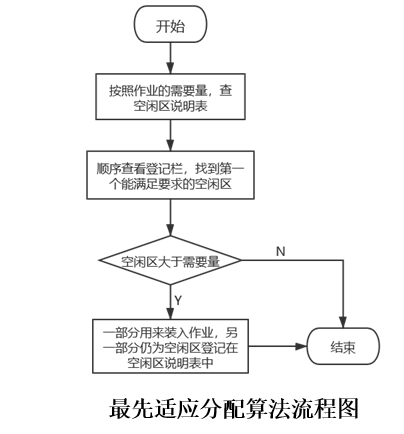

## 一、实验内容
**主存储器空间的分配和回收。**
## 二、实验目的
一个好的计算机系统不仅要有一个足够容量的、存取速度高的、稳定可靠的主存储器，而且要能合理地分配和使用这些存储空间。当用户提出申请存储器空间时，存储管理必须根据申请者的要求，按一定的策略分析主存空间的使用情况，找出足够的空闲区域分配给申请者。当作业撤离或主动归还主存资源时，则存储管理要收回作业占用的主存空间或归还部分主存空间。主存的分配和回收的实现与主存储器的管理方式有关的，通过本实验帮助学生理解在可变分区管理方式下应怎样实现主存空间的分配和回收。
## 三、实验原理
模拟在可变分区管理方式下采用最先适应算法实现主存分配和回收。

(1) **可变分区方式是按作业需要的主存空间大小来分割分区的**。当要装入一个作业时，根据作业需要的主存量查看是否有足够的空闲空间，若有，则按需要量分割一个分区分配给该作业；若无，则作业不能装入。随着作业的装入、撤离，主存空间被分成许多个分区，有的分区被作业占用，而有的分区是空闲的。例如：


为了说明哪些区是空闲的，可以用来装入新作业，必须要有一张空闲区说明表，格式如下：


其中，起址——指出一个空闲区的主存起始地址。
      长度——指出从起始地址开始的一个连续空闲的长度。
      状态——有两种状态，一种是“未分配”状态，指出对应的由起址指出的某个长度的区域是空闲区。

(2) **当有一个新作业要求装入主存时，必须查空闲区说明表，从中找出一个足够大的空闲区**。有时找到的空闲区可能大于作业需要量，这时应把原来的空闲区变成两部分：一部分分给作业占用；另一部分又成为一个较小的空闲区。为了尽量减少由于分割造成的空闲区，而尽量保存高地址部分有较大的连续空闲区域，以利于大型作业的装入。为此，在空闲区说明表中，把每个空闲区按其地址顺序登记，即每个后继的空闲区其起始地址总是比前者大。

(3) **采用最先适应算法（顺序分配算法）分配主存空间**。
按照作业的需要量，查空闲区说明表，顺序查看登记栏，找到第一个能满足要求的空闲区。当空闲区大于需要量时，一部分用来装入作业，另一部分仍为空闲区登记在空闲区说明表中。
由于本实验是模拟主存的分配，所以把主存区分配给作业后并不实际启动装入程序装入作业，而用输出“分配情况”来代替。

(4) **当一个作业执行结束撤离时，作业所占的区域应该归还，归还的区域如果与其它空闲区相邻，则应合成一个较大的空闲区，登记在空闲区说明表中**。

(5) **请按最先适应算法设计主存分配和回收的程序**。假设初始时主存中没有作业，现按下面序列进行内存的申请与释放：
`
作业1申请300K，
作业2申请100K，
作业1释放300K，
作业3申请150K，
作业4申请30K， 
作业5申请40K， 
作业6申请60K，
作业4释放30K。 
`
请你为它们进行主存分配和回收，把空闲区说明表的初值以及每次分配或回收后的变化显示出来或打印出来。
## 四、算法流程图
 

* 归还主存时的回收算法流程图


## 五、源程序及注释
```
//RAM内存类
import java.util.ArrayList;
import java.util.Random;
import java.util.Scanner;

public class RAM {
    Scanner input = new Scanner(System.in);
    static IdlePartition idle = new IdlePartition();
    private Integer size;               //总内存大小
    private Integer initialAddress;     //起址
    private Integer endAddress;         //末址
    private Integer blockNum ;          //块数
    private ArrayList blockSize;        //块大小
    private ArrayList blockAddress;     //每块的起址
    private ArrayList blockStatus;      //每块的状态

    public RAM(Integer size, Integer initialAddress) {
        this.size = size;
        this.initialAddress = initialAddress;
        this.endAddress = this.initialAddress + this.size;
        this.blockNum = 10;
        Random random = new Random();
        Integer sum = 0;
        this.blockSize = new ArrayList();
        this.blockAddress = new ArrayList();
        this.blockStatus = new ArrayList();
        for (int i = 0; i < 9; i++) {
            this.blockAddress.add(sum);
            this.blockSize.add(random.nextInt(100)+30);
            sum += (Integer)(this.blockSize.get(i));
            this.blockStatus.add("未分配");
        }
        this.blockSize.add(this.size - sum);
        this.blockAddress.add(sum);
        this.blockStatus.add("未分配");
        Printer();
    }
    public IdlePartition Changing(){
        ArrayList initialAddress1 = new ArrayList(); //起始地址
        ArrayList lenth = new ArrayList();          //长度
        ArrayList status = new ArrayList();          //状态
        for (int i = 0; i < this.blockNum; i++) {
            if (this.blockStatus.get(i) == "未分配"){
                initialAddress1.add(this.blockAddress.get(i));
                lenth.add(this.blockSize.get(i));
                status.add(this.blockStatus.get(i));
            }
        }
        idle.setInitialAddress(initialAddress1);
        idle.setLenth(lenth);
        idle.setStatus(status);
        return idle;
    }
    public void Printer(){
        System.out.println("***********内存分块说明表*************");
        System.out.printf("%-7s%-10s%-10s%-10s\n","编号","起址","长度","状态");
        for (int i = 0; i < this.blockNum; i++) {
            System.out.printf( "%2d%10d%s%10d%s%10s\n",i+1,this.blockAddress.get(i),"K"
                    ,this.blockSize.get(i) ,"K",this.blockStatus.get(i) );
        }
    }
    public void Printer1(IdlePartition idlePartition){
        System.out.println("***********空闲说明表*************");
        System.out.printf("%-7s%-10s%-10s%-10s\n","编号","起址","长度","状态");
        for (int i = 0; i < idlePartition.getStatus().size(); i++) {
            System.out.printf( "%2d%10d%s%10d%s%10s\n",i+1,idlePartition.getInitialAddress().get(i),"K"
                    ,idlePartition.getLenth().get(i) ,"K",idlePartition.getStatus().get(i) );
        }
    }

    /**
     * 查找空闲分区
     */
    public void FindingIdlePartition(IdlePartition idlePartition,Integer size,Integer a){
        for (int i = 0; i < idlePartition.getStatus().size(); i++) {
            if (size == 0) {
                System.out.println("申请无效！");
                return;
            }
            if ((Integer)(this.blockSize.get(i)) >= size && this.blockStatus.get(i).equals("未分配"))  {
                this.blockStatus.set(i,"作业" + a + "正在使用中");
                if ((Integer)(idlePartition.getLenth().get(i)) == size){
                    this.blockSize.set(i,size);
                    return;
                }else {
                    //使用空间，并建立新的空闲分区
                    this.blockAddress.add(i+1,(Integer)(this.blockAddress.get(i)) + size);
                    this.blockStatus.add(i+1,"未分配");
                    this.blockSize.add(i+1,((Integer)this.blockSize.get(i)) - size);
                    this.blockSize.set(i,size);
                    this.blockNum++;
                    return;
                }
            }
        }
        System.out.println("未找到适当的内存，请重新申请！！！");
    }
    /**
     * 作业i申请空间
     */
    public void Applying(Integer i){
        System.out.print("请输入要申请的作业" + i + "占用内存：");
        FindingIdlePartition(idle,input.nextInt(),i);
    }
    /**
     * 作业i释放空间
     */
    public void Freeing(Integer i){
        for (int j = 0; j < this.blockNum; j++) {
            if (this.blockStatus.get(j).equals("作业" + i + "正在使用中")){
                this.blockStatus.set(j,"未分配");
             this.blockSize.set(j,(Integer)this.blockSize.get(j)+(Integer)this.blockSize.get(j+1));
                this.blockSize.remove(j+1);
                this.blockAddress.remove(j+1);
                this.blockStatus.remove(j+1);
                this.blockNum--;
                return;
            }
        }
        System.out.println("未找到作业" + i + "正在使用中，请重新输入！！！");
    }

    public ArrayList getBlockAddress() {
        return blockAddress;
    }

    public ArrayList getBlockStatus() {
        return blockStatus;
    }

    public Integer getBlockNum() {
        return blockNum;
    }

    public ArrayList getBlockSize() {
        return blockSize;
    }

    public Integer getSize() {
        return size;
    }

    public void setSize(Integer size) {
        this.size = size;
    }

    public Integer getInitialAddress() {
        return initialAddress;
    }

    public void setInitialAddress(Integer initialAddress) {
        this.initialAddress = initialAddress;
    }

    public Integer getEndAddress() {
        return endAddress;
    }

}
```
```
// IdlePartition空闲区类
import java.util.ArrayList;
public class IdlePartition {
    private ArrayList initialAddress; //起始地址
    private ArrayList lenth;          //长度
    private ArrayList status;          //状态
    public IdlePartition() {}
    public ArrayList getInitialAddress() {
        return initialAddress;
    }
    public void setInitialAddress(ArrayList initialAddress) {
        this.initialAddress = initialAddress;
    }
    public ArrayList getLenth() {
        return lenth;
    }
    public void setLenth(ArrayList lenth) {
        this.lenth = lenth;
    }
    public ArrayList getStatus() {
        return status;
    }
    public void setStatus(ArrayList status) {
        this.status = status;
    }
}
```
```
//Test测试类
import java.util.Scanner;

public class Test {
    public static void main(String[] args) {
        RAM ram = new RAM(1024,0);
        ram.Changing();
        ram.Printer1(ram.Changing());
        Scanner input = new Scanner(System.in);
        while(true){
            System.out.println("1、申请\t2、释放（输入其它数字退出）");
            System.out.print("请输入要对作业进行的操作序号：");
            switch (input.nextInt()){
                case 1:
                    System.out.print("请输入要申请的作业序号：");
                    ram.Applying(input.nextInt());
                    break;
                case 2:
                    System.out.print("请输入要释放的作业序号：");
                    ram.Freeing(input.nextInt());
                    break;
                default:
                    System.exit(0);
                    break;
            }
            ram.Changing();
            ram.Printer1(ram.Changing());
            ram.Printer();
        }
    }
}
```
## 六、打印的程序运行时初值和运行结果


