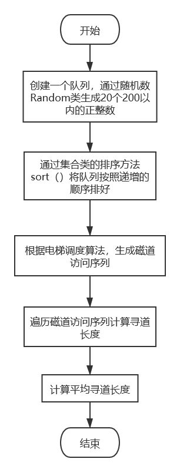
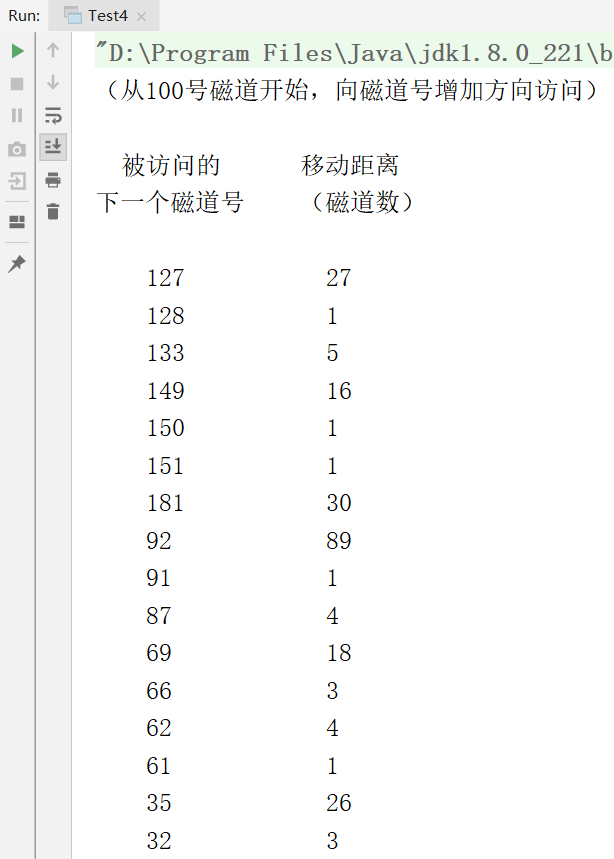
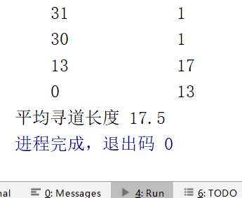

## 一、实验内容
**模拟电梯调度算法，实现对磁盘的调度**。 
## 二、实验目的
磁盘是一种高速、大量旋转型、可直接存取的存储设备。它作为计算机系统的辅助存储器，负担着繁重的输入输出任务，在多道程序设计系统中，往往同时会有若干个要求访问磁盘的输入输出请示等待处理。系统可采用一种策略，尽可能按最佳次序执行要求访问磁盘的诸输入输出请求，这就叫磁盘调度，使用的算法称磁盘调度算法。磁盘调度能降低为若干个输入输出请求服务所须的总时间，从而提高系统效率。本实验要求学生模拟设计一个磁盘调度程序，观察磁盘调度程序的动态运行过程。
## 三、实验原理
模拟电梯调度算法，对磁盘调度。
**磁盘是要供多个进程共享的存储设备，但一个磁盘每个时刻只能为一个进程服务**。

**当有进程在访问某个磁盘时，其他想访问该磁盘的进程必须等待，直到磁盘一次工作结束**。

**当有多个进程提出输入输出请求处于等待状态，可用电梯调度算法从若干个等待访问者中选择一个进程，让它访问磁盘**。

**当存取臂仅需移到一个方向最远的所请求的柱面后,如果没有访问请求了,存取臂就改变方向**。

假设磁盘有200个磁道，用编程语言随机函数随机生成一个磁道请求序列（不少于15个）放入模拟的磁盘请求队列中，假定当前磁头在100号磁道上，并向磁道号增加的方向上移动。请给出按电梯调度算法进行磁盘调度时满足请求的次序,并计算出它们的平均寻道长度。
## 四、算法流程图


## 五、源程序及注释
```
import java.util.ArrayList;
import java.util.Collections;
import java.util.Comparator;
import java.util.Random;
public class Test4 {
    public static void main(String[] args) {
        int sign = 0;//标记
        Random random = new Random();
        ArrayList r = new ArrayList();
        int i;
        double aver=0;
        //生成随机数
        for (i = 0; i < 20; i++){
            r.add(random.nextInt(200));
        }
        Collections.sort(r);
        //确定磁头位置
        for (i = 0; i < r.size(); i++){
            if((Integer)r.get(i) >= 100){
                sign = i;
                break;
            }
        }
        //增加方向
        System.out.println("（从100号磁道开始，向磁道号增加方向访问）\n");
        System.out.println("  被访问的\t\t移动距离\n下一个磁道号\t\t（磁道数）\n");
        for(i = sign; i < r.size(); i++){
            if(i == sign){
                System.out.println("\t" + (Integer)r.get(i) + "\t\t\t  " + ((Integer)r.get(i)-100));
                aver += (Integer)r.get(i)-100;
            }else{
                System.out.println("\t" + r.get(i) + "\t\t\t  " + ((Integer)r.get(i) - (Integer)r.get(i-1)));
                aver+=(Integer)r.get(i) - (Integer)r.get(i-1);
            }
        }
        //降低方向
        for(i = sign-1; i >= 0; i--){
            if(i==sign-1){
                System.out.println("\t" + (Integer)r.get(i) + "\t\t\t  " + ((Integer)r.get(19) - (Integer)r.get(i)));
                aver += (Integer)r.get(19) - (Integer)r.get(i);
            }else{
                System.out.println("\t" + (Integer)r.get(i) + "\t\t\t  " + ((Integer)r.get(i+1) - (Integer)r.get(i)));
                aver += (Integer)r.get(i+1) - (Integer)r.get(i);
            }
        }
        System.out.printf("平均寻道长度 %.1f",aver/15);
    }
}
```
## 六、打印的程序运行时初值和运行结果
  

