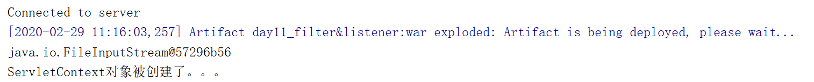
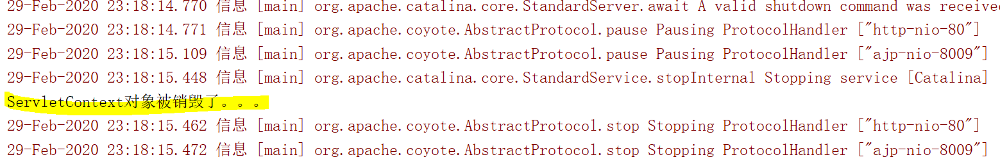

## Listener：监听器
### 1、概念：web的三大组件之一。
* **事件监听机制**
	* **事件**：一件事情
	* **事件源**：事件发生的地方
	* **监听器**：一个对象
	* **注册监听**：将事件、事件源、监听器绑定在一起。 当事件源上发生某个事件后，执行监听器代码

### 2、ServletContextListener
* **监听ServletContext对象的创建和销毁**
	* 方法：
		* `void contextDestroyed(ServletContextEvent sce)`：**ServletContext对象被销毁之前**会调用该方法
		* `void contextInitialized(ServletContextEvent sce)` ：**ServletContext对象创建后**会调用该方法
	* 步骤：
		* **定义一个类**，实现**ServletContextListener**接口
		* 复写方法
		* **配置**
			* `web.xml`
			```		
            <listener>
 			     <listener-class>cn.itcast.web.listener.ContextLoaderListener</listener-class>
   			</listener>
   			<!--指定初始化参数<context-param>-->
            ```
			* 注解：`@WebListener`
* 用处：一般用于服务器加载资源文件

### 3、简单示例
*模拟服务器启动时加载applicationContext.xml配置文件*
* ContextLoaderListener.java
```
package com.allen.web.listener;

import javax.servlet.ServletContext;
import javax.servlet.ServletContextEvent;
import javax.servlet.ServletContextListener;
import javax.servlet.annotation.WebListener;
import java.io.FileInputStream;


@WebListener
public class ContextLoaderListener implements ServletContextListener {

    /**
     * 监听ServletContext对象创建的。ServletContext对象服务器启动后自动创建。
     *
     * 在服务器启动后自动调用
     * @param servletContextEvent
     */
    @Override
    public void contextInitialized(ServletContextEvent servletContextEvent) {
        //加载资源文件
        //1.获取ServletContext对象
        ServletContext servletContext = servletContextEvent.getServletContext();

        //2.加载资源文件
        String contextConfigLocation = servletContext.getInitParameter("contextConfigLocation");

        //3.获取真实路径
        String realPath = servletContext.getRealPath(contextConfigLocation);

        //4.加载进内存
        try{
            FileInputStream fis = new FileInputStream(realPath);
            System.out.println(fis);
        }catch (Exception e){
            e.printStackTrace();
        }
        System.out.println("ServletContext对象被创建了。。。");
    }

    /**
     * 在服务器关闭后，ServletContext对象被销毁。当服务器正常关闭后该方法被调用
     * @param servletContextEvent
     */
    @Override
    public void contextDestroyed(ServletContextEvent servletContextEvent) {
        System.out.println("ServletContext对象被销毁了。。。");
    }
}

```
* web.xml
```
<?xml version="1.0" encoding="UTF-8"?>
<web-app xmlns="http://xmlns.jcp.org/xml/ns/javaee"
         xmlns:xsi="http://www.w3.org/2001/XMLSchema-instance"
         xsi:schemaLocation="http://xmlns.jcp.org/xml/ns/javaee http://xmlns.jcp.org/xml/ns/javaee/web-app_3_1.xsd"
         version="3.1">

   <!-- 指定初始化参数 -->
   <context-param>
      <param-name>contextConfigLocation</param-name>
      <param-value>/WEB-INF/classes/applicationContext.xml</param-value>
   </context-param>
   
</web-app>
```
* 控制台模拟输出
    * 服务器开启时进行加载

    * 服务器关闭时进行销毁
