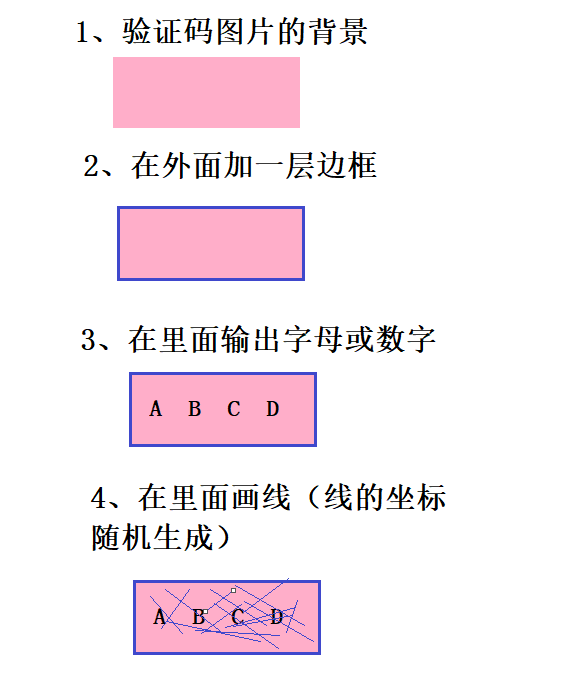
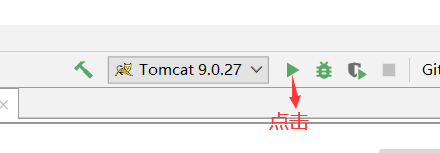
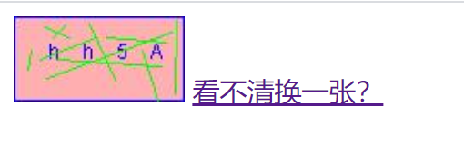

## 一、实现原理
### 1、验证码的本质以及简单分解

### 2、用到的Java技术
* servlet

### 3、步骤
* 创建一个对象，在内存中图片（验证码图片对象）
* 美化图片
    * 填充背景色
    * 画边框
    * 生成随机角标
    * 画干扰线
* 将图片输出到页面展示

## 二、具体实现
* 打开IDEA，新建一个Java_EE项目，选择Java_EE 7

* 在src目录下创建包和checkCodeServlet.java文件

* 在web目录下创建regist.html

* 复制如下代码到checkCodeServlet.java中
```
package com.allen.web.servlet;

import javax.imageio.ImageIO;
import javax.servlet.ServletException;
import javax.servlet.annotation.WebServlet;
import javax.servlet.http.HttpServlet;
import javax.servlet.http.HttpServletRequest;
import javax.servlet.http.HttpServletResponse;
import java.awt.*;
import java.awt.image.BufferedImage;
import java.io.IOException;
import java.util.Random;

@WebServlet("/checkCodeServlet")
public class CheckCodeServlet extends HttpServlet {
    protected void doPost(HttpServletRequest request, HttpServletResponse response) throws ServletException, IOException {
        int width = 100;
        int height = 50;

        //1、创建一个对象，在内存中图片（验证码图片对象）
        BufferedImage image = new BufferedImage(width,height,BufferedImage.TYPE_INT_RGB);
        //2、美化图片
        //2.1、填充背景色
        Graphics g = image.getGraphics();//画笔对象
        g.setColor(Color.PINK);//设置画笔颜色
        g.fillRect(0,0,width,height);

        //2.2、画边框
        g.setColor(Color.BLUE);
        g.drawRect(0,0,width-1,height-1);

        String str = "ABCDEFGHIJKLMNOPQRSTUVWXYZabcdefghijklmnopqrstuvwxyz0123456789";
        //生成随机角标
        Random random = new Random();
        for (int i = 1; i <= 4; i++) {
            int index = random.nextInt(str.length());
            //获取字符
            char ch = str.charAt(index);//随机字符
            //2.3、写验证码
            g.drawString(ch+"",width/5*i,height/2);
        }

        //2.4、画干扰线
        g.setColor(Color.GREEN);

        //随机生成坐标点
        for (int i = 0; i < 10; i++) {
            int x1 = random.nextInt(width);
            int x2 = random.nextInt(width);

            int y1 = random.nextInt(height);
            int y2 = random.nextInt(height);
            g.drawLine(x1,y1,x2,y2);
        }
        


        //3、将图片输出到页面展示
        ImageIO.write(image,"jpg",response.getOutputStream());

    }

    protected void doGet(HttpServletRequest request, HttpServletResponse response) throws ServletException, IOException {
        this.doPost(request,response);
    }
}


```
* 复制如下代码到regist.html中
```
<!DOCTYPE html>
<html lang="en">
<head>
    <meta charset="UTF-8">
    <title>Title</title>

    <script>
        /**
         * 分析：
         *      点击超链接或者图片，需要换一张
         *      1、给超链接和图片绑定单击事件
         *
         *      2、重新设置图片的src属性值
         */
        window.onload = function () {
            //1、获取图片对象
            var img = document.getElementById("checkCode");
            img.onclick = function () {
                //加时间戳
                var date = new Date().getTime();

                img.src = "/day08/checkCodeServlet?" + date;
            }
            //2、获取超链接对象
            document.getElementById("change").onclick = function () {
                //加时间戳
                var date = new Date().getTime();

                img.src = "/day08/checkCodeServlet?" + date;
            }
        }


    </script>
</head>
<body>

    

    <a id="change" href="#">看不清换一张？</a>

</body>
</html>
```
* 点击启动Tomcae服务器

* 在浏览器中访问http://localhost:8080/regist.html即可

## 三、效果展示
