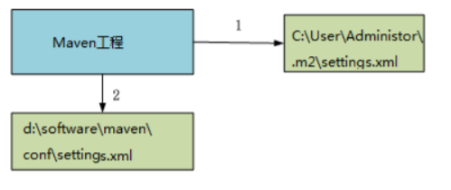
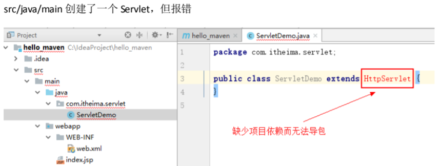

## 一、Maven介绍
### 1、什么是 Maven
#### 1.1、什么是 Maven
**Maven 是一个项目管理工具，它包含了一个项目对象模型 (POM：Project Object Model)，一组标准集合，一个项目生命周期(Project Lifecycle)，一个依赖管理系统(Dependency Management System)，和用来运行定义在生命周期阶段(phase)中插件(plugin)目标(goal)的逻辑。**

#### 1.2、Maven 能解决什么问题
**项目开发不仅仅是写写代码而已，期间会伴随着各种必不可少的事情要做**，下面列举几个感受一下：
* 我们需要**引用各种 jar 包**，尤其是比较大的工程，引用的 jar 包往往有几十个乃至上百个， 每用
到一种jar包，都需要手动引入工程目录，而且经常遇到各种让人抓狂的 jar 包冲突，版本冲突。
* 我们辛辛苦苦写好了Java文件，可是只懂 0 和 1 的白痴电脑却完全读不懂，需要将它**编译成二进制字节码**。好歹现在这项工作可以由各种集成开发工具帮我们完成，Eclipse、IDEA 等都可以将代码即时编译。当然，如果你嫌生命漫长，何不铺张，也可以用记事本来敲代码，然后用javac命令一个个地去编译，逗电脑玩。
* 世界上没有不存在 bug 的代码，计算机喜欢 bug 就和人们总是喜欢美女帅哥一样。为了追求美为
了减少 bug，因此写完了代码，我们还要写一些**单元测试**，然后一个个的运行来检验代码质量。
* 再优雅的代码也是要出来卖的。我们后面还需要把代码与各种配置文件、资源整合到一起，**定型打包**，如果是 web 项目，还需要将之发布到服务器，供人蹂躏。

### 2、Maven的两个精典作用
#### 2.1、Maven 的依赖管理
**Maven的一个核心特性就是依赖管理**。当我们涉及到多模块的项目（包含成百个模块或者子项目），管理依赖就变成一项困难的任务。Maven展示出了它对处理这种情形的高度控制。传统的 WEB 项目中，我们必须将工程所依赖的jar包复制到工程中，导致了工程的变得很大。

* **作用：**
    * **maven工程中不直接将jar包导入到工程中**，而是通过**在pom.xml文件**中添加**所需jar包的坐标**，这样就很好的避免了jar直接引入进来，在需要用到 jar 包的时候，只要查找pom.xml文件，再通过 pom.xml 文件中的坐标，到一个专门用于”存放 jar 包的仓库”(maven 仓库)中根据坐标从
    而找到这些 jar 包，再把这些jar包拿去运行。
    
    
    * **maven工程中导入的jar包的使用效率与传统导入jar包的使用效率是一样的，所以不需要担心导入后引用时的速度问题。**

#### 2.2、项目的一键构建
我们的项目，往往都要经历**编译、测试、运行、打包、安装 ，部署**等一系列过程。
* **构建**：指的是**项目从编译、测试、运行、打包、安装 ，部署整个过程都交给maven进行管理，这个过程称为构建。**
* **一键构建**：**指的是整个构建过程，使用maven一个命令可以轻松完成整个工作。**

* **Maven规范化构建流程**如下：


## 二、Maven的使用
### 1、Maven 的安装
#### 1.1、Maven软件的下载
* 进入官网[https://maven.apache.org/download.cgi](https://maven.apache.org/download.cgi)下载


#### 1.2、Maven软件的安装
Maven下载后，将Maven**解压到一个没有中文没有空格的路径下**，比如D:\maven下面。
* 解压后目录结构如下：
    * **bin**:存放了maven的命令
    * **boot**:存放了一些maven本身的引导程序，如类加载器等
    * **conf**:存放了maven的一些配置文件，如setting.xml文件
    * **lib**:存放了maven本身运行所需的一些jar包


#### 1.3、JDK的安装及配置
*能打开这篇blog的各位，我相信你们对jdk的安装配置已经很熟悉了，这里就不在赘述了*

#### 1.4、Maven的安装及配置
* 电脑上需安装java环境，安装JDK1.7以上版本（将`%JAVA_HOME%/bin`**配置环境变量path**）
* **配置MAVEN_HOME**，**变量值就是maven安装路径**


#### 1.5、Maven 软件版本测试
通过`mvn -v`命令检查maven是否安装成功，**看到maven的版本号及java版本即为安装**
成功。
* **找开cmd，输入**`mvn –v`**命令**，如下图：


### 2、Maven 仓库
#### 2.1、Maven 仓库的分类
maven的工作需要从仓库下载一些jar包，如下图所示，**本地的项目A、项目B等都会通过maven软件从远程仓库（可以理解为互联网上的仓库）下载jar包并存在本地仓库**，本地仓库就是**本地文件夹**，当第二次需要此jar包时则不再从远程仓库下载，因为本地仓库已经存在了，**可以将本地仓库理解为缓存，有了本地仓库就不用每次从远程仓库下载了。**
下图描述了 maven 中仓库的类型：


* **本地仓库** ：**用来存储从远程仓库或中央仓库下载的插件和jar包**，项目使用一些插件或jar包，优先从本地仓库查找**默认本地仓库位置在 ${user.dir}/.m2/repository，${user.dir}表示 windows 用户目录**。
* **远程仓库**：如果本地需要插件或者 jar 包，本地仓库没有，默认去远程仓库下载。**远程仓库可以在互联网内也可以在局域网内。**
* **中央仓库**：**在maven软件中内置一个远程仓库地址http://repo1.maven.org/maven2**，它是中央仓库，**服务于整个互联网**，它是由Maven团队自己维护，里面存储了非常全的 jar 包，它**包含了世界上大部分流行的开源项目构件**。

#### 2.3 全局setting与用户setting
* **maven仓库地址、私服等配置信息需要在setting.xml 文件中配置，分为全局配置和用户配置。**
* 在**maven安装目录下的有conf/setting.xml文件**，此setting.xml文件用于maven的所有project项目，**它作为 maven的全局配置。**
* 如需要个性配置则需要在用户配置中设置，**用户配置的 setting.xml文件默认的位置在**：`${user.dir}
/.m2/settings.xml`目录中,**${user.dir} 指 windows 中的用户目录。**
* **maven会先找用户配置，如果找到则以用户配置文件为准，否则使用全局配置文件。**


### 3、Maven工程的认识
#### 3.1、Maven 工程的目录结构

* 作为一个maven工程，它的**src目录和pom.xml**是必备的。
* 进入 src 目录后，我们发现它里面的目录结构如下：

```
src/main/java —— 存放项目的.java 文件
src/main/resources —— 存放项目资源文件，如 spring, hibernate 配置文件
src/test/java —— 存放所有单元测试.java 文件，如 JUnit 测试类
src/test/resources —— 测试资源文件
target —— 项目输出位置，编译后的 class 文件会输出到此目录
pom.xml——maven 项目核心配置文件
注意：如果是普通的 java 项目，那么就没有 webapp 目录。
```
*注意：如果是普通的java项目，那么就没有webapp目录。*

#### 3.2、Maven工程的运行
*由于下面的命令都需要一个maven的项目进行演示，而使用idea创建maven项目我放在了后面，这里准备了一个之前写好的maven项目示例可以下载下来，进行相关操作。下载链接(https://pan.baidu.com/s/1CUtuUlK_vJNaJuxVtgKnSA 提取码：68y5 )*

* 进入maven工程目录（当前目录有pom.xml文件），**按住shif**t右键**在此处打开cmd**，执行`mvn tomcat:run`命令。

* 然后在浏览器访问Tomcat的默认访问地址http://localhost:8080

## 三、Maven常用命令
我们可以在cmd中通过一系列的maven命令来对maven工程进行编译、测试、运行、打包、安装、部署。
### 1、compile
* **compile是maven工程的编译命令，作用是将src/main/java 下的文件编译为class文件输出到target目录下**。
在maven项目目录下**按住shif**t右键**在此处打开cmd**，执行`mvn compile`，如下图提示成功：

* 完成后**查看target目录**，class文件已生成，编译完成。

### 2、test
* **test是maven工程的测试命令**`mvn test`，**会执行src/test/java 下的单元测试类。**
* 在maven项目目录下**按住shif**t右键**在此处打开cmd**执行`mvn test`，下图为测试结果，运行1个测试用例，全部成功。


### 3、clean
* **clean是maven工程的清理命令，执行clean会删除target目录及内容。**
* 在maven项目目录下**按住shif**t右键**在此处打开cmd**执行`mvn clean`

### 4、package
* **package是maven工程的打包命令**，对于java工程执行package打成**jar包**，对于web工程打成**war包**。
* 在maven项目目录下**按住shif**t右键**在此处打开cmd**执行`mvn package`

### 5、install
* **install是maven工程的安装命令**，执行install将maven打成jar包或war包发布到本地仓库。
* * 在maven项目目录下**按住shif**t右键**在此处打开cmd**执行`mvn install`

*从运行结果中，可以看出：
当后面的命令执行时，前面的操作过程也都会自动执行。*

### 6、Maven 指令的生命周期
**maven对项目构建过程分为三套相互独立的生命周期，请注意这里说的是“三套”，而且“相互独立”，**
* 这三套生命周期分别是：
```
Clean Lifecycle 在进行真正的构建之前进行一些清理工作。
Default Lifecycle 构建的核心部分，编译，测试，打包，部署等等。
Site Lifecycle 生成项目报告，站点，发布站点。
```
### 7、maven的概念模型
Maven包含了一个**项目对象模型**(Project Object Model)，**一组标准集合**，**一个项目生命周期**(Project Lifecycle)，**一个依赖管理系统**(Dependency Management System)，和**用来运行定义在生命周期阶段**(phase)中**插件(plugin)目标(goal)的逻辑**。


* **项目对象模型**(Project Object Model)一个maven工程都有一个 pom.xml 文件，通过 pom.xml 文件定义项目的坐标、项目依赖、项目信息、
插件目标等。
* **依赖管理系统**(Dependency Management System)通过maven的依赖管理对项目所依赖的 jar 包进行统一管理。
比如：项目依赖junit4.9，通过在pom.xml中定义junit4.9的依赖即使用junit4.9，如下所示是junit4.9的依赖定义：
```
<!-- 依赖关系 -->
<dependencies>
<!-- 此项目运行使用 junit，所以此项目依赖 junit -->
<dependency>
<!-- junit 的项目名称 -->
<groupId>junit</groupId>
<!-- junit 的模块名称 -->
<artifactId>junit</artifactId>
<!-- junit 版本 -->
<version>4.9</version>
<!-- 依赖范围：单元测试时使用 junit -->
<scope>test</scope>
</dependency>
```
* **一个项目生命周期**(Project Lifecycle)
使用 maven 完成项目的构建，项目构建包括：清理、编译、测试、部署等过程，maven将这些过程规范为一个生命周期。
* maven通过执行一些简单命令即可实现上边生命周期的各各过程，比如执行 mvn compile 执行编译、
执行 mvn clean 执行清理。
* **一组标准集合**
maven 将整个项目管理过程定义一组标准，比如：通过 maven 构建工程有标准的目录结构，有
标准的生命周期阶段、依赖管理有标准的坐标定义等。
* **插件(plugin)目标(goal)** maven管理项目生命周期过程都是基于插件完成的。

## 四、idea开发maven项目
### 1、打开idea后点击File->Settings配置maven

* 依据图片指示，选择本地maven安装目录，指定maven安装目录下conf文件夹中settings配置文件。

### 2、idea中创建一个maven的web工程
* 打开idea，选择创建一个新工程

* 选择idea提供好的maven的web工程模板

* 下来就是配置项目名，然后一路next


### 3、创建一个 Servlet

* 要解决问题，就是要将servlet-api-xxx.jar包放进来，作为maven工程应当添加servlet的坐标，从而导入它的jar包

### 4、在pom.xml文件添加坐标
* 直接打开hello_maven工程的pom.xml文件，再添加坐标

* 添加jar包的坐标时，还可以指定这个jar包将来的作用范围。
* 每个maven工程都需要定义本工程的坐标，坐标是maven对jar包的身份定义，比如：入门程序的
坐标定义如下：
```
<!--项目名称，定义为组织名+项目名，类似包名-->
<groupId>com.itheima</groupId>
<!-- 模块名称 -->
<artifactId>hello_maven</artifactId>
<!-- 当前项目版本号，snapshot 为快照版本即非正式版本，release 为正式发布版本 -->
<version>0.0.1-SNAPSHOT</version>
<packaging > ：打包类型
jar：执行 package 会打成 jar 包
war：执行 package 会打成 war 包
pom ：用于 maven 工程的继承，通常父工程设置为 pom
```
### 5、坐标的来源方式
* 添加依赖需要指定依赖 jar 包的坐标，但是很多情况我们是不知道 jar 包的的坐标，可以通过如下方
式查询：
    * http://search.maven.org/
    * http://mvnrepository.com/


### 6、依赖范围
**A依赖B，需要在A的pom.xml文件中添加B的坐标，添加坐标时需要指定依赖范围**，依赖范围包括：
* **compile**：编译范围，**指A在编译时依赖B，此范围为默认依赖范围**。**编译范围的依赖会用在编译、测试、运行**，由于运行时需要所以编译范围的依赖会被打包。
* **provided**：provided依赖只有在当JDK或者一个容器已提供该依赖之后才使用， **provided依赖在编译和测试时需要，在运行时不需要**，比如：servlet api被tomcat容器提供。
* **runtime**：**runtime依赖在运行和测试系统的时候需要，但在编译的时候不需要**。比如：jdbc
的驱动包。由于运行时需要所以 runtime 范围的依赖会被打包。
* **test**：**test范围依赖在编译和运行时都不需要，它们只有在测试编译和测试运行阶段可用**，比如：junit。由于运行时不需要所以test范围依赖不会被打包。
* **system**：system 范围依赖与 provided 类似，但是你必须显式的提供一个对于本地系统中 JAR
文件的路径，需要指定 systemPath 磁盘路径，system依赖不推荐使用。


### 7、进行正常的JavaWeb项目开发
* 在pom.xml中导入依赖jar包的坐标，都会有提示很方便
* 写自己的servlet、jsp等web项目所需的内容

### 8、启动Tomcat
* 在**pom文件**中添加如下内容

* **此时点击idea最右侧Maven Projects**，就可以看到我们新添加的 tomcat7 插件
* **双击tomcat7插件下tomcat7:run命令直接运行项目**

* 也可以直接点击如图按钮，**手动输入tomc7:run命令运行项目**


### 9、运行结果
* 在浏览器中访问http://localhost:8080