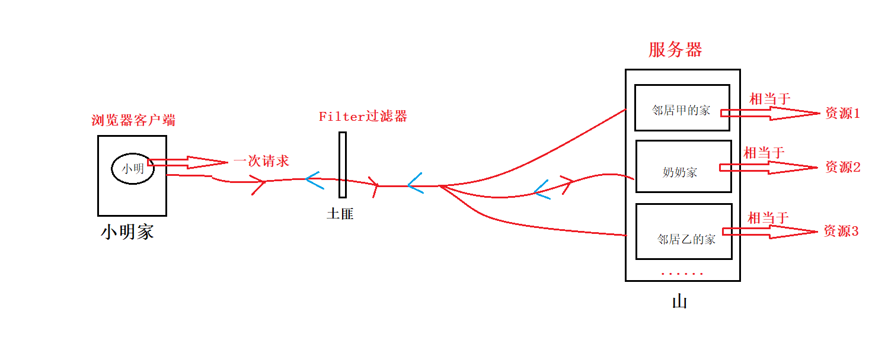
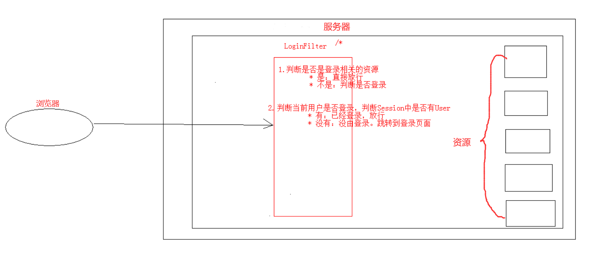
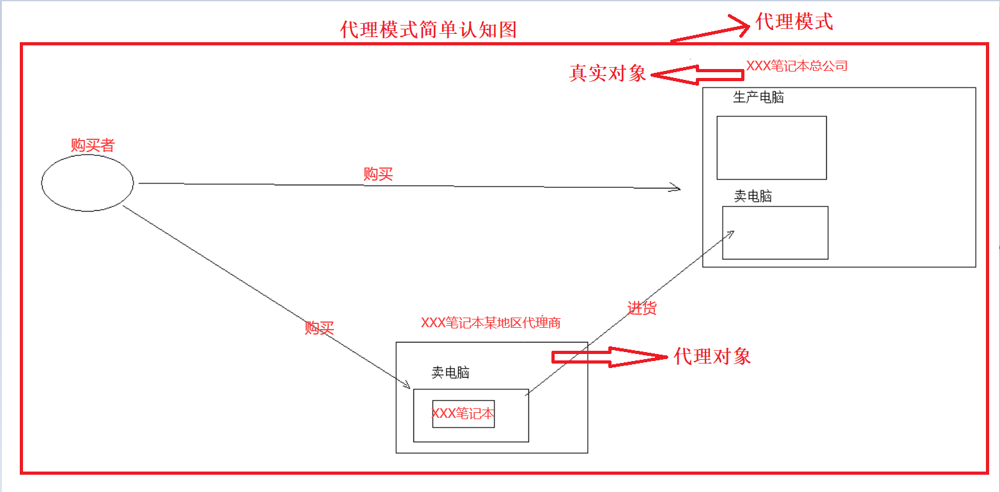
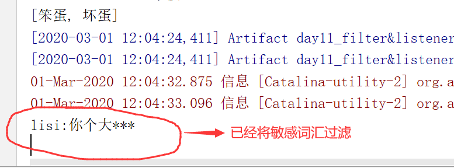

## Filter：过滤器
### 1、概念
* **生活中的过滤器**：净水器,空气净化器，土匪
    * **解释土匪**：假如**小明**从**小明家**要到山里去**奶奶家**，半路上经过一个小路（必须从这个小路通过）时，**一个土匪**突然跳出来拦住你并且说：“此路是我开，此树是我栽，要想过此路留下买路财。”小明打不过他，所以**留下了他要的东西**，**然后他放小明通行**。**小明从奶奶家回去时**，奶奶带给小明一些土特产，半路上又遇到那个土匪，**土匪又把自己要的东西拿走了**。
    * 这个例子中，**小明的家**就相当**浏览器**，**小明**就相当于**浏览器发给服务器的一个请求**，**奶奶家**就相当于是一个**服务器**，而**土匪**就充当了**过滤器**，来回从小明的身上拿走他要的东西。
    
* **web中的过滤器**：**当访问服务器的资源时，过滤器可以将请求拦截下来，完成一些特殊的功能。**
* **过滤器的作用**：
	* **一般用于完成通用的操作**。如：登录验证、统一编码处理、敏感字符过滤...

### 2、快速入门
#### 1、步骤
* **定义一个类，实现接口Filter**
* **复写方法**
* **配置拦截路径**
	* web.xml配置文件
	* **注解**

#### 2、基本结构代码
```
@WebFilter("/*")//访问所有资源之前，都会执行该过滤器
public class FilterDemo1 implements Filter {
    @Override
    public void init(FilterConfig filterConfig) throws ServletException {

    }

    @Override
    public void doFilter(ServletRequest servletRequest, ServletResponse servletResponse, FilterChain filterChain) throws IOException, ServletException {
        System.out.println("filterDemo1被执行了....");


        //放行
        filterChain.doFilter(servletRequest,servletResponse);

    }

    @Override
    public void destroy() {

    }
}

```

### 3、过滤器细节
#### 1、web.xml配置	
```
<filter>
    <filter-name>demo1</filter-name>
    <!--包名.类名-->
    <filter-class>com.allen.web.filter.FilterDemo1</filter-class>
</filter>
<filter-mapping>
    <filter-name>demo1</filter-name>
	<!-- 拦截路径 -->
    <url-pattern>/*</url-pattern>
</filter-mapping>
```
#### 2、过滤器执行流程
* **执行过滤器**
* **执行放行后的资源**
* **回来执行过滤器放行代码下边的代码**

#### 3、过滤器生命周期方法
* `init`:在服务器启动后，会创建Filter对象，然后调用init方法。**只执行一次，用于加载资源**
* `doFilter`:每一次请求被拦截资源时，会执行。**执行多次**
* `destroy`:在服务器关闭后，Filter对象被销毁。如果服务器是正常关闭，则会执行destroy方法。**只执行一次，用于释放资源**

#### 4、过滤器配置详解
* **拦截路径配置**：
	* **具体资源路径：**`/index.jsp` 只有访问index.jsp资源时，过滤器才会被执行
	* **拦截目录：**`/user/*`	访问/user下的所有资源时，过滤器都会被执行
	* **后缀名拦截：**`*.jsp	`	访问所有后缀名为jsp资源时，过滤器都会被执行
	* **拦截所有资源：**`/*`		访问所有资源时，过滤器都会被执行
* **拦截方式配置：资源被访问的方式**
	* **注解配置**：
		* 设置**dispatcherTypes属性**
			* **REQUEST**：默认值。浏览器直接请求资源
			* **FORWARD**：转发访问资源
			* INCLUDE：包含访问资源
			* ERROR：错误跳转资源
			* ASYNC：异步访问资源
	* **web.xml配置**
		* 设置`<dispatcher></dispatcher>`标签即可
		
#### 5、过滤器链(配置多个过滤器)
* **执行顺序**：如果有两个过滤器：过滤器1和过滤器2
```	
    1. 过滤器1
	2. 过滤器2
	3. 资源执行
	4. 过滤器2
	5. 过滤器1 
```
* **过滤器先后顺序问题**：
	* **注解配置**：按照**类名的字符串比较规则**比较，**值小**的先执行
		* 如： AFilter和BFilter，AFilter就先执行了。
		* 在比如**FilterDemo5和FilterDemo15，FilterDemo15先执行，没错就是FilterDemo15**
	* **web.xml配置**： `<filter-mapping>`谁定义在上边，谁先执行


### 4、案例
#### 案例1_登录验证
* 需求：
	* 访问[day10_case案例](https://blog.csdn.net/qq_34504626/article/details/104571195)的资源。验证其是否登录
	* 如果登录了，则直接放行。
	* 如果没有登录，则跳转到登录页面，提示"您尚未登录，请先登录"。
* 分析：

* 具体实现：请访问[此链接](https://blog.csdn.net/qq_34504626/article/details/104589450)

#### 案例2_敏感词汇过滤
* **需求**：
	* 对录入的数据进行敏感词汇过滤
	* 敏感词汇参考《敏感词汇.txt》
	* 如果是敏感词汇，替换为`***` 

* **分析**：
	* **对request对象进行增强**：增强获取参数相关方法
	* **放行**：传递代理对象


* **增强对象的功能**：
	* **设计模式：一些通用的解决固定问题的方式**
	    * 装饰模式
	    * 代理模式
* **代理模式**
	* **概念**：
		* **真实对象**：被代理的对象
		* **代理对象**
		* **代理模式**：代理对象代理真实对象，达到增强真实对象功能的目的

	
 	* **实现方式**：
	 	* 静态代理：有一个类文件描述代理模式
	 	* **动态代理：在内存中形成代理类**
			* **实现步骤**：
			```
			1. 代理对象和真实对象实现相同的接口
			2. 代理对象 = Proxy.newProxyInstance();
			3. 使用代理对象调用方法。
			4. 增强方法
            
			* 增强方式：
				1. 增强参数列表
				2. 增强返回值类型
				3. 增强方法体执行逻辑	
			```
* **实现代码**：
```
package com.allen.web.filter;

import javax.servlet.*;
import javax.servlet.annotation.WebFilter;
import java.io.BufferedReader;
import java.io.FileReader;
import java.io.IOException;
import java.lang.reflect.InvocationHandler;
import java.lang.reflect.Method;
import java.lang.reflect.Proxy;
import java.util.ArrayList;
import java.util.List;

/**
 * 敏感词汇过滤器
 */
@WebFilter("/*")
public class SensitiveWordsFilter implements Filter {


    public void doFilter(ServletRequest req, ServletResponse resp, FilterChain chain) throws ServletException, IOException {
        //1.创建代理对象，增强getParameter方法

        ServletRequest proxy_req = (ServletRequest) Proxy.newProxyInstance(req.getClass().getClassLoader(), req.getClass().getInterfaces(), new InvocationHandler() {
            @Override
            public Object invoke(Object proxy, Method method, Object[] args) throws Throwable {
                //增强getParameter方法
                //判断是否是getParameter方法
                if(method.getName().equals("getParameter")){
                    //增强返回值
                    //获取返回值
                    String value = (String) method.invoke(req,args);
                    if(value != null){
                        for (String str : list) {
                            if(value.contains(str)){
                                value = value.replaceAll(str,"***");
                            }
                        }
                    }
                    return  value;
                }
                return method.invoke(req,args);
            }
        });

        //2.放行
        chain.doFilter(proxy_req, resp);
    }
    private List<String> list = new ArrayList<String>();//敏感词汇集合
    public void init(FilterConfig config) throws ServletException {

        try{
            //1.获取文件真实路径
            ServletContext servletContext = config.getServletContext();
            String realPath = servletContext.getRealPath("/WEB-INF/classes/敏感词汇.txt");
            //2.读取文件
            BufferedReader br = new BufferedReader(new FileReader(realPath));
            //3.将文件的每一行数据添加到list中
            String line = null;
            while((line = br.readLine())!=null){
                list.add(line);
            }

            br.close();

            System.out.println(list);

        }catch (Exception e){
            e.printStackTrace();
        }

    }

    public void destroy() {
    }

}

```
TestServlet.class测试功能的servlet
```
package com.allen.web.servlet;

import javax.servlet.ServletException;
import javax.servlet.annotation.WebServlet;
import javax.servlet.http.HttpServlet;
import javax.servlet.http.HttpServletRequest;
import javax.servlet.http.HttpServletResponse;
import java.io.IOException;

@WebServlet("/testServlet")
public class TestServlet extends HttpServlet {
    protected void doPost(HttpServletRequest request, HttpServletResponse response) throws ServletException, IOException {
        String name = request.getParameter("name");
        String msg = request.getParameter("msg");

        System.out.println(name+":"+msg);
    }

    protected void doGet(HttpServletRequest request, HttpServletResponse response) throws ServletException, IOException {
        this.doPost(request, response);
    }
}

```
敏感词汇.txt
```
笨蛋
坏蛋
```
* **效果展示**

